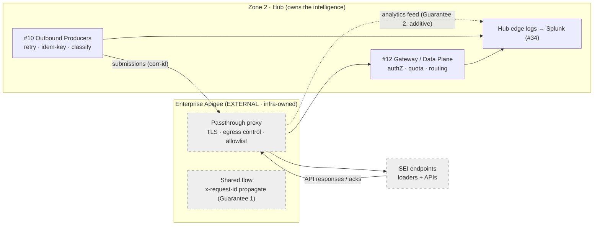
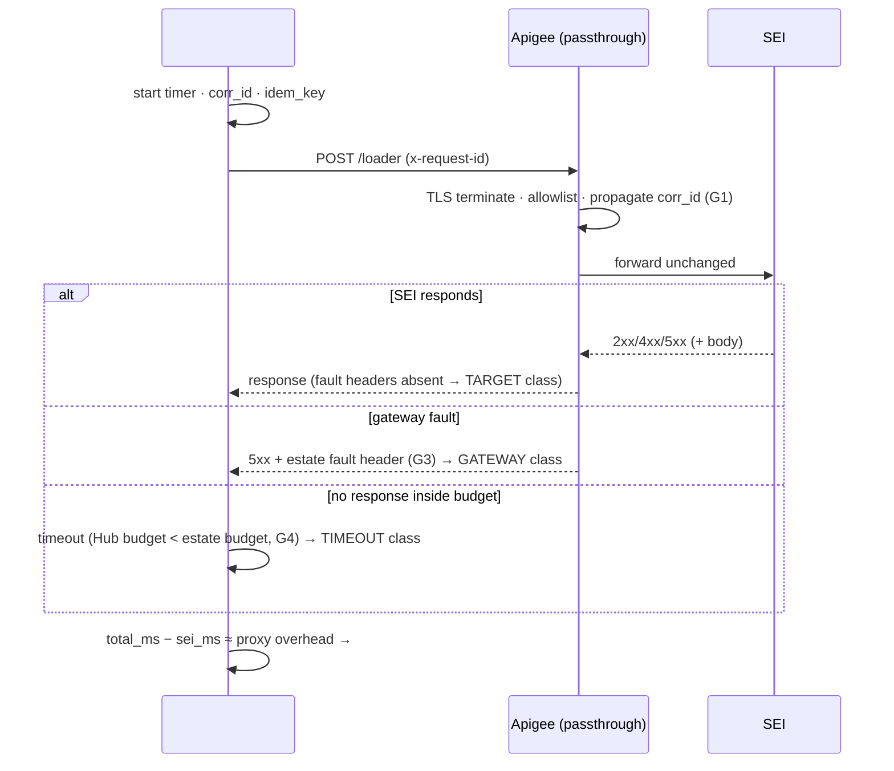

# Apigee Proxy

## 1. Purpose & Scope
Resolve the open question (AD-3): **Apigee is a decision, not a placeholder** — specifically, the *enterprise* Apigee estate operated by the infrastructure team, consumed by the Hub in **passthrough mode** as the mandated egress/ingress edge for external API traffic (SEI loader submissions outbound via #10; SEI API sources inbound toward #12). Because policies, quotas, and shared flows are infra-owned, this document's deliverable is not configuration — it is the **contract**: the guarantees the Hub requires from the estate, the observability the Hub builds at its own edges, and the failure semantics both sides agree on. Target state: zero Hub-owned Apigee policies; four written guarantees; full traffic accountability achieved from Hub-side logging.

## 2. Context & Dependencies
- **Consumers of this edge**: #10 Outbound Producers (loader submissions/acks), #12 API Gateway (inbound SEI API traffic transits the estate edge before the Hub data plane).
- **Providers**: infrastructure team (Apigee estate), network/security (egress policy).
- **Observability**: #34 receives Hub-side edge logs; estate analytics feed is additive, never foundational.

## 3. Design Decisions
| Decision | Choice | Rationale | Consequence |
|---|---|---|---|
| AD-3: Apigee decision or placeholder? | **Decision — enterprise Apigee, passthrough** | Estate standard; egress via anything else fails network policy anyway; fighting it buys nothing | Hub designs as if the proxy were a network hop; all intelligence at Hub edges |
| Passthrough vs Hub-owned policies | **Passthrough** | Infra owns the estate; Hub-owned policies there create a split-ownership change-management trap | Retries, timeouts, payload logic live in #10/#12 — never requested of infra |
| Observability strategy | **Own-edges-first** | Estate analytics access is a request with lead time; Hub logging is a config | Full trail exists day one minus the in-proxy hop; estate feed adds overhead metrics later |
| Failure semantics | **Tri-state contract (GATEWAY/TARGET/TIMEOUT)** | A 5xx through passthrough is ambiguous without fault headers | Infra's fault-code header convention is Guarantee 3 below |

## 4a. Diagrams

## 4b. Flow Walkthrough
1. Producer/Gateway → stamps correlation ID → the thread that survives every hop.
2. Apigee → TLS, IP allowlisting, egress control — and per Guarantee 1, corr-id propagation → no payload logic.
3. SEI → processes; response returns through the same hop unchanged.
4. On failure → fault headers (Guarantee 3) let the Hub classify GATEWAY vs TARGET; absence within budget → TIMEOUT.
5. Hub edge logs both directions → Splunk; estate analytics, when granted, adds the in-proxy view (overhead, estate-side errors).
6. Proxy overhead = Hub-measured total minus target time → the single metric that detects estate degradation without estate access.

## 4c. Detailed Design
**The four written guarantees (the deliverable of this component):**
1. **Correlation** — estate shared flow propagates (or generates) `x-request-id` on all Hub proxies; header name confirmed in writing.
2. **Analytics access** — Apigee Analytics API scope or inclusion in the central Apigee→Splunk export for Hub proxies; treated as additive.
3. **Fault disambiguation** — the estate's gateway-originated errors carry its fault-code header/status convention; documented values mapped to GATEWAY class in #10/#12.
4. **Budgets & quota in writing** — estate-imposed timeout, payload size ceiling, and the Hub's egress rate allocation; Hub client timeouts set strictly below the estate's; EOD outbound burst shaped (#20) under the quota.
**Hub-side edge logging (owned, config-only)**: envelope always (ts, corr_id, direction, proxy, verb, path, status, latency, bytes) from #10's client and #12's Envoy access logs → Splunk HEC. Payload logging: conditional per #10 §8 rules — never requested of the estate.
**Network**: egress NetworkPolicy allows SEI-bound traffic only via the estate proxy VIPs; no direct path exists to bypass it (control, not just convention).
**External contracts**: the four guarantees; estate change-notification (proxy config changes affecting Hub routes flagged to Hub owners).

## 5. Data Quality, Reconciliation & Lineage
The proxy carries no data-quality function by design; its lineage duty is the correlation guarantee — with it, submission→proxy→ack joins in one Splunk query and the audit trail (#31) is hop-complete. The reconciliation it enables: Hub-logged request count vs estate-logged (when feed granted) — a drift alarm for silent estate-side drops.

## 6. RECOMMENDATION
**6.1** Adopt enterprise Apigee in strict passthrough with four written guarantees, and build all traffic intelligence and observability at Hub-owned edges.
**6.2**
| Option | Description | Pros | Cons | Fit |
|---|---|---|---|---|
| A. Enterprise passthrough + guarantees (recommended) | As designed | Zero split ownership; estate standard; observability independent of infra lead times; failure semantics explicit | In-proxy visibility only as good as Guarantee 2; quota shared | **High** |
| B. Hub-owned Apigee policies (MessageLogging etc.) | Hub configures logging/retry in the estate | Rich in-proxy telemetry | Change control across two teams for every tweak; infra estates rarely grant it; couples Hub releases to estate windows | Low |
| C. Bypass (direct egress or self-hosted gateway for outbound) | Hub egresses without the estate | Full control | Violates network policy; duplicate TLS/egress governance; DOA at security review | Low |
**6.3** > **Recommended: Option A.** In an estate where infra owns the gateway, the winning move is to need *nothing* from it beyond four commitments that are standard practice anyway — correlation, analytics access, fault headers, budgets in writing. Everything the Hub must prove (who sent what, what came back, how long it took, whose fault a failure was) is provable from edges the Hub controls, which means the audit posture never depends on another team's backlog. Cost: proxy-internal blind spot until Guarantee 2 lands — mitigated by the overhead metric, which detects estate degradation from the outside. Measurements that must hold: 100% of external calls carry a corr-id observable at both Hub edges; proxy overhead p99 tracked with an alert threshold; zero unclassified failures.
**6.4** No tier boundaries touched (pure transit). AD-11 dependency: outbound traffic volume through this edge activates with the loaders; the guarantees are needed regardless (inbound API lane uses the same edge).

## 7. Failure, Replay & Idempotency
The proxy adds no replay semantics — by design. GATEWAY-class failures are safe retries (#10's idem_key protects); estate maintenance windows are the notable planned failure: change-notification contract + #20 cadence awareness (defer non-urgent outbound during announced windows). Estate-wide outage → outbound queues at PENDING with alerting; inbound API lane degrades per #12's cache/fallback design.

## 8. Security & Access Control
mTLS/OAuth material for SEI presented by the Hub client (from #48), not stored in the estate. The estate provides transport security only. Hub-side edge logs exclude payloads by default (envelope-only) so the Splunk security surface stays classification-clean; conditional payload capture follows #10's masking rules.

## 9. Open Questions & Risks
- Guarantees 1–4: confirmation meeting with infra; owner: TBD; Guarantee 3+4 block #10's failure-classification acceptance tests.
- SEI-initiated callbacks (ack style CALLBACK in #10): does the estate route inbound to #12, and under which ingress pattern? Owner: TBD.
- Risk: shared quota consumed by other estate tenants during Hub EOD burst → written allocation + #34 quota-remaining metric if the estate exposes it.
- Risk: estate proxy config drift breaking corr-id propagation silently → weekly synthetic transaction asserting the header round-trips.

## 10. Acceptance Criteria
- [ ] Written confirmation of Guarantees 1–4 filed with the design.
- [ ] Synthetic transaction: corr-id injected at #10 observed in the response path and (when feed live) estate analytics.
- [ ] Fault-injection with infra: gateway-originated error carries the documented fault convention → Hub classifies GATEWAY.
- [ ] Hub client timeout < estate timeout verified by a deliberate slow-target test → TIMEOUT class, no ambiguity.
- [ ] NetworkPolicy test: direct SEI egress (bypassing estate) is refused.
- [ ] Proxy-overhead metric live in #34 with baseline recorded.
