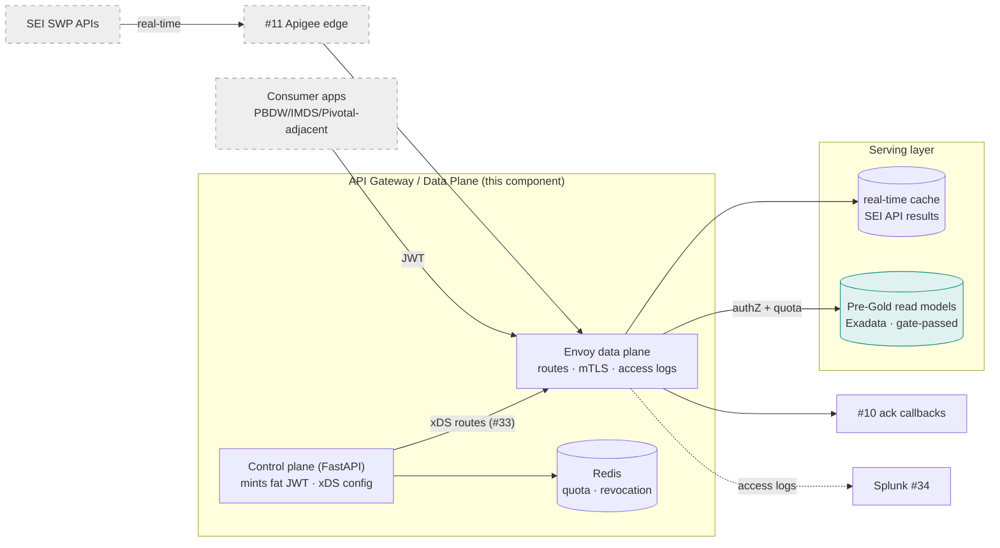
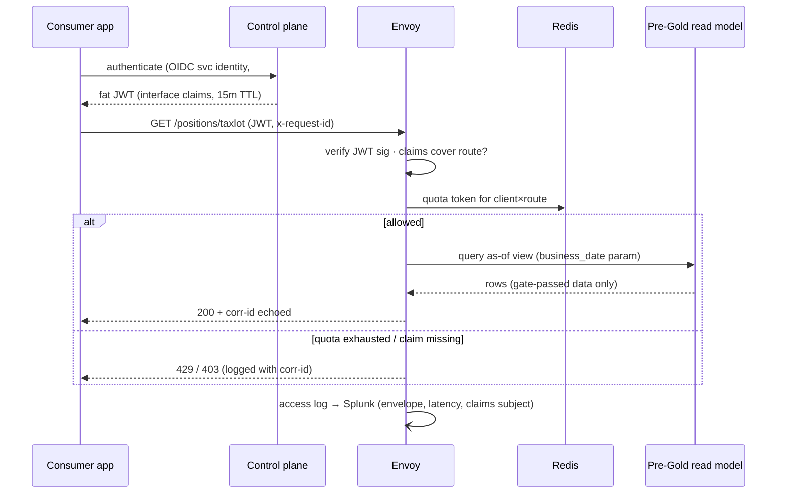

# API Gateway / Data Plane

## 1. Purpose & Scope
The Hub's API front door in both directions: **inbound**, terminating SEI real-time API traffic (via the enterprise Apigee edge, #11) into the Hub; **outbound-facing**, serving consumer APIs so PBDW/IMDS/Pivotal-adjacent applications reach Hub data through one governed lane. Target state: Envoy as the data plane on OpenShift, a FastAPI control plane issuing fat JWTs for entitlements, Redis for quota, config-driven routes from #33. This document also resolves the open question (AD-4): **the intraday/real-time lane runs HERE, with no batch-pipeline dependency** — the two lanes stay independent by construction.

## 2. Context & Dependencies
- **Upstream inbound**: SEI SWP APIs via #11 (estate edge) → this data plane → real-time consumers/caches.
- **Consumer-facing**: applications call published APIs here; data served from Pre-Gold read models / real-time cache — never from Stage tables.
- **Cross-cutting**: #32 authN/Z model, #48 credential mediation (Vault), #33 route/entitlement config, #34 access logs → Splunk, #10 callbacks (SEI ack CALLBACK style lands here).

## 3. Design Decisions
| Decision | Choice | Rationale | Consequence |
|---|---|---|---|
| AD-4: intraday on batch or here? | **Real-time/intraday API traffic on this lane; batch untouched** | The lanes exist to fail independently — an EOD stall must not take down real-time quotes, and vice versa | Intraday *data products* needing batch context read Pre-Gold as-of views; no synchronous batch coupling |
| Data plane engine | **Envoy** | Estate-proven, OpenShift-native, xDS-configurable from a control plane, first-class access logging | Kong/APISIX evaluation stands (prior analysis) if product features (dev portal) become requirements |
| Entitlements | **Fat JWT minted by control plane** | Zero per-request entitlement lookups on the hot path; claims carry interface-level grants | Token TTL vs revocation latency trade — short TTL (15m) + revocation list in Redis |
| Serving source | **Pre-Gold read models + real-time cache only** | AD-9: nothing un-gated is servable; stages are private | A consumer wanting "raw" data is an ARB conversation, not a route |
| Quota | **Redis token buckets per client×route** | Shared, fast, resilient to pod restarts | Redis is a runtime dependency — degraded mode = conservative static limits |

## 4a. Diagrams

## 4b. Flow Walkthrough
1. Consumer authenticates to the control plane (#32 OIDC) → receives a fat JWT whose claims enumerate granted interfaces.
2. Request hits Envoy with JWT + correlation ID → signature and claim check locally, no lookup.
3. Redis token bucket per client×route → quota decision in sub-ms; exhaustion is a clean 429 with corr-id.
4. Route serves from the real-time cache (SEI-sourced) or a Pre-Gold as-of read model → stages are unreachable by construction.
5. Inbound SEI lane: estate edge → Envoy → cache/handlers; **no call path touches batch state** (AD-4 resolved).
6. #10's CALLBACK-style acks route here to a dedicated internal handler → normalized into OUTBOUND_ACK.
7. Every hop logs the envelope with corr-id → the Integration-observability trail (#34) is complete at this edge regardless of estate feeds.

## 4c. Detailed Design
**Route/entitlement config (#33)**: `api_route(route_id, path, upstream, source_kind CACHE|PREGOLD, interface_id, quota_rps, quota_burst)`; control plane compiles to xDS; changes are registry rows, not deployments.
**JWT claims**: `sub` (client id), `ifs` (interface_id list), `exp` (15m), `jti` (revocation key). Revocation: `jti` denylist in Redis; TTL bounds exposure.
**As-of serving**: Pre-Gold read models expose `business_date` parameterized views (AD-2 bitemporal makes point-in-time serving natural); default = latest gate-passed date, never in-flight.
**Degraded modes**: Redis down → static conservative quotas from last-known config; Pre-Gold unreachable → 503 with retry-after (no silent stale unless a route opts into cache-serve-stale explicitly); estate edge outage → inbound SEI lane degrades, consumer lane unaffected (independence proven in #10 acceptance too).
**Deployment**: Envoy + control plane in the Hub namespace, HPA on Envoy, PodDisruptionBudget; xDS over mTLS in-cluster.
**External contracts**: SEI API specs (inbound), estate ingress pattern for SEI-initiated callbacks (#11 open question), consumer onboarding checklist (#32).

## 5. Data Quality, Reconciliation & Lineage
The gateway serves only gate-passed data (AD-9 upstream) — its DQ duty is *provenance labeling*: responses carry `X-Data-As-Of: <business_date>` and `X-Data-Source: pregold|realtime` so consumers can never confuse lanes. Access logs give per-interface consumption lineage — which consumer read which interface when — joining the Interface 360 registry for "last-seen per consumer" (#34 dashboards).

## 6. RECOMMENDATION
**6.1** Envoy data plane + fat-JWT control plane serving exclusively gate-passed Pre-Gold read models and the real-time cache, with the intraday lane structurally independent of batch (AD-4 resolved here).
**6.2**
| Option | Description | Pros | Cons | Fit |
|---|---|---|---|---|
| A. Envoy + fat JWT + Pre-Gold/cache serving (recommended) | As designed | Lane independence by construction; hot path free of lookups; config-driven routes; audit-complete at owned edge | Control plane + Redis are new operational pieces; Envoy xDS learning curve | **High** |
| B. Intraday rides the batch pipeline | Frequent mini-batches feed consumers | One pipeline to run | Couples real-time availability to EOD health — the precise failure AD-4 exists to prevent; latency floor = batch cadence | Low |
| C. Consumers query Pre-Gold directly (no gateway) | DB grants per consumer | No new runtime | No quota, no entitlement audit, credential sprawl, Exadata exposed to consumer query storms | Low |
**6.3** > **Recommended: Option A.** The gateway is where three guarantees meet: consumers see only gated data, every access is entitled and logged, and the real-time lane cannot be dragged down by a batch incident. Fat JWTs keep authorization off the hot path; the registry-compiled xDS keeps route changes in governance rather than deployments. Costs are real — Redis and a control plane to operate — and bounded by explicit degraded modes for each. Measurements that must hold: p99 added latency < 10ms at the data plane, zero un-entitled data served (claim-check audit), real-time availability unaffected during an injected batch-lane failure.
**6.4** Tier boundary: serving reads Pre-Gold read models (Exadata) and cache — never Stage 1/2; consumer *movement* (bulk publish) stays the movement jobs' domain, this lane is interactive access. AD-1 honored (Hub-owned serving); no open-AD dependencies beyond the callback-ingress question logged in §9.

## 7. Failure, Replay & Idempotency
Stateless data plane → pod loss is invisible under HPA/PDB. Idempotency is inherited: GETs trivially; the callback handler (#10 acks) applies submission-keyed upserts. Quota state loss (Redis flush) fails conservative. Config rollback = registry row versioning + xDS re-push; every config change is auditable (#31).

## 8. Security & Access Control
mTLS on all in-cluster hops; JWT RS256 with control-plane-held keys in Vault (#48); consumer onboarding = #32 workflow issuing OIDC client + interface grants. Responses containing client-identifying fields obey #32 masking policy per interface classification. Access logs envelope-only. The gateway namespace is the sole NetworkPolicy path to Pre-Gold read models from consumer networks.

## 9. Open Questions & Risks
- Estate ingress pattern for SEI-initiated callbacks — shared with #11; owner: TBD; blocks CALLBACK-style loaders in #10.
- Real-time cache technology (Redis reuse vs dedicated) and TTL semantics per SEI API — needs SEI API spec review; owner: TBD.
- Consumer API catalog v1 (which interfaces publish first) — product decision with the consumer teams; owner: TBD.
- Risk: query-shaped load on Exadata read models competing with batch transform windows → resource plans + read-model MVs sized in #66; monitor Smart Scan offload % (#34).
- Risk: JWT claim sprawl as interfaces grow → claims reference interface groups, not endpoints, from day one.

## 10. Acceptance Criteria
- [ ] Lane-independence test: batch pipeline halted mid-run → real-time and consumer APIs serve unaffected (and vice versa).
- [ ] Entitlement test: token lacking an interface claim → 403; audit row written.
- [ ] Quota test: burst beyond bucket → clean 429s, no upstream pressure.
- [ ] As-of test: `business_date` parameter returns bitemporally correct snapshot matching Pre-Gold.
- [ ] Degraded-mode drills: Redis down, Pre-Gold down, estate edge down — each behaves per §4c.
- [ ] p99 data-plane overhead < 10ms under representative load.
