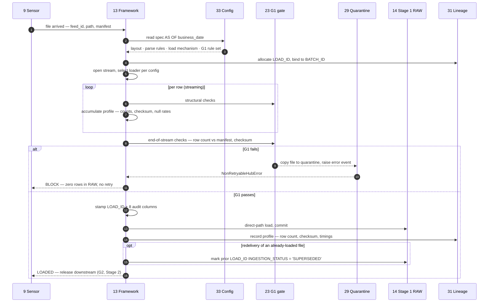

# Python Ingestion Framework

## 1. Purpose & Scope

The ingestion framework moves ~30 inbound feeds across 9 domains from the landing zone into Stage 1 RAW: validating structure, capturing profile metadata, stamping audit columns, and loading. Its single deliverable is **one config-driven framework** — not thirty scripts — that reads its behaviour per feed from the configuration store and exposes a uniform interface regardless of which underlying Oracle load mechanism a given feed uses.

It is the component that makes or breaks the "config-driven, not hand-written per source" principle. Every feed that gets its own bespoke script is a feed that must be separately maintained when SEI changes a layout.

**Tiers touched:** Stage 1 Oracle only. It does not read Stage 2, does not touch Exadata Pre-Gold, and has no involvement in the consumer-movement tier.

**AD-7 note:** the program slide labels dbt on the Landing→RAW arrow. That is the known-wrong item. RAW ingestion is Python.

---

## 2. Context & Dependencies

### Upstream (Depends On)

| ID | Component | Why required |
|---|---|---|
| 8 | Landing Zone + transport | Supplies the file and manifest on a readable volume |
| 9 | File arrival sensors | Triggers ingestion per file; supplies the manifest completeness signal |
| 33 | Metadata & config store | Feed spec, column layout, parse rules, load mechanism, G1 rule set |
| 23 | G1 file/structural gate | Executes inside the framework; blocks the RAW insert |
| 28 | DQ framework | Resolves severity; results store |
| 29 | Error handling & quarantine | Error events, quarantine store, resubmission path |
| 31 | Audit & lineage | `LOAD_ID` allocation and lineage records |
| 14 | Stage 1 RAW | The load target |
| 55 | Oracle connection pooling | Bounds concurrency; the real ceiling on fan-out width |

### Downstream

- **14 Stage 1 RAW** — receives loaded rows
- **24 G2 profiling gate** — consumes the profile metadata captured here
- **26 G4 tie-out** — consumes the per-`LOAD_ID` row counts captured here; this is what makes G4 affordable
- **21 Replay engine** — replays a `LOAD_ID` set through this framework

### Tier placement

```
  Landing Zone (8) ──▶ sensors (9)
        │
        ▼
  ┌───────────────── STAGE 1 (Oracle) ─────────────────┐
  │                                                    │
  │   ┌──────────────────────────────────────────┐     │
  │   │  13 PYTHON INGESTION FRAMEWORK           │     │
  │   │  spec → validate (G1) → profile →        │     │
  │   │  stamp → load                            │     │
  │   └──────────────┬───────────────────────────┘     │
  │                  ▼                                 │
  │            14 Stage 1 RAW (immutable)              │
  └──────────────────┬─────────────────────────────────┘
                     ▼
              Stage 2 ──▶ Pre-Gold (66) ──▶ Gold ──▶ consumers
                          [Exadata]        [standalone]
```

---

## 3. Design Decisions

**D1 · One framework or per-feed scripts?**
**Decision:** One framework. Feed behaviour is entirely config-resolved from component 33; there is no per-feed code path.
**Rationale:** ~30 feeds across 9 domains, with satellites, and a tenth domain plausible. Per-feed scripts multiply maintenance by the feed count and guarantee drift in audit-column handling.
**Consequence:** The framework must be genuinely general on day one. A feed that "just needs a small tweak" is a config gap, not a code exception.

**D2 · Which Oracle load mechanism?**
**Decision:** All three — External Tables, SQL\*Loader direct path, and `cx_Oracle executemany` — behind one loader interface, selected per feed by config.
**Rationale:** The feeds differ by orders of magnitude. Taxlot and EOD Position are large snapshots suited to External Tables; correction feeds are small and suited to `cx_Oracle` with easy quarantine routing. Committing to one mechanism penalises one end of the range.
**Consequence:** Three implementations to build and test rather than one. Justified because the alternative is either slow small-feed handling or brittle large-feed handling.

**D3 · Are business columns typed at load?**
**Decision:** No. Every RAW business column is `VARCHAR2`. Casting happens in Stage 2.
**Rationale:** Typing at the RAW boundary means a malformed date rejects the row and destroys the evidence of what SEI actually sent. Honours AD-8's intent, not just its letter.
**Consequence:** G1 reports type violations without blocking their storage. Stage 2 owns safe-cast and flagging.

**D4 · What is the unit of work?**
**Decision:** One file-load attempt, one `LOAD_ID`. A batch of ~30 files produces ~30 `LOAD_ID`s bound by a `BATCH_ID`.
**Rationale:** Per-domain replay and per-domain fan-out both require file-level granularity. A batch-level identifier cannot express "replay Positions only".
**Consequence:** `LOAD_ID` allocation must be transactional and gap-tolerant.

**D5 · How is redelivery handled?**
**Decision:** Supersede, never delete. A redelivered file loads under a new `LOAD_ID`; the prior load is flagged `SUPERSEDED`. Rows are retained.
**Rationale:** Deleting and reloading breaks immutability and makes "what did we hold on Tuesday morning?" unanswerable. AD-8.
**Consequence:** One partition's additional storage per redelivery. Stage 2 filters on `INGESTION_STATUS = 'LOADED'`.

**D6 · Streaming or full-file read?**
**Decision:** Streaming, with structural validation performed during the pass rather than as a separate read.
**Rationale:** The largest snapshots cannot be materialised in a pod's memory, and a second pass for validation doubles I/O inside the EOD window.
**Consequence:** G1 checks that require whole-file state — row count against manifest, checksum — complete at end of stream, before commit. The insert is committed only after G1 passes in full.

**D7 · How are satellite feeds handled?**
**Decision:** Satellites (Optional Fields, Supplement) load to their own RAW tables, in the same wave as their parent, with the parent relationship held in config.
**Rationale:** RAW stores as delivered — a satellite arrives as its own file and must land as its own table. Attachment to the parent entity happens during dimensional assembly (66), not at ingest.
**Consequence:** The fan-out must ensure a parent and its satellites complete together before the wave advances.

---

## 4a. Diagrams

### (1) Component / architecture

```mermaid
flowchart LR
  subgraph EXT["EXTERNAL — SEI / SWP, out of scope"]
    SEI["SWP Platform<br/>~30 feeds, 9 domains"]
  end

  subgraph ING["Ingress"]
    LZ["8 Landing Zone<br/>sFTP · manifest"]
    SEN["9 Arrival sensors<br/>per-file, manifest-aware"]
  end

  subgraph FW["13 PYTHON INGESTION FRAMEWORK"]
    direction TB
    SPEC["Spec resolver<br/>reads config by feed_id"]
    VAL["G1 validator (23)<br/>structural · BLOCKING"]
    PROF["Profiler<br/>counts · checksums · nulls"]
    STAMP["Audit stamper<br/>LOAD_ID + 8 columns"]
    LOAD["Loader interface"]
    L1["External Table<br/>large snapshots"]
    L2["SQL*Loader<br/>large deltas"]
    L3["cx_Oracle<br/>corrections, small feeds"]
    SPEC --> VAL --> PROF --> STAMP --> LOAD
    LOAD --> L1 & L2 & L3
  end

  subgraph S1["Stage 1 (Oracle)"]
    RAW["14 RAW_* tables<br/>one per feed<br/>immutable · append-only"]
  end

  subgraph DOM["Domains loaded (config-driven fan-out)"]
    D1["Account &amp; Client (5)"]
    D2["Positions (5)"]
    D3["Other (7)"]
    D4["Fee &amp; Billing (2)"]
    D5["Portfolio &amp; Model (3)"]
    D6["Reporting (2)"]
    D7["Reference &amp; Asset (3)"]
    D8["Transactions (2)"]
    D9["Cash (1)"]
  end

  subgraph FDN["Foundation"]
    CFG["33 Config store<br/>feed spec · layout · rules"]
    ERR["29 Error &amp; quarantine"]
    DQ["28 DQ framework"]
    LIN["31 Audit &amp; lineage"]
    POOL["55 Oracle pooling"]
  end

  subgraph DOWN["Downstream"]
    S2["15 Stage 2 (Exadata)"]
    G2["24 G2 profiling"]
    G4["26 G4 tie-out"]
    RPL["21 Replay"]
  end

  SEI -.->|"file contract"| LZ
  LZ --> SEN --> SPEC
  DOM -.-> SPEC
  CFG -.-> SPEC & VAL
  VAL -->|"fail"| ERR
  DQ -.->|"severity"| VAL
  LOAD --> RAW
  POOL -.-> LOAD
  STAMP --> LIN
  PROF -->|"row counts by LOAD_ID"| G4
  PROF --> G2
  RAW --> S2
  RPL -.->|"replay LOAD_ID set"| SPEC

  classDef ext stroke-dasharray:5 5,stroke:#A82316,color:#A82316
  classDef focal stroke-width:3px,stroke:#16305B
  class SEI,EXT ext
  class SPEC,VAL,PROF,STAMP,LOAD,L1,L2,L3 focal
```



### (2) Data flow / sequence



---

## 4b. Flow Walkthrough

1. **Sensor (9)** → detects a file and its manifest entry → invokes the framework with `feed_id`, path, business date
2. **Framework (13)** → reads the feed spec from config (33) **as of the business date** → layout, parse rules, load mechanism, G1 rule set
3. **Framework (13)** → allocates a `LOAD_ID` and binds it to the run's `BATCH_ID` → recorded to lineage (31)
4. **Framework (13)** → selects the loader implementation per config → External Table, SQL\*Loader, or `cx_Oracle`
5. **Framework (13)** → opens a streaming read → single pass over the file
6. **G1 (23)** → per-row structural checks during the pass → column count, delimiter integrity, encoding
7. **Framework (13)** → accumulates profile metadata in the same pass → row count, checksum, per-column null counts
8. **G1 (23)** → end-of-stream checks → row count against manifest, file checksum
9. **G1 fails** → file copied to quarantine (29), error event raised, non-retryable exception → **zero rows enter RAW**, no retry, branch fails
10. **G1 passes** → framework stamps `LOAD_ID` plus the 8 audit columns onto every row
11. **Framework (13)** → direct-path load into the feed's RAW table → commit
12. **Redelivery case** → if a prior `LOAD_ID` exists for the same feed and business date, mark it `SUPERSEDED` → **rows are retained, never deleted**
13. **Framework (13)** → writes the captured profile — row count by `LOAD_ID`, checksum, timings — to lineage → **this is what G4 later reads instead of rescanning**
14. **Framework (13)** → returns `LOADED` → sensor releases downstream tasks (G2, then Stage 2)

**No cross-database hop occurs in this component.** The Stage 2 (Oracle) → Gold (Exadata) hop happens downstream in component 67.

---

## 4c. Detailed Design

### Module structure

```
hub_framework/ingestion/
  __init__.py
  runner.py            # orchestration entry point, one call per file
  spec.py              # config resolution → FeedSpec dataclass
  stream.py            # streaming reader, encoding handling
  validate.py          # G1 checks (delegates rule set to 23/28)
  profile.py           # metadata capture during the single pass
  stamp.py             # audit column injection
  loaders/
    base.py            # Loader ABC — the abstraction that keeps D2 honest
    external_table.py
    sqlldr.py
    cx_bulk.py
  registry.py          # loader selection by config
```

### Loader interface

```python

from abc import ABC, abstractmethod

class Loader(ABC):
    """All loaders present the same contract. The caller never knows which
    mechanism is in use — that is resolved from config per feed."""

    @abstractmethod
    def prepare(self, spec: FeedSpec, load_id: int) -> None:
        """Set up whatever the mechanism needs — external table DDL,
        control file, or bind array."""

    @abstractmethod
    def load(self, stream: RowStream, spec: FeedSpec, load_id: int) -> LoadResult:
        """Consume the validated stream and write to RAW.
        MUST use direct path where the mechanism supports it."""

    @abstractmethod
    def rollback(self, load_id: int) -> None:
        """Remove rows for this LOAD_ID if the load fails after partial write.
        This is the ONLY sanctioned delete against RAW, and only for an
        uncommitted failed attempt — never for a completed load."""

    @property
    @abstractmethod
    def supports_streaming(self) -> bool: ...
```

### Loader selection matrix

| Mechanism | Config value | Use for | Why |
|---|---|---|---|
| External Table | `EXTERNAL_TABLE` | Taxlot, EOD Position, Account, Client, Asset — the large snapshots | One pass; G1 aggregate checks run as SQL over the file; no row shipping to the pod |
| SQL\*Loader direct | `SQLLDR` | Large deltas where the file cannot be DB-mounted | Fast bulk insert, bad-file capture built in |
| `cx_Oracle executemany` | `CX_ORACLE` | Correction feeds, Fund Cutoff Times, small reference feeds | Full control, straightforward row-level quarantine routing |

Default per feed is set in `CFG_FEED_REGISTRY.LOAD_MECHANISM` and is changeable without code.

### Audit column stamping

```python
AUDIT_COLUMNS = {
    "LOAD_ID":          lambda ctx: ctx.load_id,
    "BUSINESS_DATE":    lambda ctx: ctx.business_date,
    "FILE_DATE":        lambda ctx: ctx.file_date,       # asserted by SEI
    "FILE_NAME":        lambda ctx: ctx.file_name,
    "ROW_NUM":          lambda ctx: ctx.row_ordinal,     # position in file
    "LOAD_TIMESTAMP":   lambda ctx: ctx.run_ts,
    "SOURCE_SYSTEM":    lambda ctx: "SEI_SWP",
    "INGESTION_STATUS": lambda ctx: "LOADED",
}
```

### Profile capture — sized for G4

```python
@dataclass
class LoadProfile:
    load_id: int
    row_count: int                    # ← G4 compares against this, not COUNT(*)
    file_checksum: str
    bytes_read: int
    null_counts: dict[str, int]       # per column, for G2 thresholds
    distinct_counts: dict[str, int]   # sampled, for G2 cardinality checks
    min_max: dict[str, tuple]         # date range sanity for G2
    duration_ms: int
```

The `row_count` captured here is the single most important artefact this component produces for downstream performance: it converts G4's tie-out from a table scan into a lookup, which is what makes a blocking gate affordable inside the EOD window.

### Concurrency and pooling

```python
from hub_framework.db import pool

with pool.acquire(purpose="ingest", feed_id=spec.feed_id) as conn:
    result = loader.load(stream, spec, load_id)
```

| Setting | Source | Note |
|---|---|---|
| Max concurrent ingest sessions | Config, bounded by DBA grant (55) | Exceeding it makes the window longer, not shorter |
| Per-feed parallel degree | `CFG_FEED_REGISTRY` | External Table loads can use PDML; `cx_Oracle` cannot |
| Pod concurrency | Airflow (18, 52) | Must be ≤ pool ceiling or pods queue on connections |

### Interfaces / contracts

| Contract | Owner | Note |
|---|---|---|
| File layout, naming, manifest | **EXTERNAL — SEI** | Named boundary; not designed here. Depends on **AD-10** (transport protocol). |
| Landing zone path convention | 8 | Hub-owned |
| `LOAD_ID` allocation | 31 | Transactional, gap-tolerant |
| G1 rule set | 23 / 28 | Resolved from config, not embedded |
| RAW DDL | 14, generated from 33 | Framework never creates tables at runtime |

### Config surface (component 33)

- Feed registry: `feed_id`, domain, type, wave, parent/satellite, RAW table, load mechanism
- Column layout: ordinal, name, RAW length, target type, parse format, natural key flags
- G1 rule set per feed with severity overrides
- Encoding and delimiter per feed
- Manifest format per feed

---

## 5. Data Quality, Reconciliation & Lineage

| Gate | Position | Blocking | Behaviour in this component |
|---|---|---|---|
| **G1 (23)** | **Inside the framework, before the RAW insert** | **Yes** | Structural checks per row and at end of stream. Failure → file quarantined, zero rows loaded, no retry. |
| G2 (24) | After RAW, before Stage 2 | Yes | Consumes the profile captured here; not executed here |
| G4 (26) | Pre-Gold on Exadata, before publish | Yes | Consumes the per-`LOAD_ID` row count captured here |

**Quarantine behaviour:**
- **File-level** — G1 failure copies (never moves) the file to `/quarantine/{domain}/{business_date}/{load_id}/` with the original bytes, manifest, failure report and metadata.
- **Row-level** — applies only where a row cannot be split into columns at all. A row that parses but holds a bad value loads to RAW as text and is flagged in Stage 2.
- Quarantine is **pre-RAW only**. Nothing is ever removed from RAW.

**Lineage contribution:** `LOAD_ID` + `ROW_NUM` on every RAW row, carried forward through Stage 2 and Pre-Gold. A Gold value traces to a physical line in a named file. The profile record additionally establishes what the file contained at the moment of load, independent of the table.

---

## 6. RECOMMENDATION

### 6.1 Central design choice

**Does the framework commit to a single Oracle load mechanism, or abstract several behind one interface selected per feed?**

### 6.2 Options comparison

| Option | Description | Pros | Cons | Fit to Oracle/Stage1-2 → Exadata/Gold → movement stack |
|---|---|---|---|---|
| **A · `cx_Oracle` only** | One mechanism, `executemany` with bind arrays, for every feed | Simplest build and test surface. Uniform error handling and row-level quarantine routing. Pure Python — no external processes, no DB-visible mount required. | Slowest per row by a wide margin. On Taxlot and EOD Position — the largest feeds — row shipping into the pod becomes the EOD bottleneck. Consumes pool connections for long periods, squeezing the ceiling set by 55. | Weak at the top of the volume range. Would likely miss the EOD window on the snapshot feeds. |
| **B · External Tables only** | Every feed exposed as an external table; load is `INSERT /*+ APPEND */ SELECT` | Fastest for large files. No row shipping. G1 aggregate checks run as SQL, exploiting the database rather than the pod. Direct-path by default. | Requires every file on a DB-visible mount — a hard infrastructure dependency on the landing zone (8) and **AD-10**. Brittle on malformed rows: a ragged line can fail the whole select. Row-level quarantine routing is awkward. Poor fit for tiny correction feeds where setup cost dominates. | Strong for snapshots, poor for corrections. Also couples the framework to a storage topology not yet decided. |
| **C · Loader abstraction, mechanism per feed** *(recommended)* | All three mechanisms behind one `Loader` ABC, selected from `CFG_FEED_REGISTRY` | Each feed uses the mechanism suited to its size and shape. Large snapshots get External Tables; corrections get `cx_Oracle` with clean quarantine routing. Changing a feed's mechanism is a config commit, not a code change — so the choice can be revised after measurement. | Three implementations to build, test and maintain rather than one. The abstraction must be genuinely uniform or it degrades into three special cases with a shared name. | Strong. Matches the actual feed distribution — ~30 feeds spanning several orders of magnitude — and keeps the tier boundary clean: all mechanisms write only to Stage 1 Oracle. |

### 6.3 Recommendation

> **Recommended: Option C — a loader abstraction with the mechanism selected per feed from configuration.**

Option C wins because the feed inventory is not homogeneous. Nine domains and roughly thirty feeds span from single-row Fund Cutoff Times to multi-million-row Taxlot snapshots, and no single mechanism serves both ends well: option A would put the slowest available loader on the largest feeds, and option B would put a heavyweight external-table setup on feeds of a few hundred rows while forcing a DB-visible mount that **AD-10** has not yet settled. Selecting per feed also means the choice is revisable after measurement rather than baked into code.

**What it costs:** three implementations instead of one, and a real discipline risk — if the `Loader` contract is not held strictly uniform, "one framework" becomes three special cases sharing a package name. The mitigation is that `prepare` / `load` / `rollback` are the only sanctioned surface and no caller may branch on mechanism.

**Tier placement:** entirely within Stage 1 Oracle. That boundary is correct because ingestion's job ends at the RAW insert — no conforming, no typing, no business logic. Everything downstream of RAW belongs to Stage 2 and Pre-Gold on Exadata, and the framework must not reach across that line.

**Must be confirmed for this to hold:**
1. **Oracle connection-pool ceiling and DBA max-session grant (component 55)** — this bounds concurrent ingest and therefore the fan-out width in component 18. Pods are cheap; sessions are not.
2. **AD-10 transport protocol and landing-zone topology** — External Tables require the file on a DB-visible mount. If that is unavailable, the large-snapshot feeds fall back to SQL\*Loader and the window budget changes.
3. **EOD window budget against measured per-feed volumes** across all 9 domains — needed before the mechanism assignment in config is finalised.

### 6.4 Rules respected

- ✅ Tier boundary crisp — writes Stage 1 Oracle only; no Exadata access, no consumer-tier involvement
- ✅ No transformation in flight — validation and profiling only; typing and conforming belong to Stage 2
- ✅ **AD-7** — ingestion is Python, not dbt; the slide label is wrong and is not honoured
- ✅ **AD-8** — RAW immutable and append-only; redelivery supersedes, never deletes; `rollback` applies only to an uncommitted failed attempt
- ✅ **AD-9** — G1 is blocking and runs before the insert; failure means zero rows in RAW
- ⚠️ **AD-10 contingent** — the External Table path depends on the transport and mount decision

---

## 7. Failure, Replay & Idempotency

| Failure | Behaviour |
|---|---|
| File missing or late (E1) | Sensor-level; framework not invoked. Blocks that domain's branch. |
| G1 structural failure (E2) | File quarantined, zero rows loaded, **no retry**. Domain branch fails; partial-batch policy (22) decides whether other domains proceed. |
| Load fails partway | `rollback(load_id)` removes the uncommitted rows for that `LOAD_ID`. This is the only sanctioned delete against RAW, and only for a failed attempt. |
| Oracle unavailable (E6) | **Only** class that retries. Bounded exponential backoff. |
| Redelivery of a loaded file | New `LOAD_ID`, prior marked `SUPERSEDED`, rows retained. |
| Config store unreachable | Fail fast. No default spec — a wrong layout would corrupt RAW. |

**Retry policy:** `retries=0` on the ingest task by default; only E6 raises a retryable exception type. Airflow's default of retrying everything three times would otherwise turn every G1 block into a four-times-slower G1 block and make data problems look like flakiness.

**Replay (21):** replay scope is a `LOAD_ID` set. Replaying re-reads the original file from the landing zone or quarantine under a **new** `LOAD_ID`, supersedes the prior, and reloads. Because RAW is append-only and Pre-Gold uses bitemporal append (**AD-2**), replay is a forward operation throughout — nothing is undone at any tier.

**Idempotency:** a re-run against the same file produces a new `LOAD_ID` and supersedes the prior. Row counts and checksums must match; a mismatch on replay of an unchanged file is itself an error condition worth alerting on.

---

## 8. Security & Access

- **AuthN/AuthZ:** the framework runs under a dedicated OpenShift service account with `INSERT` on RAW tables and `SELECT` on config only. No `UPDATE` or `DELETE` on RAW except the narrow `rollback` grant, scoped by `LOAD_ID`.
- **Credentials:** Oracle credentials and any sFTP keys from the OpenShift secret store (48), injected at pod start, never in images or config.
- **Data classification:** TBD — BBH security. The Account & Client domain is the likely PII carrier. If masking is required it must be applied from Stage 2 onward, since RAW immutability precludes retrofitting.
- **File handling:** quarantined files inherit the same classification as the source feed and the same access controls as the landing zone.
- **Audit:** every load writes `CHANGED_BY`-equivalent context — service account, pod, config version, `GIT_COMMIT` of the spec in force — to the lineage store (31).

---

## 9. Open Questions & Risks

| # | Question / risk | Owner | Blocks |
|---|---|---|---|
| 1 | Oracle max sessions and pool ceiling | DBA (55) | Fan-out width in 18; EOD window feasibility |
| 2 | **AD-10** transport protocol and DB-visible mount availability | ARB + BBH infra | Loader mechanism assignment; External Table path |
| 3 | Per-feed volume profile across all ~30 feeds | SEI | Mechanism assignment; window budget |
| 4 | Manifest format and completeness semantics | SEI | G1 end-of-stream checks; sensor design (9) |
| 5 | Does SEI emit a change indicator or row hash on snapshots? | SEI | Not used here, but the single largest downstream performance lever |
| 6 | Encoding guarantees per feed | SEI | Streaming reader; E2 check design |
| 7 | PII classification of Account & Client attributes | BBH security | Masking approach; cannot be retrofitted into RAW |
| 8 | Quarantine retention — inherits RAW retention, still unset | Business + ops | Storage sizing; replay depth |

---

## 10. Acceptance Criteria

**Design complete when:**

- [ ] `Loader` ABC agreed, with all three implementations specified against it
- [ ] Mechanism assigned per feed in config for all ~30 feeds, justified by volume
- [ ] Audit-column stamping specified uniformly, with no per-feed exemptions
- [ ] `LOAD_ID` allocation and `BATCH_ID` binding designed against the lineage store (31)
- [ ] Profile capture defined, including the `row_count` contract consumed by G4
- [ ] Quarantine layout and resubmission path agreed with component 29
- [ ] Streaming and single-pass validation confirmed feasible against the largest feed

**Build complete when:**

- [ ] All ~30 feeds load through one framework with **zero per-feed code paths** — verified by inspection
- [ ] Adding a new feed requires only a config commit; demonstrated end to end
- [ ] G1 demonstrably blocks: an injected column-count mismatch leaves **zero rows** in RAW and does not retry
- [ ] Redelivery supersedes correctly — prior rows retained, Stage 2 reads only `LOADED`
- [ ] A RAW row traces to a physical line in a named file via `LOAD_ID` + `ROW_NUM`
- [ ] Captured `row_count` matches an independent `COUNT(*)` for every feed — the basis of G4's shortcut
- [ ] Concurrent ingest at the configured ceiling does not exceed the DBA session grant, measured
- [ ] Largest feed loads within its share of the EOD window, measured on production-shaped volume
