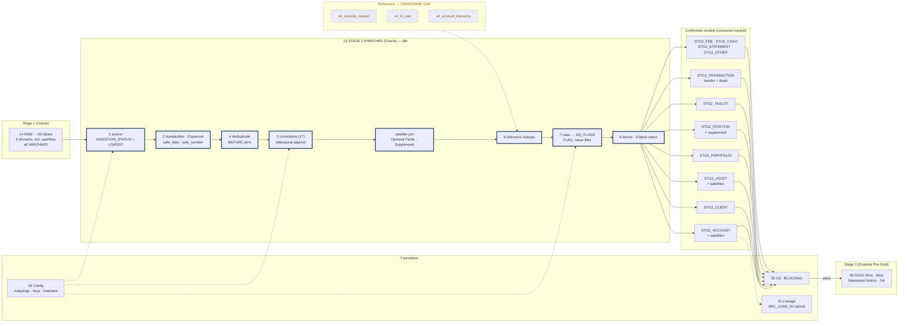
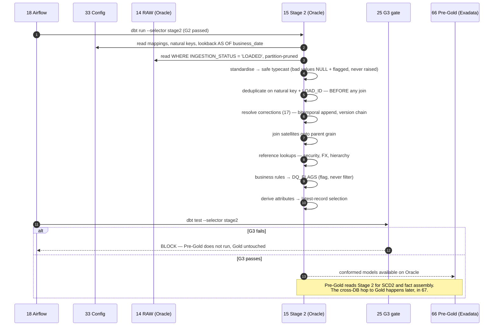

# Stage 2 Enriched (dbt)

## 1. Purpose & Scope

Stage 2 turns RAW's byte-faithful text into typed, standardised, corrected, business-rule-validated records that any consumer could use. One conformed model per entity across the 9 domains, with satellites resolved onto their parents' grain. Its single deliverable is the **dbt model set plus the shared macro library** that makes ~30 feeds conform without per-feed logic.

Its defining constraint is neutrality: Stage 2 must be reusable, not consumer-shaped. No PBDW column names, no Pivotal filters, no report logic. The test is that a fourth consumer can be added without changing a Stage 2 model.

**Tiers touched:** Stage 2 Oracle only. Reads Stage 1 RAW on the same instance. Hands off to Pre-Gold (66) on Exadata — dimensional modelling happens there, not here.

---

## 2. Context & Dependencies

| ID | Component | Why required |
|---|---|---|
| 14 | Stage 1 RAW | Source. Read filtered on `INGESTION_STATUS = 'LOADED'` |
| 17 | Correction handling | The bitemporal resolution macro, invoked inside the correction-bearing models |
| 25 | G3 dbt tests + business rules | Executes against these models; blocks Pre-Gold |
| 31 | Audit & lineage | `SRC_LOAD_ID` / `SRC_ROW_NUM` carried forward |
| 33 | Config store | Feed-to-model mapping, natural keys, lookback windows, severity parameterisation |
| 55 | Oracle connection pooling | dbt thread count bounded by the session ceiling |

### Downstream

- **66 Pre-Gold (Exadata)** — the only routine consumer; performs SCD2 and fact assembly
- **25 G3** — test execution
- **21 Replay** — replays a `LOAD_ID` set through these models

### Tier placement

```
  14 RAW ──▶ ┌─── 15 STAGE 2 ENRICHED (Oracle) ───┐
   [Oracle]  │  standardise · typecast · dedup ·   │
             │  corrections (17) · lookups ·       │
             │  rules · derive · latest-select     │
             │  CONSUMER-NEUTRAL                   │
             └──────────────┬──────────────────────┘
                            ▼
             66 Pre-Gold [Exadata] ──▶ 67 hop ──▶ Gold ──▶ PBDW · IMDS · Pivotal
```

---

## 3. Design Decisions

**D1 · Materialization.**
**Decision:** Incremental on every model, keyed by `BUSINESS_DATE`. No model is full refresh in normal operation.
**Rationale:** Daily full snapshots of Taxlot, EOD Position, Account, Client and Asset mean full refresh rebuilds all history nightly to add one day. It also forfeits single-day replay.
**Consequence:** Every model needs a deterministic incremental predicate and a documented deliberate-rebuild path.

**D2 · Does Stage 2 build dimensions?**
**Decision:** No. Stage 2 produces conformed current-state per business date. SCD2 and fact assembly belong to Pre-Gold (66) on Exadata.
**Rationale:** Dimensional modelling is consumer-shaped; Stage 2 must stay neutral. Also, SCD2 over full history is the heaviest operation in the pipeline and belongs where HCC and Smart Scan are available.
**Consequence:** Stage 2 keeps each day's conformed snapshot so Pre-Gold can rebuild SCD2 without re-reading RAW.

**D3 · Processing order.**
**Decision:** A fixed nine-step CTE order, identical in every model. Dedup before joins; corrections before rules; corrections before latest-record selection.
**Rationale:** Deduplicating a joined set multiplies work. Validating a record you are about to supersede produces false failures. Latest-record selection that cannot see corrections picks wrong.
**Consequence:** The order is enforced by a model template, not by convention.

**D4 · How are satellites handled?**
**Decision:** Satellites are joined onto their parent's grain inside the parent's Stage 2 model, using the parent relationship from config.
**Rationale:** `Account Optional Fields` and `Account Supplement` are extension attributes of Account, not independent entities. Modelling them as separate outputs pushes the join into Pre-Gold, where it would be repeated per dimension build.
**Consequence:** ~30 feeds reduce to roughly 20 Stage 2 models. The satellite join is a macro so the pattern is uniform.

**D5 · Do business rules filter or flag?**
**Decision:** Flag. Rule outcomes are written to a `DQ_FLAGS` column; rows are never dropped.
**Rationale:** Dropping rows in Stage 2 makes the G4 tie-out fail for a reason nobody can see.
**Consequence:** G3 asserts against `DQ_FLAGS` with severity parameterised from config, so a gate can branch on severity.

**D6 · Where does bitemporal versioning live?**
**Decision:** Established here, in the correction-bearing models, and preserved unchanged through Pre-Gold.
**Rationale:** AD-2. Corrections arrive against Stage 2's grain; resolving them later would require Pre-Gold to re-read RAW.
**Consequence:** Every Stage 2 model carries `RECORD_VERSION`, `IS_CURRENT`, `EFFECTIVE_FROM_TS` / `EFFECTIVE_TO_TS`. Pre-Gold consumes rather than re-derives.

**D7 · Reference data.**
**Decision:** Reference lookups (security master, FX, hierarchy) are `ref()`-ed models with their own freshness tests, not raw joins to external tables.
**Rationale:** A stale FX rate produces silently wrong base-currency amounts that no downstream gate catches.
**Consequence:** **Reference data ownership is an open gap** — named in neither source deck. Freshness tests are the mitigation, not the fix.

---

## 4a. Diagrams

### (1) Component / architecture



### (2) Data flow / sequence



---

## 4b. Flow Walkthrough

1. **Airflow (18)** → G2 passed for all domains → triggers `dbt run --selector stage2`
2. **Stage 2 (15)** → reads mappings, natural keys and lookback windows from config (33) as of business date
3. **Stage 2 (15)** → reads RAW filtered `INGESTION_STATUS = 'LOADED'`, partition-pruned by business date → superseded loads excluded
4. **Standardise, then typecast** → trim, case-fold codes, normalise nulls; safe-cast text to `DATE`/`NUMBER` → **bad values become NULL and are flagged, never raised**
5. **Deduplicate** on natural key + `LOAD_ID`, keeping the highest `ROW_NUM` → **before any join**
6. **Resolve corrections (17)** → union delta and correction feeds, rank by correction sequence, build the bitemporal version chain
7. **Join satellites** onto their parent's grain — Optional Fields, Supplement — using the parent relationship from config
8. **Reference lookups** → security master, FX rate, account hierarchy → `ref()`-ed models with freshness tests
9. **Business rules** → outcomes written to `DQ_FLAGS` → **flag, never filter**
10. **Derive** computed attributes → **latest-record selection**, one row per natural key per business date
11. **G3 (25)** → `dbt test --selector stage2` → blocking; failure means Pre-Gold does not run and Gold is untouched
12. **G3 passes** → conformed models available on the Stage 2 Oracle instance → Pre-Gold (66) reads them for assembly on Exadata

**No cross-database hop in this component.** Stage 2 and RAW share the Oracle instance. The **Stage 2 → Gold (Exadata → standalone)** hop occurs downstream in component 67, after Pre-Gold assembly and G4.

---

## 4c. Detailed Design

### Model inventory

| Model | Source feeds | Satellites folded in | Grain | Corrections |
|---|---|---|---|---|
| `STG2_ACCOUNT` | Account, Client Account Link | Account Optional Fields, Account Supplement | Account per business date | No |
| `STG2_CLIENT` | Client | — | Client per business date | No |
| `STG2_ASSET` | Asset, Asset Investment Class | Asset Optional Fields | Asset per business date | No |
| `STG2_PORTFOLIO` | Portfolio, Portfolio Groups, Model Allocation | — | Portfolio per business date | No |
| `STG2_POSITION` | End of Day Position, EOD Changed Positions, FX Forward Position | EOD Positions Supplement | Account + Asset + date | Yes |
| `STG2_TAXLOT` | Taxlot | — | Account + Lot + date | Yes |
| `STG2_TRANSACTION` | Transaction Header, Transaction Detail | — | Transaction, versioned | Yes |
| `STG2_FEE` | Fee Computation, Fee Package Usage | — | Fee event | No |
| `STG2_CASH` | Recurring Cash Activity, Custody And Nostro | — | Cash activity | No |
| `STG2_STATEMENT` | Statement Event, Statement Event Item | — | Statement event + item | No |
| `STG2_REF_*` | Interest Rates, Fund Cutoff Times, End of Period Values, Pay To Recipients, Active Commits, Curr Upcoming Activity | — | Varies | No |

Model-to-feed mapping is **config-driven**; the table above is the current resolution of the registry, not a hard-coded list.

### Fixed processing order

```
  1 source          RAW, INGESTION_STATUS = 'LOADED', partition-pruned
  2 standardise     trim · case-fold codes · '' / 'NULL' / 'N/A' → NULL
  3 typecast        safe_date / safe_number — failures NULL + flagged
  4 deduplicate     natural key + LOAD_ID, keep max ROW_NUM     ← before joins
  5 corrections     union + rank by correction sequence (17)    ← before rules
  6 satellite join  Optional Fields / Supplement onto parent
  7 lookups         reference joins
  8 rules           → DQ_FLAGS (flag, never filter)
  9 derive + latest one row per natural key per business date

  non-negotiable: 4 before 7 · 5 before 8 · 5 before 9
```

### Model template

```sql
-- models/stage2/stg2_transaction.sql
{{ config(
    materialized='incremental',
    unique_key=['transaction_id','business_date','record_version'],
    incremental_strategy='merge',
    partition_by='business_date',
    on_schema_change='fail'
) }}



WITH src AS (
    SELECT * FROM {{ source('raw_swp','RAW_TXN_HEADER') }}
    WHERE ingestion_status = 'LOADED'
    
      AND business_date >= (SELECT MAX(business_date) - {{ lookback }} FROM {{ this }})
    
),
typed AS (
    SELECT
      {{ std_code('transaction_id') }}   AS transaction_id,
      {{ safe_date('trade_date') }}      AS trade_date,
      {{ safe_number('amount') }}        AS amount,
      business_date, load_id AS src_load_id, row_num AS src_row_num, load_timestamp
    FROM src
),
deduped   AS ( {{ dedup_on(['transaction_id','business_date'], order_by='src_row_num desc') }} ),
corrected AS ( {{ resolve_corrections('deduped','corr_typed',
                                      natural_key=['transaction_id','business_date']) }} ),
enriched  AS ( {{ ref_lookups('corrected') }} ),
flagged   AS ( {{ apply_rules('enriched', rule_set='stage2.transaction') }} )

SELECT * FROM flagged
```

### Shared macro library

| Macro | Purpose |
|---|---|
| `std_code` | Trim, upper, null-normalise |
| `safe_date` / `safe_number` | Cast without raising; NULL + flag on failure |
| `dedup_on` | Natural key + `LOAD_ID`, keep max `ROW_NUM` |
| `resolve_corrections` | Bitemporal version chain (component 17) |
| `satellite_join` | Attach Optional Fields / Supplement to parent grain |
| `ref_lookups` | Reference joins with a consistent null-handling policy |
| `apply_rules` | Rule set from config → `DQ_FLAGS` |

### Standard column set added

`SRC_LOAD_ID`, `SRC_ROW_NUM` (lineage) · `RECORD_VERSION`, `IS_CURRENT`, `EFFECTIVE_FROM_TS`, `EFFECTIVE_TO_TS` (bitemporal) · `DQ_FLAGS` · `DBT_UPDATED_AT`

### Concurrency

dbt threads bounded by the Oracle pool ceiling (55), not cluster capacity. Model-level parallelism is available — `STG2_ACCOUNT` and `STG2_CLIENT` have no dependency on `STG2_TRANSACTION`.

---

## 5. Data Quality, Reconciliation & Lineage

| Gate | Position | Blocking |
|---|---|---|
| G2 (24) | Upstream — must have passed | Yes |
| **G3 (25)** | **During this build** | **Yes** — blocks Pre-Gold |
| G4 (26) | Downstream, Pre-Gold on Exadata | Yes |

**G3 assertions:** uniqueness on `(natural_key, business_date, record_version)`; referential integrity to conformed parents; accepted values; bitemporal consistency (`IS_CURRENT='Y'` implies `EFFECTIVE_TO_TS IS NULL`); orphan-correction count zero after the lookback window. **Severity is parameterised from config** — a threshold hardcoded in a dbt test cannot be read by Airflow, so the gate could not branch on it.

**Quarantine:** never applies. Quarantine is pre-RAW only. Stage 2 flags and blocks.

**Lineage:** `SRC_LOAD_ID` + `SRC_ROW_NUM` carried on every row and preserved through Pre-Gold, so a Gold value traces to a physical line in a named file.

---

## 6. RECOMMENDATION

### 6.1 Central design choice

**Are Stage 2 models incremental by business date, or full-refresh rebuilds — given that five of the largest feeds arrive as complete daily snapshots?**

### 6.2 Options comparison

| Option | Description | Pros | Cons | Fit to Oracle/Stage1-2 → Exadata/Gold → movement stack |
|---|---|---|---|---|
| **A · Full refresh daily** | Every model rebuilt from RAW each night | Simplest possible logic — no incremental predicate, no lookback, no state. Correctness is trivially guaranteed: the output is always a function of all input. Schema changes are free. | Rebuilds all history nightly to add one day. On Taxlot and EOD Position this is the dominant cost in the batch. Single-day replay is impossible — a replay is a full rebuild. Consumes the Oracle session budget that ingest also needs. | Weak. On daily full snapshots this is the worst available combination and will not fit an EOD window at production volume. |
| **B · Incremental by business date, with correction lookback** *(recommended)* | Process the current date plus a configurable lookback for corrections; merge on natural key + version | Cost proportional to one day, not to history. Single-day and single-domain replay both possible. Lookback is per-feed config, tunable after production experience. Leaves Oracle headroom for concurrent ingest. | Needs a deterministic incremental predicate per model and a documented rebuild path. A correction landing outside the lookback is missed unless routed to a manual queue. `on_schema_change` must be handled explicitly. | Strong. Keeps the heaviest work proportional and preserves the replay granularity that the per-domain fan-out (18) and replay engine (21) both depend on. |
| **C · Incremental for facts, full refresh for dimension-bearing models** | Snapshot-sourced models rebuilt; delta-sourced models incremental | Dimension models are conceptually current-state, so rebuilding feels natural. Fewer incremental predicates to write. | The snapshot-sourced models are precisely the large ones — Taxlot, Account, Client, Asset, EOD Position. This applies full refresh to the worst cases and incremental to the cheap ones, inverting the benefit. Replay granularity is lost for exactly the domains most likely to need it. | Weak. Optimises the wrong half of the inventory. |

### 6.3 Recommendation

> **Recommended: Option B — incremental on every model, keyed by business date with a per-feed correction lookback.**

Option B wins because the feed inventory is snapshot-heavy: Taxlot, EOD Position, Account, Client and Asset all arrive complete every day, and those are the largest feeds in the set. Option A rebuilds their entire history nightly to add a single day, which is the most expensive possible way to process a snapshot and will not survive contact with production volume inside an EOD window. Option C looks like a compromise but applies full refresh to exactly those five feeds, inverting the benefit it claims. Option B also preserves single-domain, single-date replay — without which the per-domain fan-out in component 18 and the `LOAD_ID`-scoped replay engine in component 21 lose their point.

**What it costs:** a deterministic incremental predicate and a documented rebuild path for every model, plus the risk that a correction arriving outside its feed's lookback window is silently missed. The mitigation is that the lookback is per-feed configuration rather than a global constant, and corrections beyond it route to a manual queue rather than disappearing — but this is a real operational edge that must be monitored, not designed away.

**Tier placement:** Stage 2 sits on the Stage 1/2 Oracle instance alongside RAW. That boundary is correct because Stage 2's read of RAW is the hottest path in the batch and colocating avoids a cross-database read there. Dimensional assembly deliberately does **not** happen here — it belongs on Exadata in Pre-Gold (66), where HCC and Smart Scan make full-history SCD2 affordable, and where the output can be tied out before crossing to the 12 CPU / 64 GB Gold box.

**Must be confirmed for this to hold:**
1. **Does SEI emit a change indicator or row hash on the snapshot feeds?** This is the single largest performance lever available — with it, unchanged rows skip processing entirely and the incremental predicate gets far cheaper.
2. **Correction lookback window per feed**, agreed with SEI. Too short and corrections are missed; too long and every run scans weeks.
3. **Oracle pool ceiling (55)** — bounds dbt thread count and therefore how much model-level parallelism is actually available.

### 6.4 Rules respected

- ✅ Tier boundary crisp — Stage 2 on Oracle; no dimensional modelling here, no Exadata residency, no consumer-tier logic
- ✅ Consumer-neutral — no PBDW, IMDS or Pivotal shaping; a fourth consumer needs no model change
- ✅ **AD-2** — bitemporal append established here and preserved unchanged through Pre-Gold
- ✅ **AD-9** — G3 blocking; failure stops Pre-Gold and Gold is untouched
- ✅ **AD-8** — RAW read-only; superseded loads excluded by filter, not by mutation
- ✅ **AD-1** — Gold is Hub-owned; Stage 2 does not write consumer schemas

---

## 7. Failure, Replay & Idempotency

| Failure | Behaviour |
|---|---|
| Safe-cast failure (E3) | Value NULL, `DQ_FLAGS` set. Never raises. G3 asserts on the flag. |
| Business rule violation (E4) | Flagged, not filtered. G3 blocks per severity from config. |
| Orphan correction | Parked with `ORPHAN_CORRECTION` flag, retried on the lookback window. G3 asserts count is zero after the window. |
| Reference lookup stale | Freshness test on the `ref_` model fails → blocks. **The mitigation for the reference-ownership gap.** |
| G3 failure | Blocks Pre-Gold. Gold retains its prior state. |
| Oracle unavailable (E6) | Retryable at the task level. |

**Replay (21):** replay re-runs the affected `LOAD_ID` set through these models. Because corrections use bitemporal append (**AD-2**), a replay appends a new version rather than overwriting — replay is forward-only, and a replayed day can be compared against the original.

**Idempotency:** `unique_key` includes `record_version`, so a re-run either finds the version present or appends a new one with a distinct `EFFECTIVE_FROM_TS`. No in-place update that a re-run would double-apply.

---

## 8. Security & Access

- **Access:** dbt service account with `SELECT` on RAW and full DDL/DML on the Stage 2 schema only. No write access to RAW, no access to Gold.
- **Credentials:** from the OpenShift secret store (48), injected at pod start.
- **Classification:** TBD — BBH security. If masking is required for Account & Client attributes, Stage 2 is the correct place to apply it, since RAW immutability precludes doing so upstream.
- **Audit:** dbt run artefacts, model versions and config version in force recorded to the lineage store (31).

---

## 9. Open Questions & Risks

| # | Question / risk | Owner | Blocks |
|---|---|---|---|
| 1 | **Reference data ownership** — security master, FX, hierarchy named in neither source deck | BBH | D7; a stale FX rate produces silently wrong amounts no gate catches |
| 2 | Change indicator / row hash on snapshot feeds | SEI | The largest available performance lever |
| 3 | Correction lookback per feed | SEI + BBH | Incremental predicate; orphan-correction handling |
| 4 | Confirmed natural keys per feed | SEI | Dedup, corrections, latest-record selection |
| 5 | Satellite semantics — point-in-time or SCD2-tracked? | SEI + BBH | D4 join design; assembly in 66 |
| 6 | Late-arriving dimension policy — reject or inferred member | ARB | Join behaviour in all fact-feeding models |
| 7 | Oracle pool ceiling | DBA (55) | dbt thread count |
| 8 | Transaction Header / Detail relationship — one model or two? | SEI | `STG2_TRANSACTION` grain |

---

## 10. Acceptance Criteria

**Design complete when:**

- [ ] Model-to-feed mapping resolved for all ~30 feeds, including satellite folding
- [ ] Fixed nine-step order captured in a model template all models are generated against
- [ ] Shared macro library specified — cast, dedup, corrections, satellite join, rules
- [ ] Incremental predicate and rebuild path defined per model
- [ ] G3 test suite specified with severity parameterised from config
- [ ] Reference model set defined with freshness tests, and ownership escalated

**Build complete when:**

- [ ] All models incremental; no model full-refreshes in normal operation — verified by inspection
- [ ] Bitemporal chain provably preserved from Stage 2 into Pre-Gold
- [ ] G3 demonstrably blocks: an injected rule violation prevents Pre-Gold from running
- [ ] A Stage 2 row traces to a RAW physical line via `SRC_LOAD_ID` + `SRC_ROW_NUM`
- [ ] Adding a consumer requires **no** Stage 2 model change — verified against a fourth-consumer scenario
- [ ] Full Stage 2 run completes within its share of the EOD window, measured on production-shaped volume
- [ ] Orphan corrections outside the lookback window are queued, not silently dropped — verified
