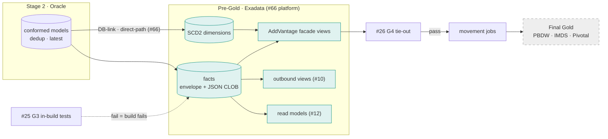
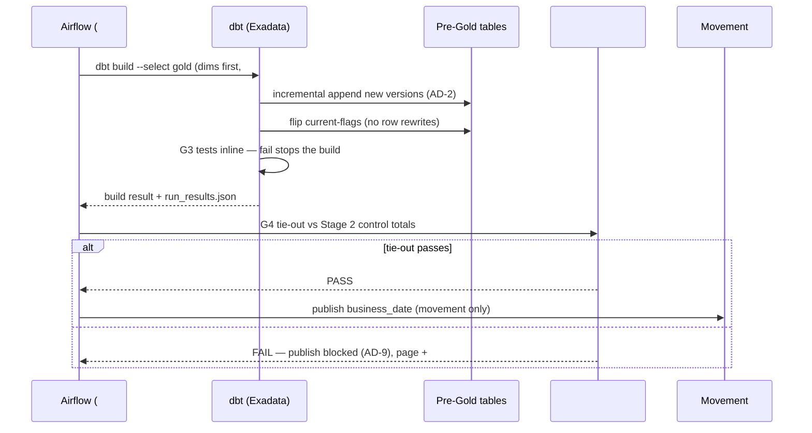

# Gold (dbt)

## 1. Purpose & Scope
The Pre-Gold transformation layer: dbt models running **on Exadata** (#66 is the platform; this component is the modeling) that turn conformed Stage 2 data into the consumption shapes — SCD2 dimensions, fact tables, the AddVantage-facade views that preserve legacy schema compatibility for downstream consumers, and the outbound views #10 selects from. Target state resolves the open question (AD-1): **Gold writes to the Hub-owned Pre-Gold schema only — never PBDW/IMDS direct**; the Final Gold at PBDW/IMDS/Pivotal is reached exclusively by publish/movement after G4 passes. Complex transformation lives here because Exadata's Smart Scan/HCC is why the tier exists.

## 2. Context & Dependencies
- **Upstream**: #15 Stage 2 Enriched (conformed, deduped, latest-record inputs over DB-link/direct-path per #66), #17 Correction Handling (bitemporal correction rows flow through the same models).
- **Gates**: #25 G3 tests embedded in these builds; #26 G4 tie-out blocks publish; #27 G5 verifies arrival.
- **Downstream**: movement jobs to PBDW/IMDS/Pivotal (Final Gold), #10 outbound views, #12 read models.

## 3. Design Decisions
| Decision | Choice | Rationale | Consequence |
|---|---|---|---|
| Hub schema or PBDW/IMDS direct? (AD-1) | **Hub-owned Pre-Gold schema; consumers via movement only** | Direct writes would put un-gated data in systems of record and fork ownership; AD-9's blocking gate only works if there is a gate to block | Movement jobs are trivial by design (simple copy); the facade views make that copy schema-compatible |
| Legacy compatibility strategy | **AddVantage facade views over canonical Pre-Gold tables** | ~1,000 consumers expect legacy shapes; rewriting them is not this program | Canonical model evolves freely beneath stable facades; facade regression tests are first-class |
| History model | **SCD2 + bitemporal columns (AD-2)** | Corrections append as new versions; as-of queries reconstruct any past view | Storage cost accepted; HCC compresses cold versions |
| Payload style for complex documents | **JSON CLOB + relational envelope** | Deep SEI structures keep fidelity in the CLOB; the envelope (keys, dates, amounts) serves joins/gates | Envelope column set is a governed contract; CLOB never queried in hot paths |
| dbt materialization | **Incremental (merge-free append + current-flag flip) for facts/dims; views for facades** | AD-2 forbids destructive merge; flag-flip is an insert+update of flags, not row rewrites | Custom incremental strategy macro; full-refresh only via #21 replay protocol |

## 4a. Diagrams



## 4b. Flow Walkthrough
1. Orchestrator → `dbt build` on the gold selector, dim models before facts (#19 owns ordering) → dependency-safe.
2. Incremental strategy → appends new SCD2 versions and flips current-flags → AD-2: no destructive merge, ever.
3. G3 (#25) → schema + business-rule tests execute inside the build → a failing rule fails the model, nothing downstream sees it.
4. Facade views → resolve current-flag rows into legacy AddVantage shapes → consumers untouched by canonical evolution.
5. G4 (#26) → control totals Pre-Gold vs Stage 2 → **the publish gate (AD-9)**.
6. Movement → simple copy of gate-passed shapes to PBDW/IMDS/Pivotal → Final Gold updated, zero transformation in flight.
7. Outbound views expose the same gate-passed snapshot to #10; read models to #12 — one truth, three doors.

## 4c. Detailed Design
**Envelope contract (fact core)**
```sql
-- every complex fact: relational envelope + fidelity CLOB
CREATE TABLE pg_fact_position (
  pk_hash        VARCHAR2(64) NOT NULL,
  business_date  DATE NOT NULL,
  acct_id        VARCHAR2(20) NOT NULL,
  instr_id       VARCHAR2(20),
  qty            NUMBER, mkt_val NUMBER, cost_basis NUMBER,
  valid_from     TIMESTAMP NOT NULL,      -- AD-2 bitemporal
  valid_to       TIMESTAMP,
  is_current     CHAR(1) DEFAULT 'Y',
  load_id        VARCHAR2(40) NOT NULL,   -- lineage anchor
  payload        CLOB CHECK (payload IS JSON),
  CONSTRAINT pk_pgfp PRIMARY KEY (pk_hash, valid_from)
) PARTITION BY RANGE (business_date) INTERVAL (NUMTODSINTERVAL(1,'DAY'))
  ( PARTITION p0 VALUES LESS THAN (DATE '2026-01-01') )
  COMPRESS FOR QUERY HIGH;                -- HCC
```
**Incremental macro**: insert-new-versions + `UPDATE ... SET is_current='N'` on superseded keys (flag update only — no data column rewrite; auditors see full history). Facades: `CREATE OR REPLACE VIEW addv_<legacy_name> AS SELECT ... WHERE is_current='Y'` with column-exact legacy mapping specs from #33.
**dbt project shape**: `models/gold/{dims,facts,facades,outbound,readmodels}`; exposures declared for movement targets, #10 views, #12 read models — lineage-complete in the dbt graph.
**Movement contract**: publishes only `is_current='Y'` facade shapes for the gate-passed business_date; consumer schemas never see bitemporal columns.
**External contracts**: legacy AddVantage column specs (from consumer inventory), Final Gold target DDL (PBDW/IMDS/Pivotal owners).

## 5. Data Quality, Reconciliation & Lineage
G3 rules live *in* the models (tests + constraint-shaped logic per #25's split); G4 reconciles envelope aggregates (counts, Σqty, Σmkt_val) Pre-Gold vs Stage 2 per domain per date; the CLOB is excluded from tie-out (fidelity, not math). load_id on every row joins RAW→Stage 2→Pre-Gold→publish in one lineage query (#31). Facade regression: a golden-query suite asserts legacy shapes byte-stable across canonical changes.

## 6. RECOMMENDATION
**6.1** Hub-owned Pre-Gold on Exadata with bitemporal SCD2 + envelope/CLOB modeling, legacy AddVantage facades, and movement-only publish after G4 — AD-1 resolved as Hub schema.
**6.2**
| Option | Description | Pros | Cons | Fit |
|---|---|---|---|---|
| A. Hub Pre-Gold + facades + movement (recommended) | As designed | Gates enforceable; consumers untouched; canonical model free to evolve; corrections auditable (AD-2) | Facade spec effort up front; double storage (Pre-Gold + Final Gold) | **High** |
| B. dbt writes PBDW/IMDS directly | Gold materializes in consumer DBs | One less copy | Un-gated writes into systems of record; AD-9 unenforceable; consumer DDL couples every dbt change; recon has no independent source | Low |
| C. Canonical-only, consumers migrate to new shapes | No facades | Cleanest model | Boiling the 1,000-consumer ocean inside the SWP timeline; explicitly out of scope (Stage 2 enrichment-only decision heritage) | Low — future program |
**6.3** > **Recommended: Option A.** It is the only option where AD-9 means anything: a blocking gate requires a place to hold gated data, and that place must be Hub-owned. The facade layer is the price of not migrating 1,000 consumers this phase — paid once per legacy shape, amortized by regression tests — while the envelope/CLOB split gives gates something to reconcile without flattening SEI's document structures. Measurements that must hold: G4 tie-out pass rate with zero publish-on-fail, facade golden queries byte-stable per release, HCC compression ratio and Smart Scan offload % tracked (#34) to prove the Exadata placement earns its keep.
**6.4** Tiers: reads Stage 2, writes Pre-Gold only; the one cross-DB hop is #66's contract; movement to Final Gold is copy-only. AD-1/AD-2/AD-9 honored; no open-AD dependencies.

## 7. Failure, Replay & Idempotency
A failed build leaves prior current-flags intact (append-then-flip ordering) — consumers keep serving yesterday's gate-passed state. Replay (#21): corrections re-enter as new versions; a business_date rebuild re-runs models as-of RAW/Stage 2 state and appends — Gold is **never rewritten in place**. Movement is idempotent per date (target truncate-insert of the date's slice or merge-by-pk per target owner's standard).

## 8. Security & Access Control
Pre-Gold schema grants: dbt role write; movement + #10 + #12 read via role-scoped views only. Client-identifying envelope columns follow #32 classification; CLOB payloads masked in any non-prod clone. No consumer credentials touch Pre-Gold (movement runs Hub-side, pushes with target-owned credentials from #48).

## 9. Open Questions & Risks
- Legacy facade inventory: which AddVantage shapes are actually consumed (vs assumed) — needs the consumer-interface census; owner: TBD; sizes the facade backlog.
- Envelope column set per domain: governed list to finalize with #33; owner: TBD.
- Risk: flag-flip updates on very large days → measured; fallback is partition-exchange current-pointer pattern documented in #66.
- Risk: facade drift when SEI adds fields → CLOB absorbs silently; envelope additions follow a versioned change process (#33).

## 10. Acceptance Criteria
- [ ] AD-2 audit: a correction produces a new version row; prior version queryable as-of; zero UPDATEs to data columns in redo logs.
- [ ] Publish-block test: forced G4 failure → movement does not run; consumers still see previous date.
- [ ] Facade golden-query suite green across a canonical column addition.
- [ ] Envelope↔CLOB consistency sample check (envelope values match JSON) at G3.
- [ ] Movement copies are transformation-free (checksum of facade rows = checksum at target).
- [ ] Smart Scan/HCC evidence recorded for the two heaviest models.
