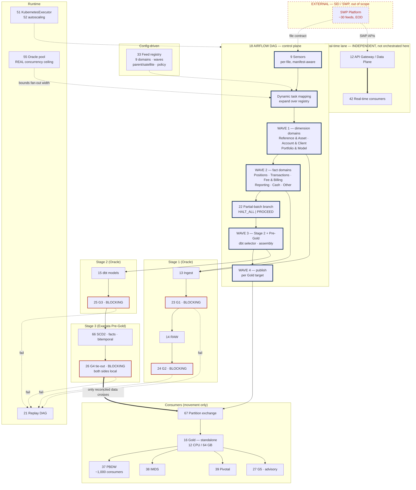

# Airflow DAG + Per-Domain Fan-out

## 1. Purpose & Scope

This component is the control plane for the entire batch lane. It decides what runs, in what order, with what concurrency, and what happens when something fails — across ~30 feeds in 9 domains, through four tiers, ending at the consumer publish. Its single deliverable is a **dynamically mapped DAG generated from the feed registry**, not a hand-written task graph.

It holds control flow and nothing else. No transformations, no business rules, no thresholds — those belong to dbt, to the gates, and to configuration. The discipline that keeps this component maintainable is that reading the DAG tells you the *shape* of the pipeline and nothing about the *meaning* of the data.

**Tiers touched:** orchestrates across all four — Stage 1 Oracle ingest, Stage 2 Oracle transformation, Stage 3 Exadata Pre-Gold assembly and tie-out, and the consumer-movement publish. It executes work at none of them.

---

## 2. Context & Dependencies

### Upstream (Depends On)

| ID | Component | Why required |
|---|---|---|
| 33 | Config store | Feed registry drives dynamic task mapping; waves, cadence, lookback, partial-batch policy |
| 9 | Arrival sensors | Per-file triggers that start each domain branch |
| 13 | Ingestion framework | Invoked per feed in wave 1 |
| 15 | Stage 2 | dbt selector invocation |
| 19 | Build order / threads | Dim-before-fact sequencing and dbt concurrency |
| 21 | Replay engine | Invoked on failure paths; replay runs re-enter this DAG |
| 22 | Partial-batch policy | Branching logic on a domain failure |
| 23–26 | Gates G1–G4 | Blocking task placement |
| 51, 52, 55 | Airflow deployment, autoscaling, Oracle pooling | Executor, worker capacity, and the real concurrency ceiling |
| 66 | Pre-Gold assembly | Wave 3 task group on Exadata |
| 67 | Gold movement | Wave 4 publish |

### Downstream

- Every executing component in the batch lane
- **35 Integration360** — run status, exceptions, process tracking
- **34 Observability** — run-level metrics and SLIs

### Tier placement

```
  ┌─────────────────── 18 AIRFLOW DAG (control plane) ───────────────────┐
  │  spans all tiers · executes at none                                  │
  └──┬────────────┬─────────────┬──────────────────┬────────────────────┘
     ▼            ▼             ▼                  ▼
  STAGE 1      STAGE 2      STAGE 3            CONSUMER
  Oracle       Oracle       Exadata Pre-Gold   movement
  ingest+G1    dbt+G3       assembly+G4        publish+G5
     └──────────────────────┬───────────────────────┘
                            │ 67 cross-DB hop: Exadata → Gold
                            ▼
                    Gold (standalone) ──▶ PBDW · IMDS · Pivotal
```

---

## 3. Design Decisions

**D1 · Static DAG or dynamic task mapping?**
**Decision:** Dynamic task mapping over the feed registry in config (33). No feed, domain or table name appears in DAG code.
**Rationale:** ~30 feeds across 9 domains, with satellites and a plausible tenth domain. A static graph means every feed change is a code change and a release.
**Consequence:** The DAG is harder to read at a glance and harder to debug — mitigated by a rendered dependency view and consistent task-ID naming derived from `feed_id`.

**D2 · What is the fan-out unit?**
**Decision:** The **domain**, not the feed. A domain branch fans out internally over its feeds.
**Rationale:** Dependencies and partial-batch decisions are meaningful at domain level — "Positions failed" is actionable; "EOD Positions Supplement failed" is a detail within it. Satellites must complete with their parent.
**Consequence:** 9 top-level branches, ~30 leaf ingest tasks. Partial-batch policy (22) operates on domains.

**D3 · How are load waves sequenced?**
**Decision:** Two waves by `LOAD_WAVE` in config. Wave 1 = dimension-bearing domains (Reference & Asset, Account & Client, Portfolio & Model). Wave 2 = fact-bearing domains (Positions, Transactions, Fee & Billing, Reporting, Cash, Other).
**Rationale:** Dimensional assembly in Pre-Gold (66) resolves fact foreign keys against dimensions. Facts arriving before their dimensions produce orphans or inferred members.
**Consequence:** Wave 2 waits on wave 1 completion at the ingest and Stage 2 level. This is a genuine serialisation cost, accepted because the alternative is late-arriving-dimension handling in every fact model.

**D4 · Does a domain failure halt the batch?**
**Decision:** Default `HALT_ALL`, configurable per domain to `PROCEED`. Held in `CFG_SCHEDULE.PARTIAL_BATCH_POLICY`.
**Rationale:** Halt-all is the defensible default until measured — a partial business date published to PBDW is a consistency problem for ~1,000 consumers. But the per-domain fan-out makes proceeding *possible*, so the policy should be config, not code.
**Consequence:** **Contingent on AD-5.** If ARB lands on per-domain proceed, a publish-completeness marker per domain must be readable by consumers.

**D5 · Are DQ failures retried?**
**Decision:** No. `retries=0` on every gate task. Only class E6 (infrastructure) is retryable, and only on non-gate tasks.
**Rationale:** The input is unchanged, so the outcome is unchanged. Retrying a blocking gate burns the EOD window and makes a real data problem look like flakiness in the run history.
**Consequence:** The `GateOperator` enforces `retries=0` regardless of what is passed, so the default cannot be reintroduced by a well-meaning edit.

**D6 · How is the cross-database hop orchestrated?**
**Decision:** Wave 4 is a distinct task group. G4 completes fully on Exadata before any movement task starts. Movement is per Gold target object, parallel, each with its own verify.
**Rationale:** Only reconciled data crosses the hop. Per-object movement means one target failing does not block the others, and each is independently restartable.
**Consequence:** The DAG must model the Exadata/Gold boundary explicitly — pool separation, distinct connection identities, and a task-level marker so an operator can see where a run stopped relative to the hop.

**D7 · Does this DAG orchestrate the real-time lane?**
**Decision:** No. The API Gateway / Data Plane lane (12) is independent and has no batch dependency.
**Rationale:** Coupling would make real-time consumers wait on an EOD build.
**Consequence:** **Contingent on AD-4.** If intraday is routed through the batch pipeline rather than the API lane, component 20's cadence design and this DAG's concurrency model both reopen.

**D8 · One DAG or several?**
**Decision:** One EOD DAG for the batch lane, plus a separate intraday DAG (20) and a separate replay DAG (21).
**Rationale:** Different schedules, different failure semantics, different concurrency budgets. A single DAG carrying all three becomes an unreadable branch tree.
**Consequence:** A cross-DAG lock is required so intraday and EOD never write the same target concurrently.

---

## 4a. Diagrams

### (1) Component / architecture



### (2) Data flow / sequence

```mermaid
sequenceDiagram
  autonumber
  participant CFG as 33 Config
  participant AF as 18 DAG
  participant SEN as 9 Sensors
  participant ING as 13 Ingest (Stage 1)
  participant S2 as 15 Stage 2
  participant PG as 66 Pre-Gold (Exadata)
  participant MV as 67 Movement
  participant GD as Gold (standalone)

  AF->>CFG: read feed registry AS OF business_date
  CFG-->>AF: 9 domains · ~30 feeds · waves · policy
  AF->>AF: expand — one branch per domain, leaves per feed
  AF->>SEN: arm per-file sensors
  SEN-->>AF: file arrived (per feed, independently)

  rect rgb(240,245,250)
    Note over AF,ING: WAVE 1 — dimension domains
    AF->>ING: ingest Reference &amp; Asset, Account &amp; Client, Portfolio &amp; Model
    ING-->>AF: G1 pass → RAW → G2 pass
  end

  rect rgb(240,245,250)
    Note over AF,ING: WAVE 2 — fact domains (waits on wave 1)
    AF->>ING: ingest Positions, Transactions, Fee &amp; Billing, Reporting, Cash, Other
    ING-->>AF: G1 pass → RAW → G2 pass
  end

  alt a domain fails a gate
    AF->>AF: evaluate 22 partial-batch policy
    alt HALT_ALL (default)
      AF-->>AF: stop batch · alert · replay candidate
    else PROCEED
      AF-->>AF: continue remaining domains · mark domain incomplete
    end
  else all domains pass
    AF->>S2: dbt run --selector stage2 (Oracle)
    S2-->>AF: G3 pass
    AF->>PG: assemble dims (wave A) then facts (wave B) — Exadata
    PG->>PG: G4 tie-out, both sides local
    alt G4 fails
      PG-->>AF: BLOCK · nothing crosses · Gold holds prior partition
    else G4 passes
      AF->>MV: publish per Gold target, parallel
      MV->>GD: CROSS-DB HOP — DB-link direct-path APPEND + partition exchange
      MV-->>AF: post-move row-count verify
      AF->>GD: release consumer extracts (PBDW, IMDS, Pivotal)
      AF->>AF: G5 advisory recon
    end
  end
```

---

## 4b. Flow Walkthrough

1. **DAG (18)** → reads the feed registry from config (33) as of the business date → 9 domains, ~30 feeds, waves, partial-batch policy
2. **DAG (18)** → expands dynamically → one branch per domain, leaf tasks per feed, satellites bound to their parent's branch
3. **Sensors (9)** → armed per file, manifest-aware → each fires independently on arrival, reclaiming the spread of the delivery window
4. **Wave 1 — Stage 1 Oracle** → ingest the dimension domains: Reference & Asset, Account & Client, Portfolio & Model → G1 blocking per file
5. **Wave 1** → RAW load → G2 profiling gate, blocking → wave 1 complete
6. **Wave 2 — Stage 1 Oracle** → ingest the fact domains: Positions, Transactions, Fee & Billing, Reporting, Cash, Other → G1, RAW, G2 as above
7. **Partial-batch branch (22)** → on any domain gate failure, evaluate policy → `HALT_ALL` stops the batch; `PROCEED` continues and marks that domain incomplete
8. **Wave 3 — Stage 2 Oracle** → dbt selector run across all conformed models → G3 blocking on tests and business rules
9. **Wave 3 — Stage 3 Exadata** → Pre-Gold (66) assembles dimensions first, then facts, then bitemporal history under HCC
10. **G4 (26)** → tie-out on Exadata, RAW counts by `LOAD_ID` against assembled rows → **both sides local, blocking, not override-eligible**
11. **G4 fails** → nothing crosses to Gold. Gold retains its prior partition. Error event (29), exception queued (30), replay candidate (21)
12. **Wave 4 — CROSS-DATABASE HOP** → **Exadata → standalone Gold** via DB-link direct-path `APPEND`, then partition exchange, per target object in parallel
13. **Movement (67)** → post-move row-count verify against the Pre-Gold source count → lightweight, appropriate for the 12 CPU / 64 GB box
14. **Consumer movement** → scheduled extracts release to PBDW, IMDS Stage → IMDS, and Pivotal → movement only, no transformation
15. **G5 (27)** → advisory post-publish reconciliation → alerts and may trigger replay; blocks nothing

**Failure branch (any gate):** the run stops at that gate. Downstream tiers are untouched, Gold holds its prior state, and remediation is fix-then-replay from `LOAD_ID` — never in-place repair.

---

## 4c. Detailed Design

### DAG shape

```python

from airflow.decorators import dag, task, task_group
from hub_framework.config import ConfigStore
from hub_framework.operators import GateOperator, IngestOperator, DbtOperator

@dag(
    dag_id="hub_eod",
    schedule=None,                     # cadence from config, set at deploy
    max_active_runs=1,                 # one EOD run at a time, full stop
    catchup=False,
    default_args={"retries": 0},       # E6 tasks opt IN; nothing opts out of blocking
)
def hub_eod():

    @task
    def domains(wave: int, ds=None):
        return ConfigStore(ds).domains(load_wave=wave)     # 33 drives the shape

    @task_group
    def ingest_domain(domain: str):
        feeds  = list_feeds(domain)                        # incl. satellites
        loaded = IngestOperator.partial(task_id="ingest").expand(feed=feeds)
        g1     = GateOperator(task_id="g1", gate="G1", scope=loaded)
        g2     = GateOperator(task_id="g2", gate="G2", scope=loaded)
        loaded >> g1 >> g2

    wave1 = ingest_domain.expand(domain=domains(1))        # dimension domains
    wave2 = ingest_domain.expand(domain=domains(2))        # fact domains

    gate_batch = partial_batch_branch()                    # 22 · policy from config

    stage2 = DbtOperator(task_id="stage2", selector="stage2", target="oracle")
    g3     = GateOperator(task_id="g3", gate="G3")

    @task_group
    def pre_gold():                                        # 66 · Exadata
        dims  = DbtOperator.partial(task_id="dim").expand(model=dim_models())
        facts = DbtOperator.partial(task_id="fact").expand(model=fact_models())
        g4    = GateOperator.partial(task_id="g4", gate="G4",
                                     override_eligible=False).expand(target=gold_targets())
        dims >> facts >> g4

    @task_group
    def publish():                                         # 67 · CROSS-DB HOP
        mv  = MovementOperator.partial(task_id="exchange").expand(target=gold_targets())
        vfy = VerifyOperator.partial(task_id="verify").expand(target=gold_targets())
        mv >> vfy

    g5 = GateOperator(task_id="g5", gate="G5", blocking=False)

    wave1 >> wave2 >> gate_batch >> stage2 >> g3 >> pre_gold() >> publish() >> g5

hub_eod()
```

### Wave assignment from the domain inventory

| Wave | Domains | Feeds | Role |
|---|---|---|---|
| **1** | Reference & Asset (3), Account & Client (5), Portfolio & Model (3) | 11 | Dimension-bearing; must land before facts resolve FKs |
| **2** | Positions (5), Transactions (2), Fee & Billing (2), Reporting (2), Cash (1), Other (7) | 19 | Fact-bearing |

Satellites (`Account Optional Fields`, `Account Supplement`, `EOD Positions Supplement`, `Asset Optional Fields`) sit in their parent's wave and must complete with it before the wave closes.

### Concurrency model

| Level | Bound by | Note |
|---|---|---|
| `max_active_runs` | 1 | One EOD run; enforced, not advisory |
| Domain branch parallelism | Config, ≤ Oracle pool ceiling (55) | 9 branches possible; actual width is a measured number |
| Feed parallelism within a domain | Config per domain | Large snapshots may run alone |
| dbt threads (Stage 2 / Pre-Gold) | Component 19 | Exadata parallel budget, not cluster capacity |
| Movement parallelism (wave 4) | Per Gold target | Bounded by the DB-link and the 12 CPU Gold box, **not** by Exadata |

**The governing constraint:** pods are cheap, Oracle sessions are not. Component 55 sets the ceiling and component 52 must not autoscale past it — beyond that point additional workers queue on connections and the window gets longer, not shorter.

### Cross-DAG locking

```python
with target_lock(objects=gold_targets(), holder="hub_eod", ds=ds):
    ...  # wave 3 and 4 execute inside the lock
```

### Task naming

Derived from `feed_id` and `domain` so a task ID is greppable back to config: `ingest_domain[positions].ingest[positions_taxlot]`. No free-text task names.

### Config surface (component 33)

- Domain and feed registry, with wave and parent/satellite relationships
- `PARTIAL_BATCH_POLICY` per domain
- Branch and feed concurrency limits
- EOD cadence and window budget
- Correction lookback per domain (passed to Stage 2)
- Gold target list and publish order

---

## 5. Data Quality, Reconciliation & Lineage

This component executes no checks; it **places** them and enforces their blocking semantics.

| Gate | Placed at | Blocking | Enforcement here |
|---|---|---|---|
| G1 (23) | Inside ingest, per feed | Yes | `retries=0`; failure fails the domain branch |
| G2 (24) | After RAW, per domain | Yes | Blocks the domain from entering wave 3 |
| G3 (25) | During Stage 2 | Yes | Blocks Pre-Gold |
| **G4 (26)** | **Pre-Gold, Exadata, per target** | **Yes — not override-eligible** | Blocks the cross-DB hop. `override_eligible=False` set on the operator. |
| G5 (27) | After publish | No | `blocking=False`; alerts and may trigger replay |

**Lineage contribution:** every task records `BATCH_ID`, the `LOAD_ID` set in scope, and the config version in force. This is what lets an operator establish which run produced a given Gold partition, and what lets replay target a `LOAD_ID` set rather than a whole date.

---

## 6. RECOMMENDATION

### 6.1 Central design choice

**Is the DAG a static, hand-written task graph over the known feeds, or dynamically generated by task mapping over the feed registry?**

### 6.2 Options comparison

| Option | Description | Pros | Cons | Fit to Oracle/Stage1-2 → Exadata/Gold → movement stack |
|---|---|---|---|---|
| **A · Static DAG, one task per feed** | ~30 explicitly written ingest tasks with hand-drawn dependencies | Immediately readable — the graph in the UI is the graph in the code. Trivial to debug a single feed. Dependencies are explicit and reviewable in a diff. | Every feed addition, removal or wave change is a code change and a release. ~30 tasks plus gates plus waves is a large hand-maintained file that will drift from the registry. Satellite/parent relationships must be re-encoded by hand in two places. | Workable but brittle. The tier progression is fine; the maintenance cost scales with the feed count and a tenth domain is a rewrite. |
| **B · Fully dynamic, generated at parse time from the registry** *(recommended)* | `expand()` over domains and feeds read from config; no names in code | Adding a feed is a config commit. Registry and DAG cannot drift — there is only one list. Satellite/parent and wave logic lives once, in config. Scales to a tenth domain without touching code. | Harder to read in the UI; a mapped task index is less obvious than a named task. Debugging requires knowing which index maps to which feed. Parse-time config reads must be fast or the scheduler suffers. | Strong. Matches the config-driven principle applied across 13, 23 and 28, and keeps the four-tier progression explicit at the wave level where it matters. |
| **C · Generated DAG files** | A build step renders static DAG Python from the registry, committed and deployed | Readable static output *and* a single source of truth. Diffable — a registry change shows as a DAG diff in review. | Adds a generation step to CI and a deploy to every feed change, so it is not a runtime change. Generated code in the repo invites hand-editing, which silently breaks the generator. Two artefacts to keep synchronised. | Reasonable middle ground, but reintroduces the release cycle that option B removes for a purely cosmetic gain. |

### 6.3 Recommendation

> **Recommended: Option B — fully dynamic task mapping over the feed registry in configuration.**

Option B wins because the feed inventory is explicitly expected to change: nine domains and roughly thirty feeds today, with satellites, a tenth domain plausible, and outbound scope (AD-11) still unsettled. Option A makes every one of those changes a code release and guarantees drift between the DAG and the registry that components 13, 23 and 28 already read. Option C keeps the single source of truth but reintroduces the release cycle for no runtime benefit, and generated code in a repository is reliably hand-edited eventually.

**What it costs:** readability. A mapped task index is less legible in the Airflow UI than a named task, and debugging "which feed is index 17?" is a real cost at 2am. The mitigation is deterministic task-ID naming derived from `feed_id`, so IDs remain greppable back to config, plus a rendered dependency view for operators.

**Tier placement:** the DAG spans all four tiers and executes at none. That boundary is correct because orchestration must see the whole progression — particularly the Exadata → Gold hop, where it enforces that G4 completes fully before any movement task starts. Pushing sequencing down into dbt or into the ingestion framework would hide the cross-database boundary from the layer responsible for stopping at it.

**Must be confirmed for this to hold:**
1. **Oracle connection-pool ceiling and DBA session grant (55)** — this, not cluster capacity, sets the maximum useful fan-out width. Autoscaling (52) must be capped to it.
2. **AD-5 partial-batch policy** — determines whether the branch in step 7 halts the batch or proceeds per domain, and whether consumers need a publish-completeness marker.
3. **Exadata parallel-degree budget and the EOD window measured end to end**, including the cross-DB hop in wave 4, which is likely bandwidth-bound rather than CPU-bound.

### 6.4 Rules respected

- ✅ Tier boundary crisp — Stage 1/2 on Oracle, Pre-Gold assembly on Exadata, Gold publish-only, consumer hop is movement
- ✅ Cross-database hop explicit — wave 4 is a distinct task group; G4 completes on Exadata before anything crosses; `LOAD_ID` lineage preserved
- ✅ **AD-9** — blocking gates with `retries=0`; G4 before publish and not override-eligible
- ✅ **AD-8** — no orchestration path mutates RAW
- ✅ **AD-1** — Gold is Hub-owned and published to; consumer extracts are movement only
- ⚠️ **AD-5 contingent** — D4 defaults to `HALT_ALL` pending decision
- ⚠️ **AD-4 contingent** — D7 assumes the real-time lane stays independent of this DAG

---

## 7. Failure, Replay & Idempotency

| Failure | Behaviour |
|---|---|
| Sensor timeout (E1) | Domain branch fails. Distinguishes "late" from "missing" via the manifest expected-file list. |
| Gate failure (E2–E5) | Task fails non-retryably. Partial-batch policy decides batch-level behaviour. |
| Infrastructure (E6) | **Only** retryable class. Bounded backoff on non-gate tasks. |
| Scheduler or worker loss | KubernetesExecutor (51) reschedules. Idempotent tasks make this safe. |
| Movement fails mid-transfer | Partition exchange has not occurred — Gold still serves the prior partition. Restart the movement task only. |
| Concurrent run attempt | `max_active_runs=1` plus target-object locking rejects it. |

**Replay (21):** replay is a separate DAG that re-enters the same task groups with a `LOAD_ID` set as scope. Because RAW is append-only (AD-8) and Pre-Gold uses bitemporal append (AD-2), replay is forward-only at every tier — a replayed domain rebuilds only its own Gold partitions and re-exchanges them.

**Idempotency:** every task is keyed on `(business_date, domain, LOAD_ID set)`. Re-running produces the same result: ingest supersedes, Stage 2 and Pre-Gold append versions, movement re-exchanges a partition. No task performs an in-place update that a re-run would double-apply.

---

## 8. Security & Access

- **Service accounts:** the DAG runs under a dedicated OpenShift service account (47). Task pods receive scoped identities — the ingest pod holds `INSERT` on RAW only; the movement pod holds the DB-link and partition-exchange grant only.
- **Credential separation:** Exadata and standalone-Gold credentials are distinct secrets (48). No single pod holds both beyond the movement task.
- **Airflow UI access:** read access for operators, trigger and clear rights restricted. The ability to clear a gate task is effectively an override path and must be controlled as tightly as the override authority in component 28.
- **Connections and variables:** sourced from the secret store, never from the Airflow metadata DB in plain text.
- **Audit:** run-level records — who triggered, who cleared a task, config version in force — to the lineage store (31).

---

## 9. Open Questions & Risks

| # | Question / risk | Owner | Blocks |
|---|---|---|---|
| 1 | Oracle pool ceiling and DBA max sessions | DBA (55) | Fan-out width; autoscaling cap in 52 |
| 2 | **AD-5** partial-batch policy | ARB | D4; publish-completeness marker for consumers |
| 3 | **AD-4** intraday lane placement | ARB | D7; cross-DAG locking scope; component 20 |
| 4 | Exadata → Gold bandwidth and nightly delta volume | BBH infra | Wave 4 duration; likely the EOD bottleneck |
| 5 | EOD window budget end to end, measured | BBH ops | Whether waves 1 and 2 can remain serialised |
| 6 | Who may clear a failed gate task in the Airflow UI? | BBH ops + risk | This is an override path in practice; must align with 28 |
| 7 | Confirmed wave assignment per domain | SEI + BBH | D3; whether Other (7 feeds) splits across waves |
| 8 | Satellite completion semantics — must a parent wait for its satellites? | SEI + BBH | Branch closure logic; assembly correctness in 66 |

---

## 10. Acceptance Criteria

**Design complete when:**

- [ ] Wave assignment agreed for all 9 domains, including where the Other domain's 7 feeds sit
- [ ] Satellite-to-parent completion semantics specified
- [ ] Concurrency limits defined per level, with the Oracle pool ceiling as the binding constraint
- [ ] Cross-DAG locking design agreed across EOD, intraday and replay
- [ ] Gate placement confirmed, with `override_eligible=False` on G4
- [ ] Task-ID naming convention agreed and traceable to `feed_id`
- [ ] Partial-batch branch behaviour specified for both AD-5 outcomes

**Build complete when:**

- [ ] No feed, domain or table name appears anywhere in DAG code — verified by inspection
- [ ] Adding a feed to the registry changes the DAG shape with **no code change**, demonstrated
- [ ] A gate failure demonstrably does not retry, and fails the correct branch only
- [ ] G4 failure leaves Gold on its prior partition, verified by query across the failure
- [ ] Wave 2 provably cannot start before wave 1 completes
- [ ] Concurrent EOD and intraday runs against the same target are rejected by the lock
- [ ] Full EOD run across all 9 domains completes inside the agreed window, measured on production-shaped volume
- [ ] Replay of one domain's `LOAD_ID` set rebuilds only that domain's Gold partitions
