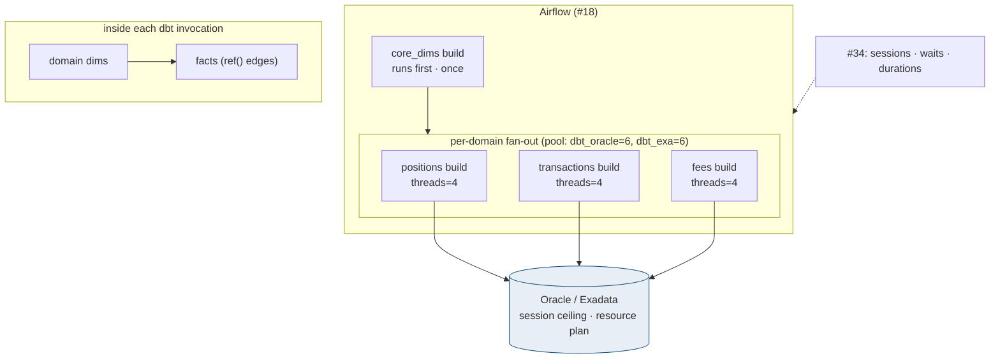
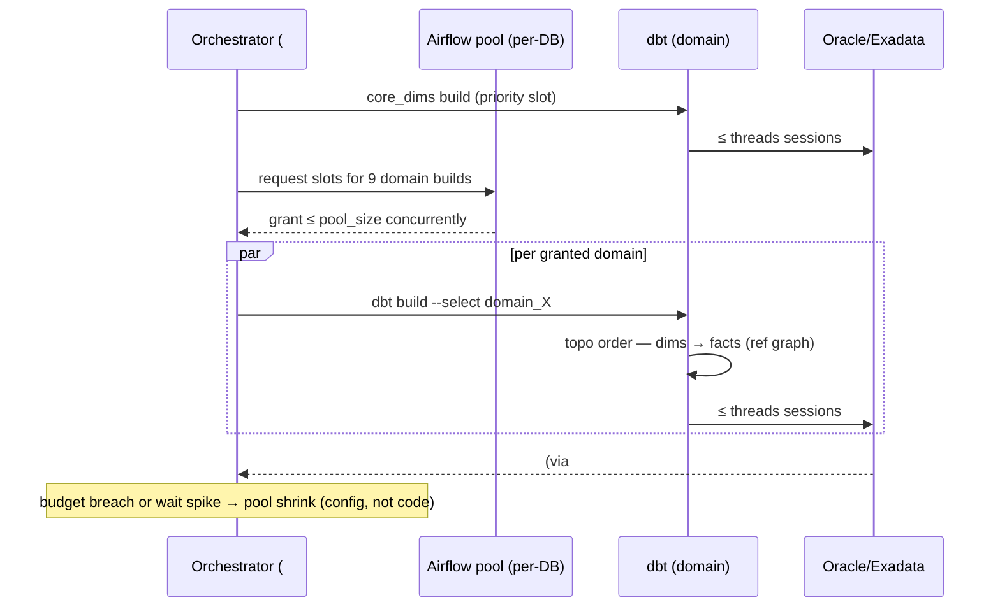

# Dim-before-Fact / dbt Threads

## 1. Purpose & Scope
The concurrency governor for dbt execution: guarantee dimensional models complete before dependent facts (correct SCD2 keys at fact-build time), and hold total database concurrency under the Oracle/Exadata session and contention ceilings while 9 domains run in parallel. Target state: **ordering comes free from the dbt DAG (`ref()` edges) — never from hand-sequenced tasks**; concurrency is governed by a two-level budget: dbt `threads` per invocation × Airflow pool slots per database, sized from measured ceilings, with #34 telemetry closing the loop. This answers the open question — thread count is not a constant, it is a budgeted product.

## 2. Context & Dependencies
- **Governs**: #15 Stage 2 builds (Oracle) and #16 Gold builds (Exadata) — separate budgets per database.
- **Invoked by**: #18 per-domain fan-out (each domain task group runs its dbt selectors under this policy).
- **Config**: #33 (per-domain selector, threads, pool); **telemetry**: #34 (session counts, wait events, build durations).

## 3. Design Decisions
| Decision | Choice | Rationale | Consequence |
|---|---|---|---|
| How is dim-before-fact enforced? | **dbt DAG via `ref()` only** | dbt already topologically orders; duplicating it in Airflow task edges creates two orderings that WILL diverge | A fact model missing a `ref()` is a PR-blocking guardrail (cp-guardrails rule), not a runtime hope |
| Thread count vs Oracle ceiling? | **Budget: Σ(active domains × threads) ≤ 0.6 × session ceiling per DB** | Headroom for gates, sensors, corrections, ad-hoc; contention (not sessions) is usually the real wall | Initial: threads=4/domain, pool=6 concurrent domain-builds per DB → ≤24 dbt sessions; tuned from evidence |
| One dbt invocation or per-domain? | **Per-domain invocations under an Airflow pool per database** | Blast-radius isolation (one domain's failure doesn't kill the run) + pool gives cross-domain governance dbt alone lacks | `state:modified` efficiency preserved via per-domain manifests |
| Cross-domain shared dims | **Build in a `core_dims` selector that runs FIRST, once** | Account/instrument dims feed many domains; rebuilding per domain wastes the budget and risks skew | core_dims is a pool-priority task ahead of the domain fan-out |

## 4a. Diagrams

## 4b. Flow Walkthrough
1. core_dims → single priority build of shared dimensions → every domain sees consistent keys.
2. #18 fan-out → 9 domain builds request slots from the per-database Airflow pool → cross-domain ceiling enforced where dbt cannot see.
3. Inside each build → dbt's `ref()` graph orders domain dims before facts → correctness is structural.
4. Each build opens ≤ `threads` sessions → worst case = pool × threads, held ≤ 60% of the DB ceiling.
5. #34 telemetry (v$session counts tagged by module, wait-event profile, per-model durations) → the tuning evidence.
6. Breach response → shrink pool or threads in #33 config → next run complies; no code change.

## 4c. Detailed Design
**Budget math (initial, to be evidence-tuned)**: Oracle Stage-2 ceiling assumed 200 sessions → dbt budget 120 → pool 6 × threads 4 = 24 sessions leaves generous room for ingestion (#13), gates, corrections; Exadata analogous with its own plan. Both numbers are #33 config: `db_budget(db, pool_size, default_threads, session_ceiling)`.
**Session attribution**: dbt `+query_comment` injects `domain`, `load_id`, `model` → v$session/ASH slice cleanly per domain (the tuning loop's join key).
**Resource plans**: Exadata resource plan caps dbt consumer group vs #12 read models (interactive protected during batch — pairs with #12 §9 risk).
**Guardrail**: cp-guardrails rule — any model in `facts/` selecting a `dims/` relation without `ref()` fails CI (the only way dim-before-fact breaks is bypassing the graph).
**Thread heuristics recorded for tuning**: raise threads when models are many-and-small (parallelism wins); raise pool when domains are few-and-serial; never raise both in one change.

## 5. Data Quality, Reconciliation & Lineage
Ordering correctness is itself a DQ property: fact rows joined to dim keys built the same run — asserted by a G3-family test (`fact.dim_key IN (SELECT key FROM dim WHERE load_batch = current)`) so a sequencing regression is caught as data, not just as timing. Run telemetry persists per model (duration, rows, sessions) into #33 run history — the evidence base G4 timings and #34 SLOs draw on.

## 6. RECOMMENDATION
**6.1** Ordering from the dbt graph exclusively; concurrency from a two-level budget (per-DB Airflow pool × per-domain threads) sized to 60% of measured ceilings and tuned from tagged session telemetry.
**6.2**
| Option | Description | Pros | Cons | Fit |
|---|---|---|---|---|
| A. Graph ordering + pooled budget (recommended) | As designed | Correctness structural; ceilings governed cross-domain; tuning is config; blast-radius per domain | Two knobs to understand (pool, threads) | **High** |
| B. One monolithic dbt build, high threads | Single invocation, threads=32 | Simplest command; dbt orders everything | One failure poisons the whole run; no per-domain SLA visibility; session spike ungoverned vs other workloads | Low |
| C. Airflow-sequenced model groups | Explicit task per model layer | Familiar to Airflow-first teams | Re-implements dbt's DAG by hand — the divergence bug factory; per-domain × per-layer task explosion | Low |
**6.3** > **Recommended: Option A.** The principle is: let each engine govern what it can see. dbt sees intra-build dependencies — ordering is its job, enforced by a lint that makes `ref()` bypass impossible. Airflow sees cross-domain and cross-workload reality — the pool is its job. The 60% budget is deliberately conservative until the tagged-session evidence says otherwise; the tuning loop is a config edit with telemetry before/after, which is how this stays an operations dial rather than an engineering event. Measurements that must hold: zero dim-miss test failures, dbt session count ≤ budget at all times (#34 alert), EOD build duration within the #34 SLO as domains scale.
**6.4** Tier note: two budgets because two databases (Stage 2 Oracle, Pre-Gold Exadata) with different ceilings and co-tenants; the DB-link hop's sessions count against the *target* budget. AD-2 interaction: correction re-builds run under the same pools — no special lane.

## 7. Failure, Replay & Idempotency
A failed domain build releases its pool slot; retries re-enter the queue (no starvation: pool is FIFO). dbt's incremental idempotency (#16's append+flip) makes re-running a partially-failed selector safe. core_dims failure blocks the fan-out by design — degraded alternative (run domains on yesterday's dims) is explicitly rejected: key-skew risk exceeds delay cost.

## 8. Security & Access Control
No new surfaces: dbt service credentials per database from #48; query_comment tags carry no client data. Pool/threads config changes are #33 rows → audited (#31).

## 9. Open Questions & Risks
- Actual session ceilings + co-tenant load on both databases — measure before first tuning; owner: TBD.
- Exadata resource-plan shares between dbt and #12 read models — joint sizing with #66; owner: TBD.
- Risk: a future very-wide domain (many models) starves under threads=4 → per-domain threads override exists in config from day one.
- Risk: pool misconfiguration (sum over ceiling) → cp-guardrails advisory computes worst case from #33 and warns on breach.

## 10. Acceptance Criteria
- [ ] CI guardrail: fact-without-ref() PR fails.
- [ ] Load test: 9 domains + core_dims concurrent → tagged sessions never exceed budget; no ORA-00018/12516 events.
- [ ] Kill-a-domain test: failure isolates; other domains complete; slot released.
- [ ] Dim-miss G3 test fires when a fact is forced to run against stale dims (test harness).
- [ ] Tuning drill: pool 6→8 via config only; telemetry before/after captured in run history.
