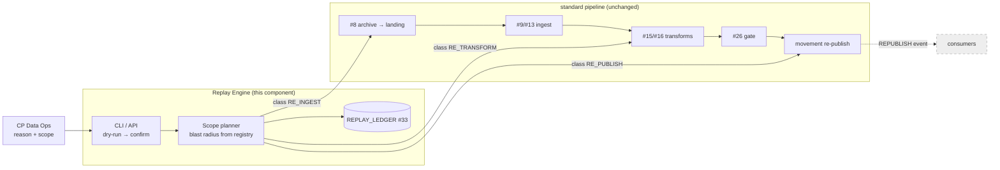
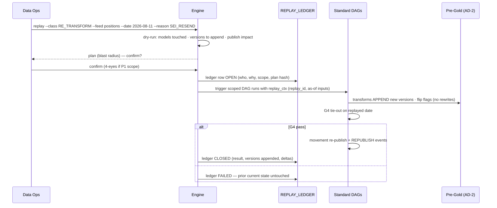

# Replay / Rerun Engine

## 1. Purpose & Scope
The governed do-over machine: re-execute any slice of the pipeline — a feed, a business date, a stage range, one domain — with full lineage of *why*, *what*, and *what changed*. Target state resolves the open question emphatically: **replay APPENDS, never rewrites — Gold is never modified in place** (AD-2 is the constitution here). Three replay classes are supported (re-ingest from archive, re-transform from RAW, re-publish from Pre-Gold), each initiated through one CLI/API with a mandatory reason, recorded in a replay ledger, and executed by the *standard* pipeline — the engine orchestrates scope; it owns no transformation logic of its own.

## 2. Context & Dependencies
- **Re-ingest**: #8 archive → landing re-presentation → #9 sensors treat as fresh arrival.
- **Re-transform**: #13/#15/#16 run for the scoped date/feed; #17 correction semantics apply.
- **Re-publish**: movement re-runs post-#26 G4; #27 G5 verifies.
- **Config/record**: #33 (replay ledger, scope selectors), #34 (replay events), #31 (audit joins).

## 3. Design Decisions
| Decision | Choice | Rationale | Consequence |
|---|---|---|---|
| Rewrite Gold in place or append? (open q) | **Append — new versions, flags flip (AD-2)** | In-place rewrite destroys the audit answer to "what did we report yesterday"; regulators and G4 history need prior state queryable | Storage cost accepted; consumers only ever see current-flag truth |
| Who may trigger | **CP Data Ops via CLI/API with mandatory reason code + scope; P1 scopes require 4-eyes ack** | Replay is powerful; ungoverned replay is how bitemporal stores get quietly polluted | Reason taxonomy in #33 (SEI_RESEND, CORRECTION, DEFECT_FIX, DR_TEST…) |
| Engine owns logic? | **No — scope orchestration only; the standard DAGs execute** | A second code path for "the same thing again" is the divergence bug factory | Replay = parameterized triggering of #18 DAGs with replay context |
| Downstream propagation | **Explicit per class: re-ingest cascades by default; re-publish never cascades upstream** | Half-cascaded replays are worse than none | The plan preview (dry-run) shows the full blast radius before confirm |
| Consumer notification | **Re-publish emits a REPUBLISH event per interface** | Consumers reconciling against prior figures must know | Event schema via #33; delivery via #34 channels |

## 4a. Diagrams



## 4b. Flow Walkthrough
1. Operator states class + scope + reason → nothing implicit; the reason is a ledger fact, not a comment.
2. Dry-run plan → blast radius computed from #33 registries (feeds→models→interfaces) → the operator sees consequences before they exist.
3. Confirm (4-eyes for P1 scopes) → ledger row OPEN with the plan hash → the intent is audit-fixed before execution.
4. Engine triggers the **standard** DAGs with `replay_ctx` → same sensors, gates, budgets (#19 pools); replay enjoys no shortcuts.
5. RE_INGEST → archive re-presented to landing (new LOAD_ID, `R` seq) → the whole chain re-runs naturally.
6. RE_TRANSFORM → Stage 2/Pre-Gold rebuild the scope **as-of RAW state**, appending versions (AD-2); prior versions remain queryable — "what we reported before" survives.
7. Gate discipline unchanged: G4 must pass again before any re-publish (AD-9 applies to replays identically).
8. Re-publish → movement + REPUBLISH events → consumers reconcile knowingly; #27 G5 verifies the new state landed.
9. Ledger CLOSED with outcome deltas (rows appended, aggregates before/after) → the replay is itself lineage.

## 4c. Detailed Design
**Ledger (#33)**
```sql
CREATE TABLE replay_ledger (
  replay_id     VARCHAR2(40) PRIMARY KEY,       -- R<yyyymmdd>_<seq>
  replay_class  VARCHAR2(14) NOT NULL,          -- RE_INGEST/RE_TRANSFORM/RE_PUBLISH
  scope_json    CLOB CHECK (scope_json IS JSON),-- feeds, dates, domains, stages
  reason_code   VARCHAR2(20) NOT NULL,
  requested_by  VARCHAR2(60) NOT NULL,
  approved_by   VARCHAR2(60),                   -- 4-eyes for P1
  plan_hash     VARCHAR2(64) NOT NULL,
  state         VARCHAR2(10) NOT NULL,          -- OPEN/RUNNING/CLOSED/FAILED
  result_json   CLOB,                           -- versions appended, deltas
  opened_at     TIMESTAMP DEFAULT SYSTIMESTAMP, closed_at TIMESTAMP
);
```
**replay_ctx propagation**: replay_id rides dbt query_comment, LOAD_ID suffix, movement batch tags → every artifact of a replay is findable by one key.
**As-of inputs**: RE_TRANSFORM reads RAW/Stage 2 bitemporally as-of the original date's final state unless `--include-late-arrivals` — the flag is the *only* way late data joins a replay (explicitness over surprise).
**Concurrency**: a scope lock (feed×date) in the ledger prevents overlapping replays; replays queue behind live EOD for the same date (EOD outranks, mirroring #20).
**RE_PUBLISH fast path**: no transforms — re-run movement from current Pre-Gold state (target-side corruption / failed movement cases); G5 (#27) is its verifier.

## 5. Data Quality, Reconciliation & Lineage
Every replay re-earns its gates — G1/G2 on re-ingest, G3 in rebuilds, G4 before re-publish — with results recorded against replay_id so gate history distinguishes original vs replayed runs. The ledger's before/after aggregate deltas are the recon artifact #30 consumes; #31 joins replay_id across registries, giving auditors the complete chain: reason → approval → plan → executions → versions → republish events.

## 6. RECOMMENDATION
**6.1** A scope-orchestrating replay engine over the unchanged standard pipeline: three classes, mandatory reasons, dry-run blast radius, 4-eyes on P1 scopes, bitemporal appends only, and a ledger that makes every replay a first-class audited event.
**6.2**
| Option | Description | Pros | Cons | Fit |
|---|---|---|---|---|
| A. Ledgered scope engine over standard DAGs (recommended) | As designed | One code path; AD-2-true; audit-complete; blast radius visible pre-commit | Engine + ledger are net-new build (High) | **High** |
| B. Manual re-runs (clear tasks in Airflow UI) | Ops re-triggers tasks by hand | Zero build | No scope safety, no reason trail, easy half-cascades, bitemporal pollution risk; indefensible at audit | Low — acceptable only pre-go-live |
| C. In-place correction scripts | Targeted UPDATEs to fix data | "Fast" | Violates AD-2/AD-8 outright; destroys as-of answers; the anti-pattern this program exists to end | Prohibited |
**6.3** > **Recommended: Option A.** Replay is where data platforms quietly rot: undocumented re-runs, half-cascades, and hand-edits accumulate until nobody can say what was reported when. This design makes the safe path the easy path — one command, a plan you can read, gates you cannot skip, versions you cannot lose — and makes the unsafe paths structurally unavailable (no engine-owned logic to fork, no in-place write route to Gold). Costs: real build effort and operator discipline on reason codes; both cheaper than one un-reconstructable regulatory question. Measurements that must hold: 100% of replays ledgered (no orphan replay-tagged artifacts), zero in-place modifications in Pre-Gold redo audit, replayed-date G4 pass before every re-publish.
**6.4** Tier interactions: touches all tiers by orchestration, none by logic. AD-2/AD-8/AD-9 are the honored constitution; interaction with #22: a replay of a partial date inherits whatever AD-5 decides there.

## 7. Failure, Replay & Idempotency
The engine replaying itself: a FAILED replay leaves prior current-state untouched (append-then-flip everywhere) → fix cause, open a new replay (ledger chains via `supersedes_replay_id` in result_json). Engine crash mid-orchestration → RUNNING ledger rows reconcile against Airflow run states on restart; scope locks expire with the ledger row. Idempotency inherits from the pipeline (#9 claims, #13 registry states, #16 append+flip, movement per-date semantics).

## 8. Security & Access Control
Trigger surface restricted to the Data Ops role (#32); 4-eyes approval recorded with identity; the ledger is append-only (no UPDATE grant except state transitions via the engine's service account). Replay of restricted-classification feeds inherits their masking rules in any plan output.

## 9. Open Questions & Risks
- Reason-code taxonomy + which scopes count as P1 (4-eyes) — governance sign-off; owner: TBD.
- REPUBLISH event delivery mechanism per consumer (email? feed? API event via #12?) — consumer census dependency; owner: TBD.
- Risk: replay storms after a bad SEI day exhausting #19 budgets → replays run in a low-priority pool slice; EOD always outranks.
- Risk: `--include-late-arrivals` misuse blending timelines → flag usage is a ledger fact reviewed in the monthly ops read.

## 10. Acceptance Criteria
- [ ] Each class end-to-end in a lower region with ledger OPEN→CLOSED and result deltas populated.
- [ ] AD-2 proof: replayed date leaves prior versions queryable; redo audit shows zero data-column UPDATEs in Pre-Gold.
- [ ] Dry-run plan matches actual touched artifacts (plan hash verified post-run).
- [ ] G4-fail replay → no re-publish, prior current state served throughout.
- [ ] Scope-lock test: overlapping replay on same feed×date rejected.
- [ ] REPUBLISH event received by a test consumer with correct interface + date.
