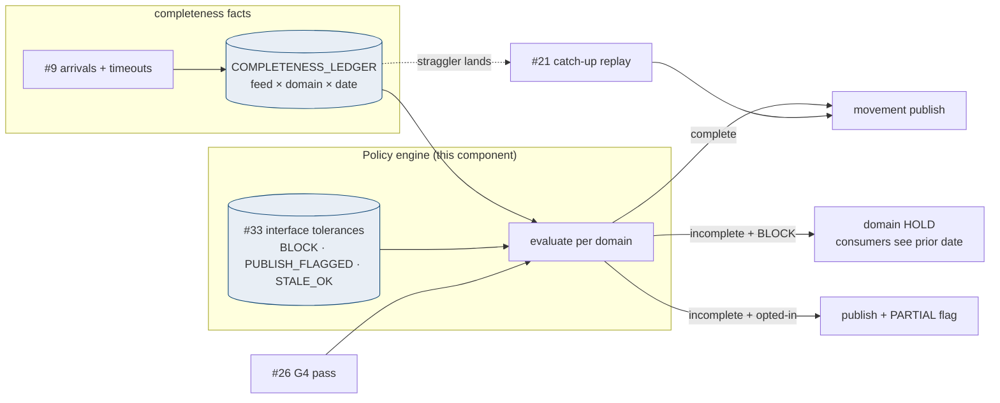
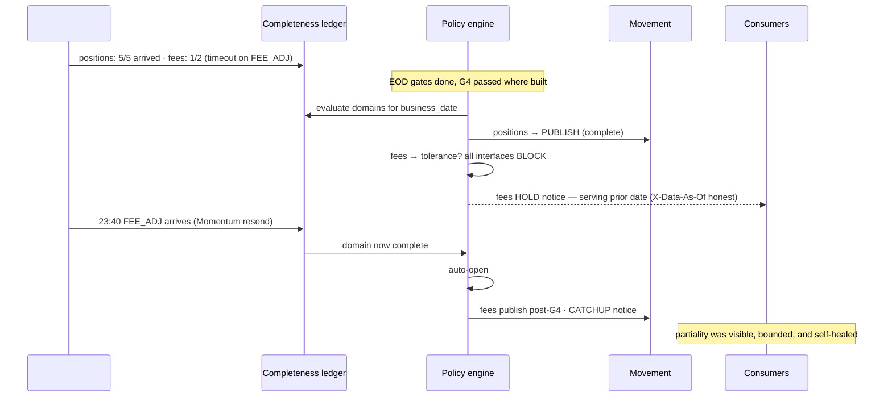

# Partial-Batch Policy

## 1. Purpose & Scope
The policy that answers the 2 a.m. question: two of thirty feeds are late — does the business date publish? Target state: a **domain-atomic completeness ledger with per-domain publish decisions**, config-declared consumer tolerances, and a hard default of **no partial domain ever publishes** — because the open question ("can consumers tolerate a partial business date?") is a *consumer* fact that must be declared, not assumed, and its formal ratification is **AD-5, which this document tees up for the ARB** with a recommended default and the mechanism either ruling needs.

## 2. Context & Dependencies
- **Inputs**: #9 sensor arrivals + timeouts (the completeness facts), #33 feed→domain→interface mapping and declared tolerances.
- **Enforces at**: the publish step after #26 G4 — the policy is a second gate condition alongside tie-out.
- **Signals**: #34 (late-feed alerts, partial-publish notices), #21 (catch-up replays when stragglers land).

## 3. Design Decisions
| Decision | Choice | Rationale | Consequence |
|---|---|---|---|
| Publish unit | **Domain, atomically** | Feeds within a domain are referentially entangled (positions without their accounts is nonsense); domains across each other are not | A late fees feed never blocks the positions publish — blast radius is honest |
| Default tolerance | **BLOCK: a domain missing any feed does not publish** | Silent partiality in a system of record is worse than lateness; consumers plan around lateness, not around wrong | Overrides require declared consumer tolerance (below) — the safe path is the default path |
| Declared tolerance model | **Per interface in #33: BLOCK / PUBLISH_FLAGGED(min_feeds) / STALE_OK(max_age)** | "Tolerate partial" means different things — publishing flagged partials vs serving yesterday | PUBLISH_FLAGGED requires the consumer's written opt-in (the AD-5 evidence base) |
| Who decides at 2 a.m.? | **Nobody — the policy does; ops can only invoke a documented override with 4-eyes** | Untracked judgment calls at night are how partiality goes silent | Override = ledger event + REPUBLISH-style notice, mirrored on #21's governance |
| Catch-up | **Straggler arrival auto-opens a #21 RE_TRANSFORM+publish for the domain** | The partial state should be transient by machinery, not memory | Catch-up SLA visible in #34 |

## 4a. Diagrams



## 4b. Flow Walkthrough
1. Sensors feed the completeness ledger continuously — arrivals and timeouts are the same fact stream.
2. At the publish decision point (post-G4), the policy evaluates **each domain independently** — complete domains never wait for incomplete ones.
3. Complete → publish normally. Incomplete → the *declared* tolerances of every consuming interface decide; the strictest wins within a domain.
4. BLOCK outcome → domain holds; consumers keep the prior date, and #12's `X-Data-As-Of` header makes staleness visible rather than silent.
5. PUBLISH_FLAGGED (only where a consumer opted in writing) → publish carries a PARTIAL marker on the interface, notice emitted.
6. Straggler arrival → auto catch-up via #21 → the hold resolves by machinery; the catch-up SLA is the number leadership watches.
7. Every decision (publish/hold/flagged/override) is a ledger event → the AD-5 conversation gets a month of real evidence instead of positions.

## 4c. Detailed Design
**Ledger (#33)**
```sql
CREATE TABLE completeness_ledger (
  business_date DATE NOT NULL,
  domain        VARCHAR2(30) NOT NULL,
  feed_id       VARCHAR2(20) NOT NULL,
  state         VARCHAR2(10) NOT NULL,   -- ARRIVED / TIMEOUT / WAIVED
  state_ts      TIMESTAMP NOT NULL,
  CONSTRAINT pk_cl PRIMARY KEY (business_date, domain, feed_id)
);
CREATE TABLE publish_decision (
  business_date DATE NOT NULL,
  domain        VARCHAR2(30) NOT NULL,
  decision      VARCHAR2(14) NOT NULL,   -- PUBLISH/HOLD/PUBLISH_PARTIAL/OVERRIDE
  basis         VARCHAR2(200),           -- tolerance rule or override ref
  decided_ts    TIMESTAMP DEFAULT SYSTIMESTAMP,
  CONSTRAINT pk_pd PRIMARY KEY (business_date, domain)
);
```
**Tolerance config (#33)**: `interface_tolerance(interface_id, mode BLOCK|PUBLISH_FLAGGED|STALE_OK, min_feeds, max_stale_days, optin_ref)` — `optin_ref` points at the consumer's written acceptance (the audit artifact).
**WAIVED state**: a feed formally deprecated mid-stream (SEI retires an extract) is waived by config, not by timeout forever.
**Override**: `override --domain --date --reason` with 4-eyes → decision OVERRIDE with basis; emits the same notices as PUBLISH_PARTIAL.
**Notices**: HOLD/PARTIAL/CATCHUP events per interface via #34 channels; format shared with #21's REPUBLISH schema (one consumer-notification grammar).

## 5. Data Quality, Reconciliation & Lineage
The policy is completeness-quality made explicit: G4 proves *what built* ties out; this proves *what built is all of it* — the two conditions jointly gate publish (AD-9's full meaning). Recon (#30) consumes publish_decision to explain domain-level gaps without false alarms. Lineage: a HOLD day is reconstructible — which feeds, which timeouts, which tolerance ruled, when catch-up closed it (#31).

## 6. RECOMMENDATION
**6.1** Domain-atomic completeness gating with BLOCK as the immovable default, consumer-declared tolerances as the only path to flagged partial publish, machine-driven catch-up, and every decision ledgered — shipped now as the mechanism, with the default's ratification teed up as AD-5.
**6.2**
| Option | Description | Pros | Cons | Fit |
|---|---|---|---|---|
| A. Domain-atomic + BLOCK default + declared tolerances (recommended) | As designed | Honest blast radius; no silent partiality; consumer tolerance becomes signed fact; evidence base for AD-5 | Late domains visibly late (which is the point); tolerance census effort | **High** |
| B. All-or-nothing business date | Any late feed holds the entire date | Simplest story | One fee file hostage-takes positions for 1,000 consumers; invites nightly overrides that rot into Option D | Low |
| C. Always publish what arrived | Partial by default | Freshest possible | Silent partiality in systems of record; recon storms; indefensible when a consumer books off a partial | Prohibited as default |
| D. Ops judgment per night | Human decides case-by-case | Flexible | Untracked, inconsistent, unauditable — the status quo this program replaces | Prohibited |
**6.3** > **Recommended: Option A.** Partiality is a consumer-contract question wearing an operations costume — so the design moves the decision from 2 a.m. judgment to daylight declarations: consumers who can tolerate flagged partials say so in writing once, and everyone else gets the guarantee that published means complete. Domain atomicity keeps the blast radius truthful in both directions — never over-blocking, never under-blocking. The month-one evidence (hold frequency, catch-up SLA, which interfaces actually request tolerance) is exactly what AD-5 needs to ratify or adjust the default from data. Measurements that must hold: zero unflagged partial publishes (the invariant), catch-up SLA within target, override rate ≈ 0 trending.
**6.4** Sits at the Consumer-Movement boundary as G4's sibling condition; AD-9 honored and completed. **AD-5 is the open decision this document exists to arm** — recommendation above is the proposed ruling.

## 7. Failure, Replay & Idempotency
Policy engine failure → publish blocks (fail-closed: no decision, no movement). Ledger and decisions are idempotent upserts keyed on date×domain. Replays (#21) re-evaluate the policy for their scope — a catch-up is just a replay with an automatic reason.

## 8. Security & Access Control
Override restricted to Data Ops with 4-eyes (#32); tolerance rows change only via governed #33 process referencing consumer sign-off; decision tables append-only to ops identities.

## 9. Open Questions & Risks
- **AD-5 ratification** of BLOCK-default + tolerance model — ARB item this document supports; owner: TBD.
- Consumer tolerance census (who would opt into PUBLISH_FLAGGED, for which interfaces) — owner: TBD; ships with zero opt-ins, meaning pure BLOCK behavior day one.
- Cross-domain consumers (an interface joining positions+fees) — strictest-domain rule covers it, but the census must map such interfaces explicitly.
- Risk: chronic single-feed lateness normalizing HOLDs → #34 trend alert at 3 holds/rolling-30 for any domain escalates to the SEI delivery review.

## 10. Acceptance Criteria
- [ ] Late-feed injection → its domain HOLDs, all complete domains publish on time.
- [ ] Zero-opt-in configuration → behavior is pure BLOCK; PARTIAL path unreachable.
- [ ] Opt-in test interface → PUBLISH_FLAGGED with PARTIAL marker + notice; unflagged partial impossible (invariant test).
- [ ] Straggler arrival → automatic catch-up publishes within SLA; notices sequence HOLD→CATCHUP correctly.
- [ ] Override drill: 4-eyes enforced, ledgered, noticed.
- [ ] Month-one AD-5 evidence pack (holds, catch-ups, overrides) auto-compilable from the two tables.
