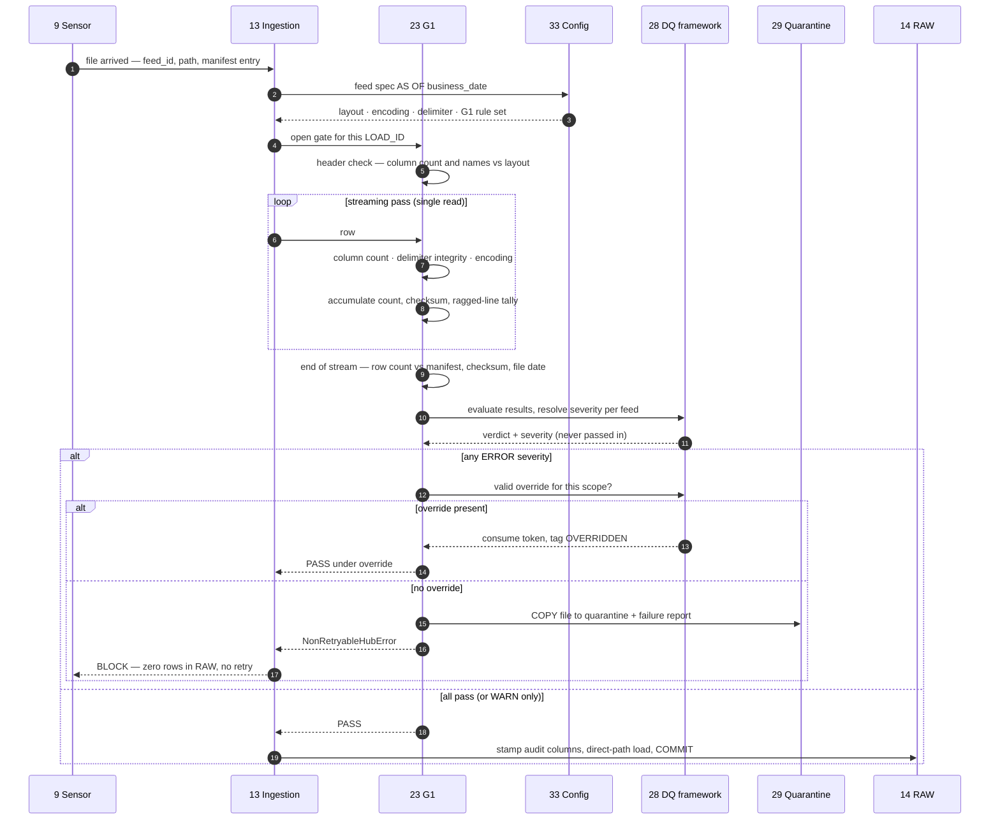

# G1 File / Structural Gate

## 1. Purpose & Scope

G1 is the first and only gate that runs before data enters the platform. It validates that a delivered file is structurally what the feed registry says it should be — encoding, delimiter, column count, header, row count against the manifest, checksum — and blocks the RAW insert if it is not. Its single deliverable is a **rule-driven validation engine embedded in the ingestion framework**, executing during the same streaming pass that loads the file.

It is the only gate whose failure leaves zero rows in the platform. Every gate after it operates on data already stored; G1 decides whether storage happens at all.

**Tiers touched:** Stage 1 Oracle, pre-insert. It has no visibility of Stage 2, Exadata Pre-Gold or the consumer tier.

---

## 2. Context & Dependencies

| ID | Component | Why required |
|---|---|---|
| 13 | Python ingestion framework | Host. G1 executes inside the streaming read, not as a separate pass |
| 8 | Landing Zone + transport | Supplies the file and manifest |
| 9 | File arrival sensors | Supplies the manifest completeness signal |
| 33 | Config store | Column layout per feed, expected encoding and delimiter, G1 rule set, per-feed severity |
| 28 | DQ framework | Rule resolution, severity, results store, override eligibility |
| 29 | Error handling & quarantine | Error events; quarantine store; resubmission path |

### Downstream

- **14 Stage 1 RAW** — the insert G1 gates
- **22 Partial-batch policy** — decides batch behaviour on a G1 failure
- **21 Replay** — a resubmitted file re-enters through G1

### Tier placement

```
  8 Landing ──▶ 9 Sensor ──▶ ┌─── 13 Ingestion framework ───┐
                             │   23 G1 GATE (streaming)      │
                             │   BLOCKS the insert           │
                             └──────┬────────────┬───────────┘
                                    │ fail       │ pass
                                    ▼            ▼
                          29 Quarantine     14 Stage 1 RAW (Oracle)
                          zero rows in RAW        │
                                                  ▼
                             15 Stage 2 ──▶ 66 Pre-Gold [Exadata] ──▶ Gold
```

---

## 3. Design Decisions

**D1 · Where does G1 execute?**
**Decision:** Inside the ingestion framework's streaming pass, not as a separate read.
**Rationale:** The largest feeds — Taxlot, EOD Position, Account, Client, Asset — cannot afford a second full read inside the EOD window.
**Consequence:** Per-row checks run during the stream; whole-file checks complete at end of stream, before commit. The insert is committed only after G1 passes in full.

**D2 · What blocks — the file or the row?**
**Decision:** The file. G1 is a file-level gate.
**Rationale:** A structural failure means the file's shape does not match the contract; individual rows cannot be trusted to have been parsed into the right columns.
**Consequence:** Row-level quarantine applies only to the narrow case where a row cannot be split into columns at all — a ragged delimiter or embedded newline — and does not by itself fail the file unless it breaches a configured tolerance.

**D3 · Are type violations G1's concern?**
**Decision:** No. G1 checks structure, not content. A non-numeric amount loads to RAW as text.
**Rationale:** RAW columns are all `VARCHAR2` precisely so evidence is preserved. Rejecting on content at G1 destroys it.
**Consequence:** G1 may *report* type violations as `WARN` for early visibility, but never blocks on them. Content is G2's and G3's business.

**D4 · Is G1 override-eligible?**
**Decision:** Yes, but rarely appropriate.
**Rationale:** A structural failure usually means the file cannot be parsed, so there is nothing to proceed with. Override applies to gates that fail on *content*; a column-count mismatch has no meaningful "proceed anyway".
**Consequence:** The override path exists for the narrow case of a tolerable soft breach — for example, a volume-vs-manifest variance within an agreed margin. It is not the remediation path for a layout change.

**D5 · Manifest-driven or filename-driven?**
**Decision:** Manifest-driven where a manifest exists; filename pattern as fallback.
**Rationale:** Distinguishing "late" from "missing" requires an expected-file list. Without it, the sensor and G1 are both guessing on a timeout.
**Consequence:** **Contingent on AD-10** and on the manifest format, which SEI has not specified.

**D6 · Quarantine — move or copy?**
**Decision:** Copy. The landing zone retains its own copy under its own retention.
**Rationale:** An operator answering "what did SEI actually send?" should never depend on the quarantine process having worked correctly.
**Consequence:** Storage duplication for failed files, accepted as cheap insurance.

**D7 · Retry on failure?**
**Decision:** Never. `retries=0`; the ingest task raises a non-retryable exception type.
**Rationale:** The file is unchanged, so the outcome is unchanged. Retrying burns the window and makes a real structural problem look like flakiness.
**Consequence:** Only class E6 (infrastructure) retries, and that is a different failure path entirely.

---

## 4a. Diagrams

### (1) Component / architecture

```mermaid
flowchart LR
  subgraph EXT["EXTERNAL — SEI / SWP, out of scope"]
    SEI["SWP extract job<br/>~30 feeds, 9 domains<br/>file + manifest contract"]
  end

  subgraph IN["Ingress"]
    LZ["8 Landing Zone<br/>sFTP · AD-10"]
    SEN["9 Sensors<br/>manifest-aware"]
  end

  subgraph GATE["23 G1 GATE — inside 13, streaming"]
    direction TB
    RS["Rule resolver<br/>from 33, as-of date"]
    PR["Per-row checks<br/>column count · delimiter<br/>encoding · ragged line"]
    EOS["End-of-stream checks<br/>row count vs manifest<br/>checksum · header · file date"]
    VD["Verdict<br/>severity from 28"]
    RS --> PR --> EOS --> VD
  end

  subgraph DOM["Feeds gated — all 9 domains"]
    D["Account &amp; Client (5) · Positions (5)<br/>Other (7) · Fee &amp; Billing (2)<br/>Portfolio &amp; Model (3) · Reporting (2)<br/>Reference &amp; Asset (3) · Transactions (2) · Cash (1)"]
  end

  subgraph PASS["Pass path"]
    STAMP["stamp LOAD_ID<br/>+ 8 audit columns"]
    RAW["14 Stage 1 RAW (Oracle)<br/>commit AFTER G1 passes"]
  end

  subgraph FAIL["Fail path"]
    QF["29 Quarantine<br/>file COPIED, not moved"]
    EV["29 Error event<br/>E2 · BLOCK_FILE"]
    PB["22 Partial-batch<br/>HALT_ALL | PROCEED"]
  end

  subgraph FDN["Foundation"]
    CFG["33 Config<br/>layout · encoding · rules"]
    DQ["28 DQ framework<br/>severity · results"]
    I360["35 Integration360"]
  end

  subgraph DOWN["Downstream tiers — never reached on failure"]
    S2["15 Stage 2 (Oracle)"]
    PG["66 Pre-Gold (Exadata)"]
    GD["Gold → PBDW · IMDS · Pivotal"]
  end

  SEI -.->|"file contract"| LZ
  LZ --> SEN --> RS
  D -.-> RS
  CFG -.-> RS
  DQ -.-> VD
  VD -->|"PASS"| STAMP --> RAW --> S2 --> PG --> GD
  VD -->|"FAIL"| QF & EV
  EV --> PB & I360

  classDef ext stroke-dasharray:5 5,stroke:#A82316,color:#A82316
  classDef focal stroke-width:3px,stroke:#16305B
  classDef block stroke:#A82316,stroke-width:2px
  class SEI,EXT ext
  class RS,PR,EOS,VD focal
  class QF,EV block
```



### (2) Data flow / sequence



---

## 4b. Flow Walkthrough

1. **Sensor (9)** → file arrived → invokes the ingestion framework with `feed_id`, path and manifest entry
2. **Framework (13)** → reads the feed spec from config (33) as of the business date → layout, encoding, delimiter, G1 rule set
3. **G1 (23)** → opens for this `LOAD_ID` → header check: column count and names against the registered layout
4. **Streaming pass** → per-row checks during the **single read**: column count, delimiter integrity, encoding validity, ragged-line detection
5. **G1 (23)** → accumulates in the same pass: row count, file checksum, ragged-line tally → no second read
6. **End of stream** → whole-file checks: row count against manifest, checksum, `FILE_DATE` against `BUSINESS_DATE`
7. **DQ framework (28)** → resolves severity per feed from the registry → **never passed by the caller**
8. **ERROR severity, override present** → token consumed, rows tagged `OVERRIDDEN` → gate passes
9. **ERROR severity, no override** → file **copied** to quarantine with a failure report → non-retryable exception → **zero rows in RAW**, no retry
10. **Partial-batch policy (22)** → decides whether the batch halts or the other 8 domains proceed
11. **Pass, or WARN only** → framework stamps `LOAD_ID` and the 8 audit columns → direct-path load → **commit happens only now**
12. **RAW committed** → domain branch released → G2, then Stage 2, then Pre-Gold assembly on Exadata

**No cross-database hop in this component.** A G1 failure means nothing ever reaches the Exadata → Gold hop.

---

## 4c. Detailed Design

### Rule catalogue

| Rule ID | Check | Scope | Default severity | Error code |
|---|---|---|---|---|
| `G1_ENCODING` | File decodes in the declared encoding | Per row + file | ERROR | `E2_ENCODING_INVALID` |
| `G1_DELIMITER` | Delimiter present and consistent | Per row | ERROR | `E2_DELIMITER_INVALID` |
| `G1_COLUMN_COUNT` | Column count matches registered layout | Per row | ERROR | `E2_COLUMN_COUNT_MISMATCH` |
| `G1_HEADER` | Header names and order match layout | Header | ERROR | `E2_HEADER_MISMATCH` |
| `G1_RAGGED_TOLERANCE` | Unparseable rows within tolerance | File | ERROR above threshold | `E2_RAGGED_ROWS` |
| `G1_MANIFEST_COUNT` | Row count matches manifest | File | ERROR | `E2_MANIFEST_COUNT_MISMATCH` |
| `G1_CHECKSUM` | File checksum matches manifest | File | ERROR | `E2_CHECKSUM_MISMATCH` |
| `G1_FILE_DATE` | `FILE_DATE` consistent with `BUSINESS_DATE` | File | ERROR | `E2_FILE_DATE_MISMATCH` |
| `G1_EMPTY_FILE` | File has ≥1 data row | File | ERROR (WARN for some feeds) | `E2_EMPTY_FILE` |
| `G1_VOLUME_VARIANCE` | Row count within margin of trailing average | File | WARN | `E2_VOLUME_VARIANCE` |
| `G1_TYPE_PROBE` | Sampled type-parse rate | File | **WARN only** (D3) | `E3_TYPE_PROBE` |

Severity is per-rule-per-feed. `G1_EMPTY_FILE` is the clearest case: an empty `Recurring Cash Activity` may be normal on a quiet day; an empty `Account` snapshot is not.

### Execution model

```python

class G1Gate:
    def __init__(self, spec: FeedSpec, load_id: int):
        self.rules = dq.resolve_rules(gate="G1", feed_id=spec.feed_id,
                                      business_date=spec.business_date)
        self.acc = Accumulator()          # count, checksum, ragged tally

    def check_header(self, header: list[str]) -> None:
        """Fails fast — a header mismatch means the whole file is wrong shape."""

    def check_row(self, raw_line: str, ordinal: int) -> RowVerdict:
        """Per-row structural checks. Returns PARSE_OK | RAGGED.
        RAGGED rows go to row-level quarantine and increment the tally;
        they do not by themselves fail the file unless tolerance is breached."""

    def finalise(self, manifest: Manifest) -> GateResult:
        """End-of-stream: manifest count, checksum, file date, tolerances.
        Delegates severity resolution to 28 — severity is never local."""
```

### Quarantine layout on failure

```
  /quarantine/{domain}/{business_date}/{load_id}/
      original/    taxlot_20260807.csv       ← byte-identical COPY (D6)
      manifest/    taxlot_20260807.manifest
      report/      g1_failures.json          ← rule, expected, actual, sample rows
      meta.json                              ← load_id, batch_id, error_ids, timestamps
```

The landing zone retains its own copy independently.

### Interaction with the ingestion framework

| Phase | G1 responsibility | Framework responsibility |
|---|---|---|
| Spec resolution | Resolve the rule set | Resolve layout and loader |
| Header | Validate against layout | Skip header from payload |
| Per row | Structural verdict | Buffer for load |
| End of stream | Whole-file verdict | Hold the transaction open |
| **Commit** | **Gate the commit** | **Commit only on PASS** |
| Failure | Raise non-retryable | Quarantine, abandon transaction |

The transaction is held open across the pass and committed only after `finalise()` passes — so a G1 failure genuinely leaves zero rows, not rolled-back rows.

### Config surface (33)

Per feed: encoding, delimiter, header presence and names, column layout, ragged-row tolerance, manifest format, volume-variance margin, empty-file severity, per-rule severity overrides.

---

## 5. Data Quality, Reconciliation & Lineage

| Aspect | Design |
|---|---|
| Gate position | Stage 1 Oracle, **pre-insert** |
| Blocking | Yes — ERROR blocks; WARN logs and proceeds |
| Override | Eligible, but rarely appropriate (D4) |
| Quarantine | File-level always; row-level for ragged lines only |
| Results | Every rule evaluation persisted to the results store (28), pass and fail alike |
| Retry | Never (D7) |

**Lineage:** a failed load still allocates a `LOAD_ID`, so the quarantine record, the error event and the failure report all share one identifier. A resubmission references the original `LOAD_ID`, making the remediation traceable end to end.

**Contribution to G4:** the row count G1 accumulates during its pass is the same count G4 later compares against on Exadata. Capturing it here is what converts G4's tie-out from a table scan into a lookup.

---

## 6. RECOMMENDATION

### 6.1 Central design choice

**Does G1 run as a separate validation pass before loading, or inline within the single streaming pass that loads the file?**

### 6.2 Options comparison

| Option | Description | Pros | Cons | Fit to Oracle/Stage1-2 → Exadata/Gold → movement stack |
|---|---|---|---|---|
| **A · Separate pre-validation pass** | Read the file once to validate, then read again to load | Clean separation — validation and load are independent, separately testable components. A validation failure costs nothing beyond the read. Simpler transaction handling: load only starts on a known-good file. | Doubles I/O on every feed, including the five large daily snapshots that dominate the EOD window. On Taxlot this is the single most expensive avoidable cost in the batch. Also opens a window where the file could change between passes. | Weak. The EOD window is the binding constraint and this option spends it on redundant reads of exactly the largest files. |
| **B · Inline within the loading pass, transaction held open** *(recommended)* | Validate per row during the stream; whole-file checks at end of stream; commit only on pass | Single read. Validation cost is close to free — the bytes are already in flight. Row count and checksum captured in the same pass, which is what makes G4 affordable downstream. Zero rows on failure, because the commit never happens. | Longer-lived transaction on the largest feeds, consuming undo and a pooled session for the duration. Validation and load are coupled, so a bug in one can affect the other. Requires the loader abstraction to support a deferred commit uniformly across all three mechanisms. | Strong. Fits the single-pass principle that also governs G2's push-down and G4's metadata comparison, and keeps all cost on the Stage 1 Oracle tier where it belongs. |
| **C · Load to a staging table, validate, then promote** | Load unvalidated into a staging area, run G1 as SQL, insert into RAW on pass | Validation runs as set-based SQL, which is fast and expressive. No long-lived transaction. Failed data is inspectable in staging with normal tools. | Writes every file twice — staging then RAW — roughly doubling I/O for the large feeds. Introduces a staging tier that exists in neither the target architecture nor the four-tier persistence model. Blurs the "RAW is what arrived" guarantee by adding a prior landing point inside the database. | Weak. Adds a persistence tier the reference architecture does not have, for a benefit option B already provides. |

### 6.3 Recommendation

> **Recommended: Option B — inline validation within the single loading pass, with the transaction committed only after end-of-stream checks pass.**

Option B wins on the constraint that actually binds this pipeline: the EOD window against five daily full snapshots. Option A spends that window reading Taxlot, EOD Position, Account, Client and Asset twice for no informational gain — the bytes needed for validation are the same bytes needed for loading. Option C writes them twice instead, and adds a staging persistence point that the four-tier reference architecture does not include, weakening the claim that RAW is the first thing that touches SEI's data. Option B also produces the row count and checksum as a by-product of a pass that had to happen anyway, and that captured count is what makes the blocking tie-out at G4 affordable on Exadata later.

**What it costs:** a long-lived transaction on the largest feeds, holding undo and a pooled Oracle session for the duration of the read. That is a real constraint against the session ceiling in component 55 and must be sized. It also couples validation to loading, so the loader abstraction in component 13 must support deferred commit identically across External Tables, SQL\*Loader and `cx_Oracle` — a uniformity requirement that needs testing rather than assuming.

**Tier placement:** entirely within Stage 1 Oracle, before the insert. That boundary is correct because G1's whole purpose is to decide whether the platform stores the file at all — a decision that must be made before RAW's immutability takes effect. Once a row is in RAW it is evidence and cannot be removed, so this is the only point at which rejection is possible.

**Must be confirmed for this to hold:**
1. **Undo capacity and session-hold duration** for the largest feed against the Oracle pool ceiling (55). A transaction held across a multi-million-row read is the practical risk in this design.
2. **Manifest format and whether one exists per feed** — `G1_MANIFEST_COUNT` and `G1_CHECKSUM` are the strongest rules in the catalogue and both depend on it. Contingent on **AD-10**.
3. **Deferred-commit behaviour of the External Table path**, which loads by `INSERT ... SELECT` and may not naturally support the same transaction shape as the other two mechanisms.

### 6.4 Rules respected

- ✅ Tier boundary crisp — Stage 1 Oracle only, pre-insert; no visibility of Stage 2, Exadata or the consumer tier
- ✅ **AD-9** — blocking, calibrated by per-feed severity from config
- ✅ **AD-8** — a G1 failure leaves zero rows, so RAW immutability is never compromised by a rejected file
- ✅ No transformation — G1 checks structure only; content typing is deferred to Stage 2 (D3)
- ⚠️ **AD-10 contingent** — manifest availability and the DB-visible mount for the External Table path
- ⚠️ **AD-5 contingent** — whether a G1 failure halts the batch or only its domain

---

## 7. Failure, Replay & Idempotency

| Failure | Behaviour |
|---|---|
| Structural failure (E2) | File copied to quarantine, error event raised, **zero rows in RAW**, no retry |
| Ragged rows within tolerance | Rows to row-level quarantine, file proceeds, `WARN` recorded |
| Ragged rows above tolerance | File-level failure as above |
| Manifest missing | Falls back to filename pattern (D5); `G1_MANIFEST_COUNT` and `G1_CHECKSUM` cannot run — recorded as reduced assurance, not silent |
| Infrastructure failure mid-pass (E6) | Transaction abandoned, no rows committed. **Retryable** — this is the only retryable path. |
| Override applied | Rows tagged `OVERRIDDEN`, load proceeds, override consumed and audited |

**Replay (21):** a resubmitted file re-enters through G1 under a **new** `LOAD_ID`, referencing the original in the error record. G1 is re-evaluated in full — an override from the original attempt does not carry forward.

**Idempotency:** G1 is a pure function of the file, the manifest and the rule version. Re-running against an unchanged file produces an identical verdict. A differing verdict on replay of an unchanged file indicates rule drift and is itself worth alerting on.

---

## 8. Security & Access

- **Execution identity:** runs within the ingestion pod's service account; needs read on the landing zone, write on quarantine, and the same RAW `INSERT` grant as the framework.
- **Quarantined files inherit the classification of their source feed** — a quarantined Account file carries whatever PII the live one does, and the quarantine store must be access-controlled accordingly. This is easily overlooked because quarantine feels like a scratch area; it is not.
- **Failure reports** must not embed sensitive values wholesale. Sample rows in `g1_failures.json` should be truncated or masked per the feed's classification.
- **Override authority** as defined in component 28; a G1 override is audited to lineage (31).

---

## 9. Open Questions & Risks

| # | Question / risk | Owner | Blocks |
|---|---|---|---|
| 1 | **Manifest format and availability per feed** | SEI | `G1_MANIFEST_COUNT`, `G1_CHECKSUM`, and sensor late-vs-missing logic |
| 2 | **AD-10** transport and DB-visible mount | ARB + BBH infra | External Table path and its deferred-commit behaviour |
| 3 | Undo capacity for a held transaction on the largest feed | DBA (55) | Feasibility of D1/option B on Taxlot |
| 4 | Ragged-row tolerance per feed | SEI + BBH | `G1_RAGGED_TOLERANCE` calibration |
| 5 | Empty-file semantics per feed — normal or fatal? | SEI | `G1_EMPTY_FILE` severity across ~30 feeds |
| 6 | Encoding guarantees per feed | SEI | `G1_ENCODING` design |
| 7 | Sample-value masking in failure reports | BBH security | Report design; quarantine classification |
| 8 | **AD-5** partial-batch policy | ARB | Batch behaviour on a single-domain G1 failure |

---

## 10. Acceptance Criteria

**Design complete when:**

- [ ] Rule catalogue confirmed with per-feed severity for all ~30 feeds
- [ ] Empty-file and ragged-row tolerances agreed per feed
- [ ] Manifest format confirmed, or the reduced-assurance fallback explicitly accepted
- [ ] Deferred-commit behaviour verified across all three loader mechanisms
- [ ] Quarantine layout and classification handling agreed with component 29
- [ ] Failure-report masking policy agreed with BBH security

**Build complete when:**

- [ ] G1 runs inline in the loading pass — verified, no second read of any file
- [ ] An injected column-count mismatch leaves **zero rows** in RAW and does not retry
- [ ] A quarantined file is byte-identical to the delivered file, and the landing-zone copy is independently intact
- [ ] Row count captured by G1 matches an independent `COUNT(*)` for every feed — the basis of G4's shortcut
- [ ] A WARN-severity failure proceeds and is visible in the results store
- [ ] Severity change in config alters blocking behaviour with no code release
- [ ] Largest feed completes G1 plus load within its share of the EOD window, measured
- [ ] Held-transaction undo consumption measured against the DBA's grant
