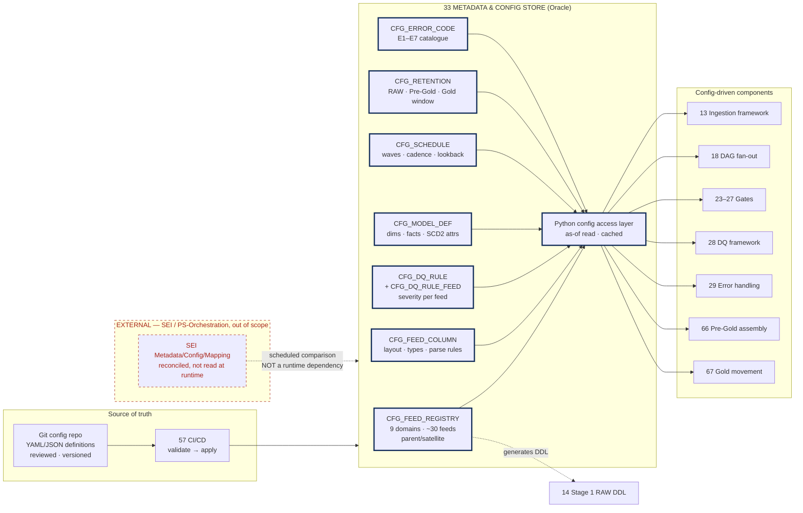

# Metadata & Configuration Store

## 1. Purpose & Scope

The configuration store is the single authoritative source for everything the Hub does per feed, per domain and per rule. It holds the feed registry for all 9 domains and ~30 inbound feeds, the DQ rule definitions and severities, the dimensional and fact model definitions, retention windows, and the schedules that drive orchestration. Its single deliverable is a **versioned, audited configuration schema plus the Python access layer** that every other component reads through.

It is built first because the ingestion framework (13), the DAG fan-out (18), all five gates (23–27) and the DQ framework (28) are specified as config-driven. If this component is late, those four get hardcoded and — in practice — never get un-hardcoded.

**Tiers touched:** physically resident in the Stage 1/2 Oracle instance; read by components operating across all four tiers including Exadata Pre-Gold and the consumer-movement layer. Holds no business data.

---

## 2. Context & Dependencies

### Upstream (Depends On)

| ID | Component | Why required |
|---|---|---|
| 14 | Stage 1 RAW | Shares the Oracle instance; RAW DDL is generated from the feed registry held here |
| 32 | Security & access control | Config is a privileged surface — write access must be tightly held, since a severity row governs whether production data is blocked |

### Downstream — every config-driven component

| ID | Reads |
|---|---|
| 13 | Feed specs, column layouts, load mechanism per feed, parse rules |
| 18 | Domain registry (drives dynamic task mapping), schedules, dependency waves |
| 20 | Intraday cadence definitions |
| 21 | Replay depth, retention windows |
| 22 | Partial-batch policy per domain |
| 23–27 | Rule sets and thresholds per gate |
| 28 | Rule registry, severity tiers, override thresholds |
| 29 | Error code catalogue |
| 66 | Dimension/fact definitions, SCD2 attribute lists, satellite attachments, Gold retention window |
| 67 | Movement targets, publish order, verification rules |

### Tier placement

```
  ┌──────────────────── EXADATA (Stage 1 / 2 / Pre-Gold) ────────────────────┐
  │                                                                          │
  │   ┌─────────────────────────────────────┐                                │
  │   │  33 METADATA & CONFIG STORE         │◀── read by every component     │
  │   │  feed registry · rules · severities │    at every tier               │
  │   │  models · schedules · retention     │                                │
  │   └─────────────────────────────────────┘                                │
  │            ▲                                                             │
  │            │ generates DDL                                               │
  │   Stage 1 RAW ──▶ Stage 2 ──▶ Pre-Gold (66)                              │
  └──────────────────────────────┬───────────────────────────────────────────┘
                                 │ 67 movement
                                 ▼
                        Gold (standalone) ──▶ PBDW · IMDS · Pivotal
```

---

## 3. Design Decisions

**D1 · One store or several?**
**Decision:** One store, one schema, in the Stage 1/2 Oracle instance. Not a file-based config in Git, not per-component tables.
**Rationale:** Airflow, Python and dbt must all read the same severity value at runtime. A YAML file in a container image cannot be changed without a release, which defeats the stated requirement that severity be changeable without a code release.
**Consequence:** The store is a runtime dependency of the entire pipeline and inherits its availability requirement. Needs the same HA treatment as RAW.

**D2 · How is configuration changed?**
**Decision:** Git is the source of truth for config *content*; the Oracle schema is the runtime *serving* copy. Changes are made in Git, reviewed, and applied by a CI job that writes to the store with full versioning.
**Rationale:** Direct SQL edits to a table that governs whether production data is blocked are indefensible at audit. Git gives review, history and rollback; the database gives runtime readability.
**Consequence:** No component writes to config at runtime — it is read-only to the pipeline. An emergency change is still a Git commit and a pipeline run, which is a deliberate friction.

**D3 · Versioned or mutable?**
**Decision:** Versioned. Every config row carries `EFFECTIVE_FROM_TS` / `EFFECTIVE_TO_TS` and `IS_CURRENT`. Nothing is updated in place.
**Rationale:** A replay of last Tuesday must run against the config that was in force last Tuesday, not today's. Under mutable config, replay produces a different answer than the original run and the pipeline stops being reproducible.
**Consequence:** Config reads are as-of by `BUSINESS_DATE`, not "current". This is the same bitemporal reasoning as AD-2, applied to configuration.

**D4 · Does SEI's Metadata/Config/Mapping share this store?**
**Decision:** No. SEI's PS-Orchestration config is external and out of scope. Where a mapping is genuinely shared (field-level source-to-target), the Hub holds the authoritative copy and SEI's is treated as an input to be reconciled, not a live dependency.
**Rationale:** A runtime read across the organisational boundary makes the Hub's pipeline dependent on SEI availability for every run.
**Consequence:** Divergence between the two is possible and must be surfaced — a scheduled comparison report, not a silent assumption. Relates to **risk R1** in the L2 pack.

**D5 · Are rule severities per-rule or per-rule-per-feed?**
**Decision:** Per-rule-per-feed, with a rule-level default.
**Rationale:** A null tolerance sensible for Transaction Detail is wrong for Account. Forcing one severity across 30 feeds guarantees either over-blocking or under-blocking.
**Consequence:** More rows to maintain; mitigated by inheritance from the rule default. Honours AD-9's requirement that blocking be calibrated rather than uniform.

**D6 · Where does the feed registry get its structure?**
**Decision:** Modelled on the authoritative 9-domain inventory with explicit parent/satellite relationships. Feeds ending "Optional Fields" or "Supplement" are registered as satellites of a parent entity, never as standalone.
**Rationale:** Satellite feeds must attach to their parent during dimensional assembly (66). If the registry treats them as peers, the model builds them as separate facts.
**Consequence:** The registry carries a self-referencing `PARENT_FEED_ID`, and the fan-out (18) must map over parents while ensuring satellites land in the same wave.

---

## 4a. Diagrams

### (1) Component / architecture



### (2) Data flow / sequence

```mermaid
sequenceDiagram
  autonumber
  participant DEV as Engineer
  participant GIT as Git config repo
  participant CI as 57 CI/CD
  participant CFG as 33 Config store
  participant COMP as Pipeline component
  participant AUD as 31 Audit &amp; lineage

  DEV->>GIT: commit config change (e.g. severity, new feed)
  GIT->>CI: PR triggers validation
  CI->>CI: schema validate · referential check · error-code check
  alt validation fails
    CI-->>DEV: build fails, change rejected
  else validation passes
    CI->>CFG: apply as NEW VERSION (close prior, open new)
    CFG->>AUD: record who, what, when, effective-from
  end
  COMP->>CFG: read config AS OF business_date
  CFG-->>COMP: version in force on that date (not "latest")
  COMP->>COMP: execute using that config
  Note over COMP,CFG: replay of an old date reads the OLD config —<br/>reproducibility preserved
```

---

## 4b. Flow Walkthrough

1. **Engineer** → commits a config change to the Git repo → PR raised
2. **CI (57)** → validates schema shape, referential integrity, and that every error code referenced exists in the catalogue → fails the build on any breach
3. **CI (57)** → applies the change to the Oracle store as a **new version** → prior version closed with `EFFECTIVE_TO_TS`, new version opened
4. **Config store (33)** → records the change to the audit trail (31) → who, what, when, effective-from
5. **Pipeline component** → at run time, reads config **as of the run's `BUSINESS_DATE`** → not "latest"
6. **Config store (33)** → returns the version in force on that date → cached for the duration of the run
7. **Component** → executes against that config → behaviour is deterministic for that business date
8. **Replay (21)** → a replay of an older date reads the *older* config → produces the same result as the original run

**Failure branch (step 2):** validation failure rejects the change at CI. The runtime store is never left in an invalid state. **Failure branch (step 5):** if the store is unreachable, components fail fast rather than falling back to a default — a silent default is worse than a stopped pipeline, since it may disable a blocking gate.

---

## 4c. Detailed Design

### Core schema

```sql
-- ── feed registry: the 9-domain, ~30-feed inventory ────────────────────────
CREATE TABLE CFG_FEED_REGISTRY (
  FEED_ID           VARCHAR2(40)  NOT NULL,
  DOMAIN            VARCHAR2(40)  NOT NULL,   -- Account & Client, Positions, ...
  FEED_NAME         VARCHAR2(120) NOT NULL,   -- 'Account Optional Fields'
  FEED_TYPE         VARCHAR2(20)  NOT NULL,   -- SNAPSHOT | DELTA | CORRECTION
  PARENT_FEED_ID    VARCHAR2(40),             -- satellites attach to a parent
  ENTITY_ROLE       VARCHAR2(20)  NOT NULL,   -- DIMENSION | FACT | SATELLITE
  LOAD_WAVE         NUMBER(2)     NOT NULL,   -- 1 = dims, 2 = facts
  RAW_TABLE         VARCHAR2(60)  NOT NULL,
  LOAD_MECHANISM    VARCHAR2(20)  NOT NULL,   -- EXTERNAL_TABLE | SQLLDR | CX_ORACLE
  IS_ACTIVE         CHAR(1)       DEFAULT 'Y' NOT NULL,
  EFFECTIVE_FROM_TS TIMESTAMP     NOT NULL,
  EFFECTIVE_TO_TS   TIMESTAMP,
  IS_CURRENT        CHAR(1)       NOT NULL,
  CHANGED_BY        VARCHAR2(120) NOT NULL,
  GIT_COMMIT        VARCHAR2(40)  NOT NULL,
  CONSTRAINT CK_FEED_ROLE CHECK (ENTITY_ROLE IN ('DIMENSION','FACT','SATELLITE')),
  CONSTRAINT CK_FEED_SAT  CHECK (ENTITY_ROLE <> 'SATELLITE' OR PARENT_FEED_ID IS NOT NULL)
);

-- ── column layout: drives RAW DDL generation and G1 structural checks ──────
CREATE TABLE CFG_FEED_COLUMN (
  FEED_ID           VARCHAR2(40)  NOT NULL,
  ORDINAL           NUMBER(4)     NOT NULL,
  COLUMN_NAME       VARCHAR2(60)  NOT NULL,
  RAW_LENGTH        NUMBER(6)     NOT NULL,   -- all RAW columns are VARCHAR2
  TARGET_TYPE       VARCHAR2(20),             -- cast applied in Stage 2
  PARSE_FORMAT      VARCHAR2(60),             -- e.g. 'YYYYMMDD'
  IS_NATURAL_KEY    CHAR(1)       DEFAULT 'N' NOT NULL,
  IS_SCD2_TRACKED   CHAR(1)       DEFAULT 'N' NOT NULL,
  EFFECTIVE_FROM_TS TIMESTAMP     NOT NULL,
  EFFECTIVE_TO_TS   TIMESTAMP,
  IS_CURRENT        CHAR(1)       NOT NULL
);

-- ── DQ rules and per-feed severity ────────────────────────────────────────
CREATE TABLE CFG_DQ_RULE (
  RULE_ID           VARCHAR2(40)  NOT NULL,
  GATE              VARCHAR2(4)   NOT NULL,   -- G1..G5
  RULE_TYPE         VARCHAR2(30)  NOT NULL,   -- COLUMN_COUNT | NULL_RATE | TIEOUT | ...
  ERROR_CODE        VARCHAR2(40)  NOT NULL,   -- FK CFG_ERROR_CODE
  DEFAULT_SEVERITY  VARCHAR2(10)  NOT NULL,   -- ERROR | WARN
  RULE_EXPRESSION   CLOB,                     -- SQL predicate or parameter JSON
  DESCRIPTION       VARCHAR2(500) NOT NULL,
  EFFECTIVE_FROM_TS TIMESTAMP     NOT NULL,
  EFFECTIVE_TO_TS   TIMESTAMP,
  IS_CURRENT        CHAR(1)       NOT NULL
);

CREATE TABLE CFG_DQ_RULE_FEED (
  RULE_ID           VARCHAR2(40)  NOT NULL,
  FEED_ID           VARCHAR2(40)  NOT NULL,
  SEVERITY          VARCHAR2(10)  NOT NULL,   -- overrides DEFAULT_SEVERITY
  THRESHOLD_NUM     NUMBER,
  THRESHOLD_PCT     NUMBER(5,2),
  IS_ENABLED        CHAR(1)       DEFAULT 'Y' NOT NULL,
  EFFECTIVE_FROM_TS TIMESTAMP     NOT NULL,
  EFFECTIVE_TO_TS   TIMESTAMP,
  IS_CURRENT        CHAR(1)       NOT NULL
);

-- ── dimensional model definitions, consumed by 66 Pre-Gold ────────────────
CREATE TABLE CFG_MODEL_DEF (
  MODEL_ID          VARCHAR2(40)  NOT NULL,
  MODEL_TYPE        VARCHAR2(20)  NOT NULL,   -- SCD2_DIM | FACT
  TARGET_OBJECT     VARCHAR2(60)  NOT NULL,   -- PG_DIM_ACCOUNT
  GOLD_OBJECT       VARCHAR2(60)  NOT NULL,   -- DIM_ACCOUNT
  SOURCE_FEEDS      VARCHAR2(500) NOT NULL,   -- comma list incl. satellites
  NATURAL_KEY       VARCHAR2(200) NOT NULL,
  GRAIN             VARCHAR2(200) NOT NULL,
  GOLD_RETENTION_D  NUMBER(5)     DEFAULT 90 NOT NULL,   -- as-of window in Gold
  EFFECTIVE_FROM_TS TIMESTAMP     NOT NULL,
  EFFECTIVE_TO_TS   TIMESTAMP,
  IS_CURRENT        CHAR(1)       NOT NULL
);

-- ── schedules, waves, cadence, lookback ───────────────────────────────────
CREATE TABLE CFG_SCHEDULE (
  SCHEDULE_ID       VARCHAR2(40)  NOT NULL,
  DOMAIN            VARCHAR2(40),
  LANE              VARCHAR2(20)  NOT NULL,   -- EOD | INTRADAY
  CRON_EXPR         VARCHAR2(60),
  WINDOW_MINUTES    NUMBER(5),
  CORRECTION_LOOKBACK_D NUMBER(4) DEFAULT 7 NOT NULL,
  PARTIAL_BATCH_POLICY  VARCHAR2(20) DEFAULT 'HALT_ALL' NOT NULL,  -- AD-5
  EFFECTIVE_FROM_TS TIMESTAMP     NOT NULL,
  EFFECTIVE_TO_TS   TIMESTAMP,
  IS_CURRENT        CHAR(1)       NOT NULL
);

-- ── error code catalogue, referenced by 29 ────────────────────────────────
CREATE TABLE CFG_ERROR_CODE (
  ERROR_CODE        VARCHAR2(40)  NOT NULL PRIMARY KEY,
  ERROR_CLASS       VARCHAR2(4)   NOT NULL,   -- E1..E7
  DEFAULT_ROUTE     VARCHAR2(20)  NOT NULL,   -- BLOCK_FILE | FLAG_ROW | RETRY | PAGE
  IS_RETRYABLE      CHAR(1)       DEFAULT 'N' NOT NULL,  -- only E6 = 'Y'
  DESCRIPTION       VARCHAR2(500) NOT NULL
);
```

### Python access layer

```python

from hub_framework.config import ConfigStore

cfg = ConfigStore(business_date=ctx.business_date)   # as-of, never "latest"

feeds     = cfg.feeds(domain="Positions")            # 5 feeds incl. satellites
layout    = cfg.columns(feed_id="POSITIONS_TAXLOT")
rules     = cfg.dq_rules(gate="G1", feed_id="POSITIONS_TAXLOT")
severity  = rules["E2_COLUMN_COUNT_MISMATCH"].severity   # resolved, never passed in
retention = cfg.retention(object="PG_DIM_ACCOUNT").gold_days

```

### Airflow access

```python
from hub_framework.config import ConfigStore

@task
def domains_for_wave(wave: int, business_date: str):
    return ConfigStore(business_date).domains(load_wave=wave)

ingest = ingest_domain.expand(domain=domains_for_wave(1, "{{ ds }}"))
```

### Config surface summary

| Table | Governs | Changed by |
|---|---|---|
| `CFG_FEED_REGISTRY` | Which feeds exist, their type, wave, satellite parentage | Onboarding a feed |
| `CFG_FEED_COLUMN` | RAW DDL generation, G1 structural checks, natural keys, SCD2 tracking | Layout change from SEI |
| `CFG_DQ_RULE` / `_FEED` | What is checked, how hard it blocks | Tuning after production experience |
| `CFG_MODEL_DEF` | Pre-Gold objects, Gold targets, retention window | Model change |
| `CFG_SCHEDULE` | Cadence, waves, lookback, partial-batch policy | Operational tuning |
| `CFG_ERROR_CODE` | Error catalogue and routes | New failure mode identified |

---

## 5. Data Quality, Reconciliation & Lineage

The config store holds no business data, so no pipeline gate applies to it. It carries its own controls instead:

| Control | Behaviour |
|---|---|
| CI schema validation | Blocks malformed config from reaching the runtime store |
| Referential validation | Every `ERROR_CODE` and `FEED_ID` referenced must exist; unregistered codes fail the build |
| Coverage check | Every active feed must have at least one G1 rule; a feed with no rules is a silent gap |
| Drift comparison vs SEI | Scheduled report on shared mappings — surfaces divergence rather than assuming alignment (D4) |
| Change audit | Every version records `CHANGED_BY` and `GIT_COMMIT`, written to the lineage store (31) |

**Lineage contribution:** each pipeline run records the config version set it executed under. This is what lets an auditor establish that day N ran under the rules in force on day N.

---

## 6. RECOMMENDATION

### 6.1 Central design choice

**Where does configuration live at runtime, and how does it change — a Git-managed file shipped in the container image, or a versioned database schema read as-of?**

### 6.2 Options comparison

| Option | Description | Pros | Cons | Fit to Oracle/Stage1-2 → Exadata/Gold → movement stack |
|---|---|---|---|---|
| **A · Git-only, files in the image** | YAML/JSON config baked into the Python and dbt container images; changed by rebuild and redeploy | Simple. Config is unambiguously versioned with code. No runtime dependency, no availability concern. Trivial rollback. | A severity change requires a build and deploy — minutes to hours, and impossible at 2am under an incident. Airflow and dbt read different copies with no guarantee they match. No as-of read: a replay runs under today's config, so historical runs are not reproducible. | Weak. Directly contradicts the requirement that severity change without a code release, and breaks replay reproducibility. |
| **B · Database-only, edited in place** | Config tables in Oracle, changed by SQL or an admin UI | Instant change. Single copy read by all components. No deploy needed. | No review, no history, no rollback. A one-character UPDATE can disable a blocking gate on production with no trace. Indefensible at audit. Mutable rows break replay reproducibility exactly as option A does. | Weak on control. Operationally fast, but the control weakness is disqualifying for a financial pipeline. |
| **C · Git as source of truth, versioned DB as runtime serving copy** *(recommended)* | Config authored and reviewed in Git; CI applies it to a versioned Oracle schema; components read as-of `BUSINESS_DATE` | Review, history and rollback from Git. Runtime readability and single-copy consistency from Oracle. As-of reads make replay reproducible. Change is a commit plus a short pipeline run, not a container rebuild. | Two systems to keep in step; the CI apply job is itself a component that can fail. Store becomes a runtime availability dependency. More build than either alternative. | Strong. Serves every tier from one place, and the as-of read is the same bitemporal reasoning already adopted for data under AD-2. |

### 6.3 Recommendation

> **Recommended: Option C — Git as source of truth, versioned Oracle schema as the runtime serving copy, read as-of business date.**

Option C wins because two requirements that look independent are actually the same requirement: severity must be changeable without a code release, and a replay of last Tuesday must reproduce last Tuesday's result. Option A satisfies neither — a rebuild is not a runtime change, and a file in today's image cannot represent last Tuesday's rules. Option B satisfies the first but destroys the second, and offers no review path for a change that can silently disable a blocking gate on production data.

**What it costs:** a genuine runtime availability dependency. If the config store is down, the pipeline stops — and it must stop rather than fall back to defaults, because a default that disables a gate is worse than a halted run. It also costs a CI apply job that must be as reliable as the pipeline it configures.

**Tier placement:** the store lives in the Stage 1/2 Oracle instance, not on Exadata Pre-Gold and not on the standalone Gold box. That boundary is correct because config is read at every tier but written by none of them, and colocating it with RAW keeps the RAW-DDL generation path local. Placing it on the 12 CPU / 64 GB Gold box would add read load to the machine whose capacity is most constrained.

**Must be confirmed for this to hold:**
1. **Config store availability target** must match or exceed RAW's, since a pipeline run cannot proceed without it — relates to HA/DR (62).
2. **CI apply job latency** — an emergency severity change must complete inside the incident window. Measure it; if it exceeds a few minutes, the friction becomes an operational problem rather than a control.
3. **Who holds write access** to the Git config repo, and whether that differs from override authority (28). Both govern whether production data is blocked.

### 6.4 Rules respected

- ✅ Tier boundary crisp — config resident in Stage 1/2 Oracle; read by Exadata and movement tiers but not resident there
- ✅ No transformation in the consumer hop — config drives movement (67) but performs none
- ✅ AD-8 — RAW immutability unaffected; config generates RAW DDL but never mutates loaded data
- ✅ AD-9 — blocking severities are held here and resolvable at runtime by Airflow, which is what lets a gate branch on severity
- ✅ AD-2 — as-of config reads mirror the bitemporal principle adopted for data
- ⚠️ **AD-6 contingent** — D4 assumes Integration360 becomes the monitoring system of record and SEI's config is reconciled rather than read. If AD-6 lands the other way, the drift-comparison design changes.
- ⚠️ **AD-5 contingent** — `PARTIAL_BATCH_POLICY` defaults to `HALT_ALL` pending the decision.

---

## 7. Failure, Replay & Idempotency

| Failure | Behaviour |
|---|---|
| Config store unreachable at run start | Pipeline fails fast. **No default fallback** — a default could disable a blocking gate. |
| Config store unreachable mid-run | Run continues on the cached version set read at start; run-level consistency is preserved by design. |
| CI apply job fails partway | Applied as a single transaction per change set — either the new version is fully open or the prior remains current. No partial config state. |
| Invalid config passes CI | Coverage checks are the backstop: a feed with zero G1 rules is reported. Residual risk accepted and monitored. |

**Replay (21):** replay reads config as of the replayed `BUSINESS_DATE`, so a replayed run reproduces the original exactly. If config has legitimately changed and the replay should use the *new* rules, that is an explicit parameter on the replay invocation — not the default, and recorded on the run.

**Idempotency:** reads are pure. The CI apply job is idempotent on `GIT_COMMIT` — reapplying the same commit is a no-op rather than a duplicate version.

---

## 8. Security & Access

- **Write path:** Git repo write access, plus the CI service account's grant on the config schema. No human holds direct `INSERT`/`UPDATE` on the runtime tables in production.
- **Read path:** all pipeline service accounts hold `SELECT` only. Enforced by role, not convention.
- **Privileged nature:** the store governs whether production data is blocked. It should be classified at the same level as production data itself and access-reviewed on the same cycle.
- **No PII:** config holds column *names* and rules, never values. Masking not applicable.
- **Audit:** every version carries `CHANGED_BY` and `GIT_COMMIT`; changes flow to the lineage store (31) on the same evidence trail as pipeline runs.

---

## 9. Open Questions & Risks

| # | Question / risk | Owner | Blocks |
|---|---|---|---|
| 1 | Who holds write access to the config repo, and is it the same set as override authority? | BBH ops + risk | Control design in 28; segregation of duties |
| 2 | Availability target for the config store | BBH infra | HA/DR (62); whether the pipeline inherits a new SPOF |
| 3 | Is SEI's Metadata/Config/Mapping authoritative for any shared mapping? | ARB + SEI | D4; drift-comparison scope; risk R1 |
| 4 | Confirmed feed inventory — 9 domains, ~30 feeds — is it stable for this phase? | SEI | Registry content; fan-out width in 18 |
| 5 | Satellite semantics: are Optional Fields / Supplement SCD2-tracked or point-in-time? | SEI + BBH | `CFG_FEED_COLUMN.IS_SCD2_TRACKED`; assembly in 66 |
| 6 | Emergency change path — is a Git commit plus CI acceptable at 2am? | BBH ops | D2; incident response design |
| 7 | AD-5 partial-batch policy | ARB | `CFG_SCHEDULE.PARTIAL_BATCH_POLICY` default |
| 8 | AD-6 monitoring system of record | ARB | D4; drift reporting destination |

---

## 10. Acceptance Criteria

**Design complete when:**

- [ ] All 9 domains and ~30 feeds registered with type, wave, and parent/satellite relationships
- [ ] Column layouts captured for every feed, sufficient to generate RAW DDL without hand-editing
- [ ] Every G1–G5 rule defined with a default severity and per-feed overrides where they differ
- [ ] Error code catalogue complete for classes E1–E7, with `IS_RETRYABLE` set only on E6
- [ ] Model definitions for all Pre-Gold and Gold objects, including the Gold retention window
- [ ] Python access layer interface agreed and reviewed — no write methods, no "current" accessor
- [ ] CI validation rules specified, including the coverage check

**Build complete when:**

- [ ] RAW DDL for all ~30 feeds generates from the registry with no manual editing
- [ ] A severity change committed to Git is live in the runtime store within the agreed latency, measured
- [ ] A replay of a historical date demonstrably reads the config version in force on that date
- [ ] Airflow fan-out width changes by adding a feed to the registry, with no DAG code change
- [ ] An unregistered error code fails the CI build
- [ ] Config store outage causes a fast, explicit pipeline failure — verified, with no silent default
- [ ] Access review confirms no human holds direct write on production config tables
