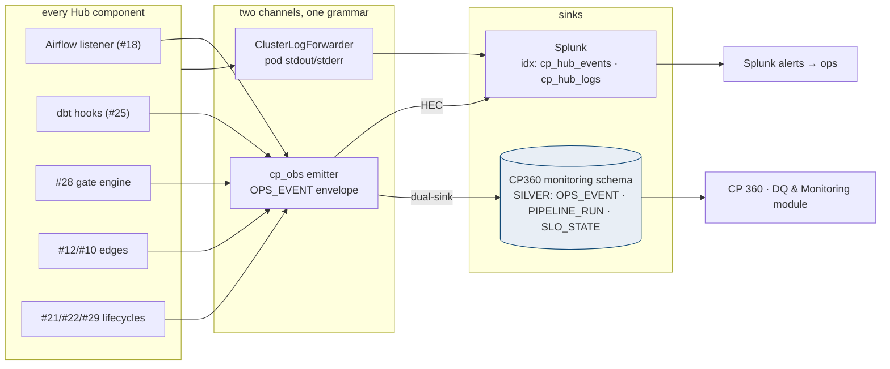
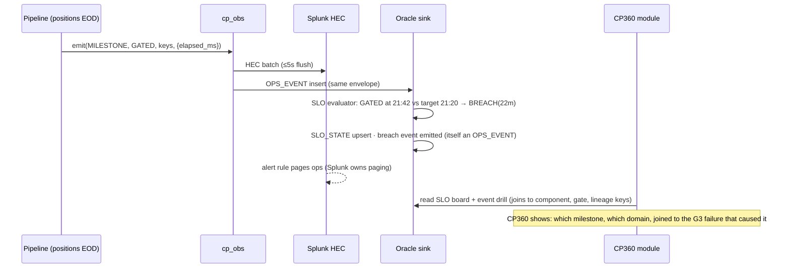

# Observability

## 1. Purpose & Scope
Two deliverables in one design, exactly as scoped: **(1) every log and operational event from every Integration Hub component ships to Splunk** through two standardized channels — the platform log path for whatever pods print, and a structured event path (HEC) for what the Hub *means*; **(2) a CP360 monitoring data model** — Oracle tables in the SILVER schema that persist the structured events, runs, and SLO states so CP 360's Data Quality & Monitoring module reads governed rows, not Splunk queries. Splunk is the ops eye (search, alert, dashboard); CP360 is the governed record (join to lineage, gates, components). One event grammar feeds both — emitted once, delivered twice. The open question — EOD SLOs — is answered with a concrete starter ladder tied to the publish deadline.

## 2. Context & Dependencies
- **Sources**: every component — Airflow task logs + listener events (#18), dbt run_results (#25 hook), gate verdicts (#28), edge envelopes (#12 Envoy, #10 client, #11 overhead metric), sensors, movement, #21/#22/#29 lifecycle events.
- **Transport**: OpenShift ClusterLogForwarder (#64's stack) → Splunk indexes for stdout/stderr; `cp_obs` library → Splunk HEC + Oracle sink for structured events.
- **Consumers**: Splunk dashboards/alerts (ops), CP360 Data Quality & Monitoring module (governed), #30 chain-completeness, #31 (spine pointers to Splunk).

## 3. Design Decisions
| Decision | Choice | Rationale | Consequence |
|---|---|---|---|
| One pipe or two? | **Two channels, one grammar: platform logs (as-is text) + structured OPS_EVENT (HEC and Oracle, dual-sink)** | Text logs are for humans grepping; events are for machines joining; conflating them is why Splunk queries become load-bearing regex | The `cp_obs` emitter is the only structured path — printf is never an integration |
| Where does CP360 read? | **Oracle monitoring schema, never Splunk** | CP360's value is joins (events ↔ components ↔ gates ↔ lineage) — Splunk can't join to SILVER; also keeps CP360 air-gap-simple | Splunk holds raw + text; Oracle holds structured + governed; retention differs by design |
| Event grammar | **One envelope: ts, event_type, component_id, severity, keys {load_id, corr_id, replay_id, business_date, domain, feed_id}, metrics{}, detail** | The four lineage keys (#31) make ops events joinable to everything | Envelope versioned in #33; unknown event_types rejected at the sink (schema discipline) |
| SLO model (open q: EOD SLOs) | **Milestone ladder per domain against the publish deadline: ARRIVED→RAW_LOADED→GATED→PREGOLD_BUILT→PUBLISHED→VERIFIED, each with a target offset** | "The EOD ran long" is useless; "positions crossed GATED 22 min late" is actionable | Ladder targets in #33; breach events auto-emit; the CP360 SLO board is a table read |
| Metrics vs events | **Metrics ride the same OPS_EVENT (metrics{} map) — no separate metrics stack in phase 1** | Prometheus exists platform-side (#64) for infra; pipeline metrics are low-cardinality and event-shaped | Revisit only if cardinality demands a TSDB; the grammar already carries values |

## 4a. Diagrams



## 4b. Flow Walkthrough
1. Components emit through `cp_obs` (sibling of #29/#31 libraries; adoption guardrail-enforced): typed event, four lineage keys, metrics map — once.
2. The emitter dual-sinks: HEC to Splunk (ops speed) and insert to the Oracle monitoring schema (governed record); local spool covers either sink's outage (same discipline as #31's emitter).
3. Pod text logs flow untouched via the platform ClusterLogForwarder to `cp_hub_logs` — humans keep full grep; nothing structural depends on it.
4. The SLO evaluator (scheduled in-DB/Airflow) folds MILESTONE events into SLO_STATE per domain × date against the #33 ladder targets; breaches are events too — alertable in Splunk, queryable in CP360.
5. Splunk owns *alerting* (paging rules on `cp_hub_events`); CP360 owns *understanding* — the DQ & Monitoring module reads the schema and joins outward: an SLO breach drills to the gate verdict, the component, the load, the lineage.
6. Edge observability lands as events: Envoy envelope summaries, #10 submission/ack states, the #11 proxy-overhead metric — the Integration-Hub-wide trail promised in the Apigee/passthrough design, minus any estate dependency.
7. #30 reads chain-completeness from PIPELINE_RUN; #31 stores Splunk pointers for text-log evidence — the three Foundation observers share keys, never duplicate stores.

## 4c. Detailed Design
**CP360 monitoring schema (SILVER — the requested data model)**
```sql
CREATE TABLE ops_event (
  event_id     NUMBER GENERATED ALWAYS AS IDENTITY PRIMARY KEY,
  event_ts     TIMESTAMP(3) NOT NULL,
  event_type   VARCHAR2(30) NOT NULL,    -- MILESTONE/GATE/EDGE/LIFECYCLE/SLO_BREACH/HEALTH
  component_id NUMBER NOT NULL,          -- tracker id → CP360 join
  severity     VARCHAR2(6) DEFAULT 'INFO',
  load_id VARCHAR2(40), corr_id VARCHAR2(40), replay_id VARCHAR2(40),
  business_date DATE, domain VARCHAR2(30), feed_id VARCHAR2(20),
  metrics_json CLOB CHECK (metrics_json IS JSON),
  detail       VARCHAR2(1000)
) PARTITION BY RANGE (event_ts) INTERVAL (NUMTODSINTERVAL(1,'DAY'))
  ( PARTITION o0 VALUES LESS THAN (TIMESTAMP '2026-01-01 00:00:00') );
CREATE TABLE pipeline_run (
  run_id VARCHAR2(60) PRIMARY KEY, business_date DATE, domain VARCHAR2(30),
  cadence VARCHAR2(10), started_at TIMESTAMP, finished_at TIMESTAMP,
  status VARCHAR2(12),                    -- RUNNING/SUCCESS/FAILED/PARTIAL
  milestones_json CLOB CHECK (milestones_json IS JSON)   -- ts per ladder step
);
CREATE TABLE slo_state (
  business_date DATE, domain VARCHAR2(30), milestone VARCHAR2(20),
  target_ts TIMESTAMP, actual_ts TIMESTAMP,
  state VARCHAR2(8),                      -- MET/BREACH/PENDING
  breach_minutes NUMBER,
  CONSTRAINT pk_slo PRIMARY KEY (business_date, domain, milestone)
);
```
Retention: ops_event 400 days online (daily partitions, drop-rolling); pipeline_run/slo_state kept 7y (small, joins #31's horizon). Splunk indexes per estate retention (text 90d, events 400d suggested).
**Starter EOD SLO ladder (per domain, offsets from publish deadline D)**: ARRIVED D−4h · RAW_LOADED D−3h20 · GATED D−2h30 · PREGOLD_BUILT D−1h30 · PUBLISHED D−30m · VERIFIED D — initial values to be re-based on the first month's observed p50+buffer (targets are #33 rows, re-basing is config).
**Emitter**: batched HEC (5s/500-event flush), Oracle array insert, spool-on-failure to #50 PVC, gap alarm; envelope schema versioned; event_type registry in #33 (sink rejects unknowns → CONTRACT finding #29).
**Splunk side**: two indexes; alert pack v1 — SLO_BREACH, gate BLOCK, chain-completeness gap, spool-gap, quarantine aging (#29), unverified publish (#27); dashboards reference events only (regex-free by construction).
**External contracts**: HEC endpoint + tokens (Splunk team), ClusterLogForwarder config (#64 platform), index retention sign-off.

## 5. Data Quality, Reconciliation & Lineage
Observability's own DQ: dual-sink parity (Splunk event count vs Oracle count per hour — drift alarm), spool-gap zero, event_type registry conformance. The four lineage keys on every event are the design's quiet feature: CP360 can pivot any operational moment into the #31 audit spine, the #28 verdicts, and #30's records — monitoring joined to governance rather than parallel to it.

## 6. RECOMMENDATION
**6.1** Two channels one grammar: platform logs to Splunk for humans, dual-sinked structured OPS_EVENTs (HEC + Oracle SILVER) for machines; Splunk alerts, CP360 understands from the governed schema; milestone-ladder SLOs with config-based targets.
**6.2**
| Option | Description | Pros | Cons | Fit |
|---|---|---|---|---|
| A. Dual-channel + Oracle monitoring schema (recommended) | As designed | CP360 reads governed joins; Splunk stays fast ops; one emit, no divergence; SLOs actionable per milestone | Emitter adoption + dual-sink parity to watch | **High** |
| B. Splunk-only (CP360 queries Splunk API) | One store | No Oracle sink | CP360 dashboards become Splunk-query-shaped (regex-fragile), can't join SILVER lineage/components; API dependency + license coupling for a governed record | Low |
| C. Oracle-only (no Splunk events) | DB as the ops eye | Simplest sink | Loses estate alerting/search where ops already lives; text logs still land in Splunk anyway — a half-migration | Low |
| D. Full metrics stack now (Prometheus + TSDB for pipeline) | Dedicated metrics | Rich graphs | Infra metrics already covered (#64); pipeline metrics are event-shaped and low-cardinality — a second stack without a driver | Defer |
**6.3** > **Recommended: Option A.** The division is by consumer: ops needs speed and paging where they already live (Splunk); CP360 needs joins and governance where the rest of the truth lives (SILVER). Dual-sinking one envelope buys both without translation layers, and putting the four lineage keys on every event is what turns a monitoring module into a *diagnosis* module — breach → gate → load → lineage in four clicks. The SLO ladder converts "EOD health" from a feeling into six timestamps with targets that re-base from evidence. Measurements that must hold: dual-sink parity within tolerance, 100% of components emitting (guardrail + coverage report), SLO board populated for every domain × date, alert pack v1 firing in drills.
**6.4** Observer across all tiers; the CP360 module this feeds is the Data Quality & Monitoring surface (Integration360's remit folded into CP 360 per scope decision); #64 keeps infra-level monitoring — the boundary is infra metrics (theirs) vs pipeline meaning (this).

## 7. Failure, Replay & Idempotency
Either sink down → spool + drain (ordered), parity alarm; both down → pipeline continues (observability never blocks data — same principle as #31). Events idempotent on producer natural keys where re-emission possible. SLO evaluator re-runs are upserts; replays (#21) emit under replay_id so boards distinguish original vs replay operational history.

## 8. Security & Access Control
Events carry keys and metrics, never payload values (the shared classification rule, #32); HEC tokens in Vault (#48); Oracle sink via the obs service identity (insert-only on ops_event); CP360 module reads via `cp_analyst`/`cp_ops` roles; Splunk index access mirrors those roles estate-side.

## 9. Open Questions & Risks
- Splunk index/retention/token provisioning with the estate team — owner: TBD.
- SLO ladder initial offsets per domain (placeholder above) — re-base after month one; owner: TBD.
- Airflow listener vs task-decorator emission for milestone fidelity — spike in #18's harness; owner: TBD.
- Risk: event storm on a bad day flooding HEC → emitter batching + severity-based sampling for INFO under storm mode (BREACH/ERROR never sampled).
- Risk: dual-sink drift normalizing → parity alarm has a hard threshold, breach = SYSTEM incident (#29), not a dashboard curiosity.

## 10. Acceptance Criteria
- [ ] Every Hub component emits ≥1 OPS_EVENT in a full-day test; coverage report shows zero silent components.
- [ ] Dual-sink parity holds through a Splunk outage drill (spool → drain → parity restored).
- [ ] SLO board renders in CP360 for all domains with drill-to-gate-verdict working via lineage keys.
- [ ] Alert pack v1: each alert fired by fault injection exactly once (no storms).
- [ ] Unknown event_type rejected at sink → CONTRACT finding raised.
- [ ] ClusterLogForwarder delivering pod logs to cp_hub_logs verified for a sample pod of each component class.
