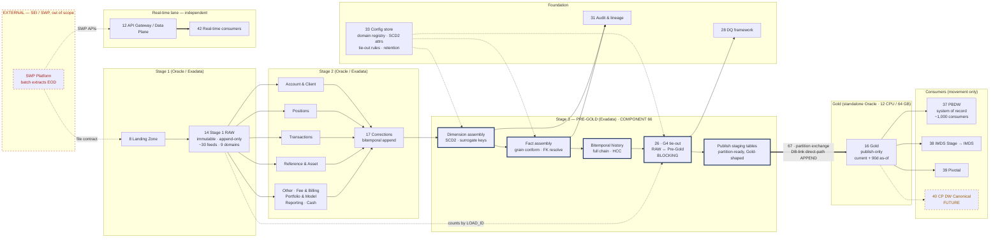
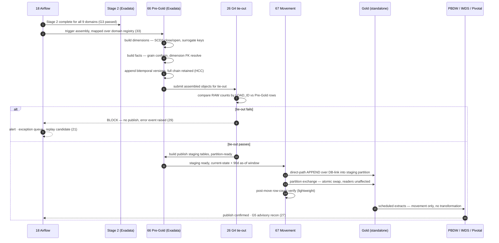

# Pre-Gold (Exadata) — dimensional assembly & tie-out

## 1. Purpose & Scope

Pre-Gold is the dimensional assembly layer. It takes conformed Stage 2 output and builds the finished SCD2 dimensions, fact tables and bitemporal history that consumers will eventually see — then reconciles them against RAW before anything leaves Exadata. Its single deliverable is a set of **publish-ready staging tables**, one per Gold target object, already tied out and already in the exact shape Gold expects.

It exists because the Gold database is a standalone Oracle instance at 12 CPU / 64 GB with no Exadata features. Every heavy set-based operation — SCD2 merge, window functions over full history, fact assembly, control-total aggregation — must complete on Exadata where Smart Scan, HCC and storage offload are available. Gold receives rows; it does not compute them.

**Tiers touched:** reads Stage 2 (Oracle/Exadata), writes Pre-Gold (Stage 3 Exadata). Hands off to component 67 for movement into Gold. Does not touch Stage 1 and does not touch the consumer tier.

---

## 2. Context & Dependencies

### Upstream (Depends On)

| ID | Component | Why required |
|---|---|---|
| 15 | Stage 2 Enriched | Source of conformed, typed, corrected records across all 9 domains |
| 17 | Correction handling | Supplies the bitemporal version chain (`RECORD_VERSION`, `IS_CURRENT`, effective timestamps) that Pre-Gold preserves rather than re-derives |
| 26 | G4 tie-out | Executes here, before the Gold hop — Pre-Gold is where the gate physically runs |
| 28 | DQ framework | Rule registry, severity resolution, blocking semantics |
| 31 | Audit & lineage | `LOAD_ID` chain must survive dimensional assembly |
| 33 | Metadata & config store | Domain registry, SCD2 attribute lists, tie-out rule sets, retention windows |
| 67 | Gold publish / movement | Consumes Pre-Gold's staging tables (design contract, not a runtime dependency) |

### Downstream

- **67 Gold publish** — partition-exchange movement of Pre-Gold output into the standalone Gold database
- **31 Audit & lineage** — receives the assembly-level lineage records
- **35 Integration360** — receives tie-out results and exception events

### Tier placement

```
  SEI feeds (9 domains, ~30 feeds)
        │
        ▼
  ┌─────────────────────────── EXADATA ───────────────────────────┐
  │                                                               │
  │  Stage 1 RAW ──▶ Stage 2 Enriched ──▶ THIS COMPONENT (66)     │
  │  immutable       conformed,            SCD2 · facts ·          │
  │  append-only     bitemporal            bitemporal history ·    │
  │                                        G4 tie-out              │
  └───────────────────────────────┬───────────────────────────────┘
                                  │ 67 · partition exchange
                                  │ current-state + bounded as-of window
                                  ▼
                   ┌─── GOLD (standalone Oracle, 12 CPU / 64 GB) ───┐
                   │        publish-only · no transformation        │
                   └───────────┬──────────┬──────────┬─────────────┘
                               ▼          ▼          ▼
                            PBDW        IMDS      Pivotal
                               │
                               ▼
                       ~1,000 consumers
```

---

## 3. Design Decisions

**D1 · Where does dimensional assembly execute?**
**Decision:** Entirely on Exadata, in Pre-Gold. Gold performs no joins, no merges, no window functions.
**Rationale:** The Gold box has no HCC, no Smart Scan, no storage indexes. A full-history SCD2 merge on 12 CPU / 64 GB spills to temp and competes with the publish window.
**Consequence:** Gold's CPU and memory are reserved for load and extract. Pre-Gold owns all compute cost. Honours AD-1 (Hub-owned Gold that publishes).

**D2 · Does Pre-Gold hold full bitemporal history, or does Gold?**
**Decision:** Pre-Gold holds the complete version chain under HCC. Gold receives current-state plus a bounded as-of window (default 90 days, configurable per object).
**Rationale:** Full versioned history on 64 GB with only basic compression will outgrow the box. Exadata absorbs it at roughly 10× compression; Gold cannot.
**Consequence:** As-of queries beyond the window resolve against Pre-Gold on Exadata, not Gold. This is a **refinement to AD-2** — bitemporal append still holds everywhere, but the retention horizon differs by tier. Requires explicit ARB acknowledgement rather than silent implementation.

**D3 · Is Pre-Gold rebuilt or incrementally maintained?**
**Decision:** Incrementally maintained, keyed on `BUSINESS_DATE` with a configurable correction lookback per domain.
**Rationale:** Full rebuild on ~30 feeds nightly is not affordable inside the EOD window regardless of Exadata's throughput, and it forfeits the ability to replay one domain in isolation.
**Consequence:** Every Pre-Gold object needs a deterministic incremental predicate and a documented rebuild path for deliberate full reconstruction.

**D4 · Where does the G4 tie-out run?**
**Decision:** On Exadata, inside Pre-Gold, before any data crosses to Gold.
**Rationale:** Both sides of the comparison — RAW counts and assembled Gold-shaped rows — are local. A tie-out spanning two databases over a link inside the EOD window is materially harder and slower.
**Consequence:** What crosses to Gold is already reconciled. Component 67's post-move check reduces to a row-count verify, which is the correct amount of work for the small box. Honours AD-9 (blocking, tie-out before publish).

**D5 · How is `LOAD_ID` lineage preserved through dimensional assembly?**
**Decision:** Every Pre-Gold row carries `SRC_LOAD_ID` (or a `LOAD_ID` array for aggregated facts) and the originating `BUSINESS_DATE`.
**Rationale:** Replay scope is a `LOAD_ID` set (component 21). If lineage breaks at dimensional assembly, targeted replay becomes date-level replay and the fan-out advantage is lost.
**Consequence:** Aggregating facts must carry a collection, not a scalar. Modest storage cost, absorbed by HCC.

**D6 · What is the handoff unit to Gold?**
**Decision:** A partition-ready staging table per Gold target object, matching Gold's DDL exactly.
**Rationale:** Enables partition exchange in component 67 — readers see the previous partition until the swap, then the new one. No half-loaded state, no long lock.
**Consequence:** Pre-Gold staging DDL and Gold DDL are a coupled contract generated from one config definition, not maintained separately.

**D7 · Does Pre-Gold serve the real-time lane?**
**Decision:** No. The real-time lane (API Gateway → real-time consumers) is independent and has no batch dependency.
**Rationale:** Coupling would make the API route wait on an EOD build.
**Consequence:** Contingent on **AD-4** remaining "independent lanes". If intraday is later routed through the batch pipeline, this decision reopens.

---

## 4a. Diagrams

### (1) Component / architecture



### (2) Data flow / sequence



---

## 4b. Flow Walkthrough

1. **Airflow (18)** → confirms Stage 2 complete and G3 passed for all 9 domains → releases the Pre-Gold task group
2. **Airflow (18)** → dynamic task mapping over the domain registry in config (33) → one assembly branch per domain, not 30 static tasks
3. **Pre-Gold (66)** → builds dimensions from Account & Client and Reference & Asset first → SCD2 close/open, surrogate key assignment
4. **Pre-Gold (66)** → builds facts from Positions, Transactions, Fee & Billing, Reporting, Cash → resolves dimension foreign keys against step 3 output
5. **Pre-Gold (66)** → appends bitemporal versions, retaining the full chain under HCC → `IS_CURRENT` maintained, prior versions closed
6. **Pre-Gold (66)** → attaches satellite feeds (Optional Fields, Supplement) to their parent entities → never modelled as standalone facts
7. **G4 tie-out (26)** → compares RAW row counts by `LOAD_ID` against assembled Pre-Gold rows, per target object → **both sides local to Exadata**
8. **G4 fails** → BLOCK. Nothing crosses to Gold. Error event raised (29), exception queued (30), replay candidate flagged (21). Gold retains yesterday's state.
9. **G4 passes** → Pre-Gold builds publish staging tables in Gold's exact DDL shape → current-state plus the bounded as-of window
10. **Movement (67)** → **CROSS-DATABASE HOP: Exadata → standalone Gold** → direct-path `APPEND` over DB-link into a staging partition
11. **Movement (67)** → partition exchange, atomic swap → readers see the prior partition until the swap completes
12. **Movement (67)** → post-move row-count verify against the Pre-Gold source count → lightweight, appropriate for the 12-CPU box
13. **Gold (16)** → three scheduled extracts → PBDW, IMDS Stage → IMDS, Pivotal → movement only, no transformation in flight
14. **G5 (27)** → advisory post-publish reconciliation → alert and replay trigger only; blocks nothing

**Failure branch (steps 8, 10, 12):** any failure leaves Gold on the prior partition. Remediation is fix-then-replay from `LOAD_ID` (21), never in-place repair of Gold.

---

## 4c. Detailed Design

### Data model — Pre-Gold objects

| Object | Type | Grain | Source domains | Gold retention |
|---|---|---|---|---|
| `PG_DIM_ACCOUNT` | SCD2 dim | Account, versioned | Account & Client (+ Optional Fields, Supplement satellites) | Current + 90d |
| `PG_DIM_CLIENT` | SCD2 dim | Client, versioned | Account & Client | Current + 90d |
| `PG_DIM_ASSET` | SCD2 dim | Asset, versioned | Reference & Asset (+ Optional Fields, Investment Class) | Current + 90d |
| `PG_DIM_PORTFOLIO` | SCD2 dim | Portfolio, versioned | Portfolio & Model | Current + 90d |
| `PG_FACT_POSITION` | Fact | Account + Asset + business date | Positions (5 feeds) | Current + 90d |
| `PG_FACT_TAXLOT` | Fact | Account + Lot + business date | Positions (Taxlot) | Current + 90d |
| `PG_FACT_TRANSACTION` | Fact | Transaction, versioned | Transactions (Header + Detail) | Current + 90d |
| `PG_FACT_FEE` | Fact | Fee computation event | Fee & Billing | Current + 90d |
| `PG_FACT_CASH` | Fact | Cash activity | Cash, Other (Custody & Nostro) | Current + 90d |
| `PG_FACT_STATEMENT` | Fact | Statement event + item | Reporting | Current + 90d |

Object list is **generated from the domain registry in config (33)**, not hand-maintained. Adding a tenth domain is a config change.

### DDL pattern — dimension

```sql
CREATE TABLE PG_DIM_ACCOUNT (
  ACCOUNT_SK        NUMBER(18) GENERATED ALWAYS AS IDENTITY,
  ACCOUNT_ID        VARCHAR2(64)  NOT NULL,     -- natural key
  -- SCD2 axis (happened-at)
  VALID_FROM_DATE   DATE          NOT NULL,
  VALID_TO_DATE     DATE          NOT NULL,     -- 9999-12-31 for current
  IS_CURRENT        CHAR(1)       NOT NULL,
  -- bitemporal axis (knew-at)
  EFFECTIVE_FROM_TS TIMESTAMP     NOT NULL,
  EFFECTIVE_TO_TS   TIMESTAMP,
  RECORD_VERSION    NUMBER(6)     NOT NULL,
  -- lineage
  SRC_LOAD_ID       NUMBER(18)    NOT NULL,
  SRC_BUSINESS_DATE DATE          NOT NULL,
  -- attributes (from Account + Account Optional Fields + Account Supplement)
  ACCOUNT_NAME      VARCHAR2(240),
  ACCOUNT_TYPE      VARCHAR2(64),
  BASE_CURRENCY     VARCHAR2(3),
  ...
  CONSTRAINT PK_PG_DIM_ACCOUNT PRIMARY KEY (ACCOUNT_SK)
)
PARTITION BY RANGE (SRC_BUSINESS_DATE)
  INTERVAL (NUMTODSINTERVAL(1,'DAY'))
  (PARTITION P_INIT VALUES LESS THAN (DATE '2026-01-01'))
COMPRESS FOR QUERY HIGH;          -- HCC: Exadata only, not available in Gold

CREATE INDEX IX_PGDA_NK ON PG_DIM_ACCOUNT (ACCOUNT_ID, IS_CURRENT) LOCAL;
CREATE INDEX IX_PGDA_LOAD ON PG_DIM_ACCOUNT (SRC_LOAD_ID) LOCAL;
```

### DDL pattern — publish staging (Gold-shaped)

```sql
-- generated from the SAME config definition as the Gold target DDL.
-- no HCC: must match the standalone Gold box, which lacks it.
CREATE TABLE PGS_DIM_ACCOUNT (
  ... identical column list to GOLD.DIM_ACCOUNT ...
)
PARTITION BY RANGE (SRC_BUSINESS_DATE)
  INTERVAL (NUMTODSINTERVAL(1,'DAY'))
  (PARTITION P_INIT VALUES LESS THAN (DATE '2026-01-01'))
ROW STORE COMPRESS BASIC;         -- direct-path only; the compression Gold can actually use
```

### Transformation logic — SCD2 with bitemporal preservation

```sql
-- macro: build_scd2_dim(entity, natural_key, tracked_attrs, satellites)
-- invoked per dimension from the config registry. NOT dbt snapshot —
-- snapshot cannot carry the bitemporal chain from component 17.

WITH incoming AS (
  SELECT s.*, {{ satellite_join(satellites) }}    -- Optional Fields / Supplement attach here
  FROM   {{ ref('stg2_' ~ entity) }} s
  WHERE  s.is_current = 'Y'
  AND    s.business_date >= (SELECT MAX(src_business_date) FROM {{ this }})
),
changed AS (
  SELECT i.*
  FROM   incoming i
  LEFT JOIN {{ this }} c
    ON  c.{{ natural_key }} = i.{{ natural_key }}
    AND c.is_current = 'Y'
  WHERE c.{{ natural_key }} IS NULL                          -- new member
     OR ora_hash({{ tracked_attrs }}) <> c.attr_hash          -- tracked change
),
closed AS (                                                   -- close the prior version
  UPDATE {{ this }} SET valid_to_date = :business_date - 1,
                        is_current    = 'N',
                        effective_to_ts = :run_ts
  WHERE  is_current = 'Y'
  AND    {{ natural_key }} IN (SELECT {{ natural_key }} FROM changed)
)
SELECT ... FROM changed;                                      -- open the new version
```

### Exadata-specific design

| Lever | Use |
|---|---|
| **HCC `QUERY HIGH`** | All Pre-Gold history tables. ~10× on repeated daily snapshots (Account, Client, Taxlot). Not available downstream — this is why history stays here. |
| **Smart Scan** | Full-table predicates during fact assembly and tie-out aggregation. Requires direct-path reads — avoid index-driven plans on the large fact builds. |
| **Storage indexes** | Automatic on `SRC_BUSINESS_DATE`. Reinforced by matching the partition key. |
| **Parallel DML** | `PARALLEL` on the fact assembly and the tie-out aggregation. Degree bounded by the Exadata session budget, not the Gold box. |
| **Direct-path insert** | `APPEND` hint on all Pre-Gold and staging writes — required for both HCC and BASIC compression to engage. |

### Orchestration

```
  Airflow (18) · dynamic task mapping over domain registry (33)
    ├─ wave 1  dimensions   Reference & Asset · Account & Client · Portfolio & Model
    │            └─ must complete before wave 2 (FK resolution)
    ├─ wave 2  facts        Positions · Transactions · Fee & Billing · Reporting · Cash · Other
    ├─ wave 3  G4 tie-out   per target object, parallel, BLOCKING
    └─ wave 4  staging      publish-table build, then hand to 67
  retries = 0 on all gate tasks (only E6 infrastructure is retryable)
```

### Config surface (component 33)

- Domain registry — 9 domains, ~30 feeds, parent/satellite relationships
- Dimension definitions — natural key, tracked attributes, satellite attachments
- Fact definitions — grain, dimension FKs, aggregation rules
- Tie-out rule sets per target object
- Gold retention window per object (default 90 days)
- Correction lookback per domain
- Parallel degree per assembly task

---

## 5. Data Quality, Reconciliation & Lineage

| Gate | Where | Blocking | Behaviour |
|---|---|---|---|
| G3 (25) | Upstream, Stage 2 | Yes | Must have passed before Pre-Gold runs |
| **G4 (26)** | **Inside Pre-Gold, on Exadata** | **Yes** | RAW counts by `LOAD_ID` vs assembled rows, per target. Fails → nothing crosses to Gold. **Not override-eligible.** |
| Post-move verify | Component 67, Gold side | Yes | Row-count only. Cheap by design — the real reconciliation already happened. |
| G5 (27) | After publish | No — advisory | Cross-system totals; triggers replay |

**Quarantine:** not applicable. Quarantine is pre-RAW only. A Pre-Gold failure blocks and is remediated by replay, never by removing rows.

**Lineage:** `SRC_LOAD_ID` and `SRC_BUSINESS_DATE` on every dimension and fact row. Aggregated facts carry a `LOAD_ID` collection. A Gold value traces back through Pre-Gold → Stage 2 → RAW `LOAD_ID` + `ROW_NUM` → a physical line in a named file.

---

## 6. RECOMMENDATION

### 6.1 Central design choice

**Where does dimensional assembly execute, and what unit of data crosses to the standalone Gold box?**

### 6.2 Options comparison

| Option | Description | Pros | Cons | Fit to Oracle → Exadata → movement stack |
|---|---|---|---|---|
| **A · Thin Pre-Gold, assemble in Gold** | Ship conformed Stage 2 rows to Gold; build SCD2 and facts on the standalone box | Simplest movement — one bulk copy. Gold owns its own model, so schema changes are local. | Full-history SCD2 merge on 12 CPU / 64 GB spills to temp; PGA ~16 GB is insufficient for window functions over multi-year dims. Build contends directly with the three extract jobs. No HCC to absorb history. | Poor. Puts the heaviest compute on the weakest tier and forfeits every Exadata lever. |
| **B · Full Pre-Gold on Exadata, publish finished partitions** *(recommended)* | Assemble dimensions, facts and bitemporal history on Exadata; tie out locally; ship partition-ready staging tables | All heavy compute where HCC, Smart Scan and offload live. Gold is insert-only and its CPU is reserved for extracts. G4 runs with both sides local. Partition exchange gives atomic publish with no reader disruption. | Two DDL definitions to keep in lockstep (Pre-Gold staging and Gold target). Larger Exadata storage footprint. Requires a full-history retention split between tiers. | Strong. Respects the tier boundary exactly: Exadata transforms, Gold publishes, consumers receive movement only. |
| **C · Assemble in Stage 2, no Pre-Gold layer** | Push SCD2 and fact logic into the Stage 2 dbt models; ship directly to Gold | One fewer layer. Fewer objects to maintain. | Conflates conforming with dimensional modelling — Stage 2 stops being consumer-neutral and can no longer serve a second consumer without change. G4 has no natural place to run. Replay granularity degrades. | Weak. Violates the Stage 2 contract (reusable, not consumer-shaped) established in the L3 design. |

### 6.3 Recommendation

> **Recommended: Option B — full dimensional assembly and tie-out on Exadata, publishing partition-ready staging tables to Gold.**

Option B wins because the Gold box's hardware profile makes the choice for us: at 12 CPU / 64 GB with no HCC and no Smart Scan, it can absorb a direct-path load and serve three scheduled extracts, but it cannot run a full-history SCD2 merge inside an EOD window without spilling to temp and starving the extracts. Option A puts the heaviest work on the weakest tier; option C buys simplicity by destroying Stage 2's consumer-neutrality, which is the property that lets a fourth consumer be added later without a rewrite.

**What it costs:** two coupled DDL definitions — the Pre-Gold staging table and the Gold target must match exactly, and drift between them is a silent failure mode. Mitigated by generating both from one config definition rather than maintaining them separately. It also means a larger Exadata footprint, since full bitemporal history lives there permanently.

**Tier placement:** assembly and tie-out sit in Stage 3 on Exadata; the boundary falls immediately after G4, so **only reconciled data crosses the database hop**. That boundary is correct because it makes the cross-database movement a pure transport problem — no logic, no validation in flight, restartable — which is what the consumer-movement principle requires and what the small box can sustain.

**Must be confirmed for this to hold:**
1. **Exadata ↔ Gold network bandwidth** and the nightly Gold delta volume across all 9 domains. At 1 GbE the practical ceiling is ~400 GB/hour before overhead; the ratio decides DB-link vs Data Pump vs transportable tablespace in component 67.
2. **Exadata session and parallel-degree budget** from the DBA (relates to component 55). This bounds the assembly fan-out width.
3. **The 90-day Gold as-of window** must be confirmed as sufficient for PBDW, IMDS and Pivotal. If any needs deeper history, the retention split changes.

### 6.4 Rules respected

- ✅ Tier boundary crisp — Oracle owns Stage 1/2, Exadata owns Pre-Gold and assembly, Gold publishes, consumers receive movement only
- ✅ Cross-database hop explicit — Exadata → Gold via DB-link direct-path `APPEND` with partition exchange, `LOAD_ID` lineage preserved
- ✅ AD-8 — RAW untouched, immutable, append-only
- ✅ AD-9 — G4 blocking, tie-out **before** Gold publish
- ✅ AD-2 — bitemporal append, not in-place merge; **flagged refinement** on tier retention split
- ✅ AD-1 — Hub-owned Gold that publishes to consumers
- ⚠️ **AD-4 contingent** — D7 assumes the real-time lane stays independent. If intraday routes through batch, Pre-Gold's cadence design reopens.

---

## 7. Failure, Replay & Idempotency

| Failure | Behaviour |
|---|---|
| Dimension build fails | Facts for that domain do not run (FK dependency). Other domains unaffected under per-domain fan-out. |
| Fact build fails | That target object does not reach G4. Others proceed to their own tie-out. |
| **G4 fails** | **BLOCK.** Nothing crosses to Gold. Gold retains the prior partition. Error event (29), exception queued (30). Not override-eligible. |
| Movement fails mid-transfer (67) | Partition exchange has not occurred — Gold still serves the prior partition. Restart the transfer; no partial state is visible. |
| Post-move verify fails | Exchange is rolled back or the prior partition is re-exchanged in. Replay candidate raised. |

**Idempotency:** every assembly task is keyed on `(target_object, business_date, LOAD_ID set)`. Re-running produces the same result — bitemporal append means a re-run either finds the versions already present or appends a new version with a distinct `EFFECTIVE_FROM_TS`, never overwrites.

**Replay (21):** scope is a `LOAD_ID` set. A replayed correction appends a new version in Pre-Gold, rebuilds the affected staging partition, and re-exchanges it into Gold. **Because AD-2 is append, replay is a forward operation — nothing is undone.** Under in-place merge this component could not offer replay at all.

---

## 8. Security & Access

- **AuthN/AuthZ:** Pre-Gold schema accessible only to the Hub's dbt and Airflow service accounts. No consumer access — consumers reach Gold, and only three extract jobs read Gold.
- **DB-link credentials:** the Exadata → Gold link account holds insert and partition-exchange privileges on staging objects only. No `DROP`, no `SELECT` on unrelated Gold schemas. Credentials in the OpenShift secret store (48), rotated per policy.
- **Data classification:** TBD — BBH security. Client and Account attributes from the Account & Client domain are the likely PII carriers. If masking is required it must apply from Stage 2 onward; retrofitting into RAW is precluded by immutability.
- **Audit:** all Pre-Gold DDL and any manual intervention logged to the lineage store (31), same evidence trail as the pipeline itself.

---

## 9. Open Questions & Risks

| # | Question / risk | Owner | Blocks |
|---|---|---|---|
| 1 | Exadata ↔ Gold network bandwidth and nightly delta volume | BBH infra + DBA | Component 67 movement mechanism; EOD window feasibility |
| 2 | Is a 90-day as-of window in Gold sufficient for PBDW, IMDS, Pivotal? | Business + consumer owners | D2 retention split; Gold storage sizing |
| 3 | ARB acknowledgement of the AD-2 tier retention refinement | ARB | Formal AD-2 closure |
| 4 | Exadata parallel-degree and session budget | DBA | Assembly fan-out width; window sizing |
| 5 | Natural keys confirmed for all 9 domains | SEI | SCD2 and FK resolution across every dimension |
| 6 | Satellite feed semantics — are Optional Fields / Supplement point-in-time or SCD2-tracked? | SEI + BBH | Dimension attribute modelling |
| 7 | Reference data ownership — FX rates, security master, hierarchy | BBH | Fact assembly; currently assumed to exist, named in neither source deck |
| 8 | Does PBDW remain system of record now that Gold sits above it? | ARB | Consumer contract; AD-1 completeness |
| 9 | AD-4 — intraday lane independence | ARB | D7; Pre-Gold cadence |

---

## 10. Acceptance Criteria

**Design complete when:**

- [ ] All 10 Pre-Gold objects defined with grain, source domains and tracked attributes, generated from the config registry
- [ ] SCD2 macro validated against every dimension, including satellite attachment
- [ ] Bitemporal chain demonstrably preserved from Stage 2 through Pre-Gold to Gold
- [ ] G4 tie-out rule set defined per target object, with expected-vs-actual sourced from captured `LOAD_ID` metadata
- [ ] Pre-Gold staging DDL and Gold target DDL proven to generate from one config definition
- [ ] Movement mechanism recommended in component 67, justified by measured bandwidth and volume
- [ ] Retention split confirmed with consumer owners and acknowledged by ARB

**Build complete when:**

- [ ] A full EOD run across all 9 domains completes inside the agreed window, measured
- [ ] G4 demonstrably blocks: an injected count mismatch prevents publish and Gold retains its prior partition
- [ ] Partition exchange proven atomic — a reader query spanning the swap returns consistent results
- [ ] Replay of a single domain's `LOAD_ID` set rebuilds only that domain's Gold partitions
- [ ] A Gold row traces to a physical line in a named source file via the `LOAD_ID` chain
- [ ] HCC compression ratio measured on the largest history table and within expected range
- [ ] Gold box CPU and memory headroom confirmed during a concurrent load-plus-extract window
