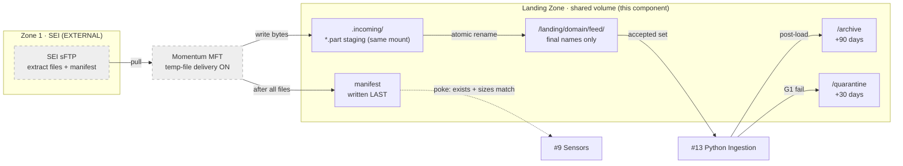
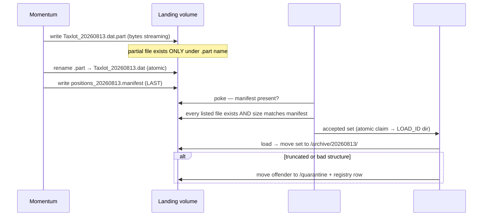

# Landing Zone + Transport — Design Document

## 1. Purpose & Scope
The Landing Zone is the physical boundary where SEI-originated files become Hub-owned artifacts. It receives ~30 feeds across 9 domains via Momentum (which pulls from the SEI sFTP location and copies to the shared landing volume), guarantees that a file visible under its final name is **complete**, and provides the archive and quarantine areas that the ingestion framework (#13) and G1 gate (#23) depend on. Target state: a structured, permissioned CIFS/NFS shared volume mounted into OpenShift worker pods, with atomic delivery semantics and a manifest-last contract. This document owns the directory contract, the completeness guarantee, and retention; it does NOT design Momentum itself (SEI/MFT-owned — interface only).

## 2. Context & Dependencies
- **Upstream**: #5 Extract Generation (external — produces files + manifest; manifest-last is a contract line on SEI/Momentum), Momentum MFT (external transport).
- **Downstream**: #9 File Arrival Sensors (poke the landing zone), #13 Python Ingestion Framework (reads accepted sets), #23 G1 (validates), #29 Error Handling & Quarantine (quarantine area lives here).
- **Platform**: #50 Persistent Storage (volume provisioning), #48 Secrets (Momentum sFTP keys).

```
SEI sFTP ──pull── Momentum ──copy (.part → rename)──► /landing/<domain>/<feed>/
                                                        ├── manifest written LAST
                                                        ├── /archive (post-load)
                                                        └── /quarantine (G1 fails)
```

## 3. Design Decisions
| Decision | Choice | Rationale | Consequence |
|---|---|---|---|
| sFTP or object store? | **CIFS/NFS shared volume now; object store deferred** | Air-gapped estate, Momentum's native target is a file share, rename-atomicity is the completeness mechanism, and OpenShift RWX PVC mounts are proven in this estate | Object-store migration (S3-compatible) revisited only if intraday volumes demand it; the directory contract below is designed to map 1:1 to key prefixes if that day comes |
| Same layout for EOD and intraday? | **Yes — one contract, cadence is a folder attribute not a structure change** | Two layouts double every sensor glob and G1 rule | Intraday files land under the same feed path with cadence encoded in the filename token |
| Completeness signal | **Write-then-rename (Momentum temp-file delivery) + manifest-last + size in manifest** | Rename within one mount is atomic; the final name cannot exist partially | Momentum channel MUST stage on the SAME share (see §4c warning) |
| Who may write | **Momentum service account only** (plus quarantine writes by #29) | Single-writer keeps the completeness guarantee provable | Ad-hoc drops go to a separate /adhoc area with stability-window-only acceptance |

## 4a. Diagrams



## 4b. Flow Walkthrough
1. Momentum → pulls extract from SEI sFTP on schedule → bytes exist only outside the Hub.
2. Momentum → writes to `.incoming/<name>.part` on the SAME landing share → partial data is invisible to sensors.
3. Momentum → atomic rename to final name in `/landing/<domain>/<feed>/` → file is complete by construction.
4. Momentum → writes the manifest AFTER all data files (contract line on #5) → arrival signal is trustworthy.
5. #9 Sensor → verifies manifest + per-file sizes → hands an accepted set to #13.
6. #13 → loads to Stage 1 RAW (Oracle, cross-tier hop is #13's concern) → moves the set to `/archive/<business_date>/`.
7. G1 failure → offending file to `/quarantine/<business_date>/` with a FILE_REGISTRY reason row.

## 4c. Detailed Design
**Directory contract**
```
/landing/<domain>/<feed>/            # final names only; sensors glob here
/landing/<domain>/<feed>/.incoming/  # Momentum staging — SAME filesystem
/landing/adhoc/                      # manual drops; stability-window acceptance only
/archive/<business_date>/<domain>/   # loaded originals, 90-day retention
/quarantine/<business_date>/         # G1/structural failures, 30-day retention
```
**Filename token**: `<FEED>_<BUSINESS_DATE>_<CADENCE>_<SEQ>.dat` (CADENCE=EOD|INTRADAY). Sensors glob extension-anchored (`*.dat`) — never `*` (guardrail rule: a `*.part` match voids the completeness guarantee).
**CIFS warning (the one way this silently breaks)**: if Momentum stages on a local disk and "renames" onto the share, SMB converts it to copy-then-delete — a gradual write under the final name. The channel's temp directory MUST be `.incoming/` on the same share. Acceptance test in §10 proves it.
**Volume**: RWX PVC (NFS/CIFS via #50), sized = 2× largest EOD day + 90-day archive; alert at 75% (via #34).
**Permissions**: Momentum svc account rw on landing+incoming; ingestion svc rw on archive/quarantine, r on landing; humans read-only.
**External contracts (named, not designed)**: Momentum channel config (temp-file delivery ON, same-share staging, manifest-last ordering); SEI manifest format per #5 (name, size, sha256 per file).

## 5. Data Quality, Reconciliation & Lineage
The Landing Zone contributes the *evidence*, not the checks: manifest (declared sizes/hashes) is the input to #9 verification and #23 G1; archive originals are the replay source under AD-2 (re-ingest from archive by LOAD_ID); every accept/quarantine/archive transition writes a FILE_REGISTRY lifecycle row (#33 schema) giving file-level lineage from SEI name → LOAD_ID.

## 6. RECOMMENDATION
**6.1** One shared-volume landing zone with atomic write-then-rename delivery and a manifest-last contract — completeness guaranteed by construction, not by inspection.
**6.2**
| Option | Description | Pros | Cons | Fit |
|---|---|---|---|---|
| A. Shared volume + rename atomics (recommended) | CIFS/NFS RWX PVC, Momentum temp-file delivery, manifest-last | Race structurally impossible; zero new infra; Momentum-native; replay from archive trivial | CIFS same-mount discipline required; volume capacity management | **High** |
| B. Object store (S3-compatible) landing | Feeds land as objects; completeness via multipart-complete event | True atomic PUT; event-driven sensors; elastic capacity | New platform through governance in an air-gap; Momentum object support weaker; #13 loaders re-plumbed | Medium — revisit for intraday scale |
| C. Direct sFTP pull by Hub (no Momentum) | Airflow tasks pull from SEI sFTP directly | One less hop | Re-implements MFT (retries, scheduling, audit) that Momentum already owns; against estate standard | Low |
**6.3** > **Recommended: Option A.** It converts the half-processed-file race from a monitoring problem into an impossibility, using only configuration Momentum already supports, on storage OpenShift already mounts. Its cost is discipline — same-share staging and extension-anchored globs — both of which are enforceable as cp-guardrails checks and provable by the §10 watcher test. The measurement that must hold: zero occurrences of a final-name file observed at partial size (watcher evidence), and manifest-vs-loaded row counts reconciling at G1. Option B remains the documented growth path; the directory contract maps to key prefixes without changing #9/#13 logic.
**6.4** Tiers respected: this component ends at the volume boundary — the file→Oracle hop belongs to #13 (AD-7 Python). AD-8 immutability begins at RAW; the archive gives the pre-RAW immutable copy. No dependency on open ADs.

## 7. Failure, Replay & Idempotency
Replay = re-present from `/archive/<business_date>/` into landing (tooling in #21); sensors treat it identically (manifest re-verified). Duplicate delivery of an already-loaded set is caught by FILE_REGISTRY state (#13 refuses ACTIVE→LOADED re-entry for same file hash). Volume-full → Momentum retries per its channel policy; alert via #34 before that horizon. Partial Momentum outage mid-set → manifest never written → sensors never fire → clean no-op.

## 8. Security & Access Control
Service-account segregation as in §4c; no human write path to landing. SWP extracts contain client-identifying data → volume is in the restricted storage class, encrypted at rest (estate standard), no export mounts outside the Hub namespace. Momentum sFTP private keys in Vault (#48). Quarantine inherits landing classification (failed files are still client data).

## 9. Open Questions & Risks
- Momentum channel settings (temp-file delivery, same-share staging) need confirmation with the MFT team — owner: TBD; blocks §10 acceptance.
- Manifest-last ordering must be added to the #5 extract contract with SEI — owner: TBD.
- Intraday volume estimates unknown → sizing uses EOD×2 placeholder — owner: TBD; revisit triggers Option B evaluation.
- Risk: a future feed bypassing Momentum (vendor direct-drop) would not carry the atomic guarantee → mitigation: /adhoc path with stability-window acceptance only, never the main glob.

## 10. Acceptance Criteria
- [ ] Watcher test: 200ms polling during a large Momentum delivery shows the final name ONLY at full size; `.part` visible during transfer.
- [ ] Rename proven same-mount (no size-growth under final name) on the production share.
- [ ] Manifest arrives after all data files across 5 consecutive EOD cycles.
- [ ] Quarantine + archive transitions write FILE_REGISTRY rows with correct states.
- [ ] Volume alert fires at 75% in a controlled fill test.
- [ ] cp-guardrails: extension-anchored glob rule active; `.part` never matched by any sensor.
