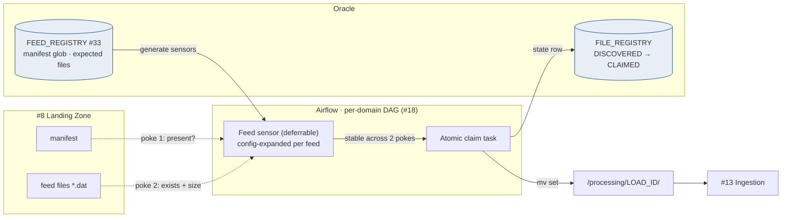
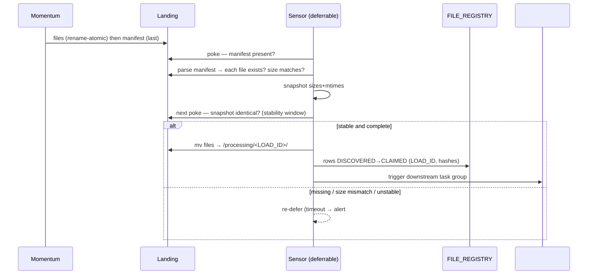

# File Arrival Sensors — Design Document

## 1. Purpose & Scope
The sensors are the Hub's gatekeeper between "files exist on the landing volume" and "the pipeline may start". Target state: **manifest-driven, deferrable Airflow sensors** — one logical sensor per feed, config-generated from the Metadata Store (#33), verifying manifest presence, per-file existence and size, and a stability window, then performing an **atomic claim** that hands exactly-once ownership of an accepted set to the ingestion framework (#13). This resolves the open question: manifest-driven, with filename patterns as the fallback for the /adhoc path only.

## 2. Context & Dependencies
- **Upstream**: #8 Landing Zone (directory contract, atomic delivery, manifest-last), #5 manifest format (external contract).
- **Downstream**: #13 Python Ingestion (consumes the claimed set), #23 G1 (deep validation after claim), #18 DAG fan-out (sensor tasks are the first task group per domain).
- **Config**: #33 feed registry drives sensor generation — no hand-written sensor per feed.

## 3. Design Decisions
| Decision | Choice | Rationale | Consequence |
|---|---|---|---|
| Manifest-driven or filename pattern? | **Manifest-driven** (resolved) | Manifest-last + size verification is a completeness *proof*; patterns only prove existence | /adhoc path (no manifest) uses stability-window pattern mode — clearly second-class |
| Poll or push? | **Poll now (deferrable), push-ready** | Deferrable sensors cost no worker slot while waiting; Momentum event → Airflow REST `dagRuns` is the documented upgrade | Push adoption is a Momentum ask, not a Hub change — trigger endpoint designed now |
| Sensor granularity | **One per feed, expanded from config** | 30 feeds = 30 mapped sensor tasks from ONE definition | Adding a feed = a registry row, zero code |
| Claim mechanism | **Atomic move to LOAD_ID processing dir + registry state transition** | The next poke cycle cannot double-claim; ownership is a filesystem fact | Replay re-presents to landing, never to the processing dir |

## 4a. Diagrams



## 4b. Flow Walkthrough
1. #33 registry → DAG factory expands one sensor definition into 30 feed sensors → config-driven fan-out.
2. Sensor (deferred, zero slot) → wakes on interval → poke 1: manifest exists.
3. Sensor → parses manifest → every listed file exists AND `stat().st_size` equals declared size → completeness proof.
4. Sensor → compares size/mtime snapshot to previous poke → stability window guards non-manifest edge cases.
5. Claim task → `mv` the whole set into `/processing/<LOAD_ID>/` (same mount, atomic) → exactly-once ownership.
6. Claim task → FILE_REGISTRY rows DISCOVERED→CLAIMED with LOAD_ID + manifest hashes → lineage anchor.
7. Downstream (#13) reads ONLY from the processing dir → landing is never a read source for loads.
8. Timeout without completeness → alert via #34; nothing is claimed; SEI/MFT chased with manifest evidence.

## 4c. Detailed Design
**Sensor poke (core)**
```python
def poke(self, context):
    m = self.landing / f"{self.feed}_{self.ds}.manifest"
    if not m.exists():
        return False
    entries = parse_manifest(m)                    # [(name, size, sha256)]
    for name, size, _ in entries:
        f = self.landing / name
        if not f.exists() or f.stat().st_size != size:
            return False
    snap = {n: (self.landing / n).stat().st_mtime for n, _, _ in entries}
    if snap != getattr(self, "_last", None):
        self._last = snap
        return False                               # stability window
    return True
```
**Config surface (#33)**: feed_id, manifest_glob, expected_file_count, poke_interval, timeout, cadence (EOD/INTRADAY), sla_deadline. Deferrable=True default; mode falls back to reschedule on older Airflow.
**Claim**: `mv` per file then manifest last (mirrors delivery ordering); LOAD_ID = `<feed>_<business_date>_<seq>` minted from #33 sequence.
**Push-ready trigger**: `POST /api/v1/dags/<domain>_ingest/dagRuns` documented as the Momentum post-transfer action; sensors remain as the safety net when push is adopted.
**Registry states owned here**: DISCOVERED (manifest seen) → CLAIMED (moved). LOADED/QUARANTINED belong to #13/#23.

## 5. Data Quality, Reconciliation & Lineage
The sensor is the first reconciliation point: manifest-declared count/size vs observed — a mismatch is *not* an error state, it is "not yet arrived" until timeout, at which point it becomes an SEI delivery incident with evidence. sha256 from the manifest is carried into FILE_REGISTRY for G1 (#23) to verify content, keeping hash checking OUT of the poke path (cheap pokes, expensive checks post-claim). Every claim is lineage: SEI filename → LOAD_ID → everything downstream.

## 6. RECOMMENDATION
**6.1** Manifest-driven deferrable sensors with size verification, a two-poke stability window, and an atomic filesystem claim into a LOAD_ID-owned processing directory.
**6.2**
| Option | Description | Pros | Cons | Fit |
|---|---|---|---|---|
| A. Manifest + size + stability + claim (recommended) | As designed | Completeness proven; exactly-once by construction; zero worker cost waiting; config-driven | Depends on manifest-last contract (#5/#8) | **High** |
| B. Filename-pattern sensors | Glob final names, fire on presence | Simplest; no manifest dependency | Presence ≠ completeness; multi-file sets race each other; the exact failure mode this design exists to kill | Low — /adhoc only |
| C. Push-only (Momentum event triggers) | No sensors; Momentum calls Airflow REST | Zero polling; instant start | Single point of trust in MFT config; no safety net for missed events; harder replay semantics | Medium — adopt as *addition*, keep A as net |
**6.3** > **Recommended: Option A, with C layered on later.** The manifest gives a completeness proof the filesystem alone cannot, the claim converts acceptance into ownership that cannot be double-taken, and deferrable execution makes 30 waiting sensors cost nothing against the Oracle-session and worker ceilings. Cost: the manifest-last contract must be formalized with SEI/MFT — which is required for audit anyway. Measurements that must hold: zero claims of incomplete sets (G1 truncation rate from sensor-claimed sets = 0), and sensor SLA breaches page with manifest evidence attached.
**6.4** Boundaries: sensors never read file *content* (that is G1's job post-claim, AD-8 side) and never write Oracle business tables — only FILE_REGISTRY lifecycle rows. No open-AD dependencies.

## 7. Failure, Replay & Idempotency
Scheduler restart mid-poke → deferrable state resumes; `_last` snapshot resets → worst case one extra stability cycle. Claim crash mid-`mv` → set split between landing and processing → recovery task reconciles against manifest and completes the move (idempotent: file-level mv). Replay (#21) re-presents from archive to landing with a new manifest; sensors treat it as a fresh arrival; LOAD_ID seq increments so RAW appends bitemporally (AD-2).

## 8. Security & Access Control
Sensor pods run the ingestion service account: read landing, write processing + registry only. No credentials to SEI (Momentum owns transport). Airflow connections via #48. The REST trigger endpoint (push path) requires the Momentum service identity — scoped to `dagRuns:create` on ingest DAGs only.

## 9. Open Questions & Risks
- Manifest field set (is sha256 present for all feeds?) — confirm against #5 samples; owner: TBD; affects G1 depth.
- Intraday poke_interval vs SEI intraday delivery jitter — needs observed data; owner: TBD.
- Risk: clock skew between Momentum host and volume mtimes could extend stability windows → mitigation: window compares snapshots, not wall-clock.
- Risk: a feed whose manifest is chronically late effectively serializes behind timeout → surface per-feed arrival SLOs in #34 from day one.

## 10. Acceptance Criteria
- [ ] Sensor claims fire ONLY after manifest + all sizes verified (fault-injection: drop one file → no claim, timeout alert).
- [ ] Truncated-file injection under final name (bypassing #8 atomics) is caught by size check → no claim.
- [ ] Double-scheduler race test: two schedulers, one claim, zero duplicate LOAD_IDs.
- [ ] 30 feed sensors generated from registry rows with zero per-feed code.
- [ ] Deferred sensors consume no worker slots (verified in pool metrics).
- [ ] Push trigger endpoint smoke-tested with a simulated Momentum call; sensor net still catches an un-pushed delivery.
