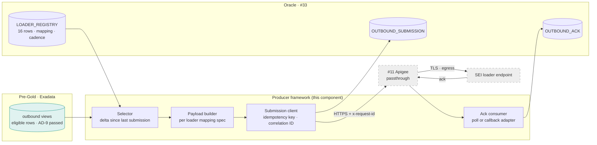

# Outbound Producers — Design Document

## 1. Purpose & Scope
The outbound half of the Hub's bidirectional relationship with SEI: **one config-driven producer framework serving all 16 SEI loader interfaces**. It selects outbound-eligible data from Pre-Gold (#16/#66), builds payloads to each SEI loader specification, submits via the Apigee passthrough (#11), consumes the submission/ack responses, and records the full trail. Target state: adding loader #17 is a configuration row plus a mapping spec — zero new pipelines. **Scope gate: the whole component is gated on AD-11 (outbound scope this phase)**; this design is written so the framework ships dark and loaders activate per AD-11's resolution. We design the producer and the submission client — never the SEI loader itself (external, contract only).

## 2. Context & Dependencies
- **Upstream data**: #16 Gold (dbt) marks outbound-eligible rows; #66 Pre-Gold Exadata hosts the outbound views.
- **Submission path**: #11 Apigee Proxy (enterprise passthrough) → SEI loader endpoint (external).
- **Cross-cutting**: #33 config (loader registry, mappings, cadence), #30 Reconciliation (ack-vs-submission recon), #31 Audit & Lineage (correlation-ID trail), #21 Replay (resubmission).

```
Pre-Gold outbound views ──select──► Producer framework ──payload──► Apigee (passthrough) ──► SEI loader
        ▲                              │                                                        │
   #16 marks eligibility          submission record ◄──────────────── ack (correlated) ◄────────┘
```

## 3. Design Decisions
| Decision | Choice | Rationale | Consequence |
|---|---|---|---|
| Which BBH systems are sources? (open q) | **Pre-Gold outbound views ONLY** | One governed egress point preserves AD-1/AD-9 (nothing leaves that did not pass the gates); direct system taps would fork lineage | Any BBH system wanting to send data to SEI routes it INTO the Hub first — a scope rule worth an explicit ARB line |
| One framework or 16 jobs? | **One framework, 16 configs** | Same argument as ingestion fan-out — the 2,500-jobs lesson | Loader-specific quirks live in mapping specs + per-loader adapter hooks, not forks |
| Submission semantics | **Idempotency-key per submission batch** | SEI-side dedupe on retry; ambiguous failures become safe | Key = `<loader>_<business_date>_<batch_seq>`; requires SEI confirmation the loader honors it (contract line) |
| Failure classification | **GATEWAY / TARGET / TIMEOUT tri-state** | Passthrough Apigee makes 5xx ambiguous; replay decisions differ per class | Requires infra's fault-header convention (#11 contract line) |
| Ack model | **Poll-or-callback per loader spec, normalized to one ACK record** | The 16 specs differ; downstream (recon, audit) must not care | Adapter hook per ack style; normalized OUTBOUND_ACK schema below |

## 4a. Diagrams

```mermaid
sequenceDiagram
 participant A as Airflow (outbound DAG)
 participant F as Producer
 participant O as Oracle (#33 tables)
 participant G as Apigee (passthrough)
 participant S as SEI loader
 A->>F: run loader L07 for business_date
 F->>O: read LOADER_REGISTRY(L07) + last watermark
 F->>F: select delta from outbound view · build payload per spec
 F->>O: OUTBOUND_SUBMISSION row (PENDING, idem_key, corr_id, payload_ref, hash)
 F->>G: POST payload (x-request-id=corr_id, Idempotency-Key)
 G->>S: forward (TLS, egress control only)
 alt 2xx accepted
  S-->>F: submission receipt
  F->>O: SUBMITTED
  F->>S: poll ack / receive callback (per spec)
  S-->>F: ack (accepted / rejected rows)
  F->>O: OUTBOUND_ACK (+ row-level rejects) → ACKED / PARTIAL
 else failure
  F->>F: classify GATEWAY | TARGET | TIMEOUT
  F->>O: FAILED(class) — GATEWAY/TIMEOUT retry w/ same idem_key; TARGET → check ack state first
 end
```

## 4b. Flow Walkthrough
1. Outbound DAG (#18 family, AD-11-gated) → invokes framework with loader + business_date.
2. Framework → LOADER_REGISTRY config + watermark → knows *what* and *since when*.
3. Selector → delta from the Pre-Gold outbound view → only gate-passed data can leave (AD-9 upstream).
4. Builder → payload per the loader mapping spec (format, field map, batching limits from config).
5. Submission row PENDING written BEFORE the wire call → crash-safe ordering.
6. POST via Apigee with correlation ID + idempotency key → passthrough adds TLS/egress only.
7. Receipt → SUBMITTED; ack adapter (poll or callback) normalizes SEI's response → OUTBOUND_ACK, state ACKED/PARTIAL with row-level rejects.
8. Failure → tri-state classification decides retry (same idem_key) vs ack-state inspection → no blind resubmission (AD-2 spirit: never ambiguous double-send).
9. Watermark advances ONLY on ACKED/PARTIAL-resolved → exactly-once-or-known.

## 4c. Detailed Design
**Data model (#33 schema)**
```sql
CREATE TABLE loader_registry (
  loader_id      VARCHAR2(10) PRIMARY KEY,   -- L01..L16
  loader_name    VARCHAR2(80) NOT NULL,
  source_view    VARCHAR2(60) NOT NULL,      -- Pre-Gold outbound view
  mapping_spec   VARCHAR2(60) NOT NULL,      -- versioned spec ref
  payload_format VARCHAR2(12) NOT NULL,      -- JSON | CSV | FIXED
  ack_style      VARCHAR2(10) NOT NULL,      -- POLL | CALLBACK
  batch_max_rows NUMBER,
  cadence        VARCHAR2(10) NOT NULL,      -- EOD | INTRADAY
  active_flag    CHAR(1) DEFAULT 'N'         -- AD-11 gate: ships dark
);
CREATE TABLE outbound_submission (
  submission_id  VARCHAR2(40) PRIMARY KEY,   -- <loader>_<bd>_<seq>
  loader_id      VARCHAR2(10) NOT NULL,
  business_date  DATE NOT NULL,
  idem_key       VARCHAR2(60) NOT NULL,
  corr_id        VARCHAR2(40) NOT NULL,
  payload_ref    VARCHAR2(200),              -- archived payload location
  payload_hash   VARCHAR2(64),
  row_count      NUMBER,
  state          VARCHAR2(12) NOT NULL,      -- PENDING/SUBMITTED/ACKED/PARTIAL/FAILED
  fail_class     VARCHAR2(8),                -- GATEWAY/TARGET/TIMEOUT
  created_at     TIMESTAMP DEFAULT SYSTIMESTAMP,
  updated_at     TIMESTAMP
);
CREATE TABLE outbound_ack (
  ack_id         NUMBER GENERATED ALWAYS AS IDENTITY PRIMARY KEY,
  submission_id  VARCHAR2(40) REFERENCES outbound_submission,
  ack_ts         TIMESTAMP,
  accepted_rows  NUMBER, rejected_rows NUMBER,
  reject_detail  CLOB                         -- row-level rejects, loader-native
);
```
**Adapter hooks**: `build_payload(spec, rows)`, `consume_ack(style, raw) -> AckRecord` — the only loader-specific code, registered per loader_id.
**Payload archive**: payloads persisted (payload_ref) for dispute/replay — restricted storage class, retention aligned to #31 audit policy.
**Correlation**: corr_id = x-request-id end-to-end; joins submission→Apigee log→ack→audit (#31).
**External contracts**: 16 SEI loader specs (format, ack, idempotency honor), infra fault-header convention (#11), egress quota allocation (#11).

## 5. Data Quality, Reconciliation & Lineage
Egress-side G-equivalents: payload row_count and hash recorded pre-send; ack accepted+rejected must reconcile to row_count (#30 owns the recon record — AD-6 pending there); rejects land as work items, never silently dropped. Lineage: every outbound row traces Pre-Gold snapshot → submission_id → corr_id → ack, satisfying "what did we send SEI and what did they say" as one query (#31).

## 6. RECOMMENDATION
**6.1** One config-driven producer framework over Pre-Gold outbound views, with idempotency-keyed submissions, tri-state failure classification, and normalized ack records — shipped dark behind AD-11.
**6.2**
| Option | Description | Pros | Cons | Fit |
|---|---|---|---|---|
| A. Framework + 16 configs off Pre-Gold (recommended) | As designed | Single egress point preserves gate guarantees; loader adds are config; recon/audit uniform | Adapter hooks needed for spec variance; AD-11 gates value | **High** |
| B. Per-loader standalone jobs | 16 bespoke scripts | Fastest first loader | The 2,500-job anti-pattern reborn on egress; 16 recon/audit variants | Low |
| C. Source systems submit directly to SEI | BBH apps call loaders themselves | No Hub work | Ungated egress (breaks AD-9 guarantee), forked lineage, 16×N credential sprawl | Low — explicitly recommend ARB prohibition |
**6.3** > **Recommended: Option A.** It makes the Hub the *only* door to SEI in both directions, which is the whole architectural point: nothing leaves that has not passed the gates, every byte out has a correlated ack trail, and the 16-spec variance is contained in two adapter hooks instead of 16 pipelines. Costs: the framework is genuinely High custom-build, and its business value is dark until AD-11 resolves — which is precisely why building the *framework* now and activating *loaders* per decision is the right sequencing. Measurements that must hold: submission→ack reconciliation at 100% (no unresolved SUBMITTED beyond SLA), zero duplicate deliveries under retry (idempotency proof), fail-class distribution visible in #34.
**6.4** Tier boundary respected: reads Pre-Gold only (movement of *outbound* data is a Hub function, not consumer movement). AD-11 is the explicit open dependency; AD-1/AD-2 honored as designed.

## 7. Failure, Replay & Idempotency
Crash between PENDING and POST → resubmit same idem_key (SEI dedupes). Crash after POST before receipt → state PENDING with corr_id → ack-state inspection before any retry (query loader status by idem_key where spec supports; else operational hold). Replay of a business_date (#21) → new submission_id/seq, same-day rows re-selected from the Pre-Gold *bitemporal* view as-of replay — AD-2 means resubmission content is reconstructible and labeled. PARTIAL acks → reject rows quarantined as work items; resubmission covers rejects only.

## 8. Security & Access Control
Outbound payloads are client data → payload archive in restricted class, field-level masking rules from #32 applied to any non-production copy. SEI credentials (mTLS certs / OAuth per loader spec) in Vault (#48), mediated per loader_id — no shared secret across loaders. Framework service account: read outbound views, write #33 outbound tables only. Egress allowed solely via #11's route (network policy).

## 9. Open Questions & Risks
- **AD-11**: outbound scope this phase — the framework ships dark regardless; loader activation order needs the decision. Owner: TBD.
- Idempotency-key honor per loader: confirm against each of the 16 specs; where absent, ack-state-inspection becomes mandatory pre-retry. Owner: TBD.
- Callback ack style requires an inbound endpoint — routes via #12 gateway; confirm SEI can target it through the estate ingress. Owner: TBD.
- Risk: loader spec drift (SEI-side changes) → mitigation: mapping_spec versioning + contract tests in CI against SEI sample payloads.
- Risk: shared Apigee egress quota throttling EOD outbound burst → quota allocation in writing (#11), cadence shaping via #20.

## 10. Acceptance Criteria
- [ ] One loader end-to-end in a lower region: select→build→submit→ack with full table trail.
- [ ] Retry storm test: same idem_key resubmitted 5× → exactly one SEI-side effect (or ack-state inspection path proven where dedupe unsupported).
- [ ] Fail-class injection: gateway 5xx, target 5xx, timeout → correct tri-state classification and per-class handling.
- [ ] Adding a second loader touches ONLY loader_registry + mapping spec + (if needed) adapter registration.
- [ ] Submission↔ack recon report (#30) balances for a full simulated day.
- [ ] Correlation ID joins producer log ↔ Apigee analytics ↔ ack in one Splunk query.
