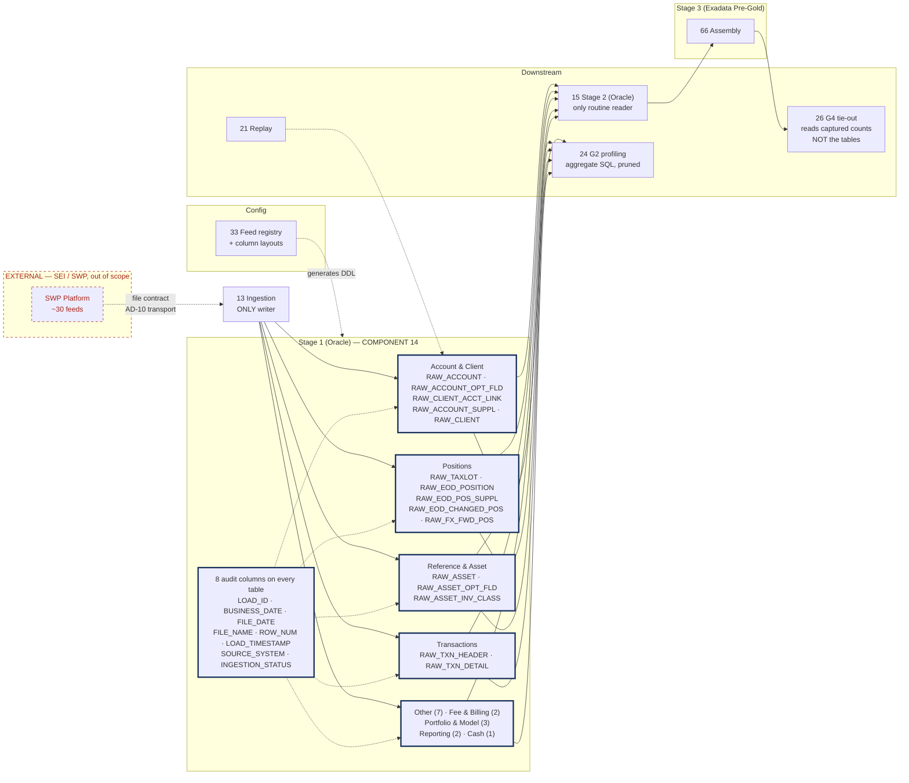
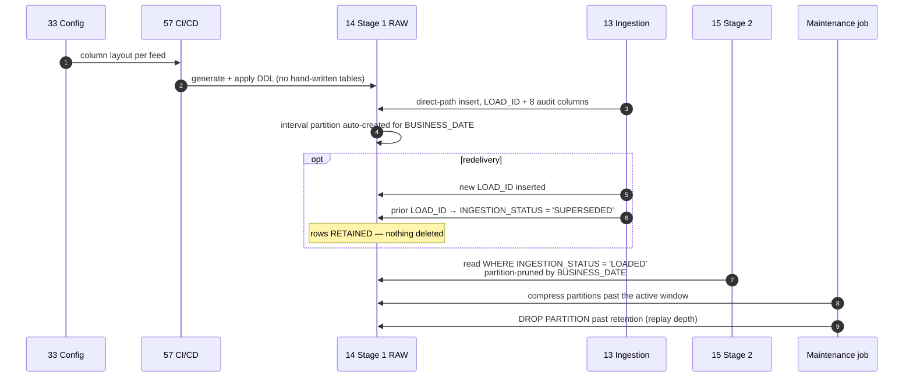

# Stage 1 RAW — Design Document

## 1. Purpose & Scope

Stage 1 RAW is the evidence record: a byte-faithful, immutable, append-only copy of every file SEI delivers, stamped with when it arrived and in what file. One table per inbound feed — approximately 30 tables across 9 domains, including satellites. Its single deliverable is the **generated DDL set plus the partitioning and retention design**, produced from the feed registry rather than hand-written.

RAW has exactly one obligation: a replay from RAW must produce the same result as the original run. Every decision below follows from that.

**Tiers touched:** Stage 1 Oracle only. Read by Stage 2; never read by Exadata Pre-Gold directly except by G4's count comparison, and never by the consumer tier.

---

## 2. Context & Dependencies

| ID | Component | Why required |
|---|---|---|
| 13 | Python ingestion framework | The only writer. RAW has no other write path. |
| 33 | Metadata & config store | Column layouts generate the DDL; retention and partitioning policy held here |

### Downstream

- **15 Stage 2** — the only routine reader
- **24 G2 profiling gate** — aggregate SQL over RAW partitions
- **26 G4 tie-out** — reads captured `LOAD_ID` counts, not the tables themselves
- **21 Replay engine** — replays from RAW partitions

### Tier placement

```
  Landing (8) ──▶ 13 Ingestion ──▶ ┌── 14 STAGE 1 RAW (Oracle) ──┐
                                   │  ~30 tables · 9 domains      │
                                   │  immutable · append-only     │
                                   │  partitioned by BUSINESS_DATE│
                                   └──────────┬───────────────────┘
                                              ▼
                        15 Stage 2 ──▶ 66 Pre-Gold [Exadata] ──▶ 67 ──▶ Gold ──▶ consumers
```

---

## 3. Design Decisions

**D1 · Column typing.**
**Decision:** Every business column is `VARCHAR2`. No dates, no numbers, no constraints.
**Rationale:** Typing at the RAW boundary means a malformed date rejects the row and destroys the evidence of what SEI actually sent. G1 reports type violations without blocking their storage.
**Consequence:** Stage 2 owns safe-cast and flagging. RAW is genuinely reconstructable back to the original file.

**D2 · Constraints and keys.**
**Decision:** No primary key, no unique constraint, no `NOT NULL` on business columns. Audit columns are `NOT NULL`.
**Rationale:** Duplicates are data to be observed, not errors to be prevented. A unique constraint would reject a duplicate SEI genuinely sent, hiding a source problem.
**Consequence:** Deduplication is a Stage 2 responsibility, performed before joins.

**D3 · Partitioning.**
**Decision:** Interval range partitioning by `BUSINESS_DATE`, daily, on every table.
**Rationale:** Gives partition-wise replay, cheap purge by `DROP PARTITION`, and pruning for G2's aggregate profiling.
**Consequence:** Correction feeds partition on the *file* date, not the corrected event's date — the corrected date lives in the payload and is resolved in Stage 2.

**D4 · One table per feed, or per entity?**
**Decision:** Per feed. Satellites (`Account Optional Fields`, `Account Supplement`, `EOD Positions Supplement`, `Asset Optional Fields`) get their own RAW tables.
**Rationale:** RAW stores as delivered. A satellite arrives as its own file with its own layout and must land as its own table. Attachment to the parent entity happens in Pre-Gold assembly (66).
**Consequence:** ~30 tables rather than ~20. Justified because merging at ingest would require transformation, which RAW must not do.

**D5 · Redelivery.**
**Decision:** Supersede via `INGESTION_STATUS`, never delete. Prior rows retained.
**Rationale:** AD-8. Deleting breaks immutability and makes "what did we hold on Tuesday morning?" unanswerable.
**Consequence:** Stage 2 filters `INGESTION_STATUS = 'LOADED'`. Storage cost of one extra partition-worth per redelivery.

**D6 · Retention.**
**Decision:** Driven by required replay depth, not by available disk. Held in config per feed.
**Rationale:** If the business needs to replay 90 days, RAW holds 90 days minimum. Sizing storage first and deriving replay depth from it produces a system that cannot honour its own recovery promise.
**Consequence:** Replay depth is an open business decision that blocks storage sizing.

**D7 · Compression.**
**Decision:** `ROW STORE COMPRESS ADVANCED` on partitions older than the active window, applied by a scheduled job.
**Rationale:** Repeated daily full snapshots of Account, Client, Taxlot and Asset compress heavily. RAW sits on the Stage 1/2 Oracle instance, so HCC is not assumed available.
**Consequence:** A maintenance job on the ageing boundary, and a note that if RAW shares Exadata storage, HCC should be evaluated as a superior option.

---

## 4a. Diagrams

### (1) Component / architecture



### (2) Data flow / sequence



---

## 4b. Flow Walkthrough

1. **Config (33)** → supplies the column layout per feed → CI generates DDL
2. **CI (57)** → applies generated DDL → **no RAW table is hand-written**
3. **Ingestion (13)** → direct-path insert with `LOAD_ID` and the 8 audit columns → the only write path
4. **RAW (14)** → interval partitioning auto-creates the `BUSINESS_DATE` partition → no pre-provisioning
5. **Redelivery** → a new `LOAD_ID` is inserted; the prior is marked `SUPERSEDED` → **rows retained, never deleted**
6. **Stage 2 (15)** → reads `INGESTION_STATUS = 'LOADED'`, partition-pruned by business date → the only routine reader
7. **G2 (24)** → aggregate profiling SQL against the target partition → pushed to the database, never row-shipped
8. **G4 (26)** → reads the **captured** row count per `LOAD_ID` from lineage, not `COUNT(*)` against these tables → this is what makes a blocking tie-out affordable
9. **Maintenance** → compresses partitions past the active window, drops partitions past retention → retention set by replay depth

**No cross-database hop in this component.** RAW is read on the Stage 1/2 Oracle instance; the Exadata → Gold hop occurs downstream in 67.

---

## 4c. Detailed Design

### Table inventory — generated from the registry

| Domain | Feeds | RAW tables | Type |
|---|---|---|---|
| Account & Client | 5 | `RAW_ACCOUNT`, `RAW_ACCOUNT_OPT_FLD`*, `RAW_CLIENT_ACCT_LINK`, `RAW_ACCOUNT_SUPPL`*, `RAW_CLIENT` | Snapshot |
| Positions | 5 | `RAW_TAXLOT`, `RAW_EOD_POSITION`, `RAW_EOD_POS_SUPPL`*, `RAW_EOD_CHANGED_POS`, `RAW_FX_FWD_POSITION` | Snapshot / delta |
| Other | 7 | `RAW_CURR_UPCOMING_ACTIVITY`, `RAW_CUSTODY_NOSTRO`, `RAW_ACTIVE_COMMITS`, `RAW_FUND_CUTOFF_TIMES`, `RAW_END_PERIOD_VALUES`, `RAW_PAY_TO_RECIPIENTS`, `RAW_INTEREST_RATES` | Mixed |
| Fee & Billing | 2 | `RAW_FEE_COMPUTATION`, `RAW_FEE_PACKAGE_USAGE` | Delta |
| Portfolio & Model | 3 | `RAW_PORTFOLIO_GROUPS`, `RAW_PORTFOLIO`, `RAW_MODEL_ALLOCATION` | Snapshot |
| Reporting | 2 | `RAW_STATEMENT_EVENT`, `RAW_STATEMENT_EVENT_ITEM` | Delta |
| Reference & Asset | 3 | `RAW_ASSET`, `RAW_ASSET_OPT_FLD`*, `RAW_ASSET_INV_CLASS` | Snapshot |
| Transactions | 2 | `RAW_TXN_HEADER`, `RAW_TXN_DETAIL` | Delta |
| Cash | 1 | `RAW_RECURRING_CASH_ACTIVITY` | Delta |

`*` satellite — attaches to a parent entity during Pre-Gold assembly (66), not here.

### DDL pattern

```sql
-- ONE pattern, ~30 tables, generated from CFG_FEED_COLUMN. Never hand-written.
CREATE TABLE RAW_TXN_HEADER (
  -- audit columns: identical on every RAW table, no exemptions
  LOAD_ID           NUMBER(18)     NOT NULL,
  BUSINESS_DATE     DATE           NOT NULL,
  FILE_DATE         DATE,
  FILE_NAME         VARCHAR2(260)  NOT NULL,
  ROW_NUM           NUMBER(12)     NOT NULL,
  LOAD_TIMESTAMP    TIMESTAMP      DEFAULT SYSTIMESTAMP NOT NULL,
  SOURCE_SYSTEM     VARCHAR2(30)   DEFAULT 'SEI_SWP'    NOT NULL,
  INGESTION_STATUS  VARCHAR2(20)   DEFAULT 'LOADED'     NOT NULL,
  -- business payload: ALL VARCHAR2, lengths from CFG_FEED_COLUMN
  TRANSACTION_ID    VARCHAR2(64),
  ACCOUNT_ID        VARCHAR2(64),
  TRADE_DATE        VARCHAR2(32),
  SETTLE_DATE       VARCHAR2(32),
  TRANSACTION_TYPE  VARCHAR2(64),
  ...
)
PARTITION BY RANGE (BUSINESS_DATE)
  INTERVAL (NUMTODSINTERVAL(1,'DAY'))
  (PARTITION P_INIT VALUES LESS THAN (DATE '2026-01-01'));

-- no PK, no unique, no NOT NULL on business columns, no FK.
CREATE INDEX IX_RAW_TXNH_LOAD ON RAW_TXN_HEADER (LOAD_ID) LOCAL;
```

### Audit columns

| Column | Type | Semantics |
|---|---|---|
| `LOAD_ID` | `NUMBER(18)` | One per file-load attempt. Replay handle and lineage join key. |
| `BUSINESS_DATE` | `DATE` | The date the data is about. Partition key. Corrections use the file date. |
| `FILE_DATE` | `DATE` | Date asserted by SEI. Divergence from `BUSINESS_DATE` is itself a G1 check. |
| `FILE_NAME` | `VARCHAR2(260)` | Exact delivered filename. Evidence and tie back to landing. |
| `ROW_NUM` | `NUMBER(12)` | Ordinal in file. Makes a row addressable to a physical line. |
| `LOAD_TIMESTAMP` | `TIMESTAMP` | Knew-at axis. Never used to order business events. |
| `SOURCE_SYSTEM` | `VARCHAR2(30)` | `'SEI_SWP'`. Present so a second source needs no schema change. |
| `INGESTION_STATUS` | `VARCHAR2(20)` | `LOADED` / `QUARANTINED` / `SUPERSEDED`. Not a DQ verdict. |

### Storage and retention

| Aspect | Design |
|---|---|
| Partitioning | Interval range, daily, `BUSINESS_DATE` |
| Indexing | `LOAD_ID` local index only. No business-column indexes — Stage 2 reads whole partitions. |
| Compression | `ROW STORE COMPRESS ADVANCED` past the active window, by scheduled job |
| Purge | `DROP PARTITION` past retention |
| Retention | Per feed, from config. Driven by replay depth — **currently unset, open item** |
| Sizing driver | Daily full snapshots: Taxlot, EOD Position, Account, Client, Asset. These dominate. |

### Config surface (33)

Column layouts, RAW lengths, retention days per feed, compression ageing boundary, partition key override for correction feeds.

---

## 5. Data Quality, Reconciliation & Lineage

RAW enforces no rules of its own — the storage layer is deliberately permissive.

| Gate | Relationship to RAW |
|---|---|
| G1 (23) | Runs **before** the insert. A failure means zero rows here. |
| G2 (24) | Aggregate SQL **over** RAW partitions. Blocks Stage 2, not RAW. |
| G4 (26) | Reads captured counts by `LOAD_ID`, not these tables. |

**Quarantine:** never applies to RAW. Quarantine is pre-RAW only. Once a row is here it is evidence and stays.

**Lineage:** `LOAD_ID` + `ROW_NUM` is the anchor for the whole chain. Carried into Stage 2, preserved through Pre-Gold assembly, and present on Gold rows — so a published value traces to a physical line in a named file.

---

## 6. RECOMMENDATION

### 6.1 Central design choice

**Does RAW store business columns as typed Oracle datatypes, or as `VARCHAR2` with casting deferred to Stage 2?**

### 6.2 Options comparison

| Option | Description | Pros | Cons | Fit to Oracle/Stage1-2 → Exadata/Gold → movement stack |
|---|---|---|---|---|
| **A · Typed at load** | Dates as `DATE`, amounts as `NUMBER`, with the load rejecting non-conforming rows | Smaller storage. Stage 2 is simpler — no cast layer. Type errors surface at the earliest possible point. Better partition pruning on date columns. | A single malformed value rejects the row at load, so the evidence of what SEI actually sent is destroyed. A layout change from SEI can fail an entire file. Contradicts "byte-faithful" — RAW no longer reconstructs the source. | Weak. Breaks the replay guarantee: a replay cannot reproduce what was never stored. |
| **B · `VARCHAR2`, cast in Stage 2** *(recommended)* | All business columns text; safe-cast and flag in Stage 2 | RAW is genuinely reconstructable to the file. No load ever fails on a value. G1 can report type violations without blocking their storage. Layout drift from SEI degrades gracefully instead of halting. | Larger storage before compression. Every Stage 2 model needs a cast layer. Date-range pruning within a partition is unavailable — mitigated by partitioning on the audit `BUSINESS_DATE`, which is typed. | Strong. Keeps Stage 1 purely an evidence tier and pushes all interpretation to Stage 2 on the same instance — no cross-tier cost. |
| **C · Hybrid — type the keys, text the rest** | Natural keys and dates typed; measures and descriptive columns text | Some pruning and join benefit on keys. Partial storage saving. | Worst of both: a malformed key still rejects the row, so the evidence guarantee is lost anyway, while the cast layer in Stage 2 is still required for everything else. The rule "which columns are typed?" becomes per-feed knowledge. | Weak. Adds per-feed variability to a layer whose value comes from being uniform. |

### 6.3 Recommendation

> **Recommended: Option B — all business columns `VARCHAR2`, cast in Stage 2.**

Option B wins because RAW's single obligation is that a replay from RAW reproduces the original run, and that is only true if RAW holds what arrived rather than what parsed. Option A trades that guarantee for storage and simplicity, and the trade is bad in a financial pipeline where an auditor may ask what a file contained on a specific morning — a question option A cannot answer for any rejected row. Option C keeps the failure mode of A while keeping the cast cost of B, and adds per-feed inconsistency to a layer that is valuable precisely because it is uniform across all ~30 tables.

**What it costs:** more storage before compression, and a mandatory cast layer in every Stage 2 model. Both are real. The storage cost is largely recovered by `COMPRESS ADVANCED` on the ageing partitions — repeated daily snapshots of Account, Client, Taxlot and Asset compress well. The cast cost is absorbed by shared macros (`safe_date`, `safe_number`) written once.

**Tier placement:** RAW sits on the Stage 1/2 Oracle instance, not on Exadata Pre-Gold and not on the standalone Gold box. That boundary is correct because RAW is read almost exclusively by Stage 2, which is on the same instance — colocating avoids a cross-database read on the hottest path in the batch. Gold's 12 CPU / 64 GB is reserved for load and extract, and putting an evidence tier there would consume the capacity that publishing needs.

**Must be confirmed for this to hold:**
1. **Replay depth**, which sets retention and therefore total RAW storage. Currently unset and blocking sizing.
2. **Per-feed volume profile** across all ~30 feeds, particularly the four large daily snapshots.
3. **Whether RAW shares Exadata storage.** If it does, HCC should replace `COMPRESS ADVANCED` and the storage argument against option B weakens further.

### 6.4 Rules respected

- ✅ Tier boundary crisp — Stage 1 Oracle only; no Exadata residency, no consumer-tier presence
- ✅ **AD-8** — immutable, append-only; redelivery supersedes; no delete path except an uncommitted failed load
- ✅ **AD-7** — written by Python, not dbt
- ✅ **AD-9** — G1 runs before the insert, so a blocked file leaves zero rows here
- ✅ No transformation — RAW performs none, by construction
- ⚠️ **AD-10 contingent** — the External Table load path in component 13 requires a DB-visible mount

---

## 7. Failure, Replay & Idempotency

| Failure | Behaviour |
|---|---|
| G1 failure upstream | Zero rows enter RAW. Nothing to clean up. |
| Load fails partway | `rollback(load_id)` removes uncommitted rows for that `LOAD_ID`. The only sanctioned delete, and only for a failed attempt. |
| Redelivery | New `LOAD_ID`; prior marked `SUPERSEDED`; rows retained. |
| Partition exhaustion / tablespace full (E6) | Retryable at the ingest task after remediation. RAW itself is unaffected. |
| Corrupt partition | Restore from backup (63) and replay the affected `LOAD_ID` set. |

**Replay (21):** RAW is the replay source of record. Replay reads the original file from landing or quarantine and reloads under a new `LOAD_ID` — RAW itself is never rewritten. Because Pre-Gold uses bitemporal append (**AD-2**), a replay is forward-only through every tier.

**Idempotency:** append-only with a distinct `LOAD_ID` per attempt makes every load idempotent by construction — a re-run adds a new load and supersedes the prior rather than mutating anything.

---

## 8. Security & Access

- **Write:** ingestion service account only, `INSERT` plus a `LOAD_ID`-scoped delete grant for failed-attempt rollback. No `UPDATE` except `INGESTION_STATUS`.
- **Read:** Stage 2 and gate service accounts, `SELECT` only. No consumer or human read access to RAW in production without an audited grant.
- **Classification:** TBD — BBH security. Account & Client is the likely PII carrier. **If masking is required it cannot be retrofitted here** — immutability precludes rewriting loaded rows, so masking must be designed before first load or applied from Stage 2 onward.
- **Audit:** all DDL changes via CI (60), recorded with the `GIT_COMMIT` of the config that generated them.

---

## 9. Open Questions & Risks

| # | Question / risk | Owner | Blocks |
|---|---|---|---|
| 1 | Replay depth — how many days must be replayable? | Business + BBH ops | Retention, storage sizing, quarantine retention |
| 2 | Per-feed volume profile across ~30 feeds | SEI | Storage sizing, compression ageing boundary |
| 3 | PII classification of Account & Client attributes | BBH security | **Must be settled before first load** — cannot be retrofitted |
| 4 | Does RAW share Exadata storage, or the Stage 1/2 Oracle instance only? | BBH infra | Compression choice; HCC availability |
| 5 | Confirmed column layouts for all ~30 feeds | SEI | DDL generation |
| 6 | Correction feed partition semantics — file date confirmed as the key? | SEI + BBH | D3; Stage 2 lookback logic |
| 7 | Natural keys per feed (recorded in config, not enforced here) | SEI | Stage 2 dedup and Pre-Gold assembly |

---

## 10. Acceptance Criteria

**Design complete when:**

- [ ] Column layouts captured for all ~30 feeds, sufficient to generate DDL with no hand-editing
- [ ] Audit column set confirmed identical across every table, no exemptions
- [ ] Partitioning and interval strategy agreed, including correction-feed treatment
- [ ] Retention set per feed from a confirmed replay depth
- [ ] Compression ageing boundary agreed
- [ ] PII classification resolved and masking approach decided before first load

**Build complete when:**

- [ ] All ~30 tables generate from the registry — verified, zero hand-written DDL
- [ ] A RAW row traces to a physical line in a named file via `LOAD_ID` + `ROW_NUM`
- [ ] Redelivery supersedes correctly; prior rows present and Stage 2 reads only `LOADED`
- [ ] Interval partitions auto-create on a new business date with no pre-provisioning
- [ ] G2 profiling demonstrably prunes to a single partition
- [ ] Compression ratio measured on the largest snapshot table
- [ ] `DROP PARTITION` purge tested against the retention policy
- [ ] Confirmed by inspection that no code path updates a business column in RAW
