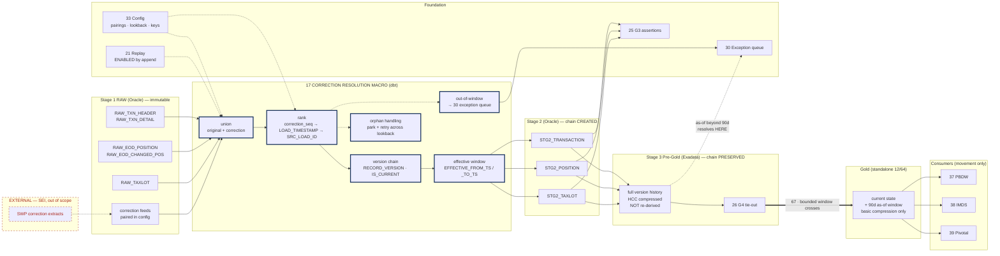

# Correction Handling — Design Document

## 1. Purpose & Scope

Correction handling is the single mechanism by which restated data — a transaction whose amount changed, a position that was wrong — is integrated without destroying what was previously held. Its single deliverable is **one reusable bitemporal resolution macro**, applied identically wherever corrections occur in Stage 2 and preserved unchanged through Pre-Gold assembly on Exadata.

It is a distinct component rather than a feature of Stage 2 because it must be written once. Correction logic implemented per model drifts, and a pipeline where two entities resolve restatements differently cannot answer an as-of question consistently.

**Tiers touched:** Stage 2 Oracle (where versions are created) and Stage 3 Exadata Pre-Gold (where they are preserved and resolved into dimensional output). Nothing in the consumer tier resolves corrections — Gold receives already-resolved current state plus a bounded as-of window.

---

## 2. Context & Dependencies

| ID | Component | Why required |
|---|---|---|
| 14 | Stage 1 RAW | Source of both original and correction records, immutable |
| 15 | Stage 2 Enriched | Host of the macro; corrections resolve at step 5 of the fixed order |
| 33 | Config store | Correction lookback per feed, natural keys, correction-feed pairings |
| 31 | Audit & lineage | Version chain is part of the evidence trail |
| 21 | Replay engine | Replay depends on append semantics — this component makes replay possible |
| 66 | Pre-Gold | Consumes the version chain; must not re-derive it |

### Downstream

- **66 Pre-Gold** — builds SCD2 and facts over the resolved chain
- **67 Movement** — ships current state plus the bounded as-of window to Gold
- **25 G3** — asserts bitemporal consistency

### Tier placement

```
  14 RAW (Oracle)
    original feeds + correction feeds, both immutable
        │
        ▼
  ┌── 15 STAGE 2 (Oracle) ─────────────────────────┐
  │   step 5: 17 CORRECTION RESOLUTION             │
  │   union → rank → version chain                 │
  │   RECORD_VERSION · IS_CURRENT · EFFECTIVE_*    │
  └────────────────┬───────────────────────────────┘
                   ▼
  ┌── 66 PRE-GOLD (Exadata) ───────────────────────┐
  │   chain PRESERVED, not re-derived              │
  │   full history retained under HCC              │
  └────────────────┬───────────────────────────────┘
                   │ 67 · current state + 90d as-of window only
                   ▼
            Gold (standalone) ──▶ PBDW · IMDS · Pivotal
```

---

## 3. Design Decisions

**D1 · Merge or versioned append?**
**Decision:** Versioned append. A correction inserts a new version; the prior row is closed with `EFFECTIVE_TO_TS` and `IS_CURRENT = 'N'`.
**Rationale:** AD-2, decided. In-place merge destroys prior state, making as-of restatement impossible and replay meaningless — replay can re-run a merge but cannot undo one.
**Consequence:** Larger tables and every consumer query needing `IS_CURRENT = 'Y'`, mitigated by exposing views. One macro to build and maintain.

**D2 · One macro or per-model logic?**
**Decision:** One macro, parameterised by natural key and correction-feed pairing from config.
**Rationale:** Three Stage 2 models carry corrections (Position, Taxlot, Transaction). Per-model implementations will diverge, and divergence means two entities answer the same as-of question differently.
**Consequence:** The macro must handle every correction shape in the inventory on day one; a feed that "needs slightly different logic" is a config gap, not a code exception.

**D3 · Where is the chain created, and where preserved?**
**Decision:** Created in Stage 2 (Oracle). Preserved unchanged through Pre-Gold (Exadata). Never re-derived.
**Rationale:** Corrections arrive against Stage 2's grain. Re-deriving in Pre-Gold would require reading RAW across the tier boundary and would allow the two layers to disagree.
**Consequence:** Pre-Gold's SCD2 build consumes `IS_CURRENT` and the effective timestamps rather than computing them.

**D4 · Retention of the version chain.**
**Decision:** Full chain retained in Pre-Gold on Exadata under HCC. Gold receives current state plus a bounded as-of window, default 90 days, configurable per object.
**Rationale:** Full versioned history on the standalone 12 CPU / 64 GB Gold box with only basic compression will outgrow it. Exadata absorbs it at roughly 10× compression.
**Consequence:** As-of queries beyond the window resolve against Pre-Gold, not Gold. This is a **refinement to AD-2** requiring explicit ARB acknowledgement — bitemporal append still holds everywhere, but the retention horizon differs by tier.

**D5 · Ordering determinism.**
**Decision:** Version order is `correction_seq`, then `LOAD_TIMESTAMP`, then `SRC_LOAD_ID`. All three, always.
**Rationale:** Two corrections to the same record on the same day are indistinguishable on `correction_seq` alone. A non-deterministic order means two replays produce two different answers.
**Consequence:** `SRC_LOAD_ID` must be monotonic per feed — a constraint on the allocation design in component 31.

**D6 · Corrections outside the lookback window.**
**Decision:** Route to a manual exception queue via component 30. Never silently dropped, never silently applied outside the incremental predicate.
**Rationale:** A correction landing today for a transaction six weeks old falls outside a seven-day lookback. Silence is the wrong answer.
**Consequence:** The lookback is per-feed config; an out-of-window correction raises an E4 exception with the affected `LOAD_ID` and business date.

**D7 · Corrections arriving before their originals.**
**Decision:** Park with `DQ_FLAGS = 'ORPHAN_CORRECTION'` and retry across the lookback window. G3 asserts the orphan count is zero after the window closes.
**Rationale:** Out-of-order delivery is a real possibility with independent feed arrival.
**Consequence:** An orphan that survives the window becomes an exception, not a silent gap.

---

## 4a. Diagrams

### (1) Component / architecture



### (2) Data flow / sequence

```mermaid
sequenceDiagram
  autonumber
  participant RAW as 14 RAW (Oracle)
  participant M as 17 Macro
  participant S2 as 15 Stage 2 (Oracle)
  participant EXC as 30 Exception queue
  participant PG as 66 Pre-Gold (Exadata)
  participant GD as Gold (standalone)

  S2->>M: invoke with natural_key + correction pairing (33)
  M->>RAW: read original feed, INGESTION_STATUS = LOADED, within lookback
  M->>RAW: read paired correction feed, same window
  M->>M: union with correction_seq (0 = original, 1 = correction)
  M->>M: rank by correction_seq → LOAD_TIMESTAMP → SRC_LOAD_ID
  M->>M: assign RECORD_VERSION; close prior with EFFECTIVE_TO_TS
  alt correction has no matching original
    M->>M: flag ORPHAN_CORRECTION, park for retry
    Note over M: G3 asserts orphan count = 0 after window closes
  end
  alt correction targets a date outside the lookback
    M->>EXC: raise E4 with LOAD_ID + business date — never silent
  end
  M-->>S2: version chain — RECORD_VERSION, IS_CURRENT, EFFECTIVE_FROM/TO
  S2->>PG: chain consumed AS IS — not re-derived
  PG->>PG: full history retained under HCC
  PG->>GD: CROSS-DB HOP (67) — current state + 90d as-of window ONLY
  Note over PG,GD: as-of queries beyond 90 days resolve on Exadata,<br/>not on the 12 CPU / 64 GB Gold box
```

---

## 4b. Flow Walkthrough

1. **Stage 2 (15)** → invokes the macro at step 5 of the fixed order, with the natural key and correction-feed pairing from config (33)
2. **Macro (17)** → reads the original feed from RAW, `INGESTION_STATUS = 'LOADED'`, within the feed's lookback window
3. **Macro (17)** → reads the paired correction feed over the same window
4. **Macro (17)** → unions both, stamping `correction_seq` — 0 for original, 1 for correction
5. **Macro (17)** → ranks by `correction_seq`, then `LOAD_TIMESTAMP`, then `SRC_LOAD_ID` → **all three, for determinism across replays**
6. **Macro (17)** → assigns `RECORD_VERSION`; closes the prior version with `EFFECTIVE_TO_TS` and `IS_CURRENT = 'N'`
7. **Orphan branch** → a correction with no matching original is flagged `ORPHAN_CORRECTION` and parked → G3 asserts the count is zero once the window closes
8. **Out-of-window branch** → a correction targeting a date beyond the lookback raises an E4 exception to the queue (30) with `LOAD_ID` and business date → **never silently dropped or applied**
9. **Stage 2 (15)** → receives the resolved chain → `RECORD_VERSION`, `IS_CURRENT`, effective timestamps on every row
10. **Pre-Gold (66)** → consumes the chain **as is** → SCD2 and fact assembly read `IS_CURRENT` rather than recomputing it
11. **Pre-Gold (66)** → retains the full version history on Exadata under HCC
12. **Movement (67)** → **CROSS-DATABASE HOP: Exadata → standalone Gold** → ships current state plus the bounded 90-day as-of window only
13. **Gold** → consumers read current state via `IS_CURRENT = 'Y'` views → as-of queries beyond 90 days resolve on Exadata, not here

---

## 4c. Detailed Design

### Correction-bearing entities

| Stage 2 model | Original feeds | Correction source | Natural key | Lookback default |
|---|---|---|---|---|
| `STG2_TRANSACTION` | Transaction Header, Transaction Detail | Paired correction feed | `transaction_id` + `business_date` | 7 days |
| `STG2_POSITION` | End of Day Position, EOD Changed Positions | EOD Changed Positions carries restatements | `account_id` + `asset_id` + `business_date` | 7 days |
| `STG2_TAXLOT` | Taxlot | Snapshot restatement | `account_id` + `lot_id` + `business_date` | 7 days |

Pairings and lookbacks are **config**, not code. **Open:** the exact correction-feed names in the SEI inventory need confirming — `EOD Changed Positions` is inferred as the position restatement carrier.

### The macro

```sql


WITH unioned AS (
  SELECT b.*, 0 AS correction_seq, 'ORIGINAL' AS record_source FROM {{ base_rel }} b
  UNION ALL
  SELECT c.*, 1 AS correction_seq, 'CORRECTION'                FROM {{ corr_rel }} c
),
ranked AS (
  SELECT u.*,
         ROW_NUMBER() OVER (
           PARTITION BY {{ natural_key | join(', ') }}
           ORDER BY correction_seq, load_timestamp, src_load_id    -- D5: all three
         ) AS record_version,
         LEAD(load_timestamp) OVER (
           PARTITION BY {{ natural_key | join(', ') }}
           ORDER BY correction_seq, load_timestamp, src_load_id
         ) AS effective_to_ts
  FROM unioned u
),
orphans AS (                                                       -- D7
  SELECT r.* FROM ranked r
  WHERE r.record_source = 'CORRECTION'
    AND NOT EXISTS (SELECT 1 FROM ranked o
                    WHERE o.record_source = 'ORIGINAL'
                      AND {{ key_match('o','r', natural_key) }})
)
SELECT r.*,
       r.load_timestamp AS effective_from_ts,
       CASE WHEN r.effective_to_ts IS NULL THEN 'Y' ELSE 'N' END AS is_current,
       CASE WHEN r.{{ natural_key[0] }} IN (SELECT {{ natural_key[0] }} FROM orphans)
            THEN 'ORPHAN_CORRECTION;' END AS dq_flags
FROM ranked r


```

### Column contract — added to every correction-bearing model

| Column | Type | Semantics |
|---|---|---|
| `RECORD_VERSION` | `NUMBER(6)` | 1 for original, incrementing per correction |
| `IS_CURRENT` | `CHAR(1)` | `Y` for the version in force |
| `EFFECTIVE_FROM_TS` | `TIMESTAMP` | Knew-at start — when BBH learned this version |
| `EFFECTIVE_TO_TS` | `TIMESTAMP` | Knew-at end; NULL for current |
| `BUSINESS_DATE` | `DATE` | Happened-at — the event's own date, unchanged by correction |
| `RECORD_SOURCE` | `VARCHAR2(12)` | `ORIGINAL` / `CORRECTION` |
| `SRC_LOAD_ID` | `NUMBER(18)` | Lineage, and the final ordering tiebreak |

### The two axes

```
  happened-at  →  BUSINESS_DATE       the event's date
  knew-at      →  EFFECTIVE_FROM_TS   when BBH learned it

  Aug 5   T-991 booked, amount 10,000   → BUSINESS_DATE 2026-08-05, v1
  Aug 7   correction: amount 12,000     → BUSINESS_DATE 2026-08-05, v2
                                           arrived 2026-08-07

  "what did the books show for Aug 5, as at Aug 6?"
    under merge:            unanswerable — v1 no longer exists
    under versioned append: v1, WHERE EFFECTIVE_FROM_TS <= Aug 6 < EFFECTIVE_TO_TS
```

### Consumer access pattern

Gold exposes `IS_CURRENT = 'Y'` views per object so PBDW, IMDS and Pivotal extracts never see versioned rows unless they ask. As-of access beyond the 90-day window is an Exadata query against Pre-Gold, not a Gold query — and should be documented as such rather than discovered.

### Config surface (33)

Correction-feed pairing per entity · lookback days per feed · natural key per entity · Gold as-of retention per object · orphan-retry policy.

---

## 5. Data Quality, Reconciliation & Lineage

| Check | Gate | Blocking |
|---|---|---|
| Uniqueness on `(natural_key, business_date, record_version)` | G3 | Yes |
| `IS_CURRENT = 'Y'` implies `EFFECTIVE_TO_TS IS NULL` | G3 | Yes |
| Exactly one current version per natural key per business date | G3 | Yes |
| Orphan correction count zero after the lookback window | G3 | Yes |
| Out-of-window corrections raised as exceptions | 30 | Advisory + queued |
| Version counts preserved Stage 2 → Pre-Gold | G4 | Yes |

**Quarantine:** never. Corrections that cannot be resolved are flagged and queued, not removed — RAW immutability and Stage 2's flag-never-filter rule both apply.

**Lineage:** the version chain is itself lineage. Each version carries the `SRC_LOAD_ID` of the file that produced it, so a restatement traces to the correction file and physical line that caused it.

---

## 6. RECOMMENDATION

### 6.1 Central design choice

**Given AD-2 fixes bitemporal append, where is the full version chain retained — everywhere, or split by tier with Gold holding only a bounded window?**

### 6.2 Options comparison

| Option | Description | Pros | Cons | Fit to Oracle/Stage1-2 → Exadata/Gold → movement stack |
|---|---|---|---|---|
| **A · Full chain everywhere, including Gold** | Complete version history shipped to and retained on the standalone Gold box | Uniform semantics — one place answers every as-of question. No routing logic for consumers. No tier-dependent behaviour to document or explain. | Full versioned history on 12 CPU / 64 GB with only basic compression (no HCC available) will outgrow the box. Every consumer query must filter `IS_CURRENT` or scan history. The movement volume in 67 grows with total history rather than with the delta. | Weak. Puts the largest data volume on the smallest, least capable tier and inflates the cross-DB hop permanently. |
| **B · Full chain on Exadata, bounded as-of window in Gold** *(recommended)* | Pre-Gold retains everything under HCC; Gold receives current state plus a configurable window, default 90 days | Gold stays sized for its actual job — load and three extracts. HCC absorbs the history where it is cheap. Movement volume tracks the delta plus a fixed window, not total history. Retention is per-object config, tunable. | As-of queries beyond the window resolve on Exadata, so there are two places to query depending on horizon. Requires an explicit ARB refinement to AD-2 and a documented consumer contract. | Strong. Respects the tier boundary — heavy retention where compression exists, serving where capacity is reserved for publishing. |
| **C · Current state only in Gold, all history on Exadata** | Gold holds one row per key; every as-of question goes to Exadata | Smallest possible Gold footprint. Simplest Gold schema. Fastest extracts. | Any as-of question — even yesterday's — crosses to Exadata, so routine restatement checks become a cross-system query. Removes Gold's ability to answer the common recent-history case that PBDW extracts may need. | Reasonable but over-corrects. Optimises storage past the point of usefulness and pushes routine queries across a tier boundary. |

### 6.3 Recommendation

> **Recommended: Option B — full chain retained on Exadata under HCC, with current state plus a bounded 90-day as-of window shipped to Gold.**

Option B wins because the two tiers have genuinely different capabilities and should carry genuinely different retention. Exadata has HCC and absorbs a full version history at roughly 10× compression; the standalone Gold box at 12 CPU / 64 GB has only basic compression and a job — absorbing a nightly load and serving three extract processes — that its capacity is exactly sized for. Option A would put the pipeline's largest data volume on its least capable tier and inflate the cross-database hop in perpetuity. Option C is defensible but pushes even routine recent-history questions across a tier boundary for a storage saving the box does not need.

**What it costs:** two places to query depending on horizon, and a consumer contract that has to be written down rather than discovered. It also costs an explicit ARB refinement to AD-2 — bitemporal append still holds at every tier, but the retention horizon differs, and that difference must be acknowledged rather than implemented quietly.

**Tier placement:** version creation in Stage 2 on Oracle, preservation and full retention in Pre-Gold on Exadata, bounded window in Gold. That boundary is correct because corrections arrive against Stage 2's grain — resolving them anywhere else would mean reading RAW across a tier — while the heavy retention belongs where compression makes it cheap, and the consumer tier receives only what it needs to serve.

**Must be confirmed for this to hold:**
1. **Is 90 days sufficient** for PBDW, IMDS and Pivotal? Confirm with consumer owners; the window is config, but sizing depends on the answer.
2. **Correction-feed pairings** in the SEI inventory — `EOD Changed Positions` is currently inferred as the position restatement carrier and must be verified.
3. **Correction volume and lag distribution.** How often do corrections land, and how far back do they reach? This sets the lookback window and determines how often the out-of-window path in D6 fires.

### 6.4 Rules respected

- ✅ Tier boundary crisp — created on Oracle, retained on Exadata, bounded in Gold, resolved nowhere in the consumer hop
- ✅ Cross-database hop explicit — only current state plus the bounded window crosses; `SRC_LOAD_ID` preserved
- ✅ **AD-2** — versioned append, never in-place merge; **flagged refinement** on tier retention split
- ✅ **AD-8** — RAW immutable; corrections are new rows, never edits
- ✅ **AD-9** — G3 asserts bitemporal consistency and blocks; G4 verifies version counts survive the hop
- ✅ No transformation in the consumer hop — Gold receives resolved data and resolves nothing

---

## 7. Failure, Replay & Idempotency

| Failure | Behaviour |
|---|---|
| Correction before its original (D7) | Flagged `ORPHAN_CORRECTION`, parked, retried across the lookback. G3 asserts zero after the window. |
| Two corrections, same record, same day | Resolved deterministically by the three-part ordering (D5). Both versions retained. |
| Correction outside the lookback (D6) | E4 exception to the queue (30) with `LOAD_ID` and business date. Never silent. |
| Correction for a record never received | Permanent orphan. Becomes an exception after the window; likely a source-side problem worth reporting to SEI. |
| Version chain broken across the hop | G4 catches it — version counts are part of the tie-out. |

**Replay (21):** **this component is what makes replay possible.** Under append, a replayed correction adds a new version with a distinct `EFFECTIVE_FROM_TS`; the original run's versions remain, so the replayed day can be compared against it. Under in-place merge — the rejected alternative — replay could re-run a merge but never undo one, and this component would have no recovery story.

**Idempotency:** the ordering in D5 is fully deterministic, so re-running over the same inputs produces an identical chain. A re-run that produces a *different* chain indicates non-monotonic `SRC_LOAD_ID` allocation and is itself an error condition worth alerting on.

---

## 8. Security & Access

- **Access:** executes under the dbt service account within Stage 2 and Pre-Gold; no additional privileges.
- **Restatement is sensitive:** the version chain evidences when BBH learned a figure changed. Access to historical versions should be treated at the same classification as the underlying data, and as-of query access on Exadata controlled deliberately rather than granted broadly.
- **Classification:** TBD — BBH security. If Account & Client attributes require masking, masking applies to every version, not only the current one.
- **Audit:** every version records the `SRC_LOAD_ID` that produced it, so a restatement is attributable to a named file. This is the evidence an auditor will ask for.

---

## 9. Open Questions & Risks

| # | Question / risk | Owner | Blocks |
|---|---|---|---|
| 1 | **ARB acknowledgement of the AD-2 tier retention refinement** | ARB | D4; formal AD-2 closure |
| 2 | Correction-feed pairings confirmed in the SEI inventory | SEI | Macro configuration; `EOD Changed Positions` role is inferred |
| 3 | Is 90 days sufficient as the Gold as-of window? | Consumer owners | D4; Gold sizing; movement volume |
| 4 | Correction volume and lag distribution | SEI | Lookback sizing; frequency of the out-of-window path |
| 5 | `SRC_LOAD_ID` monotonicity per feed | Component 31 | D5 determinism; replay reproducibility |
| 6 | Do corrections ever restate the natural key itself? | SEI | If yes, the version chain design needs a key-change path |
| 7 | Consumer contract for as-of access beyond 90 days | BBH + consumer owners | Whether Exadata query access must be provisioned |
| 8 | Do Fee, Cash or Statement domains carry restatements? | SEI | Whether the macro applies to more than three models |

---

## 10. Acceptance Criteria

**Design complete when:**

- [ ] Correction-feed pairings confirmed for every affected entity
- [ ] Macro signature agreed, parameterised by natural key, pairing and lookback
- [ ] Column contract fixed and identical across all correction-bearing models
- [ ] Ordering determinism specified, with `SRC_LOAD_ID` monotonicity confirmed
- [ ] Orphan and out-of-window paths designed against the exception queue (30)
- [ ] Gold as-of window agreed with consumer owners and acknowledged by ARB

**Build complete when:**

- [ ] One macro serves every correction-bearing model — verified, zero per-model correction logic
- [ ] An as-of query correctly returns the version in force at a past timestamp
- [ ] Two corrections to the same record on the same day resolve deterministically across repeated runs
- [ ] An orphan correction is parked, retried, and raised as an exception if unresolved after the window
- [ ] An out-of-window correction reaches the exception queue and is never silently applied
- [ ] Version counts provably survive Stage 2 → Pre-Gold → Gold, verified by G4
- [ ] A replay appends new versions without disturbing the original run's versions
- [ ] HCC compression ratio measured on the largest version-chain table
