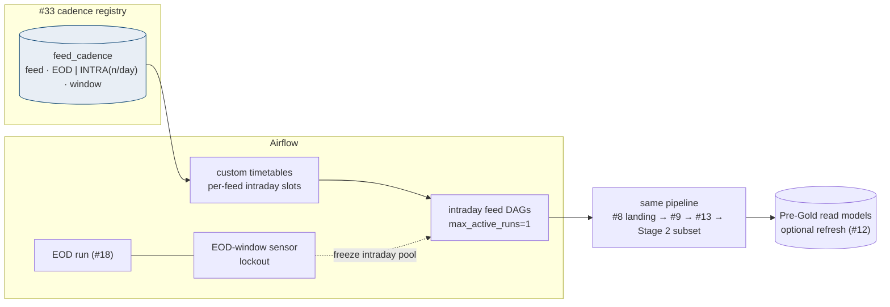
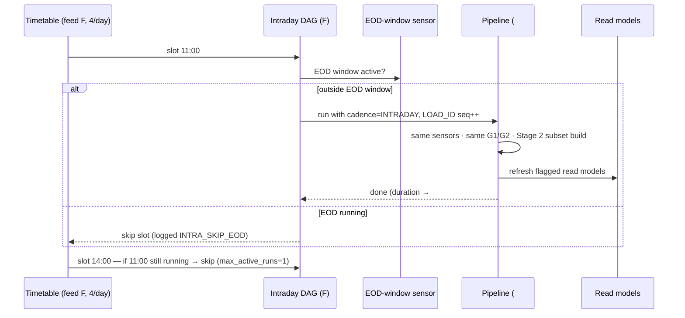

# Intraday Cadence Control — Design Document

## 1. Purpose & Scope
The scheduler-of-schedules for intraday: which feeds run more often than EOD, how often, how overlapping runs are prevented, and how intraday interacts with the EOD run and the real-time lane. Target state answers the open question with the division of labor already decided at #12 (AD-4): **true real-time = the API/gateway lane, never batch; intraday = config-driven mini-batches of the SAME pipeline** (same landing contract, same sensors, same gates), scheduled per feed from #33, with non-overlap and EOD-priority guarantees enforced by Airflow primitives rather than convention.

## 2. Context & Dependencies
- **Runs**: the standard ingest path (#8/#9/#13 → Stage 2 subset models) at intraday cadence for flagged feeds.
- **Coordinates with**: #18 (the DAG family it parameterizes), #19 (intraday builds draw from the same pools), #12 (what belongs on the API lane instead), #22 (intraday never publishes — see decision).
- **Config/telemetry**: #33 cadence registry; #34 cadence SLOs.

## 3. Design Decisions
| Decision | Choice | Rationale | Consequence |
|---|---|---|---|
| Frequency? Batch or API route? (open q) | **Per-feed config; latency < 15 min ⇒ API lane (#12); else mini-batch here** | A batch pipeline has a floor (arrival + gates); pretending otherwise rebuilds a worse gateway | The 15-min threshold is the routing rule of thumb written into #33 onboarding |
| Same pipeline or a parallel intraday one? | **Same pipeline, cadence token in filename + LOAD_ID** | Two pipelines = two gate implementations = divergence; SEI intraday extracts already follow the #8 contract | Intraday runs carry `INTRADAY` cadence through registry, gates, lineage |
| Overlap control | **`max_active_runs=1` per feed-DAG + dataset-triggered downstream** | An intraday run overtaking its predecessor corrupts latest-record logic | A slow run absorbs the next slot (skip, not queue-pile) — logged as an SLO event |
| Intraday vs EOD collision | **EOD window lockout: intraday pauses during the EOD run** | EOD owns the ceilings (#19 budget) and the business date close | Lockout = pool freeze via a window sensor; intraday resumes post-G4 |
| Does intraday publish to Final Gold? | **No — intraday refreshes Stage 2 (and optional Pre-Gold read models); publish stays EOD** | Publishing many times a day multiplies G4/G5 and consumer churn without a stated consumer need | If a consumer *needs* intraday Final Gold, that is an AD-5-adjacent ARB case (#22), not a default |

## 4a. Diagrams

## 4b. Flow Walkthrough
1. #33 cadence registry → per-feed rows compile into Airflow custom timetables → adding intraday to a feed is a row, not a DAG.
2. Slot fires → EOD-window check → intraday yields entirely during the close (ceilings + date semantics protected).
3. Run executes the *standard* path with `cadence=INTRADAY`: #8 filename token, #9 manifest sensor, #13 load, G1/G2, Stage 2 subset models (selector from registry).
4. Latest-record logic in Stage 2 absorbs the new snapshot bitemporally (AD-2) — intraday is more versions, not different semantics.
5. Optional read-model refresh gives #12's API lane fresher batch-context data — the sanctioned meeting point of the two lanes.
6. Overlap → next slot skips with a logged event; repeated skips breach the cadence SLO (#34) → capacity or cadence conversation, with evidence.

## 4c. Detailed Design
**Registry (#33)**: `feed_cadence(feed_id, cadence EOD|INTRA, runs_per_day, window_start, window_end, stage2_selector, refresh_readmodels Y/N, sla_minutes)`.
**Timetable**: one custom timetable class reading the registry (cached per scheduler heartbeat) → slots inside the window, spaced evenly; DAG factory in #18 emits `intra_<feed>` DAGs only for INTRA rows.
**EOD lockout**: EOD DAG sets a `eod_window` dataset/flag at start, clears post-G4; intraday DAGs gate on it (skip, not wait — waiting piles work into the close).
**LOAD_ID**: `<feed>_<business_date>_I<seq>` — intraday loads are first-class registry citizens; EOD's final load supersedes as latest.
**SLO events**: INTRA_SKIP_EOD (expected), INTRA_SKIP_OVERLAP (capacity smell), INTRA_LATE (duration > sla_minutes) → #34.
**External contract**: SEI intraday extract availability/windows per feed (#5) — cadence rows cannot exceed what SEI delivers.

## 5. Data Quality, Reconciliation & Lineage
Intraday runs pass the same G1/G2; G3 runs on the Stage 2 subset build. No G4/G5 (no publish). Reconciliation nuance: intraday snapshots may legitimately differ from EOD (positions move) — recon compares *within* cadence, never across. Lineage: every intraday LOAD_ID visible in the registry timeline, so "which snapshot did the 14:00 read-model refresh serve" is answerable (#31).

## 6. RECOMMENDATION
**6.1** Config-driven intraday mini-batches of the standard pipeline with hard non-overlap and EOD lockout; sub-15-minute latency needs route to the API lane; publish remains EOD-only.
**6.2**
| Option | Description | Pros | Cons | Fit |
|---|---|---|---|---|
| A. Same-pipeline mini-batches + lockout (recommended) | As designed | One set of gates/contracts; cadence is config; lanes stay honest to AD-4 | Latency floor ≈ arrival + gates (~15 min class) | **High** |
| B. Dedicated streaming/CDC intraday path | GoldenGate/CDC into Stage 2 | Minutes-level latency in batch context | New platform through air-gap governance; dual-write semantics vs AD-2; #66 already scopes CDC as only-if-intraday-requires — no requirer yet | Medium — the documented escalation if A's floor fails a real consumer |
| C. Continuous micro-batching (every 5 min all feeds) | Cron-dense schedule | Uniform | Ceilings burned on unchanged feeds; sensor churn; EOD contention daily | Low |
**6.3** > **Recommended: Option A.** Its honesty is the feature: batch has a latency floor, so the design routes anything under that floor to the lane built for it (#12) instead of torturing the pipeline — and everything above the floor gets intraday freshness at the cost of a registry row. The lockout and skip semantics encode the two priorities that must never invert: the EOD close outranks intraday, and a feed's runs never overlap. Measurements that must hold: intraday duration SLO per feed, INTRA_SKIP_OVERLAP rate ≈ 0 in steady state, zero intraday activity inside the EOD window, and read-model freshness matching the promised cadence.
**6.4** Tier note: intraday touches Stage 1/2 (+ optional Exadata read-model refresh); Final Gold untouched — keeping AD-9's gate singular at EOD. AD-2 makes multi-snapshot days natural. Interaction with open AD-5 (#22): any future "intraday publish" request lands there.

## 7. Failure, Replay & Idempotency
A failed intraday run is *disposable*: the next slot or EOD supersedes it — retry once, then skip (no daytime paging storms for a snapshot EOD will replace). Replay of an intraday LOAD_ID is supported but rare (#21); EOD replay ignores intraday history (latest-record semantics do the right thing).

## 8. Security & Access Control
No new surfaces: same pipeline identities; cadence registry writes are #33-governed and audited. Read-model refresh uses the #16 grant path.

## 9. Open Questions & Risks
- Which feeds actually need intraday, at what n/day — consumer-driven inventory; owner: TBD; the registry ships empty of INTRA rows until stated.
- SEI intraday extract windows per feed (#5 contract) — owner: TBD.
- Risk: intraday Stage 2 subset diverging from EOD full-build behavior → the subset selector is derived from the same dbt graph (`--select +readmodel_inputs`), never hand-listed.
- Risk: skip-on-overlap masking a chronic capacity gap → SLO trend review monthly with #19's telemetry.

## 10. Acceptance Criteria
- [ ] Cadence row → DAG appears next scheduler cycle; removal retires it (no orphan runs).
- [ ] Overlap injection (slow run) → next slot skips with INTRA_SKIP_OVERLAP; no concurrent same-feed runs ever observed.
- [ ] EOD lockout drill: intraday slots during a forced EOD window all skip; resume post-G4.
- [ ] Intraday LOAD_IDs bitemporally ordered; EOD supersedes as latest in Stage 2 queries.
- [ ] Read-model freshness matches cadence promise across a full test day.
- [ ] The 15-minute routing rule documented in consumer onboarding (#12/#33).
