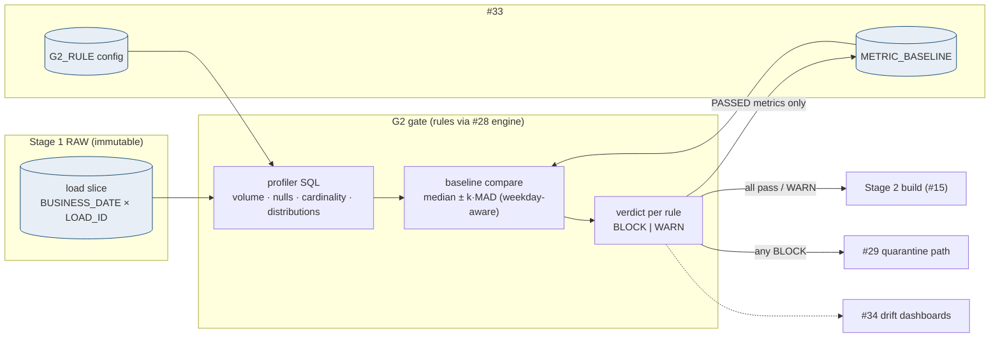
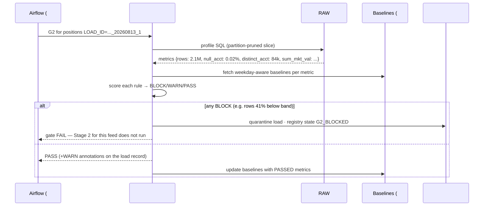

# G2 RAW Profiling Gate — Design Document

## 1. Purpose & Scope
The statistical sanity gate: after G1 (#23) proves a file is structurally whole, G2 asks whether the *data inside it is plausible* — row volumes, null rates, key cardinality, amount distributions, category mixes — before Stage 2 spends compute on it and before subtle upstream defects (a truncated SEI query, a mis-joined extract, a currency flip) propagate wearing valid structure. Target state resolves the open question: **thresholds are relative to trailing baselines by default** (per feed × metric, seasonally aware), with absolute floors as the backstop — because "3.2M rows" means nothing, while "41% below the 20-day median for a Tuesday" means everything. Verdicts are BLOCK / WARN per rule, executed by the #28 DQ Framework's engine against RAW.

## 2. Context & Dependencies
- **Upstream**: #13/#14 (profiles run on the just-loaded RAW slice, read-only — AD-8 untouched), #23 G1 (G2 runs only on structurally-passed loads).
- **Engine**: #28 DQ Framework executes rule configs; this document owns the G2 rule *catalog and baseline model*, not the engine.
- **Config/telemetry**: #33 (rules, baselines, exemptions), #34 (verdict events, drift dashboards).

## 3. Design Decisions
| Decision | Choice | Rationale | Consequence |
|---|---|---|---|
| Absolute or trailing-average thresholds? (open q) | **Trailing baseline default (median ± MAD bands over 20 obs, same-weekday aware) + absolute floors as backstop** | Feeds breathe with the calendar; absolutes rot into alarm fatigue or blindness within a quarter | Baselines need a warm-up window — first 20 days run WARN-only per feed (cold-start rule) |
| Verdict granularity | **Per rule: BLOCK or WARN, declared in config** | Volume collapse ≠ a category mix drifting 2 points; one severity for both is wrong twice | BLOCK quarantines the load (#29 path); WARN annotates and proceeds |
| Where profiles compute | **SQL against RAW in-place (partition-pruned by BUSINESS_DATE + LOAD_ID)** | RAW is immutable and partitioned for exactly this; extracting to profile is wasted movement | Profile queries carry the #19 budget tag; heavy percentile metrics sampled beyond 10M rows |
| Baseline poisoning | **Only PASSED loads update baselines; replays flagged; manual exclusions supported** | A bad day absorbed into the baseline normalizes the defect | Baseline update is a post-verdict step, never inline |
| New-feed / schema-change behavior | **Cold-start WARN-only; schema-change resets affected metric baselines with a WARN-window** | Blocking on a baseline that does not exist yet is theater | Reset events ledgered (#33) so drift charts show the discontinuity honestly |

## 4a. Diagrams



## 4b. Flow Walkthrough
1. G1-passed load → G2 task (per feed, inside the #18 task group) invokes the #28 engine with the G2 rule set.
2. Profiler SQL computes the metric vector on the RAW slice — read-only, partition-pruned, budget-tagged.
3. Each metric compares against its weekday-aware trailing band (median ± k·MAD; k per rule) and its absolute floor.
4. Any BLOCK rule → load quarantined via #29, registry state `G2_BLOCKED`, Stage 2 for that feed skips (its domain's completeness fact flows to #22).
5. PASS/WARN → proceed; WARNs ride the load record and surface on #34 drift charts — the early-warning layer BLOCKs graduate from.
6. Baselines update from PASSED loads only; replays (#21) marked so a replayed date does not double-count.
7. Threshold tuning = #33 config with change history — a governed dial, not a code deploy.

## 4c. Detailed Design
**Rule config (#33)**
```sql
CREATE TABLE g2_rule (
  rule_id       VARCHAR2(30) PRIMARY KEY,   -- POS_ROWCOUNT, POS_NULL_ACCT...
  feed_id       VARCHAR2(20) NOT NULL,
  metric        VARCHAR2(30) NOT NULL,      -- ROWCOUNT/NULL_RATE(col)/NDV(col)/SUM(col)/MIX(col)
  metric_arg    VARCHAR2(60),
  mode          VARCHAR2(8)  NOT NULL,      -- BASELINE | ABSOLUTE
  k_mad         NUMBER DEFAULT 4,           -- band width for BASELINE
  floor_val     NUMBER,                     -- ABSOLUTE / backstop
  severity      VARCHAR2(6)  NOT NULL,      -- BLOCK | WARN
  active_flag   CHAR(1) DEFAULT 'Y'
);
CREATE TABLE metric_baseline (
  feed_id VARCHAR2(20), metric VARCHAR2(30), metric_arg VARCHAR2(60),
  weekday NUMBER(1), median_val NUMBER, mad_val NUMBER,
  obs_count NUMBER, updated_at TIMESTAMP,
  CONSTRAINT pk_mb PRIMARY KEY (feed_id, metric, metric_arg, weekday)
);
```
**Starter catalog per feed (defaults, tuned per domain)**: ROWCOUNT (BLOCK, k=4), NULL_RATE on business keys (BLOCK, floor 0.5%), NDV on account/instrument keys (WARN, k=4), SUM on primary amount (WARN, k=5 — legitimate market moves), MIX on record-type distribution (WARN, k=4). Month-end/quarter-end: calendar-tagged observations form their own baseline population (from #33 business calendar) — the seasonality answer beyond weekday.
**Sampling**: metrics needing sorts (percentiles) use SAMPLE(10) beyond 10M rows; counts/sums always exact.
**Verdict record**: engine writes per-rule outcomes to #28's dq_result store keyed by LOAD_ID + rule_id — G2 shares the framework's evidence schema, no private tables.

## 5. Data Quality, Reconciliation & Lineage
G2 *is* the DQ layer for statistical plausibility; its recon duty is honesty about baseline provenance — every baseline row traces to the LOAD_IDs that formed it (obs ledger), so an auditor can ask "why did this pass" and receive the band, the observations behind it, and the calendar tag. Verdicts join the load's lineage (#31): file → G1 → G2 metrics+verdict → Stage 2.

## 6. RECOMMENDATION
**6.1** Baseline-relative profiling (weekday- and calendar-aware median±MAD bands, PASSED-only updates) with absolute floors as backstop, per-rule BLOCK/WARN severity, executed by the shared #28 engine against immutable RAW.
**6.2**
| Option | Description | Pros | Cons | Fit |
|---|---|---|---|---|
| A. Trailing baselines + floors (recommended) | As designed | Self-calibrating per feed; seasonal honesty; catches the "valid-but-wrong" class G1 cannot | Warm-up window; baseline hygiene discipline | **High** |
| B. Absolute thresholds only | Hand-set numbers per feed | Simple to reason about day one | 30 feeds × N metrics of numbers that rot; alarm fatigue or blindness — the industry's most-failed DQ pattern | Low |
| C. ML anomaly detection | Model-based outlier scoring | Catches multivariate weirdness | Unexplainable verdicts in a regulated gate; training/serving infra in an air-gap; tuning opacity | Low now — a WARN-only overlay candidate in year 2 |
**6.3** > **Recommended: Option A.** The gate's job is to catch the defect class that wears valid structure — the 40%-short extract, the null-flood, the currency flip — and only a memory of normal can do that. Median±MAD is deliberately boring: robust to outliers, explainable in one sentence to an auditor ("outside 4 deviations of the same-weekday norm"), and tunable per rule without touching code. Floors keep catastrophic collapse caught even during warm-up. The discipline that matters is baseline hygiene — PASSED-only updates and ledgered resets — because a poisoned baseline is worse than none. Measurements that must hold: BLOCK precision (quarantines confirmed as real defects) trending high, WARN-to-BLOCK graduation reviewed monthly, zero Stage 2 builds on G2_BLOCKED loads.
**6.4** Tier: reads RAW only (AD-8 intact — profiling never mutates); verdicts feed AD-9's chain (G2 BLOCK ⇒ nothing downstream builds). No open-AD dependencies.

## 7. Failure, Replay & Idempotency
Engine failure → gate fails closed (no verdict, no Stage 2 for that feed; #22 sees the domain incomplete). Re-running G2 on the same LOAD_ID is idempotent (verdict upsert; baselines guard against double-count via obs ledger). Replayed loads (#21) evaluate against baselines *as-of* their original date class and never update history.

## 8. Security & Access Control
Profiler reads RAW under the DQ service role (SELECT only); metric outputs are aggregates — no row-level client data leaves the database into logs (a deliberate rule: distributions yes, values no). Config changes via #33 governance, audited (#31).

## 9. Open Questions & Risks
- Metric starter set per domain needs a pass with Hema's DQ inventory — owner: TBD.
- Business calendar source for seasonal tagging (#33) — confirm the golden calendar; owner: TBD.
- Risk: MAD≈0 on ultra-stable metrics makes bands razor-thin → minimum band width parameter (band_floor) per rule.
- Risk: correlated multi-feed defects (SEI-side) pass individually — a cross-feed WARN roll-up ("4 feeds low on the same day") is a #34 dashboard rule, logged here as a v2 candidate.

## 10. Acceptance Criteria
- [ ] Injected 40% volume drop → BLOCK, quarantine, Stage 2 skip, #22 completeness fact recorded.
- [ ] Injected null-flood on a key column → BLOCK via floor even in cold-start.
- [ ] Legitimate month-end spike → PASS under calendar-tagged baseline (no false BLOCK).
- [ ] Baseline poisoning test: BLOCKed load provably absent from subsequent bands.
- [ ] Cold-start feed runs WARN-only for its warm-up window, then auto-arms.
- [ ] Threshold change is a #33 row with history; no deploy involved.
