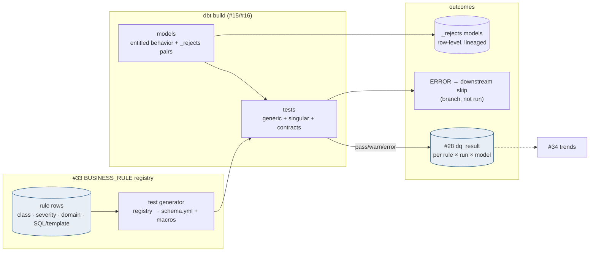
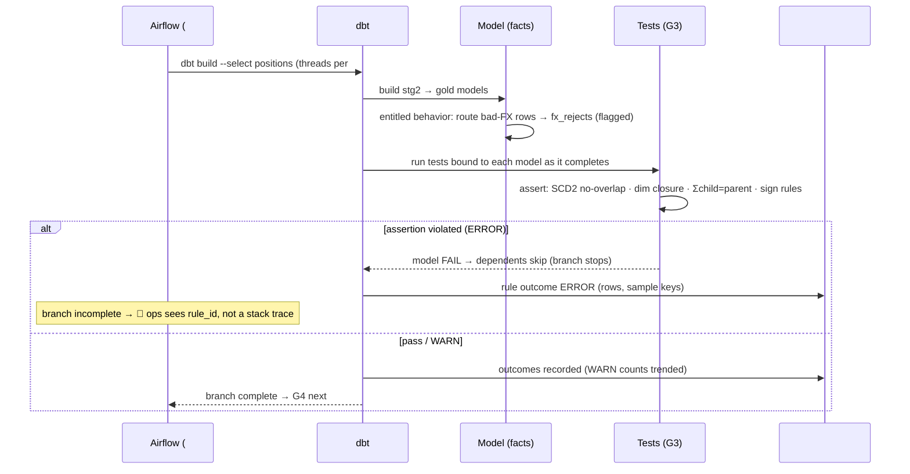

# G3 dbt Tests + Business Rules — Design Document

## 1. Purpose & Scope
The transformation-correctness gate: prove that what Stage 2 (#15) and Gold (#16) *built* obeys the rules the business would state — referential closure, SCD2 integrity, sign conventions, derivation math, domain invariants — at the only moment it can be cheap: **inside the dbt build itself**. Target state resolves the open question with a bright line: **assertions are dbt tests; entitled behavior is model logic** — a rule that says "reject/flag rows like X" belongs in models (producing inspectable outcomes); a rule that says "this must never be true of the result" belongs in tests (failing the build). Severity is two-tier (ERROR fails the model's downstream, WARN records), results flow into the shared #28 evidence store, and the rule catalog is governed in #33 so business rules are a registry, not folklore in SQL.

## 2. Context & Dependencies
- **Executes inside**: #15 and #16 dbt builds (Oracle + Exadata) under #19's budgets.
- **Interplay**: #17 correction semantics (bitemporal invariants are G3 tests), #24 G2 (statistical vs logical division), #26 G4 (aggregates; G3 owns row-level truth), #28 (evidence store + severity conventions), #33 (rule registry), #34 (trend surfacing).

## 3. Design Decisions
| Decision | Choice | Rationale | Consequence |
|---|---|---|---|
| Which rules are tests vs model logic? (open q) | **Assertions → tests; entitled behavior → models; the discriminator: "can a row legitimately violate this and continue, flagged?" yes→model, no→test** | Tests that encode tolerated exceptions get muted; models that hide invariants get trusted | Every registry rule carries its classification; reviewers apply the discriminator, not taste |
| Test failure semantics | **ERROR = dependent models skip (dbt native), date continues for unaffected branches; WARN = record + proceed** | AD-9 needs bad branches stopped, not whole-run theatrics | Domain isolation preserved (#18/#19); #22 sees the branch incomplete |
| Where do rejected rows go? | **Model-logic rejects → `_rejects` companion models (inspectable, lineaged), never silent filters** | A WHERE clause that drops rows is invisible data loss | Every filtering model has a paired rejects model; cp-guardrails checks the pairing |
| Rule source of truth | **#33 BUSINESS_RULE registry generates test YAML/macros for registry-born rules; hand-written tests allowed but registered** | 42-and-growing rules across 9 domains cannot live only in scattered YAML | A generator produces `schema.yml` test blocks from registry rows; drift check in CI |
| Contract enforcement | **dbt model contracts ON for Gold-layer models** | Column types/nullability locked at the layer consumers' facades sit on | Schema evolution becomes explicit contract changes (#33 versioned) |

## 4a. Diagrams



## 4b. Flow Walkthrough
1. Registry rules → generator emits test blocks/macros at build-prep → the catalog and the executed tests cannot drift (CI diff).
2. Models run under #19 ordering; **entitled behavior executes in-model**: rows failing tolerated conditions route to `_rejects` pairs with reason codes — visible, countable, replayable.
3. Tests bind per model and run as each completes → failure localizes to the model, dependents skip, sibling domains proceed.
4. Canonical G3 assertion families: **SCD2 integrity** (no overlapping validity, exactly one current per key — the AD-2 invariants as executable truth), **referential closure** (fact keys resolve to same-run dims — #19's ordering proven as data), **derivation math** (Σ lot-level = position-level; recomputed fields match), **sign/domain invariants** (per registry), **contract conformance** (Gold layer).
5. Outcomes → #28's dq_result with rule_id, rows affected, sample keys → one evidence schema across G1–G5.
6. WARN trends on #34 graduate to ERROR by registry edit — severity is governance, not code.
7. Rejects feed the correction/exception workflow: high reject counts are themselves a WARN-rule input.

## 4c. Detailed Design
**Registry (#33)**
```sql
CREATE TABLE business_rule (
  rule_id      VARCHAR2(30) PRIMARY KEY,    -- POS_SCD2_NO_OVERLAP...
  domain       VARCHAR2(30) NOT NULL,
  rule_class   VARCHAR2(10) NOT NULL,       -- TEST | MODEL
  layer        VARCHAR2(10) NOT NULL,       -- STAGE2 | GOLD
  severity     VARCHAR2(6),                 -- ERROR | WARN (TEST class)
  template     VARCHAR2(40),                -- generic test name or macro ref
  rule_sql     CLOB,                        -- singular test body / model predicate
  description  VARCHAR2(400) NOT NULL,      -- the business sentence
  owner_group  VARCHAR2(40),
  active_flag  CHAR(1) DEFAULT 'Y', version NUMBER DEFAULT 1
);
```
**Generator**: registry TEST rows → `schema.yml` entries (generic templates: `no_overlap`, `single_current`, `sum_reconciles(parent, child, key, col)`, `resolves_to(dim)`) or singular test files from rule_sql; MODEL rows → documented predicates the paired model/rejects implement (generator emits the rejects-model skeleton).
**_rejects contract**: `<model>_rejects(reason_code, load_id, business_date, <keys>, offending_payload_ref)` — retention per #29's policy; counts exposed as a metric.
**Store**: dbt `on-run-end` hook parses `run_results.json` → #28 dq_result rows (rule_id join via test naming convention `g3__<rule_id>`).
**Sampling in evidence**: ERROR outcomes persist up to 100 sample keys, never full payloads (classification rule shared with #24).

## 5. Data Quality, Reconciliation & Lineage
G3 completes the gate ladder's middle: G1 structure, G2 plausibility, **G3 logical truth**, G4 aggregate conservation, G5 arrival. Its lineage duty is dual: every outcome joins run × model × rule (#31), and every *reject* is row-lineaged (load_id + keys) so "why is this account short one lot" ends at a reason code, not a shrug. The registry's description field is the business-language layer — the same sentence the ARB reads and the test executes.

## 6. RECOMMENDATION
**6.1** A governed rule registry with a bright classification line — assertions as dbt tests (ERROR skips the branch), entitled behavior as model logic with mandatory `_rejects` pairs — generated into the builds, evidenced in the shared #28 store, with contracts locking the Gold layer.
**6.2**
| Option | Description | Pros | Cons | Fit |
|---|---|---|---|---|
| A. Registry-generated tests + rejects-paired models (recommended) | As designed | Rules governable + executable from one truth; failures localized; data loss impossible-by-silence; audit reads business sentences | Generator + pairing guardrail to build; discriminator discipline in review | **High** |
| B. Hand-written YAML tests only | Conventional dbt testing | Zero new machinery | 9-domain rule sprawl untracked; severity drift; tolerated-exception tests get muted — the classification problem unsolved | Medium — the day-one floor A grows from |
| C. External rule engine post-build | #28 runs all G3 SQL after dbt | One engine for all gates | Loses in-build localization (whole build "passes" then flunks); doubles the SQL surface dbt already has; skips dbt-native contracts | Low for G3 (right for G2/G4 where no build exists) |
**6.3** > **Recommended: Option A.** The discriminator is the design's core: rules that tolerate exceptions must produce *visible* exceptions (rejects with reasons), and rules that tolerate nothing must *stop the line* — collapsing the two is how DQ regimes decay into muted tests and silent filters. Putting the catalog in #33 makes rules reviewable in business language and generated into execution, so the ARB-approved sentence and the running assertion are provably the same thing. Costs: the generator and the pairing guardrail, plus review discipline — all cheaper than one silent filter found by a client. Measurements that must hold: registry↔executed-test drift = 0 (CI), zero unpaired filtering models, ERROR localization verified (sibling domains complete when one branch fails), WARN graduation reviewed monthly.
**6.4** Runs inside Stage 2/Gold builds on both databases under #19 budgets; AD-2's invariants are its canonical tests; AD-9's chain: G3 ERROR ⇒ branch never reaches G4. No open-AD dependencies.

## 7. Failure, Replay & Idempotency
Test infrastructure failure (not rule failure) fails the build fail-closed. Replays (#21) re-run G3 identically; results version by run with replay_id, so gate history distinguishes original vs replay verdicts. Rejects models rebuild deterministically from inputs (they are models — idempotent by dbt semantics).

## 8. Security & Access Control
Registry edits via #33 governance with owner_group sign-off (#32 roles); evidence sample keys exclude payload values; rejects models inherit source classification with masking on any non-prod copy. No new runtime identities — G3 rides the dbt service accounts.

## 9. Open Questions & Risks
- Initial rule harvest: Hema's DQ inventory + legacy RMJ validation logic mined into registry rows — owner: TBD; the migration's rule archaeology.
- Owner_group taxonomy (who signs which domain's rules) — governance; owner: TBD.
- Risk: sum_reconciles tests at scale on Exadata → written as aggregate-vs-aggregate SQL (Smart-Scan friendly), never row-explode joins.
- Risk: discriminator disputes ("is this entitled?") → tie-break rule recorded: if the business would want the row *seen*, it is MODEL+rejects; if the business would want the run *stopped*, TEST.

## 10. Acceptance Criteria
- [ ] Registry row → generated test executes next build; deactivation removes it (CI drift check green both ways).
- [ ] ERROR injection (overlapping SCD2 validity) → model fails, dependents skip, sibling domain completes, #22 fact recorded.
- [ ] Filtering-without-rejects model → cp-guardrails CI failure.
- [ ] Rejects rows carry reason + lineage; count surfaces as a WARN metric.
- [ ] Gold contract violation (type change) → build-time contract error, not runtime surprise.
- [ ] dq_result rows for a full run join rule registry with zero orphan test names.
