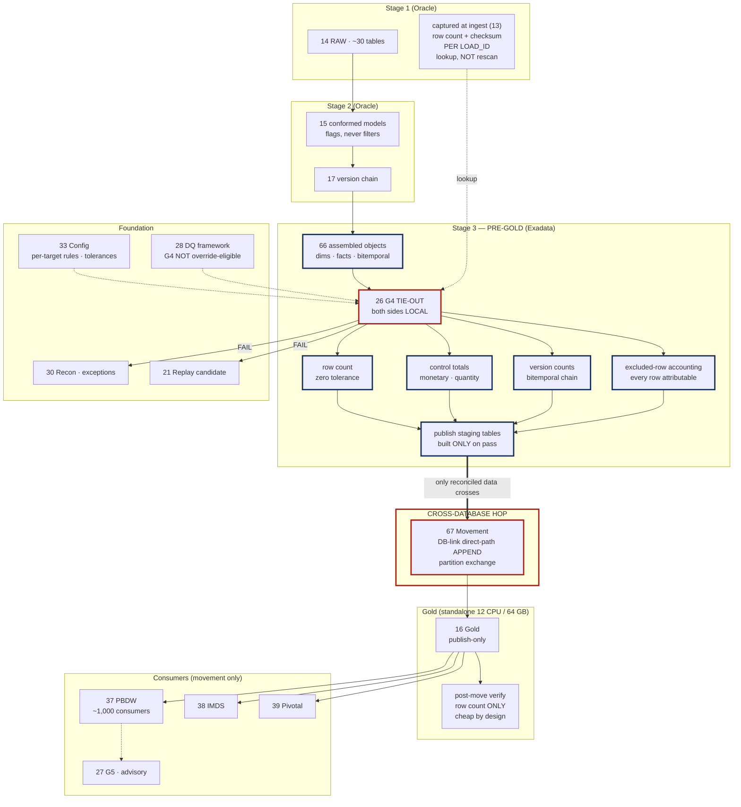

# G4 Tie-out / Control Totals — Design Document

## 1. Purpose & Scope

G4 is the last check before data leaves Exadata. It reconciles assembled Pre-Gold output back to Stage 1 RAW — row counts, control totals, version counts — per Gold target object, and blocks the cross-database movement into Gold if any target fails. Its single deliverable is a **per-target reconciliation rule set plus the blocking task that gates the publish**.

It is the gate that did not exist in either source deck. SEI v5 placed its only DQ step after the Gold load, where it stops nothing: by the time it fires, data is already in the consumer tier. G4 exists because a check that runs after the damage is a report, not a control.

**Tiers touched:** executes entirely on Stage 3 Exadata Pre-Gold. It gates the Exadata → Gold hop and therefore the consumer-movement tier, but performs no work there.

---

## 2. Context & Dependencies

| ID | Component | Why required |
|---|---|---|
| 66 | Pre-Gold | Host. G4 runs after assembly, before staging tables are handed to movement |
| 14 | Stage 1 RAW | One side of the reconciliation — via captured metadata, not a rescan |
| 13 | Ingestion framework | Supplies the per-`LOAD_ID` row counts and checksums captured at ingest |
| 17 | Correction handling | Version counts are part of the tie-out |
| 33 | Config store | Per-target rule sets, control-total definitions, tolerances |
| 28 | DQ framework | Severity, results store — and the override exclusion |
| 29, 30 | Error handling, recon | Error events and exception lifecycle |
| 31 | Audit & lineage | `LOAD_ID` chain is what makes the comparison possible |
| 67 | Movement | The component G4 gates |

### Downstream

- **67 Movement** — runs only if G4 passes for that target
- **21 Replay** — a G4 failure raises a replay candidate
- **35 Integration360** — tie-out breaks surface as exceptions

### Tier placement

```
  14 RAW (Oracle) ──▶ 15 Stage 2 (Oracle) ──▶ 66 Pre-Gold (Exadata)
     │  captured                                      │
     │  LOAD_ID counts ─────────────────────────────▶ │
     │  (lookup, not rescan)                          ▼
     │                                    ┌── 26 G4 TIE-OUT ──┐
     │                                    │  both sides LOCAL  │
     │                                    │  per target object │
     │                                    │  BLOCKING          │
     │                                    └────────┬───────────┘
     │                                       pass  │  fail
     │                                             ▼      ▼
     │                              67 CROSS-DB HOP    Gold holds
     │                              Exadata → Gold     prior partition
     │                                     ▼
     │                        Gold (standalone) ──▶ PBDW · IMDS · Pivotal
```

---

## 3. Design Decisions

**D1 · Which side of the hop does G4 run on?**
**Decision:** Exadata, before movement. Both sides of the comparison are local.
**Rationale:** A tie-out spanning two databases over a DB-link, inside the EOD window, is materially slower and introduces a failure mode — link unavailability — unrelated to data quality.
**Consequence:** What crosses to Gold is already reconciled. Component 67's post-move check reduces to a row-count verify, which is the right amount of work for a 12 CPU / 64 GB box.

**D2 · Rescan or captured metadata?**
**Decision:** Compare against per-`LOAD_ID` counts and checksums captured at ingest (13), not `COUNT(*)` over RAW.
**Rationale:** A rescan of RAW for ~30 feeds inside the EOD window is the difference between an affordable blocking gate and an unaffordable one. The count was already computed during G1's streaming pass.
**Consequence:** Correctness depends on the captured count being accurate — which is itself an acceptance criterion on component 13.

**D3 · Granularity — batch or per target?**
**Decision:** Per Gold target object, evaluated in parallel.
**Rationale:** A break in `FACT_FEE` should not block the publish of `DIM_ACCOUNT`. Per-target evaluation matches the per-target movement design in 67.
**Consequence:** Partial publish becomes possible, which interacts with **AD-5**. The default remains that a failure blocks only its own target's movement.

**D4 · Is G4 override-eligible?**
**Decision:** No. Excluded at the DQ framework service and enforced by a schema constraint.
**Rationale:** A tie-out break means Pre-Gold does not reconcile to RAW. Overriding publishes knowingly-unreconciled figures across the hop into Gold and onward to PBDW's ~1,000 consumers. No downstream control catches it.
**Consequence:** Requires explicit ARB ratification. If the business genuinely needs to publish, that is a decision recorded outside the pipeline.

**D5 · What is reconciled?**
**Decision:** Three classes — row counts, control totals on monetary and quantity measures, and version counts for bitemporal objects.
**Rationale:** Row count alone catches loss but not corruption. A control total catches a mis-scaled amount. Version counts catch a broken correction chain.
**Consequence:** Control totals must be defined per target with agreed tolerances; a floating-point sum needs a tolerance, an integer count does not.

**D6 · Tolerance policy.**
**Decision:** Zero tolerance on row and version counts. Configurable tolerance on monetary control totals, defaulting to exact.
**Rationale:** A row count is exactly right or wrong. A sum over `NUMBER` in Oracle is exact, but derived measures involving FX conversion may legitimately differ in the last place.
**Consequence:** Any non-zero tolerance must be justified per target and reviewed, not set as a convenience.

**D7 · What about filtered rows?**
**Decision:** G4 accounts for every RAW row: loaded, superseded, flagged, or legitimately excluded. Excluded rows must be attributable to a named rule.
**Rationale:** This is why Stage 2 flags rather than filters. A row silently dropped in Stage 2 makes G4 fail for a reason nobody can see.
**Consequence:** The reconciliation is a full accounting, not a simple equality — expected = loaded − superseded − rule-excluded.

---

## 4a. Diagrams

### (1) Component / architecture



### (2) Data flow / sequence

```mermaid
sequenceDiagram
  autonumber
  participant AF as 18 Airflow
  participant PG as 66 Pre-Gold (Exadata)
  participant G4 as 26 G4
  participant META as Ingest metadata (13/31)
  participant DQ as 28 DQ framework
  participant MV as 67 Movement
  participant GD as Gold (standalone)

  AF->>PG: assembly complete for target object
  AF->>G4: evaluate tie-out for this target (parallel per target)
  G4->>META: fetch captured row counts by LOAD_ID
  META-->>G4: counts + checksums (lookup, no RAW scan)
  G4->>PG: aggregate assembled rows — LOCAL to Exadata
  G4->>G4: row count · control totals · version counts
  G4->>G4: account for excluded rows — every row attributable to a rule
  G4->>DQ: persist results, resolve severity
  alt any target fails
    DQ-->>G4: no override possible — G4 excluded
    G4-->>AF: BLOCK this target
    Note over G4,GD: Gold retains its PRIOR partition.<br/>Nothing crosses the hop for this target.
    G4->>AF: raise exception (30) + replay candidate (21)
  else target passes
    G4->>PG: build publish staging table, partition-ready
    G4-->>AF: PASS
    AF->>MV: CROSS-DB HOP — DB-link direct-path APPEND
    MV->>GD: partition exchange, atomic swap
    MV->>MV: post-move verify — row count only
    GD-->>AF: published; release consumer extracts
  end
```

---

## 4b. Flow Walkthrough

1. **Airflow (18)** → Pre-Gold assembly complete for a target object → invokes G4 for that target, in parallel with other targets
2. **G4 (26)** → fetches captured row counts and checksums by `LOAD_ID` from ingest metadata (13, 31) → **a lookup, not a RAW scan**
3. **G4 (26)** → aggregates the assembled Pre-Gold rows → **local to Exadata, using Smart Scan and parallel query**
4. **Row count check** → expected = loaded − superseded − rule-excluded, per `LOAD_ID` → zero tolerance
5. **Control totals** → monetary and quantity sums against RAW-derived expectations → tolerance per target from config, defaulting to exact
6. **Version counts** → bitemporal chain length preserved from Stage 2 → catches a broken correction chain
7. **Excluded-row accounting** → every RAW row not present must be attributable to a named rule → an unattributable gap is a failure
8. **DQ framework (28)** → results persisted, severity resolved → **no override is possible; G4 is excluded at the service and by schema constraint**
9. **Any target fails** → that target is blocked. **Gold retains its prior partition.** Exception raised (30), replay candidate flagged (21)
10. **Target passes** → Pre-Gold builds the publish staging table, partition-ready, in Gold's exact DDL shape
11. **Movement (67)** → **CROSS-DATABASE HOP: Exadata → standalone Gold** → DB-link direct-path `APPEND`, then partition exchange
12. **Post-move verify** → row count only, against the Pre-Gold source count → **cheap by design, because the real reconciliation already happened**
13. **Consumer extracts** released → PBDW, IMDS Stage → IMDS, Pivotal → movement only
14. **G5 (27)** → advisory post-publish recon → alerts and may trigger replay; blocks nothing

---

## 4c. Detailed Design

### Reconciliation classes

| Class | Compares | Tolerance | Catches |
|---|---|---|---|
| Row count | Captured RAW counts by `LOAD_ID` vs assembled rows | **Zero** | Loss, duplication, join fan-out |
| Control total — monetary | Sum of amount measures | Per target, default exact | Mis-scaling, unit errors, FX misapplication |
| Control total — quantity | Sum of quantity measures | Per target, default exact | Sign errors, aggregation faults |
| Version count | Bitemporal chain length | **Zero** | Broken correction chain, lost versions |
| Distinct key count | Natural keys represented | **Zero** | Silent key collapse in dimensional assembly |
| Excluded-row accounting | Every RAW row attributable | **Zero unattributed** | Silent Stage 2 filtering |

### The accounting identity

```
  For each target object and business date:

    assembled_rows
  + superseded_rows          (redelivery, INGESTION_STATUS = 'SUPERSEDED')
  + rule_excluded_rows       (attributable to a NAMED rule, from DQ results)
  + orphan_parked_rows       (ORPHAN_CORRECTION, awaiting lookback)
  ─────────────────────────
  = captured_raw_rows        (per LOAD_ID, from ingest metadata)

  Any residual is a FAILURE. There is no "acceptable difference" bucket —
  an unexplained row is exactly the condition this gate exists to catch.
```

### Rule definition

```sql
-- config-driven per target. This is the shape, not a hand-written query.
-- Executes on EXADATA. Both operands local — no DB-link involved.

WITH expected AS (                         -- from captured metadata, NOT a RAW scan
  SELECT load_id, row_count, control_sum_amount
  FROM   HUB_INGEST_PROFILE
  WHERE  business_date = :bd
    AND  feed_id IN ( :feeds_for_target )
),
actual AS (                                -- local aggregate on Pre-Gold
  SELECT src_load_id AS load_id,
         COUNT(*)                    AS row_count,
         SUM(amount)                 AS control_sum_amount,
         COUNT(DISTINCT record_version) AS version_count
  FROM   PG_FACT_TRANSACTION
  WHERE  src_business_date = :bd
  GROUP  BY src_load_id
),
excluded AS (                              -- attributable exclusions only
  SELECT load_id, SUM(rows_affected) AS excluded_rows, LISTAGG(rule_id, ',') AS rules
  FROM   HUB_DQ_RESULT
  WHERE  business_date = :bd AND route = 'FLAG_ROW' AND outcome = 'FAIL'
  GROUP  BY load_id
)
SELECT e.load_id,
       e.row_count                                   AS expected_rows,
       NVL(a.row_count,0) + NVL(x.excluded_rows,0)   AS accounted_rows,
       e.row_count - (NVL(a.row_count,0) + NVL(x.excluded_rows,0)) AS residual,
       x.rules                                       AS exclusion_reasons
FROM   expected e
LEFT   JOIN actual   a ON a.load_id = e.load_id
LEFT   JOIN excluded x ON x.load_id = e.load_id
WHERE  e.row_count <> NVL(a.row_count,0) + NVL(x.excluded_rows,0);
-- any row returned = tie-out break
```

### Per-target rule sets

| Gold target | Row count | Control totals | Version count | Distinct key |
|---|---|---|---|---|
| `DIM_ACCOUNT` | ✔ | — | ✔ | ✔ account_id |
| `DIM_CLIENT` | ✔ | — | ✔ | ✔ client_id |
| `DIM_ASSET` | ✔ | — | ✔ | ✔ asset_id |
| `DIM_PORTFOLIO` | ✔ | — | ✔ | ✔ portfolio_id |
| `FACT_POSITION` | ✔ | quantity, market value | ✔ | ✔ account+asset |
| `FACT_TAXLOT` | ✔ | quantity, cost basis | ✔ | ✔ account+lot |
| `FACT_TRANSACTION` | ✔ | amount, quantity | ✔ | ✔ transaction_id |
| `FACT_FEE` | ✔ | fee amount | — | ✔ |
| `FACT_CASH` | ✔ | amount | — | ✔ |
| `FACT_STATEMENT` | ✔ | — | — | ✔ |

### Exadata execution characteristics

| Lever | Application |
|---|---|
| Smart Scan | Aggregations over assembled facts use direct-path reads; avoid index-driven plans |
| Parallel query | Degree per target from config, bounded by the Exadata parallel budget |
| Partition pruning | All aggregates filter on `SRC_BUSINESS_DATE` — the partition key |
| No DB-link | Both operands local (D1) — this is the design's main performance property |

### Config surface (33)

Per-target rule set · control-total column lists · tolerances per measure · parallel degree · which feeds contribute to which target · `override_eligible = false` (immutable).

---

## 5. Data Quality, Reconciliation & Lineage

G4 *is* reconciliation, so its relationship to the other gates matters more than its own checks:

| Gate | Relationship |
|---|---|
| G1 (23) | **Produces G4's expected values.** The row count captured during G1's streaming pass is one operand here. |
| G2 (24) | Upstream; must have passed |
| G3 (25) | Upstream; its `FLAG_ROW` results are the attributable exclusions in D7 |
| **G4** | **Blocks the cross-database hop. Not override-eligible.** |
| G5 (27) | Downstream, advisory. Verifies at consumer level what G4 verified at Gold level. |

**Lineage:** the tie-out is expressed per `LOAD_ID`, which is why the `LOAD_ID` chain must survive dimensional assembly in Pre-Gold. A break identifies the specific load and target, so replay can be scoped to exactly that — not to a whole business date.

---

## 6. RECOMMENDATION

### 6.1 Central design choice

**Where does G4 execute, and against what — a rescan of RAW after data reaches Gold, or captured ingest metadata compared locally on Exadata before the hop?**

### 6.2 Options comparison

| Option | Description | Pros | Cons | Fit to Oracle/Stage1-2 → Exadata/Gold → movement stack |
|---|---|---|---|---|
| **A · Post-publish recon on Gold** *(the SEI v5 position)* | Load Gold, then reconcile against RAW across the DB-link | Simplest to schedule — a job after the load, decoupled from the pipeline. No impact on the publish path's duration. | It stops nothing. By the time it fires, unreconciled data is in Gold and available to PBDW's ~1,000 consumers. Remediation is retraction, not prevention. The comparison also runs across a DB-link on a 12 CPU / 64 GB box with no Smart Scan — the worst place to do it. | Weak. This is the arrangement G4 was created to replace. It converts a control into a report. |
| **B · Rescan RAW from Exadata before the hop** | Pre-publish tie-out, but computing expected values by scanning RAW on the Stage 1/2 Oracle instance | Genuinely blocking, and independent of whether ingest metadata is correct — a true end-to-end recomputation. | A rescan of ~30 RAW tables inside the EOD window, across a database boundary from Exadata, for every business date. On the five large daily snapshots this is likely the single most expensive operation in the batch, and it makes the blocking gate the thing that breaks the window. | Weak on cost. Correct in principle, unaffordable in practice at this volume. |
| **C · Local comparison on Exadata against captured ingest metadata** *(recommended)* | Expected values from per-`LOAD_ID` counts and checksums captured during G1's pass; actual values aggregated locally on Pre-Gold; runs before movement | Blocking and before the hop, so Gold is protected. Both operands local to Exadata — Smart Scan and parallel query apply, no DB-link. Expected values cost nothing, having been computed during a pass that had to happen. Per-target granularity matches per-target movement. | Correctness depends on the captured count being right — if ingest miscounts, G4 validates against a wrong expectation. Requires the `LOAD_ID` chain to survive dimensional assembly, which constrains Pre-Gold's design. | Strong. Puts the check on the tier with the compute headroom, on the correct side of the hop, and keeps the 12 CPU / 64 GB Gold box doing only a cheap row-count verify. |

### 6.3 Recommendation

> **Recommended: Option C — local comparison on Exadata against captured ingest metadata, executed per target before the cross-database hop.**

Option C wins because it is the only option that is both blocking and affordable. Option A is where the source architecture placed this check and is the reason G4 exists as a new component: a reconciliation that fires after publish cannot prevent anything, and running it across a DB-link on the small Gold box is additionally the worst possible placement for the work. Option B is correct in principle — a genuine end-to-end recomputation — but a rescan of thirty RAW tables per business date, across a database boundary, on top of five daily full snapshots, will make the blocking gate itself the reason the EOD window is missed. Option C exploits the fact that the expected values were already computed once, during G1's streaming pass, and never need computing again.

**What it costs:** a dependency on the accuracy of the captured count. If ingest miscounts, G4 checks against a wrong expectation and passes something it should have blocked. That is an accepted, bounded risk — mitigated by making "captured count matches an independent `COUNT(*)` for every feed" an acceptance criterion on component 13, verified once at build rather than every night. It also constrains Pre-Gold: the `LOAD_ID` chain must survive SCD2 and fact assembly, including as a collection on aggregated facts.

**Tier placement:** execution on Stage 3 Exadata, immediately before the movement in component 67. That boundary is exactly right — it is the last point at which blocking is still cheap and the first point at which all the assembled output exists. Placing it after the hop would put a heavy aggregate workload on the tier least able to bear it and, more importantly, would mean the data it is checking has already reached the consumer tier.

**Must be confirmed for this to hold:**
1. **Ingest-captured counts verified against independent `COUNT(*)`** for all ~30 feeds — the correctness foundation of the whole approach.
2. **`LOAD_ID` preservation through dimensional assembly**, including the collection form on aggregated facts, confirmed in component 66.
3. **G4 duration measured on production-shaped volume** against the EOD window, with the Exadata parallel-degree budget agreed. If it does not fit, the correct response is to widen the window — not to demote the gate.
4. **ARB ratification of D4** — that G4 is not override-eligible.

### 6.4 Rules respected

- ✅ Tier boundary crisp — executes on Exadata Pre-Gold; gates but does not perform the movement
- ✅ Cross-database hop protected — only reconciled data crosses; post-move verify is a row count only
- ✅ **AD-9** — blocking, with the tie-out **before** Gold publish
- ✅ **AD-1** — protects the Hub-owned Gold and everything it publishes to
- ✅ **AD-2** — version counts are part of the reconciliation, so a broken correction chain is caught
- ✅ **AD-8** — reads captured metadata and Pre-Gold aggregates; never touches RAW rows
- ⚠️ **AD-5 contingent** — per-target granularity (D3) makes partial publish possible; the batch-level policy is decided in component 22

---

## 7. Failure, Replay & Idempotency

| Failure | Behaviour |
|---|---|
| Row-count break | Target blocked. Gold retains prior partition. Exception (30) + replay candidate (21). |
| Control-total break | Same. Usually indicates a scaling or FX fault rather than loss. |
| Version-count break | Same. Indicates the correction chain was damaged in assembly. |
| Unattributed exclusion | Same. This is the silent-filtering detector and the hardest failure to diagnose without D7's accounting. |
| Captured metadata missing for a `LOAD_ID` | **Fail.** A tie-out that cannot establish an expectation is not a pass. |
| Exadata unavailable (E6) | Retryable at the task level; the gate itself does not retry. |
| Override attempted | Refused at the DQ service and by schema constraint. |

**Replay (21):** a G4 break scopes the replay precisely — the failing `LOAD_ID` set and target object. Because RAW is append-only and Pre-Gold uses bitemporal append, the replay rebuilds only that target's staging partition and re-exchanges it into Gold. Other targets that passed are unaffected and stay published.

**Idempotency:** G4 is a pure aggregate comparison. Re-running over unchanged inputs gives an identical verdict. Results are append-only under a new `RUN_ID`, so the original break remains visible alongside the replayed pass.

---

## 8. Security & Access

- **Execution identity:** the Pre-Gold service account on Exadata, with `SELECT` on assembled objects and on the ingest metadata store. **No Gold access** — G4 deliberately cannot see or touch the target it protects.
- **Separation from movement:** the DB-link credential belongs to component 67's identity, not G4's. The gate and the thing it gates are held by different principals.
- **Results and breaks** carry business measures — control-total values are financial figures and the results store should be classified accordingly.
- **No override path** means no approval workflow to secure, which is itself a security simplification.
- **Audit:** every evaluation, pass or fail, recorded to the results store and to lineage (31) with the rule version in force.

---

## 9. Open Questions & Risks

| # | Question / risk | Owner | Blocks |
|---|---|---|---|
| 1 | **ARB ratification that G4 is not override-eligible** | ARB | D4; the central control decision of the DQ plane |
| 2 | Control-total definitions and tolerances per target | BBH finance + SEI | D5, D6; which measures are authoritative |
| 3 | Ingest-captured counts verified against independent `COUNT(*)` | Component 13 | Correctness foundation of option C |
| 4 | `LOAD_ID` preservation through assembly, including collections on aggregated facts | Component 66 | Whether per-`LOAD_ID` tie-out is possible at all |
| 5 | G4 duration on production volume vs EOD window | BBH ops + DBA | Feasibility; the answer must not be to demote the gate |
| 6 | Exadata parallel-degree budget | DBA | Aggregate performance per target |
| 7 | **AD-5** — does one target's break block the others? | ARB | D3; partial publish semantics for consumers |
| 8 | Are FX-derived measures in scope for control totals? | BBH finance | Tolerance policy; ties to the reference-data ownership gap |

---

## 10. Acceptance Criteria

**Design complete when:**

- [ ] Per-target rule sets defined for all Gold targets, with control-total column lists
- [ ] Tolerance policy agreed — zero on counts, justified per measure elsewhere
- [ ] The accounting identity (D7) agreed, including how orphan-parked rows are treated
- [ ] Captured-metadata contract confirmed with component 13
- [ ] `LOAD_ID` preservation through assembly confirmed with component 66
- [ ] Override exclusion ratified by ARB and enforced by schema constraint

**Build complete when:**

- [ ] G4 runs entirely on Exadata with **no DB-link** in the comparison — verified
- [ ] An injected row loss demonstrably blocks that target and **Gold retains its prior partition**, verified by query across the failure
- [ ] An injected control-total error is caught where the row count is unchanged
- [ ] A silently filtered row in Stage 2 is caught by the excluded-row accounting
- [ ] A G4 override attempt is refused at both the service and the schema
- [ ] One target's failure does not block a passing target's publish
- [ ] Replay scoped to the failing `LOAD_ID` set rebuilds only that target
- [ ] G4 completes within its share of the EOD window across all targets, measured on production-shaped volume
