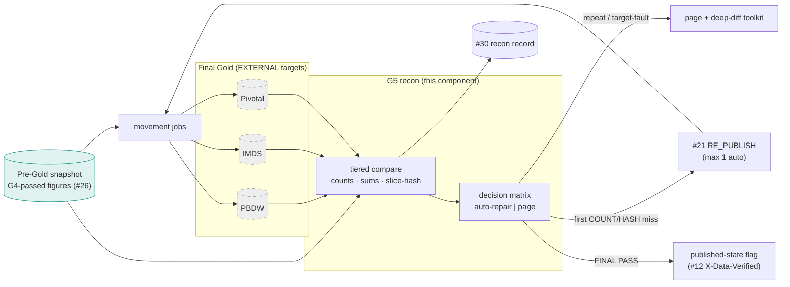
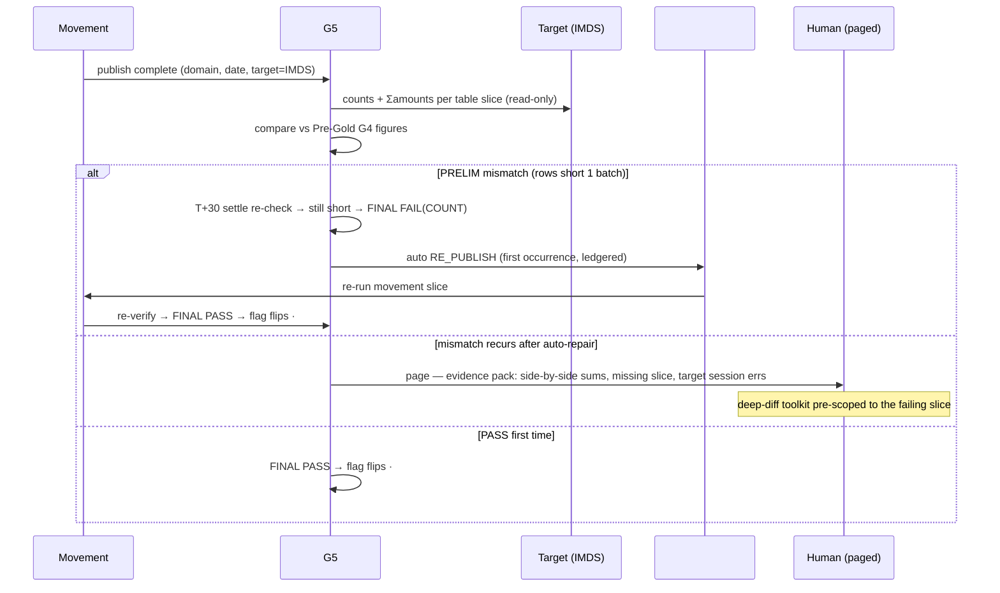

# G5 Post-Publish Recon — Design Document

## 1. Purpose & Scope
The arrival-proof gate: after movement publishes gate-passed Pre-Gold to Final Gold (PBDW, IMDS, Pivotal), G5 proves — per target, per domain, per date — that **what arrived equals what was sent**. Because publish is movement-only (AD-1: zero transformation in flight), any G5 discrepancy is by construction a *movement or target-side* fault, never a transformation question — which is what makes automated response safe. Target state resolves the open question with a decision matrix: **deterministic movement faults auto-trigger a #21 RE_PUBLISH; anything implicating target-side state or repeating after one auto-repair pages a human** — machines fix what machines broke, people investigate what they didn't.

## 2. Context & Dependencies
- **Verifies**: movement outputs of #16 (facade shapes) at each Final Gold target; baseline = the G4-passed Pre-Gold snapshot (#26's figures reused — same math, different sides).
- **Responds via**: #21 RE_PUBLISH (the fast path that exists for exactly this); **records into**: #30 Reconciliation Framework (G5 is a producer of recon evidence, #30 owns the cross-system record — AD-6 pending there).
- **Config/telemetry**: #33 target registry + expectations; #34 events and the publish-integrity dashboard.

## 3. Design Decisions
| Decision | Choice | Rationale | Consequence |
|---|---|---|---|
| What auto-triggers replay vs pages? (open q) | **Matrix: COUNT/HASH mismatch on first occurrence → auto RE_PUBLISH (max 1); recurrence, partial-visibility, or target-reachability faults → page** | First-pass movement faults (dropped batch, partial commit) are deterministic to repair; repeats or target weirdness mean an unknown — automation must not thrash | The one-auto-repair ceiling is absolute; every auto-repair is ledgered via #21 |
| Comparison depth | **Tiered: counts + control sums always; slice-hash per partition on amount-bearing tables; full row-hash only on demand** | Depth costs target-side compute you don't own; tiers catch 99% at 1% of the cost | On-demand deep diff is the paged human's tool, pre-built |
| Where comparison runs | **Hub-side orchestration; target queries via read-only recon accounts over DB links / target-approved endpoints** | The Hub owns the proof; targets own their compute windows | Recon query budget agreed per target (#33 expectations, external contract) |
| Timing | **Immediately post-movement per target + a T+30min settle re-check** | Some targets index/refresh async; instant-only produces false alarms, settle-only delays truth | Two-phase verdict: PRELIM → FINAL; only FINAL drives actions |
| Consumer-visible truth | **G5 FINAL PASS flips the interface's published-state flag consumers/#12 read** | "Published" should mean *verified arrived*, not *movement exited 0* | The flag is the API-layer's `X-Data-Verified` source |

## 4a. Diagrams

## 4b. Flow Walkthrough
1. Movement completion event per (domain, date, target) → G5 launches that target's compare; targets verify independently (IMDS lag never blocks PBDW truth).
2. Tier-1 compare: row counts + control sums per table against **#26's stored G4 figures** — one source of expected truth, no re-derivation drift.
3. Tier-2 on amount-bearing tables: ORA_HASH slice-hash per business-date partition — order-independent, cheap, locates *which slice* diverges.
4. PRELIM verdict → T+30 settle re-check absorbs async target refresh → FINAL verdict only then drives action.
5. Decision matrix: first deterministic mismatch → auto RE_PUBLISH via #21 (ledgered, max one); recurrence/reachability/partial-visibility → page with the evidence pack and the pre-scoped deep-diff.
6. FINAL PASS → published-state flag flips → #12 serves `X-Data-Verified: true`; consumers can key on verified, not merely moved.
7. Every verdict (clean, auto-repaired, paged) → #30's recon record with full figures — the cross-system evidence #30 aggregates under its AD-6 ownership question.

## 4c. Detailed Design
**Expectation reuse**: `g4_figures(domain, business_date, table_name, row_count, control_sums_json)` written by #26 at gate time — G5 reads, never recomputes Pre-Gold side (drift-proof by construction).
**Target registry (#33)**: `recon_target(target_id, table_map_json, access_route, settle_minutes, query_budget, deep_diff_allowed)` — per-target realities (IMDS settle 30, PBDW 10…) are config.
**Verdict store (#30 schema)**: `g5_result(business_date, domain, target_id, table_name, tier, expected, observed, verdict PRELIM_*|FINAL_PASS|FINAL_FAIL(class), action NONE|AUTO_REPUBLISH|PAGED, replay_id)`.
**Failure classes**: COUNT, SUM, HASH(slice), REACH (target unqueryable), PARTIAL (some tables visible, others not — classic mid-refresh; always settle-waits then pages, never auto-repairs).
**Deep-diff toolkit**: parameterized MINUS/row-hash comparison for one (table, slice) — human-invoked, budget-capped, output to the evidence pack.
**External contracts**: read-only recon accounts + query budgets per target owner; refresh/settle semantics per target documented in the registry.

## 5. Data Quality, Reconciliation & Lineage
G5 closes AD-9's promise end-to-end: gates guaranteed what *left*; G5 proves what *arrived* — and its zero-transformation premise (AD-1) is what keeps every discrepancy classifiable as movement/target. It is deliberately a **producer** into #30's framework rather than a private ledger, so business-level recon (#30's remit) and publish-integrity recon share one evidence spine. Lineage: date × domain × target × table → figures → verdict → action → (replay_id) — the complete "did the client system get the right data" chain (#31).

## 6. RECOMMENDATION
**6.1** Tiered Hub-side verification against stored G4 figures with a two-phase (settle-aware) verdict and a hard-bounded response matrix: one auto RE_PUBLISH for first deterministic movement faults, humans for everything else — recorded into #30's shared evidence spine and surfaced to consumers as verified-published state.
**6.2**
| Option | Description | Pros | Cons | Fit |
|---|---|---|---|---|
| A. Tiered + settle-aware + bounded auto-repair (recommended) | As designed | Self-heals the common fault in minutes; cannot thrash (max-1); false alarms absorbed by settle; consumer-visible verified state | Per-target contracts to negotiate; settle adds bounded latency to "verified" | **High** |
| B. Alert-only (no automation) | Every miss pages | No automation risk | 3 a.m. pages for dropped batches a machine repairs deterministically; verified-state latency = human latency | Medium — the fallback if a target forbids re-publish windows |
| C. Full row-hash always, all targets | Maximum depth every night | Nothing escapes | Target compute budgets blown nightly for defects tier-1/2 already catch; recon becomes the outage | Low |
| D. Trust movement exit codes | No G5 | Free | "Published" unverifiable; silent target-side loss undetected until a client calls — the incident class this gate exists to end | Prohibited |
**6.3** > **Recommended: Option A.** The design's leverage is the AD-1 premise: because nothing transforms in flight, a mismatch has exactly two suspects — movement or target — and the matrix assigns each to its right responder: deterministic movement faults to the machine (once), everything ambiguous to a human armed with a pre-scoped diff instead of a blank Splunk search. Reusing G4's stored figures removes the classic recon failure mode of two sides computing "expected" differently. Costs: per-target access/budget negotiation and the settle-window latency on the verified flag — both explicit, both config. Measurements that must hold: FINAL false-alarm rate ≈ 0 (settle doing its job), auto-repair success on first attempt trending high with recurrence-pages near zero, and 100% of publishes reaching a FINAL verdict (no silent unverified dates).
**6.4** Sits wholly at the Consumer-Movement boundary; AD-1/AD-9 are its premises; feeds #30 whose AD-6 (recon record ownership) is the adjacent open decision — G5's schema is written to slot under either AD-6 outcome.

## 7. Failure, Replay & Idempotency
G5 engine failure → publishes stand but *unverified*: flag stays down, #34 escalates (fail-visible, not fail-silent). Verdicts are idempotent upserts per (date, domain, target, table); re-running G5 is always safe. #21 RE_PUBLISH loops are impossible by the max-1 rule + ledger check; a replayed publish (#21-initiated for any reason) re-enters G5 as a fresh verification.

## 8. Security & Access Control
Recon accounts: SELECT-only, table-map-scoped, credentialed via #48, activity attributable per target (#31). Evidence packs contain aggregates and keys, never payload values (the shared classification rule). Deep-diff invocation restricted to the DQ ops role (#32) with per-run budget enforcement.

## 9. Open Questions & Risks
- Recon account + query-budget agreements with PBDW/IMDS/Pivotal owners — owner: TBD; blocks per-target activation.
- Settle windows per target: initial values are guesses to be measured — owner: TBD.
- Interaction with target-side maintenance windows (planned unreachability) → maintenance calendar in #33 suppresses REACH pages during declared windows.
- Risk: targets with consumer-side writes to the same tables (drift that is *their* change) → table_map marks Hub-authoritative tables only; anything else is #30's business-recon territory, not a G5 fault.

## 10. Acceptance Criteria
- [ ] Dropped-batch injection → FINAL FAIL(COUNT) → auto RE_PUBLISH → FINAL PASS, flag flips; total elapsed within SLA; #21 ledger shows the auto entry.
- [ ] Second injected miss same slice → page with evidence pack; no second auto-repair (max-1 proven).
- [ ] Async-refresh simulation → PRELIM mismatch, FINAL PASS after settle; zero false pages.
- [ ] REACH fault (target down) → page path, publishes marked unverified, #12 header reflects it.
- [ ] G5 outage drill → unverified escalation fires; nothing reports verified.
- [ ] #30 record present for 100% of publishes across a full test day, all three targets.
