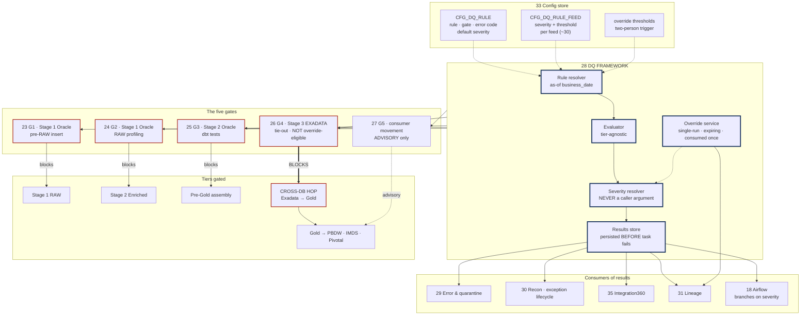
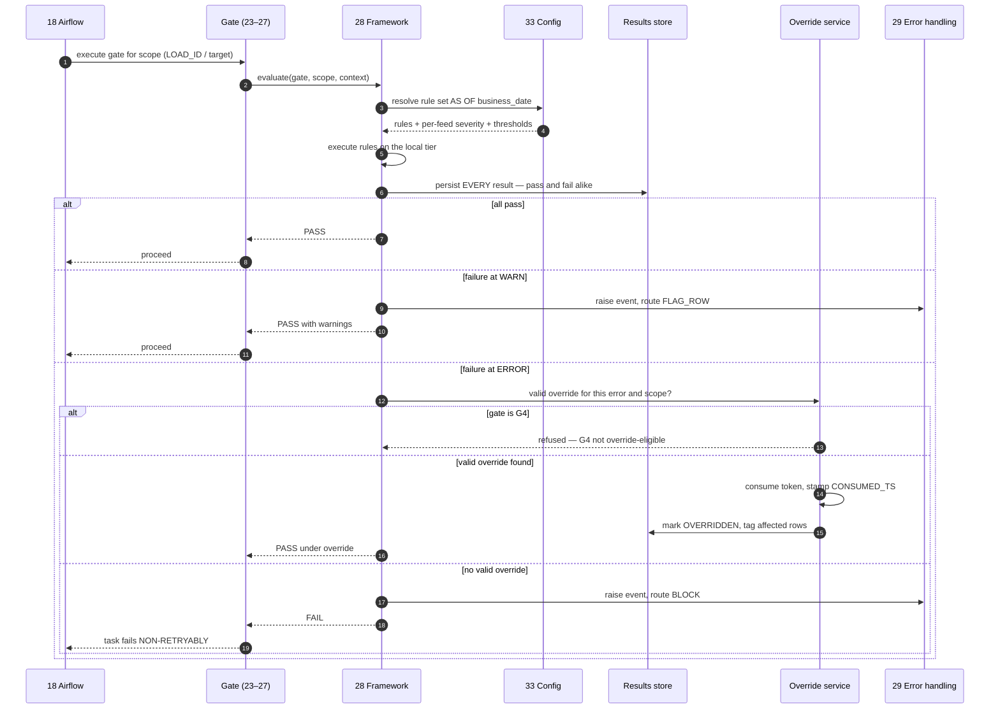

# DQ Framework — Design Document

## 1. Purpose & Scope

The DQ framework is the machinery all five gates run on: the rule registry, the severity model, the results store, and the override path. Its single deliverable is **one Python framework plus its Oracle schema** that makes G1 through G5 behave identically regardless of which tier they execute on — Stage 1 Oracle, Stage 2 Oracle, Stage 3 Exadata, or the consumer-movement verify.

It exists as a separate component because gates without a shared framework diverge. Five independently-built checks produce five error formats, five severity conventions and five override behaviours, and the operator cannot reason about any of them.

**Tiers touched:** all four. The framework is tier-agnostic by design — a rule executed against RAW on Oracle and a tie-out executed against Pre-Gold on Exadata produce the same result record with the same severity semantics.

---

## 2. Context & Dependencies

| ID | Component | Why required |
|---|---|---|
| 33 | Metadata & config store | Rule definitions, per-feed severities, thresholds, override thresholds |
| 29 | Error handling & quarantine | Receives error events raised by failing rules; owns quarantine |
| 30 | Reconciliation framework | Consumes tie-out results; owns exception lifecycle |
| 31 | Audit & lineage | Override records and rule-version-in-force are part of the evidence trail |
| 35 | Integration360 | Surfaces results and exceptions to operators |

### Downstream — the five gates

| ID | Gate | Tier |
|---|---|---|
| 23 | G1 file/structural | Stage 1 Oracle, pre-insert |
| 24 | G2 RAW profiling | Stage 1 Oracle |
| 25 | G3 dbt tests + rules | Stage 2 Oracle |
| 26 | G4 tie-out | Stage 3 Exadata Pre-Gold |
| 27 | G5 post-publish recon | Consumer movement, advisory |

### Tier placement

```
  ┌──────── 28 DQ FRAMEWORK — tier-agnostic ────────┐
  │  registry · severity · results · override        │
  └──┬──────────┬───────────┬───────────┬───────────┘
     ▼          ▼           ▼           ▼
  G1 · G2     G3         G4          G5
  Stage 1     Stage 2    Stage 3     Consumer
  Oracle      Oracle     Exadata     movement
  pre-RAW     dbt        Pre-Gold    post-publish
                         BLOCKS the
                         cross-DB hop
```

---

## 3. Design Decisions

**D1 · Is severity a caller argument?**
**Decision:** Never. Severity is resolved from the registry at evaluation time. The framework exposes no parameter for it.
**Rationale:** If a developer can pass `severity="warn"` at the call site, severity has left the registry and the config-driven design is decorative.
**Consequence:** Adjusting how hard a rule blocks is a config commit, reviewable and audited — not a code edit.

**D2 · How many severity tiers?**
**Decision:** Two — `ERROR` blocks, `WARN` logs and proceeds. No third tier.
**Rationale:** Three tiers invite an `INFO` level that nobody acts on and that hides real signal. Two forces a decision per rule per feed.
**Consequence:** Rules that "sometimes matter" must be split into two rules with different thresholds rather than given a middle severity.

**D3 · Per-rule or per-rule-per-feed severity?**
**Decision:** Per-rule-per-feed, with a rule-level default.
**Rationale:** A null tolerance sensible for Transaction Detail is wrong for Account. One severity across ~30 feeds guarantees over-blocking or under-blocking.
**Consequence:** More config rows, mitigated by inheritance from the default.

**D4 · Can Airflow read severity?**
**Decision:** Yes — severity and result are written to the results store before the task fails, and the `GateOperator` reads them to decide branching.
**Rationale:** A blocking gate must fail; a warning gate must proceed. If severity lives only inside a dbt test, Airflow cannot branch on it.
**Consequence:** Rule execution and task failure are separate steps. The result is always persisted, even when the task then fails.

**D5 · Is G4 override-eligible?**
**Decision:** No. G4 is excluded from the override path entirely.
**Rationale:** A tie-out break means Pre-Gold does not reconcile to RAW. Overriding it publishes knowingly-wrong data across the cross-database hop into Gold and onward to PBDW's ~1,000 consumers. If the business needs to publish anyway, that is a decision recorded outside the pipeline.
**Consequence:** Requires explicit ARB ratification rather than assumption.

**D6 · Override scope and lifetime.**
**Decision:** Single-run, scoped to a `LOAD_ID` or `BATCH_ID`, expiring after 60 minutes, consumed once.
**Rationale:** A standing exemption is a rule change and belongs in the registry. An unexpiring token can be replayed into a later run.
**Consequence:** An operator handling a recurring failure must either fix it or change the rule — the override cannot become the workaround.

**D7 · Two-person rule.**
**Decision:** Required above a configurable impact threshold — row count or value.
**Rationale:** Overriding a check on three rows and on three million are different acts.
**Consequence:** Threshold in config; the second approver must be a distinct identity, enforced by the framework.

**D8 · Rule results retention.**
**Decision:** Results retained 24 months minimum, independent of RAW retention.
**Rationale:** The operational history evidences control effectiveness to an auditor. It is a small table.
**Consequence:** Partitioned monthly, separate purge policy from RAW.

---

## 4a. Diagrams

### (1) Component / architecture



### (2) Data flow / sequence



---

## 4b. Flow Walkthrough

1. **Airflow (18)** → invokes a gate for a scope — a `LOAD_ID` for G1/G2, a model set for G3, a target object for G4
2. **Gate (23–27)** → calls the framework's evaluator with gate, scope and context
3. **Framework (28)** → resolves the rule set from config (33) **as of the business date** → rules, per-feed severities, thresholds
4. **Framework (28)** → executes rules on whichever tier it is running — Stage 1 Oracle, Stage 2 Oracle, Stage 3 Exadata, or the movement verify → **execution is tier-agnostic; the result record is identical**
5. **Framework (28)** → persists **every** result, pass and fail alike → this happens *before* any task failure, so Airflow can always read the outcome
6. **All pass** → gate returns PASS → pipeline proceeds
7. **Failure at `WARN`** → error event raised with route `FLAG_ROW` → gate returns PASS with warnings → pipeline proceeds
8. **Failure at `ERROR`** → framework checks the override service for a valid, unconsumed, unexpired token matching this error and scope
9. **Gate is G4** → override refused unconditionally → **the cross-database hop to Gold is blocked; Gold retains its prior partition**
10. **Valid override found** → token consumed, `CONSUMED_TS` stamped, affected rows tagged `OVERRIDDEN`, result marked → gate returns PASS under override
11. **No valid override** → error event raised with a BLOCK route → gate returns FAIL → **task fails non-retryably**, `retries=0`
12. **Results store** → feeds error handling (29), recon (30), Integration360 (35) and lineage (31) → one result format across all five gates and all four tiers

---

## 4c. Detailed Design

### Results store

```sql
CREATE TABLE HUB_DQ_RESULT (
  RESULT_ID       NUMBER(18) GENERATED ALWAYS AS IDENTITY,
  RUN_ID          VARCHAR2(120) NOT NULL,        -- Airflow dag_run_id
  BATCH_ID        VARCHAR2(40),
  GATE            VARCHAR2(4)   NOT NULL,        -- G1..G5
  TIER            VARCHAR2(24)  NOT NULL,        -- STAGE1 | STAGE2 | PREGOLD_EXADATA | MOVEMENT
  RULE_ID         VARCHAR2(40)  NOT NULL,
  RULE_VERSION_TS TIMESTAMP     NOT NULL,        -- which rule version was in force
  -- scope
  FEED_ID         VARCHAR2(40),
  DOMAIN          VARCHAR2(40),
  LOAD_ID         NUMBER(18),
  TARGET_OBJECT   VARCHAR2(60),                  -- for G4, per Gold target
  BUSINESS_DATE   DATE          NOT NULL,
  -- outcome
  OUTCOME         VARCHAR2(12)  NOT NULL,        -- PASS | FAIL | OVERRIDDEN
  SEVERITY        VARCHAR2(10)  NOT NULL,        -- ERROR | WARN  (resolved, never passed)
  ROUTE           VARCHAR2(20)  NOT NULL,
  EXPECTED_VALUE  VARCHAR2(200),
  ACTUAL_VALUE    VARCHAR2(200),
  ROWS_AFFECTED   NUMBER(12),
  ERROR_ID        NUMBER(18),                    -- FK HUB_ERROR_EVENT (29)
  OVERRIDE_ID     NUMBER(18),                    -- FK HUB_OVERRIDE
  DURATION_MS     NUMBER(12),
  CREATED_TS      TIMESTAMP DEFAULT SYSTIMESTAMP NOT NULL,
  CONSTRAINT PK_HUB_DQ_RESULT PRIMARY KEY (RESULT_ID)
)
PARTITION BY RANGE (CREATED_TS) INTERVAL (NUMTOYMINTERVAL(1,'MONTH'))
  (PARTITION P_INIT VALUES LESS THAN (TIMESTAMP '2026-01-01 00:00:00'));

CREATE INDEX IX_DQR_RUN   ON HUB_DQ_RESULT (RUN_ID, GATE);
CREATE INDEX IX_DQR_FAIL  ON HUB_DQ_RESULT (OUTCOME, SEVERITY, BUSINESS_DATE);
CREATE INDEX IX_DQR_RULE  ON HUB_DQ_RESULT (RULE_ID, FEED_ID, BUSINESS_DATE);
```

`TIER` is recorded so an operator can see immediately whether a failure occurred before or after the cross-database hop — the single most consequential thing to know when triaging.

### Override record

```sql
CREATE TABLE HUB_OVERRIDE (
  OVERRIDE_ID   NUMBER(18) GENERATED ALWAYS AS IDENTITY,
  ERROR_ID      NUMBER(18)    NOT NULL,
  GATE          VARCHAR2(4)   NOT NULL,
  SCOPE_TYPE    VARCHAR2(20)  NOT NULL,   -- LOAD | BATCH   (never DOMAIN, never STANDING)
  SCOPE_ID      VARCHAR2(40)  NOT NULL,
  BUSINESS_DATE DATE          NOT NULL,
  JUSTIFICATION VARCHAR2(2000) NOT NULL,  -- mandatory, minimum length enforced
  APPROVER_1    VARCHAR2(120) NOT NULL,
  APPROVER_2    VARCHAR2(120),            -- required above threshold, must differ
  GRANTED_TS    TIMESTAMP DEFAULT SYSTIMESTAMP NOT NULL,
  EXPIRES_TS    TIMESTAMP     NOT NULL,   -- default +60 minutes
  CONSUMED_TS   TIMESTAMP,                -- set when a gate actually uses it
  CONSTRAINT CK_OVR_SCOPE CHECK (SCOPE_TYPE IN ('LOAD','BATCH')),
  CONSTRAINT CK_OVR_GATE  CHECK (GATE <> 'G4')   -- D5 enforced in the schema
);
```

The `CHECK` on `GATE` puts D5 in the database rather than in application logic — a G4 override cannot be created even by a direct insert.

### Framework interface

```python
from hub_framework.dq import evaluate, GateContext

result = evaluate(
    gate="G4",
    scope=GateContext(load_ids=[...], target_object="DIM_ACCOUNT",
                      business_date=ds, tier="PREGOLD_EXADATA"),
)
# severity is NOT a parameter and cannot be passed.
# result is persisted before this call returns, pass or fail.

if result.blocked:
    raise NonRetryableHubError(result.error_id)
```

```python
# Airflow operator — used identically for all five gates
GateOperator(
    task_id="g4_tieout_dim_account",
    gate="G4",
    rule_set="tieout.dim_account",
    scope="{{ ti.xcom_pull('pregold_dim_account')['load_ids'] }}",
    override_eligible=False,      # ignored for G4 — refused at the service anyway
    retries=0,                    # enforced by the operator regardless of what is passed
)
```

### Rule types by gate

| Gate | Tier | Rule types | Executes as |
|---|---|---|---|
| G1 (23) | Stage 1 Oracle | Column count, delimiter, encoding, header, manifest count, checksum | Python, streaming |
| G2 (24) | Stage 1 Oracle | Null rate, cardinality, volume vs trailing average, date range | Aggregate SQL, pushed to DB |
| G3 (25) | Stage 2 Oracle | Uniqueness, referential integrity, accepted values, bitemporal consistency | dbt tests + singular tests |
| G4 (26) | **Stage 3 Exadata** | Row count vs captured `LOAD_ID` metadata, control totals, version-count preservation | SQL on Exadata, both sides local |
| G5 (27) | Consumer movement | Cross-system totals, consumer-visible consistency | SQL, advisory only |

### Severity resolution

```
  rule default (CFG_DQ_RULE.DEFAULT_SEVERITY)
        │
        ▼ overridden by
  per-feed severity (CFG_DQ_RULE_FEED.SEVERITY)
        │
        ▼ resolved AS OF business_date
  effective severity  →  ERROR blocks · WARN proceeds
```

No fourth source. In particular, no code path and no caller may contribute.

### Config surface (33)

Rule definitions per gate · default severity per rule · per-feed severity and threshold overrides · override expiry duration · two-person impact threshold · results retention.

---

## 5. Data Quality, Reconciliation & Lineage

This component *is* the DQ machinery, so its own controls are meta-level:

| Control | Behaviour |
|---|---|
| Rule coverage | Every active feed must have ≥1 G1 rule; a feed with none is reported by CI (33) |
| Result completeness | Every gate invocation must produce ≥1 result row; a gate that runs and writes nothing is itself an error |
| Rule version recorded | `RULE_VERSION_TS` on every result — proves which rule version was in force |
| Override audit | Every override written to lineage (31), not only to this store |
| Repeat-offender detection | Same `RULE_ID` + `FEED_ID` failing across N consecutive business dates → escalated as a design problem, not an incident |

**Lineage contribution:** the result set for a run establishes what was checked, under which rule versions, at which tier, with what outcome. Combined with the override records, this is the control-effectiveness evidence an auditor asks for.

---

## 6. RECOMMENDATION

### 6.1 Central design choice

**Where does severity live, and can a blocking gate be released at run time — and if so, under what constraints?**

### 6.2 Options comparison

| Option | Description | Pros | Cons | Fit to Oracle/Stage1-2 → Exadata/Gold → movement stack |
|---|---|---|---|---|
| **A · Severity in code, no override** | Each gate hardcodes what blocks; a failure always stops the run until the data is fixed | Absolutely unambiguous. No override machinery to build, no authority question, no audit surface. The gate cannot be weakened at 2am under pressure. | A single cosmetic null in a non-critical column halts a batch that ~1,000 PBDW consumers depend on. Tuning requires a code release, so calibration never happens and teams work around the gate instead. Airflow cannot branch, because severity is invisible to it. | Weak. Uncalibrated blocking on a pipeline this wide will either be disabled informally or cause repeated business-hours outages. |
| **B · Severity in config, override for any gate** | Two tiers from the registry; any ERROR failure can be released by an authorised operator | Fully calibrated blocking. Every failure has an operational path, so the EOD window is never hostage to a minor rule. Simple, uniform mental model. | Makes every gate ultimately advisory, including the tie-out. An override at G4 publishes data known not to reconcile across the cross-DB hop into Gold and onward to PBDW — precisely the outcome AD-9 exists to prevent. | Weak on control. Undermines the one gate that protects the consumer tier. |
| **C · Severity in config; override for G1–G3 and G5 only, G4 excluded** *(recommended)* | Two tiers per-rule-per-feed; single-run expiring overrides with two-person rule above a threshold; G4 refused at the service and blocked by a schema constraint | Calibrated blocking with a real operational release path for the recoverable cases. The one gate protecting the consumer tier cannot be released. Airflow reads severity and branches. Overrides are audited, scoped, expiring and consumed once. | Most machinery to build — registry, results store, override service, two-person flow. Requires a named override authority, which is an organisational decision, not a technical one. Asymmetry between gates must be documented or it looks arbitrary. | Strong. Places the hard boundary exactly where the tier boundary is: everything before the Exadata → Gold hop is recoverable; the hop itself is not. |

### 6.3 Recommendation

> **Recommended: Option C — severity resolved from config per-rule-per-feed, with single-run expiring overrides available for G1, G2, G3 and G5, and G4 excluded entirely.**

Option C wins because the gates are not equivalent and should not be treated as such. G1 through G3 fail *before* anything crosses the Exadata → Gold boundary, so a bad decision there is recoverable by replay and costs a delay. G4 is the last check before data crosses into Gold and flows onward to PBDW's roughly 1,000 consumers — releasing it publishes figures known not to reconcile to RAW, and no downstream control catches that. Option A's uniform no-override stance is unworkable at this width: an uncalibrated blocking gate on ~30 feeds will be worked around informally, which is worse than a governed override. Option B's uniform override stance makes AD-9's central protection optional.

**What it costs:** the largest build in the DQ plane — registry, results store, override service with two-person approval, and the discipline that severity never appears as a caller argument. It also costs an organisational decision the technical design cannot make: someone must be named as override authority, with a threshold above which a second approver is required.

**Tier placement:** the framework is deliberately tier-agnostic and resident in the Stage 1/2 Oracle instance alongside the config store, while executing rules on whichever tier the gate runs — including Exadata for G4. That boundary is correct because the results store must be readable by Airflow, by Integration360 and by an auditor without regard to where a check happened to execute, and because putting it on the 12 CPU / 64 GB Gold box would add load to the tier with the least headroom.

**Must be confirmed for this to hold:**
1. **ARB ratification that G4 is not override-eligible.** This is the load-bearing decision and must be explicit, not assumed.
2. **Named override authority and the two-person impact threshold.** Without a named role the override is either unusable at 2am or effectively unrestricted — both defeat the gates.
3. **Whether the ability to clear a failed task in the Airflow UI constitutes an override in practice.** If an operator can clear a G4 task, D5 is bypassed outside this framework entirely.

### 6.4 Rules respected

- ✅ Tier boundary crisp — framework resident on Stage 1/2 Oracle, executes at all tiers, records `TIER` on every result
- ✅ Cross-database hop protected — G4 blocks the Exadata → Gold movement and cannot be released
- ✅ **AD-9** — blocking, calibrated, with the tie-out before Gold publish
- ✅ **AD-8** — no gate mutates RAW; G1 runs before the insert
- ✅ **AD-2** — G3 asserts bitemporal consistency; G4 verifies version counts survive the hop
- ⚠️ **AD-5 contingent** — partial-batch behaviour on a gate failure is decided in component 22
- ⚠️ **AD-6 contingent** — results surface to Integration360 on the assumption it becomes the recon system of record

---

## 7. Failure, Replay & Idempotency

| Failure | Behaviour |
|---|---|
| Rule execution error (framework bug) | Treated as `ERROR` and blocks. A rule that cannot be evaluated is not a pass. |
| Config store unreachable | Fail fast. **No default severity** — a default could silently disable a blocking gate. |
| Results store write fails | The gate fails. A result that cannot be persisted means Airflow cannot read the outcome. |
| Override expired mid-run | Treated as absent. The gate blocks. |
| Override already consumed | Refused. Single-use is enforced at consumption, not at grant. |
| G4 override attempted | Refused at the service and rejected by the schema constraint. |

**Replay (21):** a replay re-evaluates all gates against the replayed scope. Results are written under a new `RUN_ID`, so the original run's results remain — the two can be compared. An override does **not** carry into a replay: the replayed run must pass on its own merits or obtain a fresh override.

**Idempotency:** rule evaluation is pure — same inputs, same rule version, same result. Results are append-only, keyed by `RUN_ID`, so a re-run adds rows rather than mutating them.

---

## 8. Security & Access

- **Rule authorship:** via the Git config repo (33). No human holds direct write on `CFG_DQ_RULE` or `CFG_DQ_RULE_FEED` in production.
- **Override authority:** a named role, distinct from the engineering team that authors rules. **Segregation matters** — whoever can weaken a rule should not also be able to release a failure of it.
- **Airflow task-clear rights** must be controlled at the same level as override authority, since clearing a failed gate task achieves the same outcome outside this framework.
- **Results store:** write by the framework service account only; read by Integration360, operators and audit.
- **Audit:** overrides written to lineage (31) as well as to `HUB_OVERRIDE`, so the evidence sits alongside the run it affected.

---

## 9. Open Questions & Risks

| # | Question / risk | Owner | Blocks |
|---|---|---|---|
| 1 | **ARB ratification that G4 is not override-eligible** | ARB | D5; the load-bearing control decision |
| 2 | Named override authority and two-person threshold | BBH ops + risk | D6, D7; usability of the whole blocking design |
| 3 | Airflow task-clear rights — an override path outside this framework | BBH ops | Whether D5 can be bypassed in practice |
| 4 | Initial severity calibration across ~30 feeds | BBH + SEI | Over-blocking on day one is the likeliest early failure mode |
| 5 | Escalation SLA per severity | BBH ops | Aged-exception escalation in 30 |
| 6 | **AD-5** partial-batch policy | ARB | What a gate failure does at batch level |
| 7 | **AD-6** monitoring system of record | ARB | Where results surface authoritatively |
| 8 | Repeat-offender threshold — how many consecutive days is a design problem? | BBH ops | Escalation design |

---

## 10. Acceptance Criteria

**Design complete when:**

- [ ] Rule registry schema agreed, with per-rule-per-feed severity inheritance
- [ ] Results store schema agreed, including `TIER` and `RULE_VERSION_TS`
- [ ] Override record schema agreed, with the G4 exclusion enforced as a schema constraint
- [ ] Framework interface agreed — **no severity parameter exists**
- [ ] `GateOperator` contract agreed, with `retries=0` enforced by the operator
- [ ] Override authority named and two-person threshold set
- [ ] G4 exclusion ratified by ARB

**Build complete when:**

- [ ] Severity cannot be passed at any call site — verified by inspection and by a failing test
- [ ] A config severity change alters blocking behaviour with **no code release**, demonstrated
- [ ] Airflow demonstrably branches on severity read from the results store
- [ ] Every gate invocation writes a result, including passes — verified across all five gates and all four tiers
- [ ] A G4 override attempt is refused at both the service and the schema
- [ ] An expired or already-consumed override is refused
- [ ] A two-person override cannot be approved twice by the same identity
- [ ] An override tags the affected rows and appears in the lineage record for that business date
- [ ] Repeat-offender query returns correctly across a seeded multi-day failure
