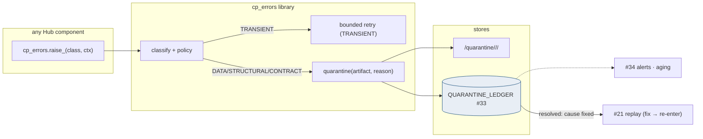

# Error Handling & Quarantine — Design Document

## 1. Purpose & Scope
The Hub's shared failure discipline: one error taxonomy, one quarantine mechanism, one reprocessing route — used by every component instead of thirty private try/excepts. Target state: a Python error library (`cp_errors`) that classifies every failure into a governed taxonomy, routes quarantinable artifacts (files, row sets, payloads) into a registered quarantine store with reason + lineage, and resolves the open question: **quarantine retention is 30 days active + archive-to-90 aligned with #8, and the ONLY reprocessing route is back through the front door** — re-ingest/re-transform via #21 after the cause is fixed, never in-place repair (AD-2/AD-8).

## 2. Context & Dependencies
- **Callers**: #13 (load errors), #23/#24 (gate BLOCKs), #16/#25 (rejects escalation), #10 (submission failures), sensors (#9 timeouts).
- **Stores**: quarantine filesystem area (#8 layout), QUARANTINE_LEDGER (#33 schema).
- **Exit route**: #21 replay classes; **signals**: #34 (error-rate SLOs, quarantine aging alerts).

## 3. Design Decisions
| Decision | Choice | Rationale | Consequence |
|---|---|---|---|
| Quarantine retention + route? (open q) | **30d active / 90d archived; reprocess ONLY via #21 re-ingest/re-transform** | Fix-then-replay preserves bitemporal truth; direct repair edits corrupt lineage | An untouched 30-day quarantine item is an *unworked incident*, alerting escalates at 7d |
| Error taxonomy | **Five classes: TRANSIENT / STRUCTURAL / DATA / CONTRACT / SYSTEM** | Retry policy, ownership, and paging differ by class, not by component | Class is mandatory at raise-time; the library refuses unclassified errors |
| Retry ownership | **TRANSIENT auto-retry (bounded, jittered) inside the library; everything else never auto-retries** | Retrying a STRUCTURAL error is denial; not retrying a network blip is fragility | Retry budgets per call-site in #33; exhaustion promotes to SYSTEM |
| Quarantine granularity | **File (G1/G2), row-set (rejects escalation), payload (outbound)** | One mechanism, three artifact shapes | Ledger rows carry artifact_kind + locator; store layout per kind |
| Poison-pill guard | **Same artifact quarantined twice → CONTRACT class + hold** | Endless requeue loops are the classic failure | Second-strike detection via artifact hash in the ledger |

## 4a. Diagrams

```mermaid
sequenceDiagram
 participant C as #13 loader
 participant L as cp_errors
 participant Q as Quarantine store+ledger
 participant O as Ops
 participant R as #21
 C->>L: raise_(DATA, file=X, load_id=..., reason=BAD_ENCODING)
 L->>Q: move X → /quarantine/2026-08-13/file/ · ledger OPEN(hash, reason, lineage)
 L-->>C: quarantined → loader continues with remaining set
 Q-->>O: #34 alert (class DATA, feed, aging clock starts)
 O->>O: root cause: SEI encoding defect → fixed extract resent
 O->>Q: ledger RESOLVED(cause_ref)
 O->>R: re-ingest via #21 (new LOAD_ID, normal gates)
 R-->>Q: ledger CLOSED(replay_id)
 Note over Q: 30d unresolved → escalation; 30d resolved → archive tier
```

## 4b. Flow Walkthrough
1. Any component raises through the library with mandatory class + context (load_id/corr_id, artifact ref, reason code from #33 taxonomy).
2. TRANSIENT → bounded jittered retry at the call site; exhaustion promotes to SYSTEM (paging class) — retries are never silent (#34 counter).
3. Quarantinable classes → artifact moved to the kind-specific quarantine area, ledger row OPEN with hash, reason, full lineage keys.
4. Pipeline continues where the design allows (a quarantined file removes one feed; #22 handles the domain consequence) — errors isolate, never cascade by default.
5. Ops works the ledger queue (the #34 aging clock is the SLA): root cause fixed → RESOLVED with cause reference.
6. Reprocessing = #21 only: re-ingest (fixed file arrives as new LOAD_ID) or re-transform — the artifact re-earns every gate; the quarantine copy is evidence, never the input.
7. Second-strike on the same hash → CONTRACT hold: something systematic is wrong; no more automatic anything.

## 4c. Detailed Design
**Ledger (#33)**
```sql
CREATE TABLE quarantine_ledger (
  q_id          VARCHAR2(40) PRIMARY KEY,
  artifact_kind VARCHAR2(10) NOT NULL,      -- FILE / ROWSET / PAYLOAD
  artifact_ref  VARCHAR2(400) NOT NULL,     -- path or table+predicate or payload_ref
  artifact_hash VARCHAR2(64),
  err_class     VARCHAR2(12) NOT NULL,
  reason_code   VARCHAR2(30) NOT NULL,      -- #33 taxonomy
  load_id       VARCHAR2(40), corr_id VARCHAR2(40), feed_id VARCHAR2(20),
  state         VARCHAR2(10) NOT NULL,      -- OPEN/RESOLVED/CLOSED/EXPIRED
  cause_ref     VARCHAR2(200), replay_id VARCHAR2(40),
  opened_at TIMESTAMP DEFAULT SYSTIMESTAMP, resolved_at TIMESTAMP, closed_at TIMESTAMP
);
```
**Library surface**: `raise_(cls, reason, **ctx)`, `retryable(policy_id)` decorator, `quarantine(kind, ref, reason, **lineage)` — Nexus-published wheel, versioned; adoption enforced by cp-guardrails (bare `except:` and unclassified raises are CI findings).
**Taxonomy (#33)**: reason codes per class with owner_group — DATA→domain owners, CONTRACT→SEI liaison, SYSTEM→platform. The routing table *is* the on-call map.
**Retention jobs**: nightly — RESOLVED/CLOSED > 30d → archive tier; OPEN > 7d → escalate; > 30d → EXPIRED + management report (an expired quarantine is a process failure, made visible).
**Row-set kind**: rejects (#25) escalate to quarantine only on threshold breach — normal rejects stay in `_rejects` models; the ledger references table + predicate, data stays in Oracle.

## 5. Data Quality, Reconciliation & Lineage
Quarantine is where DQ verdicts become work: every G1/G2 BLOCK lands here with the gate evidence attached (dq_result join), so the queue is self-documenting. Lineage: q_id ↔ load_id/corr_id ↔ replay_id closes the loop — an auditor can walk defect → decision → fix → re-entry → gates re-passed (#31). Recon (#30) treats OPEN quarantine as explained variance: missing data with a named reason, not a mystery.

## 6. RECOMMENDATION
**6.1** One shared error library with a five-class taxonomy, three-shape quarantine with a governed ledger, 30/90 retention, second-strike holds, and re-entry exclusively through #21 — errors as governed work items, never private exceptions.
**6.2**
| Option | Description | Pros | Cons | Fit |
|---|---|---|---|---|
| A. Shared library + ledgered quarantine + replay-only re-entry (recommended) | As designed | Uniform ops; lineage-complete incidents; AD-2-safe repair; taxonomy = on-call routing | Library adoption discipline; ledger hygiene | **High** |
| B. Per-component error handling | Each component does its own | No shared dependency | 30 taxonomies, invisible retries, quarantines in log messages — the legacy pattern being replaced | Low |
| C. Dead-letter-queue middleware (Kafka-style DLQ) | Streaming DLQ infra | Familiar pattern elsewhere | Wrong shape for file/batch artifacts; new platform in the air-gap for what a share + table already do | Low |
| D. Fix-in-place repair scripts | Edit quarantined data, resume | "Fast" | Violates AD-2/AD-8; un-audited data surgery — prohibited for the same reasons as #21 Option C | Prohibited |
**6.3** > **Recommended: Option A.** The design's center is the re-entry rule: quarantine is evidence, the front door is the only way back in — which keeps every recovered artifact gate-verified and bitemporally honest, and makes the 2 a.m. question ("can I just fix the file?") answer itself. The taxonomy earns its place by *routing*: class determines retry, ownership, and paging, so incident response is a lookup, not a judgment. Measurements that must hold: zero re-entries bypassing #21 (ledger↔replay join complete), OPEN-aging within SLA, EXPIRED count ≈ 0, second-strike holds catching every poison pill in fault drills.
**6.4** Touches Stage 1/2 boundaries as a *service*, owns no pipeline tier; AD-2/AD-8 are its constitution; no open-AD dependencies.

## 7. Failure, Replay & Idempotency
The handler failing: quarantine move is copy-verify-delete (crash-safe); ledger insert idempotent on q_id; a failed quarantine leaves the artifact in place with a SYSTEM page (fail-loud). Library retry state is in-process only — restart re-runs the task under normal Airflow semantics.

## 8. Security & Access Control
Quarantined artifacts retain source classification (client data stays restricted — quarantine is not a downgrade); store area permissions mirror #8 with ops-read; ledger writes via library service identity; RESOLVED/CLOSED transitions require the ops role (#32) and are audited (#31).

## 9. Open Questions & Risks
- Reason-code taxonomy first cut + owner_group mapping — with Hema's inventory; owner: TBD.
- Escalation channels per class (page vs ticket) — ops runbook decision; owner: TBD.
- Risk: library version skew across components → single Nexus wheel, version floor enforced in CI.
- Risk: quarantine volume spikes on a bad SEI day → store shares #8's capacity alerting; ledger-driven bulk-resolve tooling for common-cause days.

## 10. Acceptance Criteria
- [ ] Each artifact kind quarantined + re-entered via #21 end-to-end in a lower region, ledger states walked OPEN→CLOSED.
- [ ] Second-strike drill: same hash twice → CONTRACT hold, no auto path.
- [ ] TRANSIENT storm test: bounded retries, counter visible, promotion to SYSTEM on exhaustion.
- [ ] Aging alerts at 7d/30d fire in a clock-advanced test.
- [ ] cp-guardrails: bare except / unclassified raise fails CI on a seeded repo.
- [ ] Direct-write attempt to quarantined RAW rows blocked by grants (negative test).
