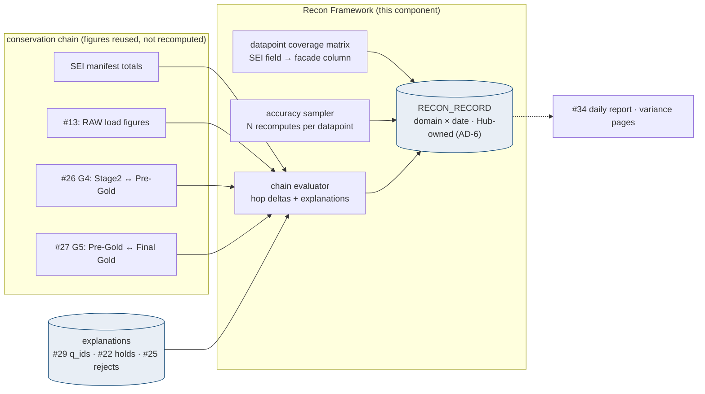
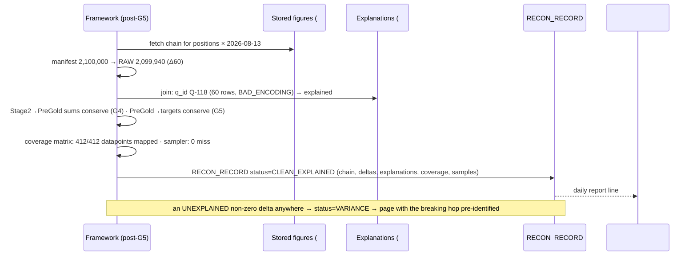

# Reconciliation Framework — Design Document

## 1. Purpose & Scope
The end-to-end proof that **what SEI sent is what BBH serves**: every datapoint that leaves SEI SWP must be present, accurate, and unchanged-in-meaning after conversion into the AddVantage-facade shapes — no variance, no deviation, no silent loss anywhere along RAW → Stage 2 → Pre-Gold → Final Gold. Target state: a checkpoint-chain recon engine that conserves counts and control figures across every hop, a **datapoint coverage matrix** (driven by the Datapoint 360 inventory) proving each SEI field maps to a served field or a documented exclusion, and one governed recon record per business date that answers the client-facing question in one place. This document also owns **AD-6 — who owns the recon record — and recommends: the Hub owns it**, as the only party that sees both ends.

## 2. Context & Dependencies
- **Checkpoint producers**: #13 (manifest vs RAW), #26 G4 (Stage 2 vs Pre-Gold), #27 G5 (Pre-Gold vs Final Gold targets) — the framework *chains* their figures; SEI-manifest declared totals anchor the start.
- **Datapoint truth**: Datapoint 360 / #33 field mappings (SEI field → canonical → facade column) — the coverage matrix's spine.
- **Signals**: #34 (variance alerts, the daily recon report); **explained variance**: #29 quarantine, #22 holds, #25 rejects feed the explanation ledger.

## 3. Design Decisions
| Decision | Choice | Rationale | Consequence |
|---|---|---|---|
| Who owns the recon record? (AD-6) | **The Hub — one RECON_RECORD per domain × date, consumed by all parties** | SEI sees only what it sent; targets see only what arrived; the Hub is the only observer of the whole chain | Consumer/SEI recon disputes adjudicate against the Hub record; targets may keep local recons but the Hub record is authoritative — the AD-6 ruling to ratify |
| Conservation model | **Chained checkpoints: each hop's OUT figures = next hop's IN, anchored at the SEI manifest** | End-to-end totals alone hide compensating errors; chaining localizes the breaking hop | Reuses #26/#27 stored figures — one math, no re-derivation drift |
| Variance tolerance | **Zero for counts and identity datapoints; explained-only for everything else** | "Small" unexplained variance in a system of record is a defect, not noise | Every non-zero delta must join an explanation (quarantine q_id, hold, reject set, correction) or it pages |
| Datapoint completeness | **Coverage matrix: every SEI-delivered field → served facade column OR documented exclusion (with owner sign-off)** | Presence of rows ≠ presence of *datapoints*; conversion loss is the silent failure class | Matrix drift (new SEI field unmapped) is a CONTRACT-class finding (#29) |
| Value accuracy sampling | **Deterministic per-datapoint sample recompute daily (N per field class) + full recompute on demand** | Full field-level compare daily is compute-prohibitive; zero sampling is blindness | Sample seeds rotate; any sample miss triggers the full recompute for that datapoint |

## 4a. Diagrams



## 4b. Flow Walkthrough
1. Post-G5 per domain × date, the evaluator assembles the chain from *stored* figures — manifest, load, G4, G5 — computing the delta at every hop.
2. Non-zero deltas seek explanations: quarantined rows (#29), held feeds (#22), rejected rows (#25), in-flight corrections (#17) — each delta must be *fully covered* by explanation joins or the record is VARIANCE.
3. The coverage matrix asserts datapoint presence: every SEI field in the Datapoint 360 inventory maps to a facade column (via #33 mapping specs) or carries a signed exclusion; unmapped novelty is a CONTRACT finding.
4. The accuracy sampler recomputes N values per datapoint through the whole conversion (SEI raw payload → facade value) — sign conventions, scaling, currency, date semantics — the "no deviation" proof at field level.
5. RECON_RECORD written: chain figures, deltas, explanation refs, coverage state, sample results, final status CLEAN / CLEAN_EXPLAINED / VARIANCE.
6. VARIANCE pages with the breaking hop already identified (that's what chaining buys); CLEAN_* feeds the daily report leadership actually reads.
7. The record is the adjudication surface: SEI disputes, consumer disputes, and audit queries all resolve against it (AD-6 recommendation in practice).

## 4c. Detailed Design
**Record (#33 schema)**
```sql
CREATE TABLE recon_record (
  business_date DATE NOT NULL, domain VARCHAR2(30) NOT NULL,
  status        VARCHAR2(16) NOT NULL,  -- CLEAN / CLEAN_EXPLAINED / VARIANCE
  chain_json    CLOB CHECK (chain_json IS JSON),      -- hop figures + deltas
  expl_json     CLOB CHECK (expl_json IS JSON),       -- delta → explanation refs
  coverage_json CLOB CHECK (coverage_json IS JSON),   -- matrix summary + exceptions
  sample_json   CLOB CHECK (sample_json IS JSON),     -- per-datapoint sample results
  finalized_at  TIMESTAMP DEFAULT SYSTIMESTAMP,
  CONSTRAINT pk_rr PRIMARY KEY (business_date, domain)
);
CREATE TABLE datapoint_coverage (
  sei_field     VARCHAR2(80) NOT NULL,   -- from Datapoint 360 inventory
  domain        VARCHAR2(30) NOT NULL,
  facade_column VARCHAR2(120),           -- NULL only with exclusion_ref
  transform_ref VARCHAR2(60),            -- mapping spec (#33)
  exclusion_ref VARCHAR2(60),            -- signed exclusion if unserved
  CONSTRAINT pk_dc PRIMARY KEY (sei_field, domain)
);
```
**Control-figure grammar**: counts always; Σ / abs-Σ on amount datapoints; hash on identity sets — declared per datapoint class in #33 (shared with #26/#27 so the chain speaks one language).
**Sampler**: seeded deterministic key selection (auditable — "why these rows" is answerable), N=25/datapoint/day default, full-recompute escalation on any miss; comparisons tolerance-zero except declared rounding rules (documented per datapoint, e.g., facade rounds basis points — the *rule* is the tolerance, never a fuzz factor).
**Explanation joins**: q_id / hold(domain,date) / reject-set counts / correction versions — each with row-count arithmetic so Δ coverage is exact, not narrative.
**External contracts**: SEI manifest totals (the anchor), Datapoint 360 inventory freshness (matrix input), target-side figures via #27's accounts.

## 5. Data Quality, Reconciliation & Lineage
This *is* the reconciliation layer; its DQ posture is meta: the framework's own health (chain completeness — did every hop report?) is a #34 SLO, because a recon that silently didn't run is worse than a variance. Lineage: RECON_RECORD joins every evidence key it consumed (#31), making it the one document an auditor, an SEI liaison, or a consumer sees for "prove the 13th was right."

## 6. RECOMMENDATION
**6.1** A Hub-owned, checkpoint-chained recon record per domain × date with zero-tolerance-unless-explained variance, a signed datapoint coverage matrix over the Datapoint 360 inventory, and deterministic accuracy sampling — AD-6 resolved as Hub ownership.
**6.2**
| Option | Description | Pros | Cons | Fit |
|---|---|---|---|---|
| A. Hub-owned chained record + coverage matrix + sampling (recommended) | As designed | Breaking hop localized; datapoint loss impossible-by-silence; one adjudication surface; reuses gate math | Sampler + matrix are real build; Datapoint 360 inventory must stay current | **High** |
| B. End-to-end totals only (SEI vs Final Gold) | Compare the ends | Cheap | Compensating errors invisible; a variance means a manual archaeology through four hops at 6 a.m. | Low |
| C. Target-owned recons (each consumer reconciles) | PBDW/IMDS/Pivotal own their own | No Hub build | Three inconsistent versions of truth; nobody sees SEI's side; AD-6 chaos codified | Low |
| D. Full field-level compare daily | Every value recomputed | Maximum assurance | Compute cost dwarfs the pipeline itself; the sampler + zero-tolerance-counts already bound the risk class | Low |
**6.3** > **Recommended: Option A.** The framing that matters: *rows conserve at the chain, datapoints conserve at the matrix, values conserve at the sampler* — three different failure classes, each with the cheapest sufficient detector, unified in one record owned by the only party that can see end to end. Zero-tolerance-unless-explained is the cultural core: variance is never "small," it is either arithmetic-covered by a named cause or it is a page. Costs: the matrix demands the Datapoint 360 inventory be living, and the sampler needs per-datapoint rounding rules made explicit — both are documentation debts the program owes anyway. Measurements that must hold: 100% chain completeness, VARIANCE rate trending to zero with breaking-hop precision, matrix exceptions all signed, sampler miss → full-recompute loop exercised in drills.
**6.4** Spans all tiers as an *observer* (reads figures, owns no pipeline step). **AD-6 is resolved here as recommended**; AD-2 makes historical recon reconstructible (as-of records for any past date).

## 7. Failure, Replay & Idempotency
Framework failure → no record → chain-completeness SLO fires (fail-visible). Records are idempotent upserts per (date, domain); re-evaluation after late explanations (a quarantine resolved at noon) transitions VARIANCE → CLEAN_EXPLAINED with history retained (record versions, AD-2 style). Replays (#21) trigger re-evaluation for their scope with replay_id stamped.

## 8. Security & Access Control
Records contain aggregates, keys, and refs — no payload values (sampler results store match/mismatch + key, not the value pair for restricted datapoints). Read access: ops, audit, SEI-liaison, consumer-liaison roles (#32). Writes: framework identity only. Matrix exclusions require owner_group sign-off recorded in exclusion_ref.

## 9. Open Questions & Risks
- **AD-6 ratification** of Hub ownership — ARB item this document arms; owner: TBD.
- Datapoint 360 inventory completeness per domain (the matrix is only as good as it) — owner: TBD.
- Per-datapoint rounding/precision rules for the sampler — with domain owners; owner: TBD.
- Risk: explanation arithmetic gaps (a delta 90% covered) → status rule: partial coverage = VARIANCE, no proration.
- Risk: matrix rot as SEI adds fields → nightly diff of SEI payload keys vs matrix (CONTRACT finding on novelty, per #29).

## 10. Acceptance Criteria
- [ ] Full-day chain across a test domain: CLEAN record with all hop figures reused (no recomputation drift).
- [ ] Injected 60-row quarantine → CLEAN_EXPLAINED with exact arithmetic coverage.
- [ ] Injected unexplained 1-row delta at Stage2→PreGold → VARIANCE page naming that hop.
- [ ] Unmapped new SEI field appears → CONTRACT finding within one cycle.
- [ ] Sampler catches a seeded sign-flip on one datapoint → full recompute isolates affected keys.
- [ ] Late-resolution transition VARIANCE→CLEAN_EXPLAINED preserves both record versions.
