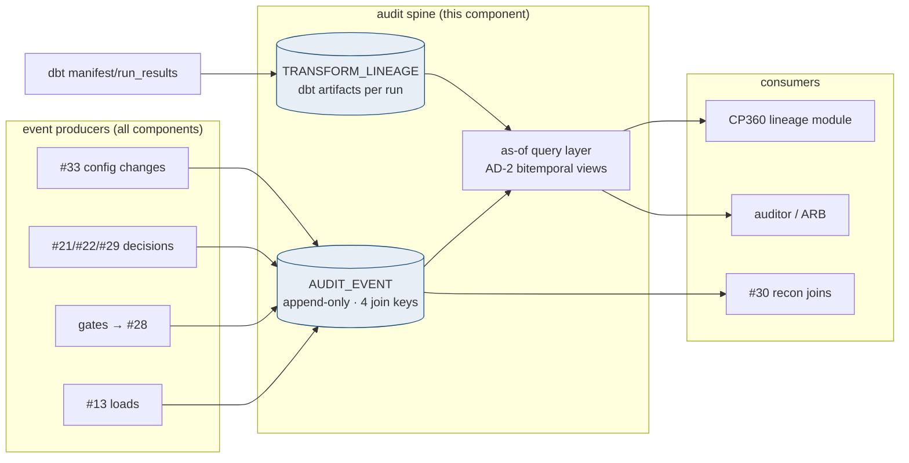
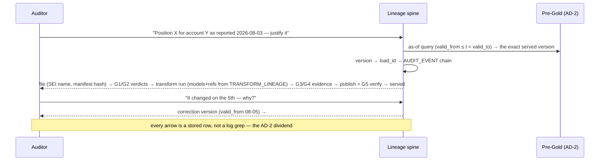

# Audit & Lineage — Design Document

## 1. Purpose & Scope
The defensibility layer: for any datapoint BBH served, reconstruct **where it came from, what touched it, who decided, and what it looked like at any prior moment** — under NYDFS Part 500 expectations and the open question's standard: *is lineage audit-defensible under AD-2?* Target state answers **yes, by construction**: because every store is bitemporal-append (AD-2) and RAW is immutable (AD-8), history is *data*, not logs — this component's job is to bind that data into one navigable spine: an append-only audit event store keyed by the four join keys (LOAD_ID, replay_id, corr_id, business_date), dbt-artifact-derived transformation lineage, and the decision records (gates, replays, overrides, config changes) that turn "what happened" into "who approved it."

## 2. Context & Dependencies
- **Event producers**: every component — #13 loads, gates (via #28 dq_result), #21 ledger, #22 decisions, #29 quarantine, #10 submissions, #33 config changes, #12 access logs (envelope refs).
- **Transformation lineage**: dbt `manifest.json`/`run_results.json` per run (models, refs, columns) — harvested, versioned, joined to run identity.
- **Consumers**: #30 (record joins), CP360 lineage module (the UI over this spine), auditors/ARB.

## 3. Design Decisions
| Decision | Choice | Rationale | Consequence |
|---|---|---|---|
| Lineage defensible under AD-2? (open q) | **Yes — bitemporal appends make state history queryable; this component adds the binding, not the history** | Log-file archaeology is not defensible; queryable as-of state + bound decisions is | The audit answer to "what did you report on the 3rd" is a SQL query, demonstrable live in an exam |
| Event store shape | **One append-only AUDIT_EVENT table + typed detail refs (not one table per event kind)** | Auditors traverse one spine; kinds evolve without DDL sprawl | detail_ref points into the owning ledger (replay_ledger, quarantine_ledger, dq_result…) — no duplication |
| Transformation lineage source | **dbt artifacts harvested per run (+ #13's registry for pre-dbt hops)** | The graph that *ran* beats any drawn diagram; column-level available from manifest | Harvest step in every build's on-run-end; artifact retention = audit retention |
| Identity on events | **Human actions carry the person (#32 identity); machine actions carry service identity + triggering context** | "The system did it" is not an audit answer | Every override/resolve/config-change event has a who; 4-eyes events carry both |
| Retention | **7 years online-queryable (partitioned, HCC-compressed), aligned to records policy** | Regulated-records horizon; compression makes online feasible | Yearly partitions; no purge without records-management sign-off |
## 4a. Diagrams



## 4b. Flow Walkthrough
1. Components emit audit events through the shared writer (`cp_audit.emit(kind, keys, actor, detail_ref)`) — a library sibling of #29's, adoption guardrail-enforced.
2. Each event carries whichever of the four join keys exist — LOAD_ID (batch), corr_id (API/outbound), replay_id, business_date — the spine's navigation is these keys.
3. dbt on-run-end harvests manifest + run_results → TRANSFORM_LINEAGE rows (run_id, model, refs, columns-hash, status) → the executed graph, versioned per run.
4. Decision events (gate verdicts, replay approvals, overrides, quarantine resolutions, config/tolerance changes) bind *who* to *what* — the difference between history and defensibility.
5. The as-of layer packages AD-2: parameterized views answering "state at time T" per store, joined to the events active at T.
6. CP360's lineage module reads this spine (it is the LIVE source the E2E lineage UI will graduate to); auditors get the walkthrough in §4a's sequence — live, in SQL.

## 4c. Detailed Design
**Spine (#33 schema)**
```sql
CREATE TABLE audit_event (
  event_id      NUMBER GENERATED ALWAYS AS IDENTITY PRIMARY KEY,
  event_ts      TIMESTAMP DEFAULT SYSTIMESTAMP NOT NULL,
  event_kind    VARCHAR2(30) NOT NULL,   -- LOAD/GATE/PUBLISH/REPLAY/OVERRIDE/QUARANTINE/CONFIG/ACCESS...
  load_id       VARCHAR2(40), corr_id VARCHAR2(40),
  replay_id     VARCHAR2(40), business_date DATE,
  component_id  NUMBER,                  -- tracker id of the emitter
  actor         VARCHAR2(60) NOT NULL,   -- person or service identity
  actor2        VARCHAR2(60),            -- 4-eyes second identity
  detail_ref    VARCHAR2(200)            -- pointer into owning ledger
) PARTITION BY RANGE (event_ts) INTERVAL (NUMTOYMINTERVAL(1,'YEAR'))
  ( PARTITION a0 VALUES LESS THAN (TIMESTAMP '2026-01-01 00:00:00') )
  COMPRESS FOR ARCHIVE LOW;
CREATE TABLE transform_lineage (
  run_id       VARCHAR2(60) NOT NULL, model_name VARCHAR2(120) NOT NULL,
  refs_json    CLOB CHECK (refs_json IS JSON),     -- upstream models/sources
  columns_hash VARCHAR2(64),                        -- schema fingerprint
  status       VARCHAR2(10), load_id VARCHAR2(40), replay_id VARCHAR2(40),
  run_ts       TIMESTAMP,
  CONSTRAINT pk_tl PRIMARY KEY (run_id, model_name)
);
```
**Append-only enforcement**: no UPDATE/DELETE grants on audit_event to any identity including the writer (INSERT only); corrections to audit are new events referencing the corrected one (`event_kind=CORRECTION_OF`, detail_ref=event_id).
**As-of views**: per bitemporal store, `<table>_asof(t)` pattern (pipelined or SQL-macro) — the exam-day interface.
**Emitter contract**: emit is fire-and-forget with local spool on Oracle unavailability (events must never block the pipeline; spool drains with ordering preserved, gap alarm in #34).
**External contract**: records-management retention schedule sign-off; #12 access events stored as envelope refs (Splunk is the payload-holder, the spine holds the pointer + subject).

## 5. Data Quality, Reconciliation & Lineage
The spine's own quality is completeness: expected-event assertions (every LOAD has G1+G2 events; every PUBLISH has a G4 and a G5; every replay_id in any ledger has ledger events) run nightly — a hole in the audit trail is itself an incident (#29 SYSTEM class). Recon (#30) and lineage share join keys by design — one spine, two lenses.

## 6. RECOMMENDATION
**6.1** An append-only audit spine on four join keys with harvested-from-execution transformation lineage, identity-bound decisions, as-of query packaging of AD-2, and 7-year online retention — defensibility as a queryable property, not a document.
**6.2**
| Option | Description | Pros | Cons | Fit |
|---|---|---|---|---|
| A. Spine + harvested lineage + as-of layer (recommended) | As designed | Exam answers are live SQL; lineage = what ran; decisions carry humans; no duplication (refs into owning ledgers) | Emitter adoption across all components; spool discipline | **High** |
| B. Splunk as the audit store | Everything to logs, retained 7y | One pipe already exists | Log retention ≠ queryable defensibility; joins across kinds brittle; as-of state impossible from logs; cost at 7y | Low — Splunk stays the *ops* eye (#34), pointers only here |
| C. Drawn/maintained lineage diagrams + doc trail | Wiki-grade lineage | Familiar | Diverges from execution the week after it's drawn; not evidence | Prohibited as the system of record |
| D. Full CDC/audit-vault on every table | Database-level audit everything | Total capture | Massive volume duplicating what AD-2 tables already keep; noise burying decisions | Low |
**6.3** > **Recommended: Option A.** AD-2 already paid for the hard part — state history lives in the tables — so the design refuses to duplicate it and instead binds it: events for *what happened*, harvested artifacts for *what ran*, identities for *who decided*, as-of views for *what was true*. That refusal (detail_ref pointers instead of copies, Splunk pointers instead of payloads) is what keeps seven online years feasible. The measure of success is operational: the §4a auditor walkthrough executable live for any datapoint, any date; expected-event completeness at 100%; zero UPDATE/DELETE physically possible on the spine.
**6.4** Observer across all tiers; AD-2/AD-8 are its foundations (and its answer); feeds #30 and the CP360 lineage UI; no open-AD dependencies (AD-6's outcome only labels who *reads* jointly, not who writes).

## 7. Failure, Replay & Idempotency
Emitter spool covers Oracle outage (ordered drain, gap alarm); event inserts are idempotent by producer-supplied natural keys where re-emission is possible (kind+keys+detail_ref uniqueness). The spine under replay: replays *add* events (the replay is itself audited); nothing is ever restated. Spine-loss DR: yearly partitions in #63 backup scope with restore-verify drills.

## 8. Security & Access Control
Read: audit role (#32) — broad by design for examiners, with access itself evented (ACCESS kind). Write: INSERT-only identities. actor fields carry directory identities for humans (via #32's SSO-adjacent identity, independent of the deferred SSO component), service accounts for machines. No payload values in the spine — refs only.

## 9. Open Questions & Risks
- Records-management ratification of 7-year online + partition strategy — owner: TBD.
- Expected-event assertion catalog first cut — with #28's conventions; owner: TBD.
- Risk: emitter adoption gaps leaving spine holes → cp-guardrails: components' key paths must show emit calls (static check) + nightly completeness assertions (runtime check).
- Risk: spool loss on pod eviction before drain → spool on the #50 PVC, not emptyDir; drain-on-start.

## 10. Acceptance Criteria
- [ ] The §4a auditor walkthrough executed live in a lower region for a seeded datapoint with a correction — every hop resolved in SQL.
- [ ] UPDATE/DELETE on audit_event fails for every identity (negative grants test).
- [ ] Kill-Oracle drill: events spool, drain in order, gap alarm exercised.
- [ ] Expected-event assertions catch a suppressed G2 emission (fault injection).
- [ ] transform_lineage matches dbt manifest for a run (model + refs parity check).
- [ ] As-of view returns the pre-correction version for T before the correction, post- for after.
