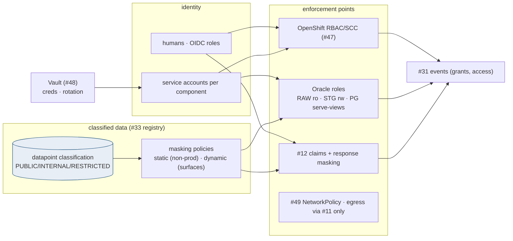
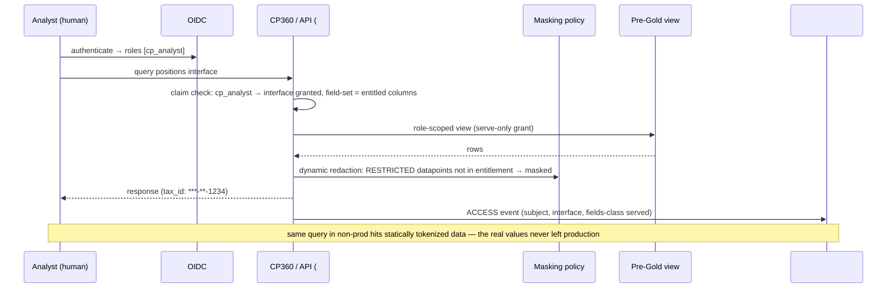

# Security & Access Control — Design Document

## 1. Purpose & Scope
The Hub's security model as one coherent design rather than per-component afterthoughts: data classification and masking, identity (human and service), authorization layers (OpenShift, Oracle, API), credential mediation, and the NYDFS Part 500 mapping that the ARB and audit will ask for by section number. Target state answers the open question conservatively and correctly: **SWP extracts are presumed to contain client-identifying and account data (names, accounts, tax IDs in some feeds, holdings) — classification is per-datapoint, masking is policy-driven at every non-production and non-entitled surface**, and "presumed sensitive until classified otherwise" is the default that makes the presumption safe.

## 2. Context & Dependencies
- **Implements over**: #47 (ServiceAccounts/RBAC/SCCs), #48 (Vault), #49 (NetworkPolicy) — platform primitives this design composes.
- **Enforces at**: #8 storage, Oracle schemas (RAW/Stage2/Pre-Gold), #12 API layer (JWT claims + response masking), #10 payload archive, quarantine (#29), audit spine (#31).
- **Classification source**: #33 datapoint registry (classification column per field — shared with #30's coverage matrix).

## 3. Design Decisions
| Decision | Choice | Rationale | Consequence |
|---|---|---|---|
| PII in SWP extracts requiring masking? (open q) | **Presume yes; classify per datapoint in #33; mask by policy at non-prod, exports, logs, and un-entitled API fields** | Wealth data is client data; waiting for a census to protect it inverts the risk | Classification backlog runs with Datapoint 360; unclassified = RESTRICTED by default |
| Identity model | **Humans via corporate OIDC (roles in #33); machines via per-component service accounts — no shared identities, no personal creds in pipelines** | Attribution (#31) and revocation both require it | The role catalog below is the whole human surface; new access = role grant, evented |
| Authorization layering | **Three enforcement points: OpenShift RBAC (who runs), Oracle roles/grants (who reads which schema), API claims (#12, who consumes which interface)** | Defense in depth with each layer owning its native question | No layer trusts another's decision; each denies independently |
| Masking mechanism | **Static masking on any non-prod refresh (deterministic tokenization for joins); dynamic redaction at API/log surfaces per classification** | Non-prod is where data leaks; determinism keeps test joins working | Masking rules are #33 config per datapoint class; VPD reserved for row-level cases if a consumer contract demands it |
| Secrets | **Vault (#48) mediation everywhere; no secret in code, config repos, or Airflow variables; short-lived DB creds where the estate supports** | The audit finding that never gets a second chance | cp-guardrails secret-scan blocking; rotation calendar per credential class |

## 4a. Diagrams

## 4b. Flow Walkthrough
1. Every datapoint enters the classification registry at mapping time (#33, alongside its facade mapping) — unclassified defaults RESTRICTED, so the backlog fails safe.
2. Human access: OIDC → role → interface/schema entitlements; the role catalog: `cp_ops` (run/replay/override with 4-eyes), `cp_analyst` (read serve-views, masked per class), `cp_dq` (gates, quarantine work), `cp_audit` (spine + evidence, read-everything-evented), `cp_admin` (config via #33 governance).
3. Machine access: one service account per component (#47), Vault-mediated credentials (#48), grants scoped to the component's documented needs (this document's appendix table is the grant source-of-truth).
4. Oracle layering: RAW insert-only to #13 / read-only to gates (AD-8 as grants); Stage 2 rw to dbt identity; Pre-Gold write to dbt, **serve-views only** to movement/#10/#12 — schema isolation as the enforcement of tier boundaries.
5. Non-prod refreshes pass the static masker: deterministic tokenization on RESTRICTED identity fields, format-preserving where formats matter — joins survive, values don't leak.
6. Dynamic surfaces (API responses, logs, evidence packs, recon samples) redact by classification per the shared rule already cited by #24/#27/#30/#31: aggregates and keys travel, values of RESTRICTED fields do not.
7. Every grant, role change, and RESTRICTED access is an event (#31) — access review is a query, quarterly recert is a report.

## 4c. Detailed Design
**Classification registry (#33)**: `datapoint_class(sei_field, domain, class PUBLIC|INTERNAL|RESTRICTED, mask_rule, entitlement_tag)` — one row per datapoint, joined by #30's matrix and #12's field entitlements.
**Masking rules**: `TOKENIZE_DET` (ids — deterministic HMAC-based), `REDACT_PARTIAL` (display tails), `NULLIFY` (free-text), `NONE`; applied by the refresh pipeline (static) and the serving layer (dynamic).
**NYDFS mapping (the audit-facing table)**: 500.03 policies→this doc; 500.07 access privileges→role catalog + recert query; 500.12 MFA→OIDC estate controls; 500.13 retention→#31/#8 schedules; 500.14 monitoring→#34 + ACCESS events; 500.15 encryption→at-rest (storage class, Oracle TDE per estate standard) and in-transit (mTLS everywhere, #11/#12).
**Grant matrix appendix**: component × schema × privilege table generated from #33 rows — drift between granted and documented is a nightly finding.
**External contracts**: corporate OIDC group mapping; TDE/estate encryption standards; recert cadence with security office.

## 5. Data Quality, Reconciliation & Lineage
Security's DQ is drift detection: granted-vs-documented grant diff, unclassified-datapoint count (must trend to zero), masking-rule coverage over RESTRICTED class = 100%, orphaned service accounts = 0 — all nightly #34 checks. Lineage of access lives in #31 (ACCESS/GRANT events), making "who could see X in March" answerable.

## 6. RECOMMENDATION
**6.1** Per-datapoint classification with RESTRICTED-by-default, three-layer independent authorization, deterministic static masking for every non-prod surface plus dynamic redaction at serving/log surfaces, Vault-mediated machine identity, and a generated grant matrix reconciled nightly — with the NYDFS section mapping maintained as a living table in this document.
**6.2**
| Option | Description | Pros | Cons | Fit |
|---|---|---|---|---|
| A. Classified datapoints + layered enforcement + policy masking (recommended) | As designed | Fails safe on the unclassified; masking is config not code; audit answers are queries; tier boundaries become grants | Classification backlog effort; masking pipeline for refreshes | **High** |
| B. Environment-level trust (prod locked, non-prod open) | Perimeter model | Cheap | Non-prod leak = full client data leak; indefensible under 500.15/500.07 | Prohibited |
| C. Encrypt-everything, mask-nothing | TDE + transit only | Simple story | Encryption protects storage, not screens/logs/refreshes — the actual leak surfaces | Low alone (A includes C's controls) |
| D. VPD/row-level everywhere | Row policies on all tables | Fine-grained | Massive policy surface for a Hub whose consumers are systems; complexity where schema isolation already answers | Low — reserved tool, not default |
**6.3** > **Recommended: Option A.** The design's spine is the classification registry: one row per datapoint drives masking, API field entitlements, evidence redaction, and the recon sampler's discretion — so "is this protected" has exactly one answer everywhere, and the default answer for anything unclassified is yes. Layered enforcement means no single misconfiguration exposes data, and grants-as-tier-boundaries turns architecture rules (AD-8, serve-views-only) into things the database refuses rather than reviewers catch. Measurements that must hold: unclassified count → 0, grant-matrix drift = 0, non-prod refresh contains zero unmasked RESTRICTED values (sampled proof), quarterly recert executed as a query with sign-off evented.
**6.4** Composes platform primitives (#47/#48/#49) into the Hub's policy; enforces tier boundaries as grants; no open-AD dependencies. SSO component deferral noted — human identity here rides the existing corporate OIDC estate regardless.

## 7. Failure, Replay & Idempotency
Vault unavailability → components fail closed at credential fetch (no cached-secret fallback beyond lease TTL); OIDC outage → human surfaces degrade, machine pipelines unaffected. Masking pipeline failure → the refresh does not complete (no unmasked non-prod, ever). All policy changes are #33 rows → versioned, revertible, evented.

## 8. Security & Access Control
This document *is* that design; its own meta-controls: changes to this policy set require security-office sign-off recorded via #31; the grant matrix generator runs under `cp_audit` read scope; break-glass access exists (sealed credential, dual-control) with mandatory post-use review evented.

## 9. Open Questions & Risks
- Datapoint classification first pass per domain (with Datapoint 360 + Hema) — owner: TBD; RESTRICTED-default de-risks the interim.
- Estate TDE status on all four databases (RAW/Stage2/Exadata/targets are estate-run) — confirm; owner: TBD.
- Short-lived Oracle credential support (Vault DB engine vs static rotation) — with DBAs; owner: TBD.
- Risk: tokenization collisions across refreshes breaking longitudinal test data → HMAC key persistence policy for non-prod (stable per environment, rotated on schedule with refresh).
- Risk: entitlement_tag sprawl at the API layer → tags reference role-level groups (mirrors #12's claims-by-group rule).

## 10. Acceptance Criteria
- [ ] Unclassified datapoint injected → treated RESTRICTED at API, logs, and refresh (default-safe proof).
- [ ] Non-prod refresh sample scan: zero live RESTRICTED values; joins on tokenized keys still resolve.
- [ ] Three-layer denial tests: pod without RBAC, identity without grant, token without claim — each denied independently.
- [ ] Grant-matrix drift injection (manual grant) → nightly finding within one cycle.
- [ ] Secret-scan CI blocks a seeded credential commit.
- [ ] NYDFS mapping table reviewed and signed by security office; recert query produces the quarterly report.
