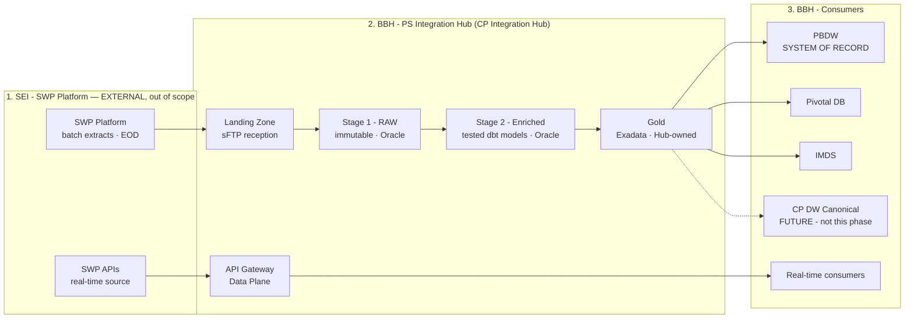
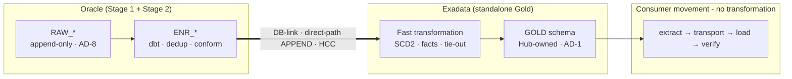

The CP INTEGRATION HUB (BBH - PS Integration Hub) is the BBH-owned data integration
platform for the Capital Partners / SWP Migration Program: it receives every SWP
extract, lands it immutably, standardises and enriches it, builds Gold, and publishes
to every downstream consumer. Three zones, two independent lanes, four physical tiers.

## Zones & lanes — the endorsed target

| Zone | Ownership | Role |
|---|---|---|
| 1. SEI - SWP Platform | SEI (EXTERNAL - out of scope) | SWP batch extracts (EOD) + SWP APIs (real-time source) |
| 2. BBH - PS Integration Hub | BBH (this program) | Landing → Stage 1 RAW → Stage 2 Enriched → Gold → publish |
| 3. BBH - Consumers | BBH (existing estates) | PBDW (System of Record), Pivotal, IMDS, real-time consumers |

- **Batch lane**: Landing Zone (sFTP) → Stage 1 RAW (immutable, as delivered) → Stage 2 Enriched (tested dbt models) → Gold → simple movement to consumers.
- **Real-time lane**: SWP APIs → API Gateway / Data Plane → real-time consumers. **No batch dependency** — the lanes are independent (AD-4 flags any bridge).
- **CP DW - Canonical Model** is FUTURE (dashed): not built this phase; Stage 2/Gold stay forward-compatible only.
- Cross-cutting, end to end: Integration360 monitoring · recon & error handling · metadata & configuration · security, audit & lineage · scheduler & batch control · observability.

## Physical persistence — the four tiers

| Tier | Engine | What runs there |
|---|---|---|
| Stage 1 - RAW | Oracle | Immutable append-only landing · 8 audit columns · partitioned by BUSINESS_DATE · **Python ingestion (cx_Oracle / SQL*Loader / External Tables) - NOT dbt (AD-7)** |
| Stage 2 - Enriched | Oracle | Cleansing, dedup, latest-record selection, conforming · dbt models |
| Stage 3 - Gold | Oracle Exadata (standalone) | Heavy set-based transformation, SCD2 dimensions, fact builds, control-total tie-out · Smart Scan / HCC / storage offload |
| Consumer movement | simple data movement | Extract, transport, load, verify - **no transformation in flight** |

The one unavoidable cross-database hop is **Stage 2 (Oracle) → Pre-Gold (Exadata)** — default
mechanism: DB-link + direct-path APPEND with HCC for EOD batch; Data Pump for full
reloads; CDC/GoldenGate only if intraday (AD-4) demands it. LOAD_ID lineage is preserved
across the hop for replay.

## Authoritative inventories

**Inbound - Source Feed Inventory (SWP → Hub): 9 domains, ~30 feeds.** All fan-out
(Airflow branches, RAW_* tables, sensors, DQ rule sets) is config-driven over this list —
never a hard-coded "7 domains".

| Domain | Feeds |
|---|---|
| Account & Client (5) | Account · Account Optional Fields · Client Account Link · Account Supplement · Client |
| Positions (5) | Taxlot · End of Day Position · EOD Positions Supplement · EOD Changed Positions · FX Forward Position |
| Other (7) | Curr Upcoming Activity · Custody And Nostro · Active Commits and Contributions · Fund Cutoff Times · End of Period Values · Pay To Recipients · Interest Rates |
| Fee & Billing (2) | Fee Computation · Fee Package Usage |
| Portfolio & Model (3) | Portfolio Groups · Portfolio · Model Allocation |
| Reporting (2) | Statement Event · Statement Event Item |
| Reference & Asset (3) | Asset · Asset Optional Fields · Asset Investment Class |
| Transactions (2) | Transaction Header · Transaction Detail |
| Cash (1) | Recurring Cash Activity |

Load order respects dependencies: Reference & Asset and Account & Client are dimensions
that land before Positions, Transactions, Fee & Billing, and Reporting facts.
"Optional Fields" / "Supplement" feeds are satellites attached to their parent entity.

**Outbound - Loader Inventory (Hub → SEI): 16 loaders** (component #10, gated on AD-11):
Custody Transfer · Adhoc Fee · Adhoc Income · Fund Account · Free Movement · Account and
Client · Corporate Action · Unified Cash · Accrual · Generic Payment · Transaction
Adjustment · Client Profile Update · Acquisition Lot Adjustment · Executed Trade · ADS
Non-Marketable · ADS Overrides. One producer framework, per-loader config — the Hub
builds and submits the payload per the SEI loader spec; the SEI-side loaders themselves
are external.

## Design principles (the decided ADs)

- **AD-1** Gold is a Hub-owned schema that publishes to consumers; consumer load is movement only.
- **AD-2** Corrections are bitemporal append with as-of resolution — never in-place merge — consistently across Stage 2 and Gold.
- **AD-7** RAW ingestion is Python, not dbt (the program slide's dbt label on Landing→RAW is the known-wrong item).
- **AD-8** RAW is immutable and append-only.
- **AD-9** DQ gates are blocking, with a control-total tie-out before any Gold publish.
- Everything is config-driven off the Metadata & Configuration Store — assumed present.

## Where the component designs live

The 65-component tracker below this hero maps every component to its governing design
document — L2 plane drill-downs, the L3 Stage 1/2 and Error Handling designs, and the
per-component design documents (#13 Python Ingestion, #14 Stage 1 RAW, #15 Stage 2
Enriched, #17 Corrections, #18 Airflow Fan-out, #23 G1 Gate, #26 G4 Tie-out, #28 DQ
Framework, #33 Metadata Store, #66 Pre-Gold) generated to the program's design-document
contract. Click any Design chip to drill in.

